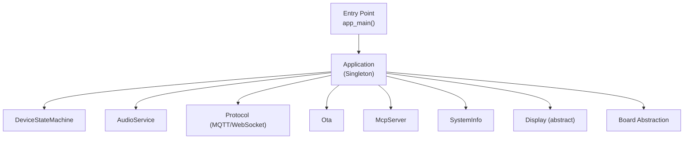
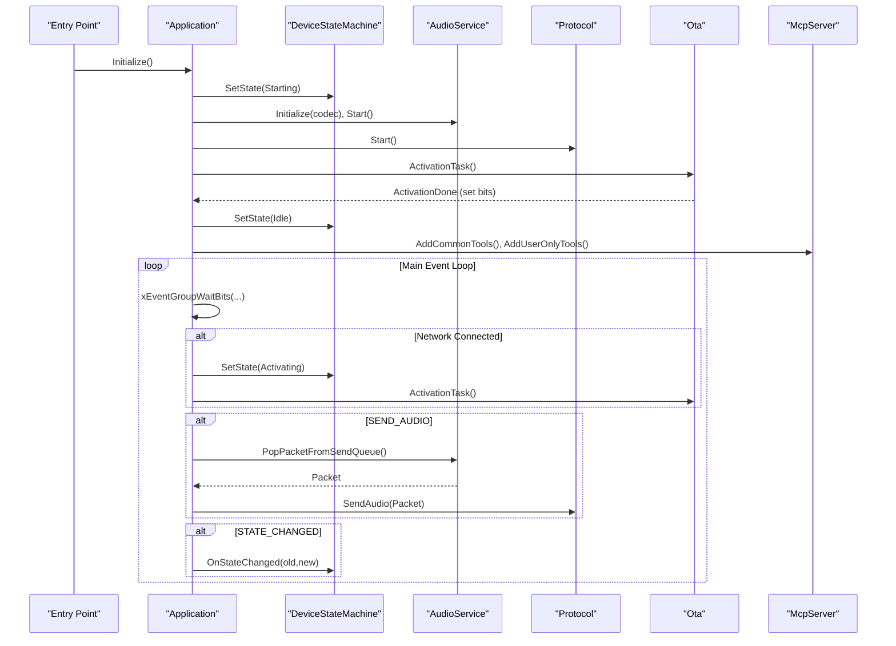
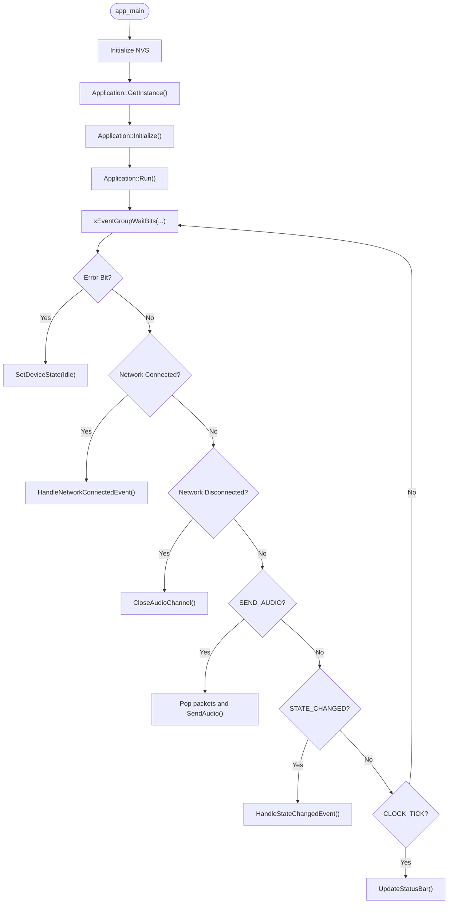
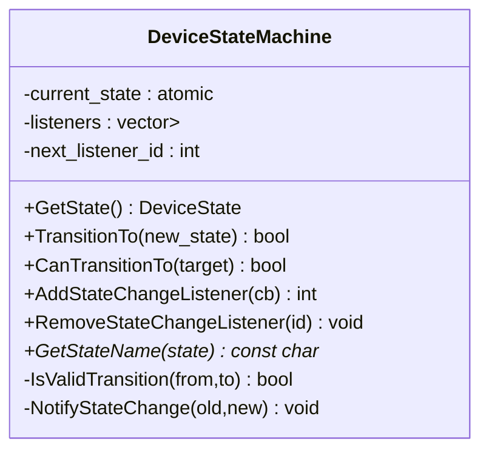
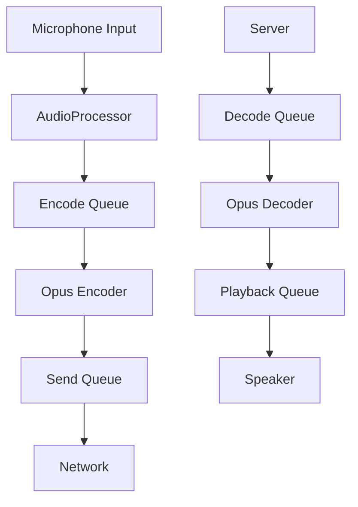
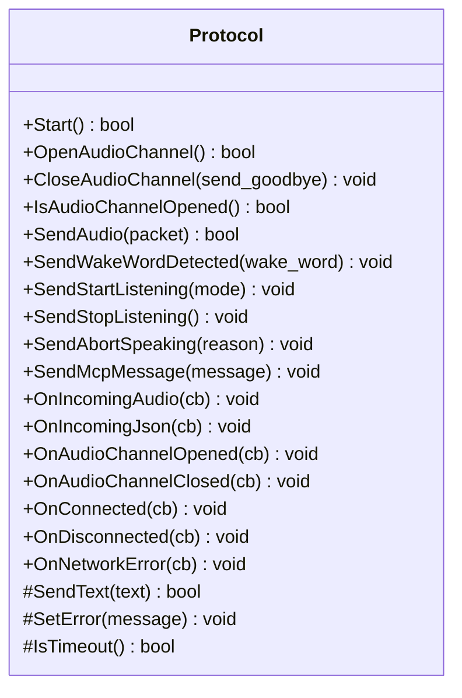
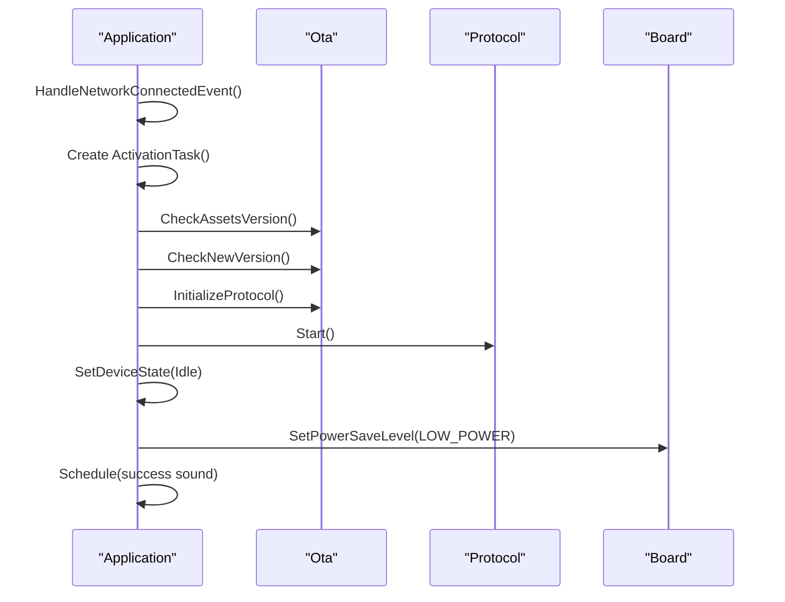
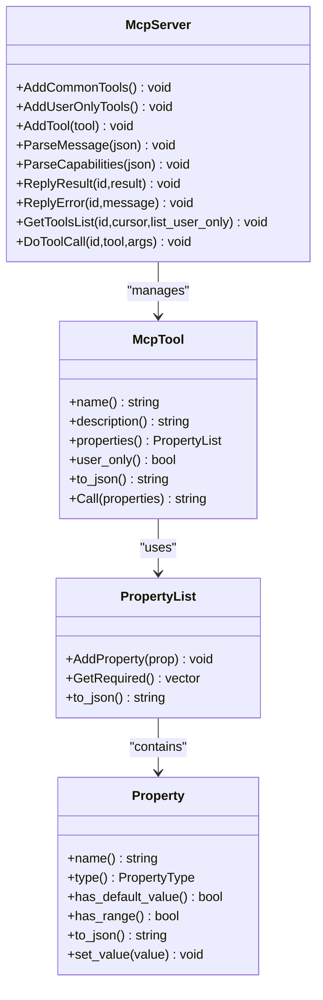
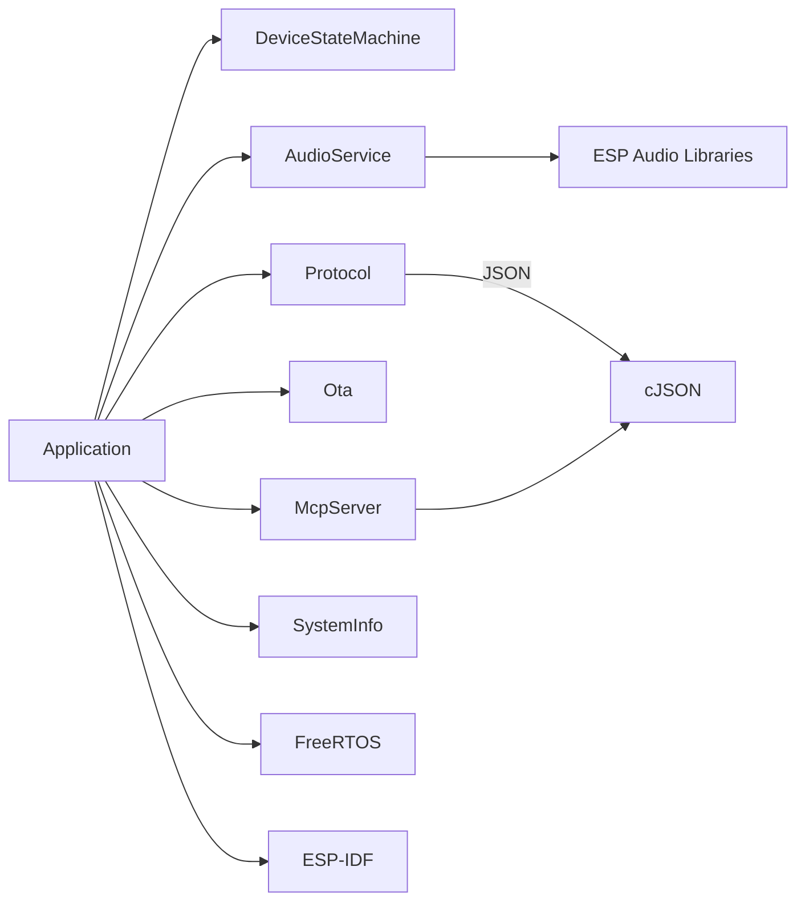

# Embedded Firmware Architecture

<cite>
**Referenced Files in This Document**
- [main.cc](file://main/main.cc)
- [application.h](file://main/application.h)
- [application.cc](file://main/application.cc)
- [device_state.h](file://main/device_state.h)
- [device_state_machine.h](file://main/device_state_machine.h)
- [device_state_machine.cc](file://main/device_state_machine.cc)
- [audio_service.h](file://main/audio/audio_service.h)
- [protocol.h](file://main/protocols/protocol.h)
- [ota.h](file://main/ota.h)
- [mcp_server.h](file://main/mcp_server.h)
- [system_info.h](file://main/system_info.h)
</cite>

## Table of Contents
1. [Introduction](#introduction)
2. [Project Structure](#project-structure)
3. [Core Components](#core-components)
4. [Architecture Overview](#architecture-overview)
5. [Detailed Component Analysis](#detailed-component-analysis)
6. [Dependency Analysis](#dependency-analysis)
7. [Performance Considerations](#performance-considerations)
8. [Troubleshooting Guide](#troubleshooting-guide)
9. [Conclusion](#conclusion)
10. [Appendices](#appendices)

## Introduction
This document describes the embedded firmware architecture centered on the application orchestrator pattern. The system is built around a main event loop coordinated by an Application singleton, a deterministic Device State Machine, and modular subsystems for audio, networking, OTA, and UI. Real-time operations are managed via FreeRTOS primitives, with event-driven communication ensuring low-latency responsiveness. The document covers state machine validation and transitions, memory management strategies, task scheduling, event handling, initialization/shutdown procedures, fault recovery, and extension points for adding new components while preserving system stability.

## Project Structure
The firmware follows a layered design:
- Entry point initializes NVS and launches the Application singleton.
- Application coordinates subsystems, manages device states, and runs the main event loop.
- Device State Machine enforces valid transitions and notifies observers.
- Audio Service handles capture, encoding, decoding, and playback with separate tasks and queues.
- Protocol interface abstracts transport (MQTT/WebSocket), enabling dynamic selection at runtime.
- OTA module performs version checks, upgrades, and activation flows.
- MCP server provides a tooling framework for device capabilities and user-only tools.
- System Info exposes runtime diagnostics and power/performance metrics.

**Diagram sources**
- [main.cc:14-29](file://main/main.cc#L14-L29)
- [application.h:42-177](file://main/application.h#L42-L177)
- [application.cc:62-178](file://main/application.cc#L62-L178)
- [device_state_machine.h:17-81](file://main/device_state_machine.h#L17-L81)
- [audio_service.h:106-204](file://main/audio/audio_service.h#L106-L204)
- [protocol.h:44-95](file://main/protocols/protocol.h#L44-L95)
- [ota.h:10-59](file://main/ota.h#L10-L59)
- [mcp_server.h:314-342](file://main/mcp_server.h#L314-L342)
- [system_info.h:9-22](file://main/system_info.h#L9-L22)

**Section sources**
- [main.cc:14-29](file://main/main.cc#L14-L29)
- [application.h:42-177](file://main/application.h#L42-L177)
- [application.cc:62-178](file://main/application.cc#L62-L178)

## Core Components
- Application: Central orchestrator with event group-driven loop, state transitions, audio/protocol coordination, and UI alerts.
- DeviceStateMachine: Enforces valid state transitions and notifies listeners.
- AudioService: Multi-task audio pipeline with encode/decode queues, wake word detection, and power-aware scheduling.
- Protocol: Transport-agnostic interface for audio streaming and JSON control messages.
- Ota: Version checking, activation, and firmware upgrade lifecycle.
- McpServer: Tool registry and capability exchange for device-side actions.
- SystemInfo: Runtime diagnostics and power/performance insights.

**Section sources**
- [application.h:42-177](file://main/application.h#L42-L177)
- [application.cc:180-276](file://main/application.cc#L180-L276)
- [device_state_machine.h:17-81](file://main/device_state_machine.h#L17-L81)
- [device_state_machine.cc:108-131](file://main/device_state_machine.cc#L108-L131)
- [audio_service.h:106-204](file://main/audio/audio_service.h#L106-L204)
- [protocol.h:44-95](file://main/protocols/protocol.h#L44-L95)
- [ota.h:10-59](file://main/ota.h#L10-L59)
- [mcp_server.h:314-342](file://main/mcp_server.h#L314-L342)
- [system_info.h:9-22](file://main/system_info.h#L9-L22)

## Architecture Overview
The Application singleton owns the main FreeRTOS task and event group. It initializes subsystems, registers callbacks, and drives state changes. The Device State Machine validates transitions and notifies observers. AudioService runs dedicated tasks for capture/encode/decode/playback and communicates with Protocol via queues. Protocol implementations (MQTT/WebSocket) handle transport-specific details. Ota coordinates activation and upgrades. McpServer enables tool-based interactions. SystemInfo supports runtime monitoring.

**Diagram sources**
- [main.cc:14-29](file://main/main.cc#L14-L29)
- [application.cc:62-178](file://main/application.cc#L62-L178)
- [application.cc:180-276](file://main/application.cc#L180-L276)
- [application.cc:278-356](file://main/application.cc#L278-L356)
- [device_state_machine.cc:108-131](file://main/device_state_machine.cc#L108-L131)
- [audio_service.h:131-133](file://main/audio/audio_service.h#L131-L133)
- [protocol.h:66-75](file://main/protocols/protocol.h#L66-L75)

## Detailed Component Analysis

### Application Orchestrator Pattern
- Singleton lifecycle: app_main initializes NVS, constructs Application, calls Initialize(), then Run().
- Main event loop: waits on an EventGroup for bits indicating state changes, audio events, network events, and periodic ticks.
- Thread-safe scheduling: main_tasks_ deque is protected by a mutex; scheduled callbacks execute in the main task context.
- Priority management: main task is pinned to a fixed priority; helper RAII wrapper temporarily adjusts task priorities when needed.
- State coordination: delegates to DeviceStateMachine; triggers protocol/audio/UI actions based on events.

**Diagram sources**
- [main.cc:14-29](file://main/main.cc#L14-L29)
- [application.cc:180-276](file://main/application.cc#L180-L276)
- [application.cc:278-314](file://main/application.cc#L278-L314)
- [application.cc:235-241](file://main/application.cc#L235-L241)
- [application.cc:219-221](file://main/application.cc#L219-L221)
- [application.cc:265-274](file://main/application.cc#L265-L274)

**Section sources**
- [main.cc:14-29](file://main/main.cc#L14-L29)
- [application.h:42-177](file://main/application.h#L42-L177)
- [application.cc:180-276](file://main/application.cc#L180-L276)
- [application.cc:18-48](file://main/application.cc#L18-L48)

### Device State Machine
- Purpose: enforce strict state transitions and notify observers.
- Validation: IsValidTransition defines allowed transitions per source state.
- Observers: AddStateChangeListener registers callbacks invoked in the TransitionTo caller’s context.
- Logging: GetStateName provides human-readable names for logs.

**Diagram sources**
- [device_state_machine.h:17-81](file://main/device_state_machine.h#L17-L81)
- [device_state_machine.cc:108-131](file://main/device_state_machine.cc#L108-L131)

**Section sources**
- [device_state_machine.h:17-81](file://main/device_state_machine.h#L17-L81)
- [device_state_machine.cc:34-102](file://main/device_state_machine.cc#L34-L102)
- [device_state_machine.cc:108-131](file://main/device_state_machine.cc#L108-L131)
- [device_state.h:4-16](file://main/device_state.h#L4-L16)

### Audio Service
- Pipelines:
  - Capture/Process → Encode Queue → Opus Encoder → Send Queue → Network
  - Server → Decode Queue → Opus Decoder → Playback Queue → Speaker
- Tasks and queues:
  - AudioInputTask, AudioOutputTask, OpusCodecTask
  - Separate queues for decode/send/testing and encode/playback tasks
- Concurrency model: condition variables and mutexes coordinate producers/consumers; event groups signal availability.
- Power awareness: timers and counters gate audio power state; resamplers adjust sample rates.
- Real-time constraints: bounded queue sizes, fixed frame durations, and separate tasks minimize latency.

**Diagram sources**
- [audio_service.h:29-38](file://main/audio/audio_service.h#L29-L38)
- [audio_service.h:164-202](file://main/audio/audio_service.h#L164-L202)

**Section sources**
- [audio_service.h:106-204](file://main/audio/audio_service.h#L106-L204)

### Protocol Interface
- Abstraction: Protocol defines transport-agnostic APIs for opening/closing audio channels, sending/receiving audio/json, and lifecycle hooks.
- Dynamic selection: Application chooses MQTT or WebSocket based on OTA configuration.
- Callbacks: OnIncomingAudio, OnIncomingJson, OnAudioChannelOpened/Closed, OnConnected/Disconnected, OnNetworkError.
- Session metadata: server sample rate/frame duration, session id, last incoming time.

**Diagram sources**
- [protocol.h:44-95](file://main/protocols/protocol.h#L44-L95)

**Section sources**
- [protocol.h:44-95](file://main/protocols/protocol.h#L44-L95)
- [application.cc:497-634](file://main/application.cc#L497-L634)

### OTA and Activation
- ActivationTask runs in a dedicated FreeRTOS task and coordinates:
  - Asset version checks and downloads
  - Firmware version checks with exponential backoff
  - Protocol initialization based on OTA config
  - Completion signaling via event bits
- After activation, Application transitions to Idle, releases OTA object, applies power save policy, and plays readiness sound.

**Diagram sources**
- [application.cc:278-356](file://main/application.cc#L278-L356)
- [application.cc:358-414](file://main/application.cc#L358-L414)
- [application.cc:416-495](file://main/application.cc#L416-L495)
- [application.cc:497-634](file://main/application.cc#L497-L634)

**Section sources**
- [application.cc:278-356](file://main/application.cc#L278-L356)
- [application.cc:358-414](file://main/application.cc#L358-L414)
- [application.cc:416-495](file://main/application.cc#L416-L495)
- [application.cc:497-634](file://main/application.cc#L497-L634)
- [ota.h:10-59](file://main/ota.h#L10-L59)

### MCP Server
- Tool registry: McpTool encapsulates name, description, input schema (PropertyList), and callback.
- Capability exchange: McpServer parses capabilities and tool lists, dispatches calls, and replies with structured results.
- Audience annotations: user-only tools are hidden from AI prompts.
- Integration: Application adds common and user-only tools during initialization.

**Diagram sources**
- [mcp_server.h:208-342](file://main/mcp_server.h#L208-L342)

**Section sources**
- [mcp_server.h:208-342](file://main/mcp_server.h#L208-L342)
- [application.cc:111-115](file://main/application.cc#L111-L115)

### System Information and Diagnostics
- Exposes heap stats, task CPU usage, PM locks, IMU status, and platform info.
- Used by Application for periodic diagnostics and runtime health checks.

**Section sources**
- [system_info.h:9-22](file://main/system_info.h#L9-L22)
- [application.cc:270-273](file://main/application.cc#L270-L273)

## Dependency Analysis
- Coupling:
  - Application depends on DeviceStateMachine, AudioService, Protocol, Ota, McpServer, SystemInfo, and Board abstractions.
  - DeviceStateMachine is decoupled from Application except for state change notifications.
  - AudioService and Protocol are loosely coupled via shared AudioStreamPacket and callback interfaces.
- Cohesion:
  - Application maintains high cohesion around orchestration and event handling.
  - AudioService encapsulates audio pipeline concerns.
  - Protocol interface isolates transport details.
- External dependencies:
  - FreeRTOS primitives (tasks, event groups, timers)
  - ESP-IDF components (nvs, esp_timer, esp_audio, cJSON)
  - Optional JSON parsing and base64 encoding for MCP images

**Diagram sources**
- [application.h:14-18](file://main/application.h#L14-L18)
- [application.cc:1-11](file://main/application.cc#L1-L11)
- [audio_service.h:10-27](file://main/audio/audio_service.h#L10-L27)
- [mcp_server.h:14-14](file://main/mcp_server.h#L14-L14)

**Section sources**
- [application.h:14-18](file://main/application.h#L14-L18)
- [application.cc:1-11](file://main/application.cc#L1-L11)
- [audio_service.h:10-27](file://main/audio/audio_service.h#L10-L27)
- [mcp_server.h:14-14](file://main/mcp_server.h#L14-L14)

## Performance Considerations
- Real-time scheduling:
  - Dedicated tasks for audio input/output and codec operations reduce jitter.
  - Fixed frame durations and bounded queue depths prevent unbounded latency growth.
- Memory management:
  - Static task control blocks and PSRAM-backed stacks for audio tasks.
  - Event groups and condition variables coordinate queues efficiently.
  - Resamplers adjust sample rates to match server expectations; mismatches are logged as potential distortion risks.
- Power and thermal constraints:
  - Power save levels are adjusted on audio channel open/close and during activation.
  - Audio power timer gates power state to balance quality and consumption.
- Throughput and backpressure:
  - Separate queues for encode/decode/send/testing isolate workloads.
  - SEND_AUDIO event loop drains send queue until exhaustion, preventing stalls.

[No sources needed since this section provides general guidance]

## Troubleshooting Guide
- Network errors:
  - Application captures network errors via Protocol’s OnNetworkError and signals MAIN_EVENT_ERROR, transitioning to Idle and displaying an alert.
- Activation failures:
  - Exponential backoff in version checks; repeated failures are logged and handled gracefully.
- Audio channel issues:
  - On channel close, Application resets UI and state; power save level is restored.
- State transition violations:
  - DeviceStateMachine logs warnings for invalid transitions and rejects them.
- Diagnostics:
  - Periodic heap statistics and task CPU usage help identify leaks or overload conditions.

**Section sources**
- [application.cc:517-520](file://main/application.cc#L517-L520)
- [application.cc:202-205](file://main/application.cc#L202-L205)
- [application.cc:416-495](file://main/application.cc#L416-L495)
- [application.cc:303-314](file://main/application.cc#L303-L314)
- [device_state_machine.cc:116-121](file://main/device_state_machine.cc#L116-L121)
- [application.cc:270-273](file://main/application.cc#L270-L273)

## Conclusion
The firmware employs a robust application orchestrator pattern with a validated state machine, event-driven subsystem coordination, and real-time audio processing. FreeRTOS primitives underpin deterministic scheduling, while modular components enable extensibility. The design balances responsiveness, reliability, and power efficiency, with clear pathways for adding new components and maintaining stability.

[No sources needed since this section summarizes without analyzing specific files]

## Appendices

### Component Initialization Sequence
- app_main initializes NVS, constructs Application, calls Initialize(), then Run().
- Initialize sets up Display, loads assets, initializes AudioService, registers AudioService callbacks, adds state change listeners, starts clock timer, adds MCP tools, sets network event callbacks, and starts network asynchronously.
- Run enters the main event loop, processing events and driving state changes.

**Section sources**
- [main.cc:14-29](file://main/main.cc#L14-L29)
- [application.cc:62-178](file://main/application.cc#L62-L178)
- [application.cc:180-276](file://main/application.cc#L180-L276)

### Shutdown and Fault Recovery
- Shutdown: Application destructor stops and deletes the clock timer and event group.
- Fault recovery:
  - Network disconnect closes audio channel if in connecting/listening/speaking states.
  - Protocol network errors trigger alert and state reset.
  - Activation task handles retries and graceful degradation.

**Section sources**
- [application.cc:50-56](file://main/application.cc#L50-L56)
- [application.cc:303-314](file://main/application.cc#L303-L314)
- [application.cc:517-520](file://main/application.cc#L517-L520)

### Extending Functionality
- New subsystems:
  - Implement a new service with a small API surface and integrate via Application::Schedule for thread-safe updates.
  - Register event callbacks and push/pop from queues to align with existing patterns.
- Adding state transitions:
  - Extend DeviceStateMachine::IsValidTransition to permit new transitions and add logging via GetStateName.
- Transport providers:
  - Implement Protocol subclass and select it in Application::InitializeProtocol based on OTA configuration.

**Section sources**
- [application.h:129-177](file://main/application.h#L129-L177)
- [device_state_machine.cc:34-102](file://main/device_state_machine.cc#L34-L102)
- [application.cc:497-634](file://main/application.cc#L497-L634)