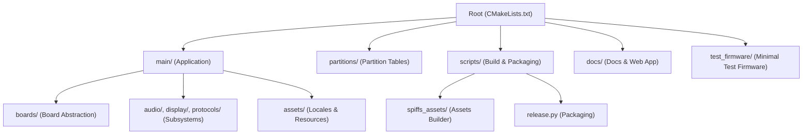
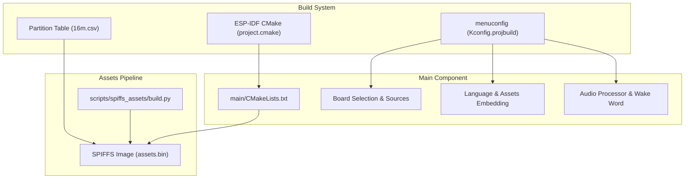
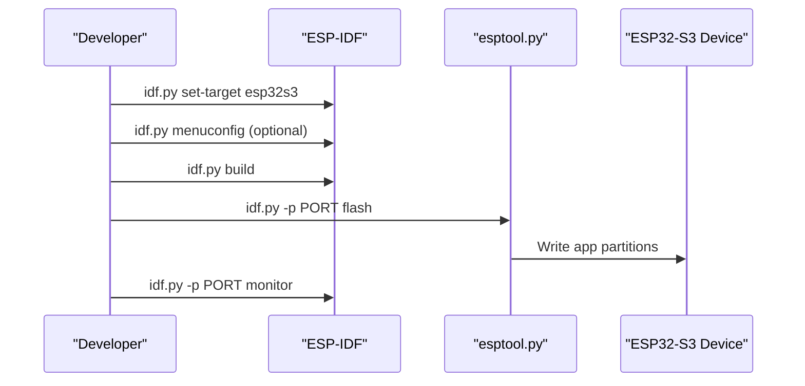
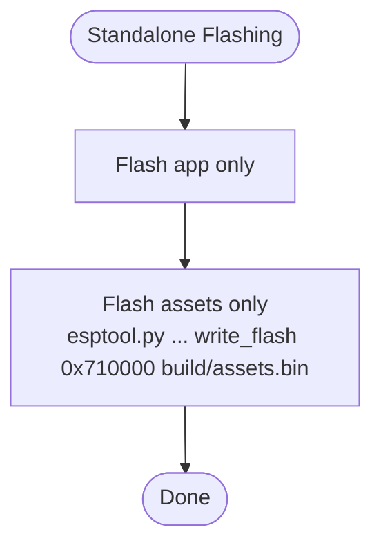
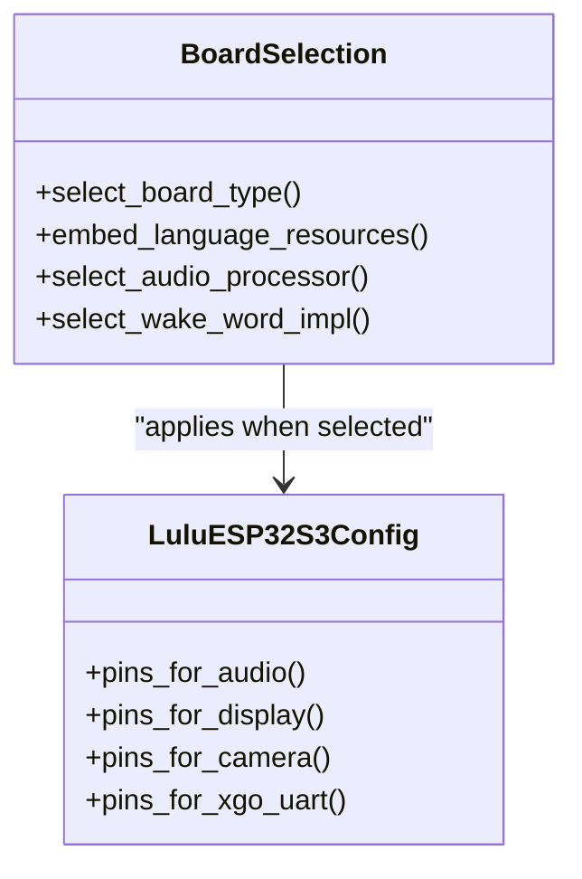
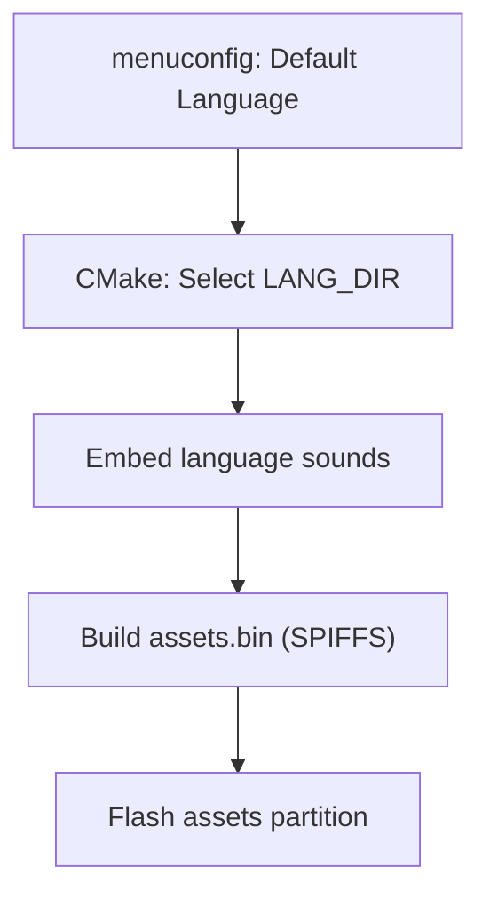
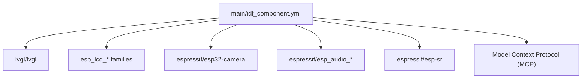
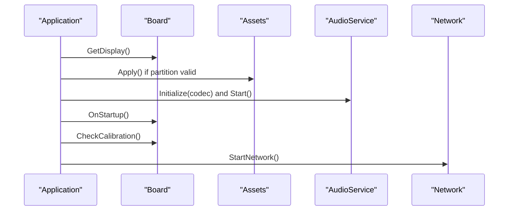

# Getting Started

<cite>
**Referenced Files in This Document**
- [README.md](file://README.md)
- [CMakeLists.txt](file://CMakeLists.txt)
- [main/CMakeLists.txt](file://main/CMakeLists.txt)
- [main/Kconfig.projbuild](file://main/Kconfig.projbuild)
- [sdkconfig.defaults](file://sdkconfig.defaults)
- [sdkconfig.defaults.esp32s3](file://sdkconfig.defaults.esp32s3)
- [partitions/v2/16m.csv](file://partitions/v2/16m.csv)
- [main/boards/lulu-esp32s3/config.h](file://main/boards/lulu-esp32s3/config.h)
- [scripts/spiffs_assets/build.py](file://scripts/spiffs_assets/build.py)
- [test_firmware/sdkconfig.defaults](file://test_firmware/sdkconfig.defaults)
- [main/idf_component.yml](file://main/idf_component.yml)
- [test_firmware/main/idf_component.yml](file://test_firmware/main/idf_component.yml)
- [main/application.cc](file://main/application.cc)
- [scripts/release.py](file://scripts/release.py)
</cite>

## Table of Contents
1. [Introduction](#introduction)
2. [Project Structure](#project-structure)
3. [Core Components](#core-components)
4. [Architecture Overview](#architecture-overview)
5. [Detailed Component Analysis](#detailed-component-analysis)
6. [Dependency Analysis](#dependency-analysis)
7. [Performance Considerations](#performance-considerations)
8. [Troubleshooting Guide](#troubleshooting-guide)
9. [Conclusion](#conclusion)
10. [Appendices](#appendices)

## Introduction
This guide helps you set up the RIG-Puppy development environment for ESP32-S3 and build/run the firmware. It covers installing ESP-IDF v5.4+, cloning the repository, configuring the project, compiling and flashing, and using menuconfig to tailor the build for your board and assets. It also documents standalone flashing of application and assets partitions, hardware requirements, initial device setup, typical workflows, debugging, prerequisites, and troubleshooting.

## Project Structure
RIG-Puppy is an ESP-IDF project organized around a modular “main” component with board-specific implementations, assets, and scripts for building and packaging. Key areas:
- main: Application entry, audio/video/display subsystems, board abstraction, and assets
- partitions: Partition tables for firmware and assets
- scripts: Tools for building assets and packaging firmware
- docs: Documentation and web app assets
- test_firmware: Minimal test firmware for hardware verification

**Diagram sources**
- [CMakeLists.txt:1-14](file://CMakeLists.txt#L1-L14)
- [main/CMakeLists.txt:1-800](file://main/CMakeLists.txt#L1-L800)
- [partitions/v2/16m.csv:1-9](file://partitions/v2/16m.csv#L1-L9)
- [scripts/spiffs_assets/build.py:1-200](file://scripts/spiffs_assets/build.py#L1-L200)
- [scripts/release.py:1-349](file://scripts/release.py#L1-L349)

**Section sources**
- [README.md:115-137](file://README.md#L115-L137)
- [CMakeLists.txt:1-14](file://CMakeLists.txt#L1-L14)
- [main/CMakeLists.txt:1-800](file://main/CMakeLists.txt#L1-L800)

## Core Components
- ESP-IDF v5.4+: The framework used to build and flash the firmware
- Board abstraction: Board-specific configuration and drivers under main/boards
- Assets pipeline: SPIFFS assets built and flashed separately for expressions and fonts
- Partition table: Defines app and assets partitions for ESP32-S3
- menuconfig: Project configuration for board type, language, assets, and provisioning

Key configuration files:
- sdkconfig.defaults: General defaults for logging, partitions, LVGL, and memory
- sdkconfig.defaults.esp32s3: ESP32-S3 specific settings (PSRAM, BLUFI, OTA URL)
- main/Kconfig.projbuild: Project menuconfig options (board type, language, assets, provisioning)
- partitions/v2/16m.csv: Partition table for app and assets

**Section sources**
- [README.md:49-114](file://README.md#L49-L114)
- [sdkconfig.defaults:1-83](file://sdkconfig.defaults#L1-L83)
- [sdkconfig.defaults.esp32s3:1-63](file://sdkconfig.defaults.esp32s3#L1-L63)
- [main/Kconfig.projbuild:1-800](file://main/Kconfig.projbuild#L1-L800)
- [partitions/v2/16m.csv:1-9](file://partitions/v2/16m.csv#L1-L9)

## Architecture Overview
The build system integrates ESP-IDF’s CMake with project-specific logic. The main component compiles board-specific sources, selects audio processors and wake word implementations based on Kconfig, and embeds language resources. Assets are packaged into a SPIFFS image and flashed to the assets partition.

**Diagram sources**
- [CMakeLists.txt:1-14](file://CMakeLists.txt#L1-L14)
- [main/CMakeLists.txt:1-800](file://main/CMakeLists.txt#L1-L800)
- [main/Kconfig.projbuild:1-800](file://main/Kconfig.projbuild#L1-L800)
- [partitions/v2/16m.csv:1-9](file://partitions/v2/16m.csv#L1-L9)
- [scripts/spiffs_assets/build.py:1-200](file://scripts/spiffs_assets/build.py#L1-L200)

**Section sources**
- [main/CMakeLists.txt:816-852](file://main/CMakeLists.txt#L816-L852)
- [scripts/spiffs_assets/build.py:1-200](file://scripts/spiffs_assets/build.py#L1-L200)

## Detailed Component Analysis

### ESP-IDF v5.4+ Installation and Environment Setup
- Install ESP-IDF v5.4+ as documented by Espressif
- Ensure your shell environment is initialized for ESP-IDF commands

Verification steps:
- Confirm idf.py is available and prints version
- Verify ESP-IDF version meets minimum requirements

**Section sources**
- [README.md:51-57](file://README.md#L51-L57)

### Cloning the Repository
- Clone the repository and navigate into the project directory

**Section sources**
- [README.md:59-63](file://README.md#L59-L63)

### Setting the Target and Building
- Set the target to ESP32-S3
- Configure optional settings with menuconfig
- Build the project
- Flash the firmware to the device
- Monitor logs

**Diagram sources**
- [README.md:65-82](file://README.md#L65-L82)

**Section sources**
- [README.md:65-82](file://README.md#L65-L82)

### Standalone Flashing of Application and Assets Partitions
- Flash only the application partition
- Flash only the assets partition using esptool.py to the assets offset

**Diagram sources**
- [README.md:84-92](file://README.md#L84-L92)
- [partitions/v2/16m.csv:8-8](file://partitions/v2/16m.csv#L8-L8)

**Section sources**
- [README.md:84-92](file://README.md#L84-L92)
- [partitions/v2/16m.csv:8-8](file://partitions/v2/16m.csv#L8-L8)

### menuconfig Options and Configuration
Primary options in project menuconfig:
- Board Type: Select your hardware (e.g., LULU ESP32-S3)
- Default Language: Choose display language
- Flash Assets: Choose assets to flash (default, custom, expression)
- WiFi Provisioning: Choose provisioning method (Hotspot, Esp Blufi, Acoustic)

These options are defined in the project Kconfig and influence board selection, language resource embedding, and provisioning stack.

**Section sources**
- [README.md:94-104](file://README.md#L94-L104)
- [main/Kconfig.projbuild:1-800](file://main/Kconfig.projbuild#L1-L800)

### Board Type Selection and Board-Specific Configuration
- Board selection is driven by Kconfig choices and reflected in CMake logic
- Board-specific pins and peripherals are configured in the board header (e.g., LULU ESP32-S3)

**Diagram sources**
- [main/CMakeLists.txt:86-726](file://main/CMakeLists.txt#L86-L726)
- [main/boards/lulu-esp32s3/config.h:1-91](file://main/boards/lulu-esp32s3/config.h#L1-L91)

**Section sources**
- [main/CMakeLists.txt:86-726](file://main/CMakeLists.txt#L86-L726)
- [main/boards/lulu-esp32s3/config.h:1-91](file://main/boards/lulu-esp32s3/config.h#L1-L91)

### Language Settings and Assets Configuration
- Language selection influences which locale assets are embedded and used
- Assets builder supports building SPIFFS images with emojis, fonts, and wake word models

**Diagram sources**
- [main/CMakeLists.txt:758-791](file://main/CMakeLists.txt#L758-L791)
- [scripts/spiffs_assets/build.py:1-200](file://scripts/spiffs_assets/build.py#L1-L200)

**Section sources**
- [main/CMakeLists.txt:758-791](file://main/CMakeLists.txt#L758-L791)
- [scripts/spiffs_assets/build.py:1-200](file://scripts/spiffs_assets/build.py#L1-L200)

### Partition Table and Assets Layout
- The partition table defines offsets for app and assets partitions
- Assets are stored in a SPIFFS partition and mounted at runtime

**Section sources**
- [partitions/v2/16m.csv:1-9](file://partitions/v2/16m.csv#L1-L9)

### Hardware Requirements and Initial Device Setup
- MCU: ESP32-S3 (N16R8)
- Flash: 16MB
- PSRAM: 8MB Octal
- Display: GC9A01 round LCD 240x240 (LULU board)
- Audio: I2S digital mic and DAC with amplifier
- Camera: OV2640 (optional)
- Power and connectivity: USB/UART for flashing and serial monitoring

Initial setup:
- Connect the device via USB-to-serial adapter
- Set target to ESP32-S3
- Flash firmware and monitor logs
- Use BluFi or another provisioning method to connect to Wi-Fi

**Section sources**
- [README.md:36-48](file://README.md#L36-L48)
- [README.md:65-82](file://README.md#L65-L82)
- [sdkconfig.defaults.esp32s3:34-63](file://sdkconfig.defaults.esp32s3#L34-L63)

### Development Workflows and Debugging
Typical workflows:
- Iterate on application logic and rebuild
- Rebuild assets and flash only the assets partition for rapid iteration
- Use monitor filtering for specific log tags

Debugging tips:
- Filter logs by tags (e.g., LULUESP32S3, XGO, BLUFI, AFE)
- Use serial monitor to observe boot and runtime logs
- For camera or audio issues, enable debug modes conditionally

**Section sources**
- [README.md:179-196](file://README.md#L179-L196)

### Prerequisites and Recommended Tools
- ESP-IDF v5.4+ installed and environment sourced
- Python 3.x for scripts
- esptool.py for standalone flashing
- Serial terminal for monitoring logs
- Board-specific USB-to-serial adapter

**Section sources**
- [README.md:51-57](file://README.md#L51-L57)
- [test_firmware/sdkconfig.defaults:1-26](file://test_firmware/sdkconfig.defaults#L1-L26)

## Dependency Analysis
External dependencies are declared via the IDF Component Manager manifest. These include display panels, cameras, audio codecs, LVGL, and related components.

**Diagram sources**
- [main/idf_component.yml:1-128](file://main/idf_component.yml#L1-L128)

**Section sources**
- [main/idf_component.yml:1-128](file://main/idf_component.yml#L1-L128)
- [test_firmware/main/idf_component.yml:1-8](file://test_firmware/main/idf_component.yml#L1-L8)

## Performance Considerations
- PSRAM usage: Ensure PSRAM is enabled for advanced features (e.g., AFE, wake word)
- Partition sizing: Verify assets partition is large enough for your emoji and audio assets
- Logging level: Adjust default log level to balance verbosity and performance
- Cache configuration: Instruction/data cache settings are set for ESP32-S3

**Section sources**
- [sdkconfig.defaults.esp32s3:1-63](file://sdkconfig.defaults.esp32s3#L1-L63)
- [sdkconfig.defaults:1-83](file://sdkconfig.defaults#L1-L83)
- [partitions/v2/16m.csv:8-8](file://partitions/v2/16m.csv#L8-L8)

## Troubleshooting Guide
Common issues and resolutions:
- WiFi scan timeout: AP list is limited and sorted by signal strength
- Slow wake response: Ensure emotion setting occurs after enabling voice processing
- Servo jitter: Verify calibration values and power stability

Environment and flashing:
- If flashing fails, confirm the serial port is correct and the device is in download mode
- For assets-only updates, use esptool.py to write to the assets partition offset

Logs and filtering:
- Use monitor with tag filtering to diagnose subsystems (e.g., LULUESP32S3, XGO, BLUFI, AFE)

**Section sources**
- [README.md:196-206](file://README.md#L196-L206)
- [README.md:179-196](file://README.md#L179-L196)

## Conclusion
You now have the essentials to install ESP-IDF, configure RIG-Puppy for ESP32-S3, build and flash the firmware, and iterate on assets and code. Use menuconfig to tailor the build to your board and needs, and leverage standalone assets flashing for efficient development cycles.

## Appendices

### Appendix A: Typical Build and Flash Commands
- Set target: idf.py set-target esp32s3
- Configure (optional): idf.py menuconfig
- Build: idf.py build
- Flash: idf.py -p PORT flash
- Monitor: idf.py -p PORT monitor
- Flash assets only: esptool.py --chip esp32s3 -p PORT write_flash 0x710000 build/assets.bin

**Section sources**
- [README.md:65-92](file://README.md#L65-L92)

### Appendix B: Board-Specific Pins (LULU ESP32-S3)
- Audio I2S pins and modes
- Display pins (GC9A01)
- Camera pins (OV2640)
- XGO UART pins
- IMU I2C pins

**Section sources**
- [main/boards/lulu-esp32s3/config.h:1-91](file://main/boards/lulu-esp32s3/config.h#L1-L91)

### Appendix C: Application Initialization Flow
- Board initialization and startup callbacks
- Asset loading at boot
- Audio service initialization and callbacks
- Network start and UI updates

**Diagram sources**
- [main/application.cc:62-178](file://main/application.cc#L62-L178)