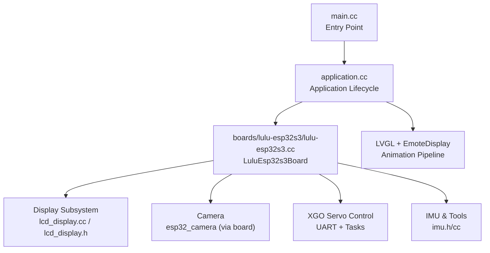
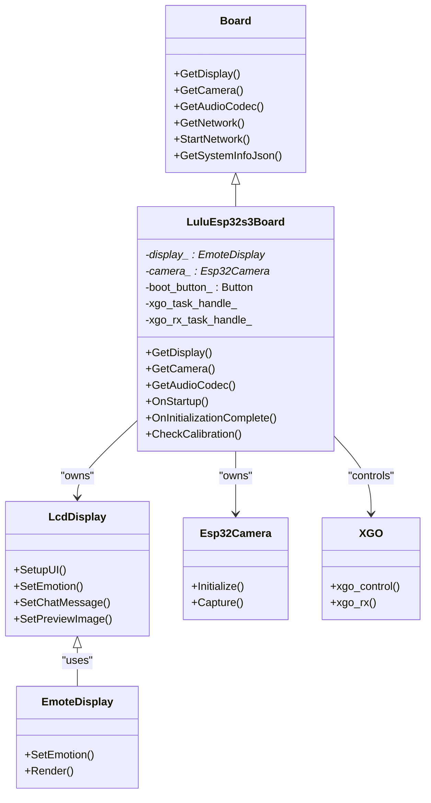
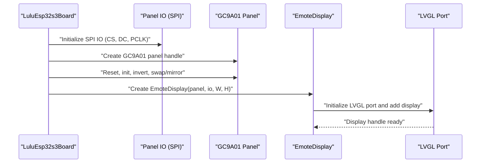
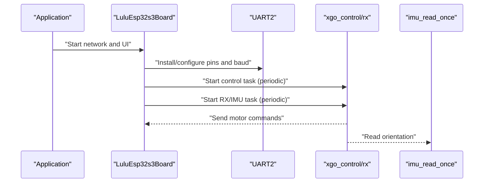
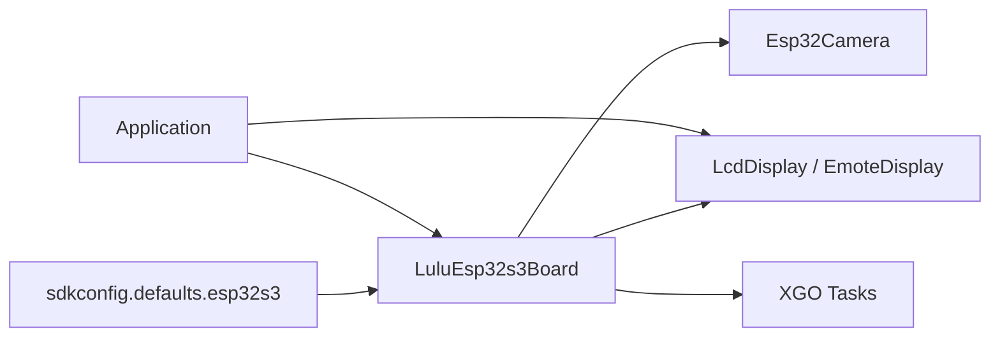

# Board Design and Layout

<cite>
**Referenced Files in This Document**
- [config.h](file://main/boards/lulu-esp32s3/config.h)
- [config.json](file://main/boards/lulu-esp32s3/config.json)
- [emote_config.json](file://main/boards/lulu-esp32s3/emote_config.json)
- [layout.json](file://main/boards/lulu-esp32s3/240_240/layout.json)
- [config.json](file://main/boards/lulu-esp32s3/240_240/config.json)
- [lulu-esp32s3.cc](file://main/boards/lulu-esp32s3/lulu-esp32s3.cc)
- [lcd_display.cc](file://main/display/lcd_display.cc)
- [lcd_display.h](file://main/display/lcd_display.h)
- [sdkconfig.defaults.esp32s3](file://sdkconfig.defaults.esp32s3)
- [main.cc](file://main/main.cc)
- [application.cc](file://main/application.cc)
</cite>

## Table of Contents
1. [Introduction](#introduction)
2. [Project Structure](#project-structure)
3. [Core Components](#core-components)
4. [Architecture Overview](#architecture-overview)
5. [Detailed Component Analysis](#detailed-component-analysis)
6. [Dependency Analysis](#dependency-analysis)
7. [Performance Considerations](#performance-considerations)
8. [Troubleshooting Guide](#troubleshooting-guide)
9. [Conclusion](#conclusion)
10. [Appendices](#appendices)

## Introduction
This document describes the LULU robot board design and physical layout, focusing on the ESP32-S3 N16R8 architecture with 16 MB flash and octal PSRAM. It documents the round 240x240 GC9A01 LCD display mounting, servo motor control via XGO UART, component routing, and the software-controlled display pipeline. It also outlines power delivery, signal integrity, thermal management, and EMI considerations derived from the configuration and implementation. Board revision history, manufacturing specifications, and assembly requirements are summarized based on the repository’s configuration and defaults.

## Project Structure
The LULU board implementation is organized around a board abstraction that initializes peripherals, manages display and camera, controls motors, and integrates with the application runtime. Key areas:
- Board configuration and pin assignments for display, camera, audio, IMU, and XGO control
- Display subsystem using LVGL and EmoteDisplay for AAF animations
- Application lifecycle managing initialization, UI updates, and protocol integration
- SDK configuration enabling 16 MB flash, 240 MHz CPU, and octal PSRAM

**Diagram sources**
- [main.cc:14-29](file://main/main.cc#L14-L29)
- [application.cc:62-178](file://main/application.cc#L62-L178)
- [lulu-esp32s3.cc:37-130](file://main/boards/lulu-esp32s3/lulu-esp32s3.cc#L37-L130)
- [lcd_display.cc:92-172](file://main/display/lcd_display.cc#L92-L172)
- [sdkconfig.defaults.esp32s3:1-63](file://sdkconfig.defaults.esp32s3#L1-L63)

**Section sources**
- [main.cc:14-29](file://main/main.cc#L14-L29)
- [application.cc:62-178](file://main/application.cc#L62-L178)
- [lulu-esp32s3.cc:37-130](file://main/boards/lulu-esp32s3/lulu-esp32s3.cc#L37-L130)
- [sdkconfig.defaults.esp32s3:1-63](file://sdkconfig.defaults.esp32s3#L1-L63)

## Core Components
- ESP32-S3 N16R8 with 16 MB flash and octal PSRAM
- GC9A01 240x240 round LCD mounted via SPI interface
- XGO servo motor control over UART with dedicated tasks
- IMU I2C for orientation and diagnostics
- Camera module configured for 240x240 RGB565 frames
- LVGL-based UI with EmoteDisplay for AAF animations

**Section sources**
- [config.h:54-74](file://main/boards/lulu-esp32s3/config.h#L54-L74)
- [config.json:1-8](file://main/boards/lulu-esp32s3/config.json#L1-L8)
- [sdkconfig.defaults.esp32s3:1-14](file://sdkconfig.defaults.esp32s3#L1-L14)
- [lulu-esp32s3.cc:98-130](file://main/boards/lulu-esp32s3/lulu-esp32s3.cc#L98-L130)
- [lulu-esp32s3.cc:132-183](file://main/boards/lulu-esp32s3/lulu-esp32s3.cc#L132-L183)

## Architecture Overview
The board integrates display, camera, servo control, and IMU under a unified board class. The application orchestrates initialization, UI updates, and protocol handling. LVGL is initialized per display type, and EmoteDisplay renders AAF animations.

**Diagram sources**
- [board.h:52-93](file://main/boards/common/board.h#L52-L93)
- [lulu-esp32s3.cc:37-130](file://main/boards/lulu-esp32s3/lulu-esp32s3.cc#L37-L130)
- [lcd_display.h:17-85](file://main/display/lcd_display.h#L17-L85)
- [lulu-esp32s3.cc:132-183](file://main/boards/lulu-esp32s3/lulu-esp32s3.cc#L132-L183)
- [lulu-esp32s3.cc:634-654](file://main/boards/lulu-esp32s3/lulu-esp32s3.cc#L634-L654)

## Detailed Component Analysis

### ESP32-S3 N16R8 Hardware Stack and Configuration
- Flash: 16 MB, QIO mode
- CPU: 240 MHz
- PSRAM: Octal, 8+ MB usable depending on allocation
- WiFi and BT stacks tuned for provisioning and connectivity
- LVGL snapshot enabled for graphics capture

**Section sources**
- [sdkconfig.defaults.esp32s3:2-6](file://sdkconfig.defaults.esp32s3#L2-L6)
- [sdkconfig.defaults.esp32s3:5](file://sdkconfig.defaults.esp32s3#L5)
- [sdkconfig.defaults.esp32s3:7-14](file://sdkconfig.defaults.esp32s3#L7-L14)
- [sdkconfig.defaults.esp32s3:31-33](file://sdkconfig.defaults.esp32s3#L31-L33)

### GC9A01 240x240 Round LCD Mounting and Routing
- SPI interface on dedicated pins with 80 MHz clock
- DC pin for data/command selection; CS pin for chip select
- Reset and invert/color/mirror/swap controls applied at driver level
- EmoteDisplay used for AAF animations; LVGL port configuration supports RGB565 buffers and rotation/mirror

**Diagram sources**
- [lulu-esp32s3.cc:98-130](file://main/boards/lulu-esp32s3/lulu-esp32s3.cc#L98-L130)
- [lulu-esp32s3.cc:128-129](file://main/boards/lulu-esp32s3/lulu-esp32s3.cc#L128-L129)
- [lcd_display.cc:92-172](file://main/display/lcd_display.cc#L92-L172)

**Section sources**
- [config.h:54-74](file://main/boards/lulu-esp32s3/config.h#L54-L74)
- [lulu-esp32s3.cc:98-130](file://main/boards/lulu-esp32s3/lulu-esp32s3.cc#L98-L130)
- [lcd_display.cc:92-172](file://main/display/lcd_display.cc#L92-L172)

### Servo Motor Placement and XGO UART Control
- XGO UART TX/RX pins configured; baud set to 1 Mbps
- Two RTOS tasks: one for periodic control loop, another for RX and IMU reads
- Boot button long-press triggers NVS reset; triple-click exits calibration mode

**Diagram sources**
- [lulu-esp32s3.cc:48-59](file://main/boards/lulu-esp32s3/lulu-esp32s3.cc#L48-L59)
- [lulu-esp32s3.cc:634-654](file://main/boards/lulu-esp32s3/lulu-esp32s3.cc#L634-L654)
- [config.h:75-88](file://main/boards/lulu-esp32s3/config.h#L75-L88)

**Section sources**
- [config.h:75-88](file://main/boards/lulu-esp32s3/config.h#L75-L88)
- [lulu-esp32s3.cc:48-59](file://main/boards/lulu-esp32s3/lulu-esp32s3.cc#L48-L59)
- [lulu-esp32s3.cc:634-654](file://main/boards/lulu-esp32s3/lulu-esp32s3.cc#L634-L654)

### Camera Integration and Frame Buffer Management
- Camera configured for 240x240 RGB565 frames
- Frame buffer located in PSRAM to reduce CPU memory pressure
- Sensor detection and optional tool availability depend on successful initialization

**Section sources**
- [config.h:35-52](file://main/boards/lulu-esp32s3/config.h#L35-L52)
- [lulu-esp32s3.cc:132-183](file://main/boards/lulu-esp32s3/lulu-esp32s3.cc#L132-L183)

### IMU and System Diagnostics
- IMU I2C pins configured; IMU initialization and periodic reads integrated into XGO RX task
- Device status JSON includes IMU state and orientation

**Section sources**
- [config.h:82-84](file://main/boards/lulu-esp32s3/config.h#L82-L84)
- [lulu-esp32s3.cc:631-633](file://main/boards/lulu-esp32s3/lulu-esp32s3.cc#L631-L633)
- [lulu-esp32s3.cc:684-706](file://main/boards/lulu-esp32s3/lulu-esp32s3.cc#L684-L706)

### Display Layout and Emotion Assets
- Emote assets configured via emote_config.json
- Layout defined in 240x240 layout.json with aligned elements and timers
- Text fonts and emoji collections referenced in board-level configs

**Section sources**
- [emote_config.json:1-34](file://main/boards/lulu-esp32s3/emote_config.json#L1-L34)
- [layout.json:1-85](file://main/boards/lulu-esp32s3/240_240/layout.json#L1-L85)
- [config.json:1-6](file://main/boards/lulu-esp32s3/240_240/config.json#L1-L6)

## Dependency Analysis
The board depends on SDK configuration for memory and peripheral tuning, and the application manages lifecycle and UI updates. Display initialization varies by panel type and uses LVGL port abstractions.

**Diagram sources**
- [sdkconfig.defaults.esp32s3:1-63](file://sdkconfig.defaults.esp32s3#L1-L63)
- [lulu-esp32s3.cc:37-130](file://main/boards/lulu-esp32s3/lulu-esp32s3.cc#L37-L130)
- [application.cc:62-178](file://main/application.cc#L62-L178)

**Section sources**
- [sdkconfig.defaults.esp32s3:1-63](file://sdkconfig.defaults.esp32s3#L1-L63)
- [lulu-esp32s3.cc:37-130](file://main/boards/lulu-esp32s3/lulu-esp32s3.cc#L37-L130)
- [application.cc:62-178](file://main/application.cc#L62-L178)

## Performance Considerations
- CPU frequency at 240 MHz balances performance and power
- Octal PSRAM enabled with reserved internal memory for allocations
- LVGL image cache sizing depends on PSRAM availability
- WiFi and BT stacks configured for responsiveness and memory footprint
- Camera frame buffers allocated in PSRAM to minimize CPU RAM usage

Recommendations:
- Keep LVGL DMA buffers enabled and avoid frequent full-refresh modes
- Limit UI redraw regions and leverage LVGL’s built-in caching
- Use PSRAM for large images/animations; monitor heap fragmentation
- Tune XGO task intervals to balance responsiveness and CPU load

**Section sources**
- [sdkconfig.defaults.esp32s3:5](file://sdkconfig.defaults.esp32s3#L5)
- [sdkconfig.defaults.esp32s3:7-14](file://sdkconfig.defaults.esp32s3#L7-L14)
- [lcd_display.cc:116-126](file://main/display/lcd_display.cc#L116-L126)
- [lulu-esp32s3.cc:154-158](file://main/boards/lulu-esp32s3/lulu-esp32s3.cc#L154-L158)

## Troubleshooting Guide
- NVS reset via long-press: Hold boot button >3 seconds to erase NVS and restart
- Calibration mode: Triple-click to exit calibration; IMU state included in status JSON
- Boot animation: Startup sequence triggers a posture and sound; ensure laser is off post-initialization
- Servo stall protection: Automatic motor disable and re-enable after stall event; verify motor connections

**Section sources**
- [lulu-esp32s3.cc:217-283](file://main/boards/lulu-esp32s3/lulu-esp32s3.cc#L217-L283)
- [lulu-esp32s3.cc:735-774](file://main/boards/lulu-esp32s3/lulu-esp32s3.cc#L735-L774)
- [lulu-esp32s3.cc:708-719](file://main/boards/lulu-esp32s3/lulu-esp32s3.cc#L708-L719)
- [lulu-esp32s3.cc:597-627](file://main/boards/lulu-esp32s3/lulu-esp32s3.cc#L597-L627)

## Conclusion
The LULU board leverages the ESP32-S3 N16R8 with 16 MB flash and octal PSRAM to deliver a responsive UI, camera, and servo control system. The GC9A01 LCD is integrated via SPI with EmoteDisplay for animations, while XGO control and IMU integration are managed through dedicated tasks. The configuration and defaults in the repository define a robust baseline for performance, power, and reliability, with clear pathways for diagnostics and calibration.

## Appendices

### Manufacturing Specifications and Assembly Requirements
- Target MCU: ESP32-S3
- Display: GC9A01 240x240 round LCD
- Camera: 240x240 RGB565 frames
- PSRAM: Octal, 8+ MB usable
- Flash: 16 MB
- CPU: 240 MHz
- Provisioning: BluFi Wi-Fi provisioning enabled

**Section sources**
- [config.json:1-7](file://main/boards/lulu-esp32s3/config.json#L1-L7)
- [sdkconfig.defaults.esp32s3:2-6](file://sdkconfig.defaults.esp32s3#L2-L6)
- [sdkconfig.defaults.esp32s3:38-47](file://sdkconfig.defaults.esp32s3#L38-L47)

### Signal Integrity, Power Delivery, and Thermal Management
- SPI clock up to 80 MHz; ensure short traces and proper routing near the LCD
- Dedicated control pins for DC/CS/RST; maintain signal timing for command/data transitions
- PSRAM and camera share external memory bandwidth; schedule heavy operations to avoid contention
- IMU I2C on separate SDA/SCL pins to avoid conflicts with camera SDA/SCL
- Thermal considerations: XGO motors and camera generate heat; ensure adequate airflow and avoid prolonged high-load operations without monitoring

**Section sources**
- [config.h:54-74](file://main/boards/lulu-esp32s3/config.h#L54-L74)
- [config.h:82-84](file://main/boards/lulu-esp32s3/config.h#L82-L84)
- [lulu-esp32s3.cc:154-159](file://main/boards/lulu-esp32s3/lulu-esp32s3.cc#L154-L159)