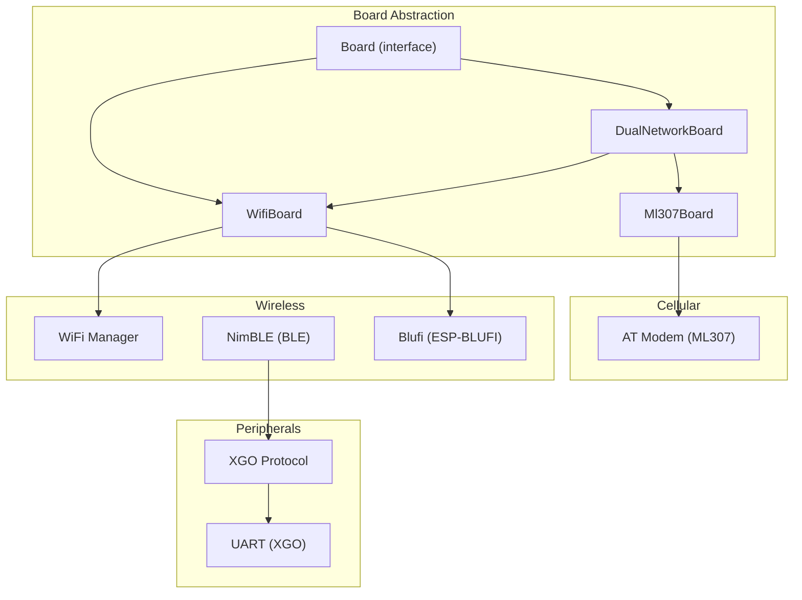
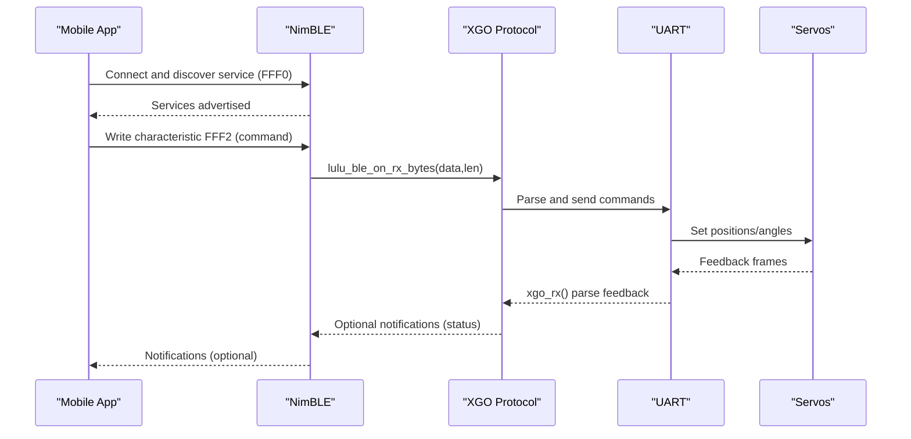
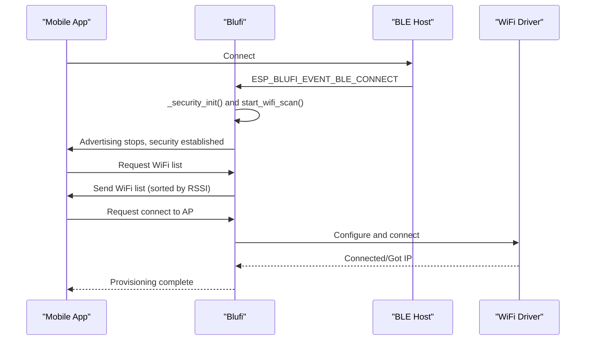
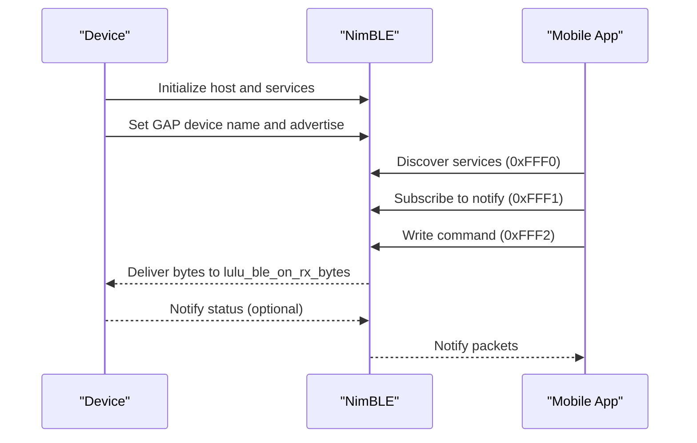
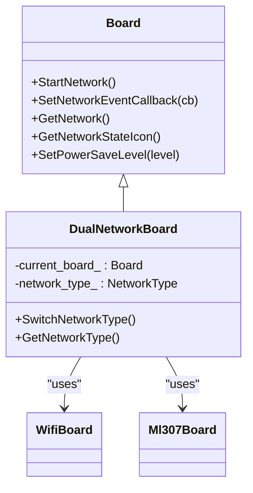
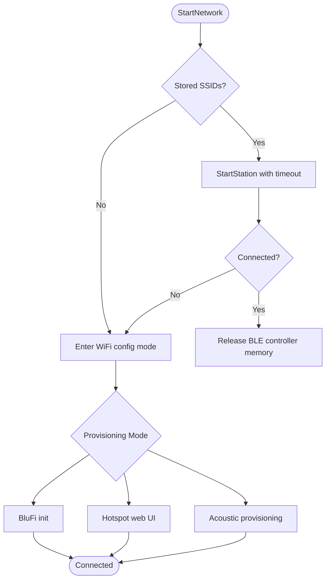
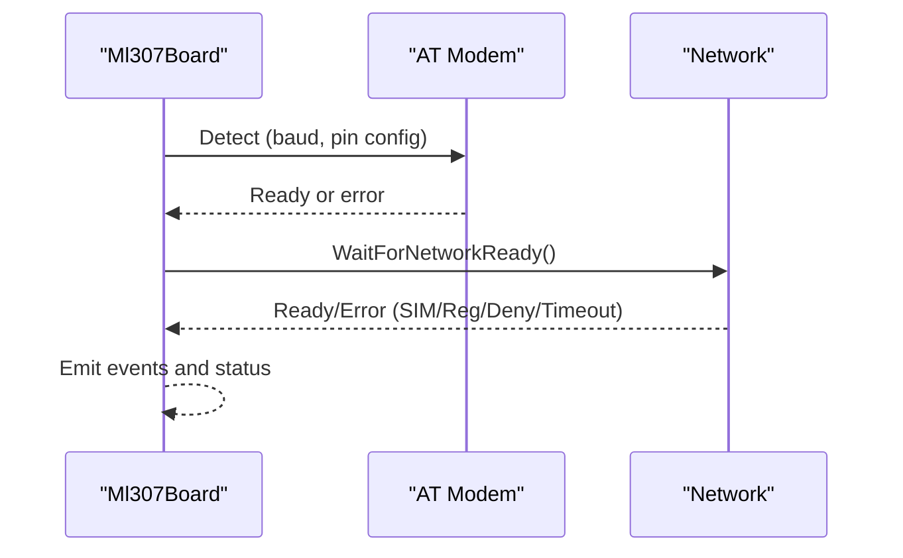
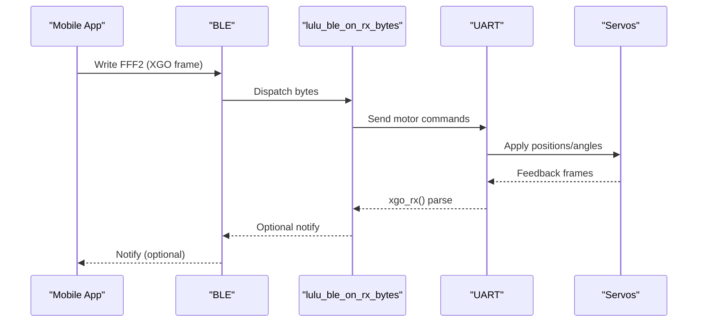
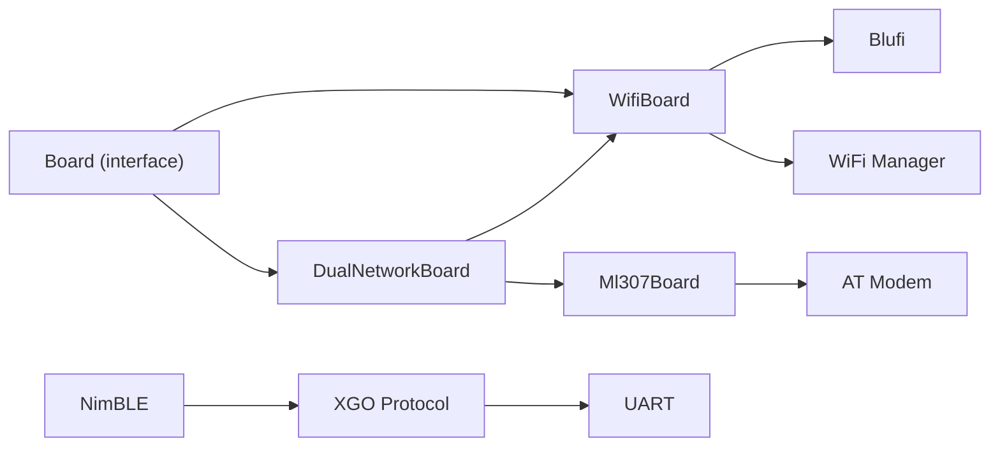

# Communication Interfaces and Protocols

<cite>
**Referenced Files in This Document**
- [wifi_board.h](file://main/boards/common/wifi_board.h)
- [wifi_board.cc](file://main/boards/common/wifi_board.cc)
- [blufi.h](file://main/boards/common/blufi.h)
- [blufi.cpp](file://main/boards/common/blufi.cpp)
- [dual_network_board.h](file://main/boards/common/dual_network_board.h)
- [dual_network_board.cc](file://main/boards/common/dual_network_board.cc)
- [ml307_board.h](file://main/boards/common/ml307_board.h)
- [ml307_board.cc](file://main/boards/common/ml307_board.cc)
- [lulu_ble.h](file://main/boards/lulu-esp32s3/lulu_ble.h)
- [lulu_ble.cc](file://main/boards/lulu-esp32s3/lulu_ble.cc)
- [xgo.h](file://main/boards/lulu-esp32s3/xgo.h)
- [xgo.cc](file://main/boards/lulu-esp32s3/xgo.cc)
- [board.h](file://main/boards/common/board.h)
- [test_hw.c](file://test_firmware/main/test_hw.c)
</cite>

## Table of Contents
1. [Introduction](#introduction)
2. [Project Structure](#project-structure)
3. [Core Components](#core-components)
4. [Architecture Overview](#architecture-overview)
5. [Detailed Component Analysis](#detailed-component-analysis)
6. [Dependency Analysis](#dependency-analysis)
7. [Performance Considerations](#performance-considerations)
8. [Troubleshooting Guide](#troubleshooting-guide)
9. [Conclusion](#conclusion)

## Introduction
This document explains the communication interfaces and wireless connectivity of the system, focusing on:
- BluFi WiFi configuration protocol
- BLE advertisement and data exchange for device provisioning and control
- Dual-network board abstraction supporting WiFi and cellular (ML307)
- Serial communication for XGO servo control via UART
- Network provisioning, security, and resilience
- RF performance and wireless debugging techniques

## Project Structure
The communication stack spans board-level abstractions, protocol implementations, and platform-specific drivers:
- Board abstraction defines a unified interface for network and device services
- WiFi provisioning via BluFi and hot-spot modes
- BLE provisioning and control for device discovery and XGO protocol
- Dual-network switching between WiFi and cellular
- UART-based XGO servo control protocol

**Diagram sources**
- [board.h:52-93](file://main/boards/common/board.h#L52-L93)
- [wifi_board.h:9-76](file://main/boards/common/wifi_board.h#L9-L76)
- [dual_network_board.h:16-58](file://main/boards/common/dual_network_board.h#L16-L58)
- [ml307_board.h:9-36](file://main/boards/common/ml307_board.h#L9-L36)
- [blufi.h:16-147](file://main/boards/common/blufi.h#L16-L147)
- [lulu_ble.h:7-21](file://main/boards/lulu-esp32s3/lulu_ble.h#L7-L21)
- [xgo.h:3-73](file://main/boards/lulu-esp32s3/xgo.h#L3-L73)

**Section sources**
- [board.h:20-93](file://main/boards/common/board.h#L20-L93)
- [wifi_board.h:9-76](file://main/boards/common/wifi_board.h#L9-L76)
- [dual_network_board.h:16-58](file://main/boards/common/dual_network_board.h#L16-L58)
- [ml307_board.h:9-36](file://main/boards/common/ml307_board.h#L9-L36)
- [blufi.h:16-147](file://main/boards/common/blufi.h#L16-L147)
- [lulu_ble.h:7-21](file://main/boards/lulu-esp32s3/lulu_ble.h#L7-L21)
- [xgo.h:3-73](file://main/boards/lulu-esp32s3/xgo.h#L3-L73)

## Core Components
- Board abstraction: Defines the interface for network, display, audio, and device services
- WifiBoard: Implements WiFi connection lifecycle, configuration modes, and event reporting
- DualNetworkBoard: Switches between WiFi and ML307 cellular networks
- Ml307Board: Manages cellular connectivity via AT modem
- BluFi: Implements ESP-BLUFI for secure WiFi provisioning over BLE
- BLE (NimBLE): Provides advertising and GATT services for device discovery and control
- XGO Protocol: UART-based protocol for servo control and BLE-to-serial bridging

**Section sources**
- [board.h:52-93](file://main/boards/common/board.h#L52-L93)
- [wifi_board.cc:53-88](file://main/boards/common/wifi_board.cc#L53-L88)
- [dual_network_board.cc:35-43](file://main/boards/common/dual_network_board.cc#L35-L43)
- [ml307_board.cc:67-132](file://main/boards/common/ml307_board.cc#L67-L132)
- [blufi.cpp:104-138](file://main/boards/common/blufi.cpp#L104-L138)
- [lulu_ble.cc:199-243](file://main/boards/lulu-esp32s3/lulu_ble.cc#L199-L243)
- [xgo.cc:177-187](file://main/boards/lulu-esp32s3/xgo.cc#L177-L187)

## Architecture Overview
The system supports multiple provisioning and operational paths:
- WiFi provisioning via BluFi (BLE + ESP-BLUFI) with DH/AES-based security
- Hot-spot provisioning for web-based configuration
- BLE-based device discovery and control using a custom XGO-style protocol
- Dual-network operation with seamless switching between WiFi and cellular
- UART-based servo control with protocol parsing and feedback

**Diagram sources**
- [lulu_ble.cc:55-78](file://main/boards/lulu-esp32s3/lulu_ble.cc#L55-L78)
- [xgo.cc:521-685](file://main/boards/lulu-esp32s3/xgo.cc#L521-L685)

**Section sources**
- [lulu_ble.cc:134-170](file://main/boards/lulu-esp32s3/lulu_ble.cc#L134-L170)
- [xgo.cc:325-408](file://main/boards/lulu-esp32s3/xgo.cc#L325-L408)

## Detailed Component Analysis

### BluFi WiFi Provisioning
BluFi enables secure WiFi provisioning over BLE using ESP-BLUFI. It initializes the BLE controller/host, registers callbacks, and manages DH key exchange and AES encryption for transport security. It also performs WiFi scans and sends AP lists to the client.

Key behaviors:
- Initializes BLE controller/host and registers callbacks
- Starts a dedicated WiFi scan and maintains AP records
- Handles BLE connect/disconnect events and manages security context
- Negotiates DH parameters, derives shared secret, and sets up AES-CFB encryption
- Sends WiFi list to client and connects to AP on request

**Diagram sources**
- [blufi.cpp:104-138](file://main/boards/common/blufi.cpp#L104-L138)
- [blufi.cpp:531-581](file://main/boards/common/blufi.cpp#L531-L581)
- [blufi.cpp:644-717](file://main/boards/common/blufi.cpp#L644-L717)

**Section sources**
- [blufi.h:16-147](file://main/boards/common/blufi.h#L16-L147)
- [blufi.cpp:104-138](file://main/boards/common/blufi.cpp#L104-L138)
- [blufi.cpp:531-581](file://main/boards/common/blufi.cpp#L531-L581)
- [blufi.cpp:644-717](file://main/boards/common/blufi.cpp#L644-L717)

### BLE Advertisement and Discovery
The device advertises a custom BLE service and characteristics compatible with the XGO protocol. It uses NimBLE to configure GAP/GATT services, set device name from MAC, and manage advertising parameters.

Highlights:
- Advertises service UUID 0xFFF0 with characteristics 0xFFF1 (notify) and 0xFFF2 (write)
- Sets device name dynamically based on MAC address
- Handles connect/disconnect and advertising restart
- Supports notify/indicate for device-to-app communication

**Diagram sources**
- [lulu_ble.cc:172-185](file://main/boards/lulu-esp32s3/lulu_ble.cc#L172-L185)
- [lulu_ble.cc:134-170](file://main/boards/lulu-esp32s3/lulu_ble.cc#L134-L170)
- [lulu_ble.h:7-21](file://main/boards/lulu-esp32s3/lulu_ble.h#L7-L21)

**Section sources**
- [lulu_ble.cc:199-243](file://main/boards/lulu-esp32s3/lulu_ble.cc#L199-L243)
- [lulu_ble.cc:134-170](file://main/boards/lulu-esp32s3/lulu_ble.cc#L134-L170)
- [lulu_ble.h:7-21](file://main/boards/lulu-esp32s3/lulu_ble.h#L7-L21)

### Dual Network Support and Switching
The dual network board abstracts switching between WiFi and ML307 cellular. It loads the preferred network type from settings, initializes the appropriate board, and forwards network operations.

Key points:
- Loads network type from settings (default ML307)
- Initializes current board (WifiBoard or Ml307Board)
- Forwards StartNetwork/SetNetworkEventCallback to active board
- Switching triggers reboot to apply changes

**Diagram sources**
- [dual_network_board.h:16-58](file://main/boards/common/dual_network_board.h#L16-L58)
- [dual_network_board.cc:35-43](file://main/boards/common/dual_network_board.cc#L35-L43)

**Section sources**
- [dual_network_board.h:16-58](file://main/boards/common/dual_network_board.h#L16-L58)
- [dual_network_board.cc:23-43](file://main/boards/common/dual_network_board.cc#L23-L43)
- [ml307_board.cc:134-141](file://main/boards/common/ml307_board.cc#L134-L141)

### WiFi Board Abstraction and Provisioning
The WiFi board orchestrates connection attempts, configuration modes, and event callbacks. It integrates with the WiFi manager and can trigger BluFi provisioning when no credentials are stored.

Highlights:
- Initializes WiFi manager with language and SSID prefix
- Registers unified network event callbacks
- Attempts connection with timeout; falls back to config mode
- Supports hot-spot and acoustic provisioning modes alongside BluFi

**Diagram sources**
- [wifi_board.cc:53-88](file://main/boards/common/wifi_board.cc#L53-L88)
- [wifi_board.cc:90-105](file://main/boards/common/wifi_board.cc#L90-L105)
- [wifi_board.cc:173-221](file://main/boards/common/wifi_board.cc#L173-L221)

**Section sources**
- [wifi_board.h:9-76](file://main/boards/common/wifi_board.h#L9-L76)
- [wifi_board.cc:53-88](file://main/boards/common/wifi_board.cc#L53-L88)
- [wifi_board.cc:90-105](file://main/boards/common/wifi_board.cc#L90-L105)
- [wifi_board.cc:173-221](file://main/boards/common/wifi_board.cc#L173-L221)

### Cellular (ML307) Board
The ML307 board detects the modem via AT commands, waits for network registration, and reports network state. It exposes carrier info, CSQ, and device identifiers.

Key behaviors:
- Detects modem with retries
- Waits for network registration with error handling
- Emits network events for UI and logging
- Provides device status JSON with carrier and signal quality

**Diagram sources**
- [ml307_board.cc:67-132](file://main/boards/common/ml307_board.cc#L67-L132)

**Section sources**
- [ml307_board.h:9-36](file://main/boards/common/ml307_board.h#L9-L36)
- [ml307_board.cc:67-132](file://main/boards/common/ml307_board.cc#L67-L132)

### XGO Servo Control via UART and BLE
The XGO protocol bridges BLE writes to UART commands and parses servo feedback. It supports reading device info and controlling motion via speed commands.

Highlights:
- BLE GATT write to 0xFFF2 triggers lulu_ble_on_rx_bytes
- Parses XGO-style frames and validates checksum
- Writes servo commands to UART and reads feedback
- Supports speed controls and action selection

**Diagram sources**
- [xgo.cc:521-685](file://main/boards/lulu-esp32s3/xgo.cc#L521-L685)
- [xgo.cc:325-408](file://main/boards/lulu-esp32s3/xgo.cc#L325-L408)
- [lulu_ble.cc:38-52](file://main/boards/lulu-esp32s3/lulu_ble.cc#L38-L52)

**Section sources**
- [xgo.h:3-73](file://main/boards/lulu-esp32s3/xgo.h#L3-L73)
- [xgo.cc:521-685](file://main/boards/lulu-esp32s3/xgo.cc#L521-L685)
- [xgo.cc:325-408](file://main/boards/lulu-esp32s3/xgo.cc#L325-L408)
- [lulu_ble.cc:38-52](file://main/boards/lulu-esp32s3/lulu_ble.cc#L38-L52)

## Dependency Analysis
The communication stack exhibits layered dependencies:
- Board abstraction underpins WifiBoard, DualNetworkBoard, and Ml307Board
- WifiBoard depends on WiFi manager and optionally BluFi
- DualNetworkBoard composes WifiBoard and Ml307Board
- BLE and XGO depend on NimBLE and UART respectively
- Security in BluFi relies on mbedTLS and ESP-IDF crypto

**Diagram sources**
- [board.h:52-93](file://main/boards/common/board.h#L52-L93)
- [wifi_board.h:9-76](file://main/boards/common/wifi_board.h#L9-L76)
- [dual_network_board.h:16-58](file://main/boards/common/dual_network_board.h#L16-L58)
- [ml307_board.h:9-36](file://main/boards/common/ml307_board.h#L9-L36)
- [blufi.h:16-147](file://main/boards/common/blufi.h#L16-L147)
- [lulu_ble.h:7-21](file://main/boards/lulu-esp32s3/lulu_ble.h#L7-L21)
- [xgo.h:3-73](file://main/boards/lulu-esp32s3/xgo.h#L3-L73)

**Section sources**
- [board.h:52-93](file://main/boards/common/board.h#L52-L93)
- [wifi_board.cc:53-88](file://main/boards/common/wifi_board.cc#L53-L88)
- [dual_network_board.cc:64-73](file://main/boards/common/dual_network_board.cc#L64-L73)
- [ml307_board.cc:134-141](file://main/boards/common/ml307_board.cc#L134-L141)
- [blufi.cpp:104-138](file://main/boards/common/blufi.cpp#L104-L138)
- [lulu_ble.cc:199-243](file://main/boards/lulu-esp32s3/lulu_ble.cc#L199-L243)
- [xgo.cc:177-187](file://main/boards/lulu-esp32s3/xgo.cc#L177-L187)

## Performance Considerations
- BLE advertising interval: The device advertises with 20–40 ms intervals, balancing discovery latency and power consumption
- WiFi scan optimization: Dedicated scans are triggered on demand and limited in AP count to reduce BLE transfer overhead
- UART throughput: Command batching and wait-for-TX completion ensure reliable servo updates
- Power saving: WiFi power-save levels can be adjusted via the board abstraction; cellular power saving is currently a placeholder

[No sources needed since this section provides general guidance]

## Troubleshooting Guide
Common issues and resolutions:
- WiFi connection timeout: The board enters config mode automatically; verify stored SSIDs and credentials
- BluFi provisioning conflicts: Cannot run BluFi and WiFi config AP simultaneously; exit one before starting the other
- BLE notify failures: Ensure client subscribed to characteristic 0xFFF1 and that connection handle is valid
- UART framing errors: Verify checksum calculation and frame boundaries; confirm baud rate and wiring
- ML307 registration failures: Check SIM presence, network registration status, and retry limits

**Section sources**
- [wifi_board.cc:165-171](file://main/boards/common/wifi_board.cc#L165-L171)
- [blufi.cpp:116-120](file://main/boards/common/blufi.cpp#L116-L120)
- [lulu_ble.cc:127-131](file://main/boards/lulu-esp32s3/lulu_ble.cc#L127-L131)
- [xgo.cc:325-408](file://main/boards/lulu-esp32s3/xgo.cc#L325-L408)
- [ml307_board.cc:104-118](file://main/boards/common/ml307_board.cc#L104-L118)

## RF Performance and Wireless Debugging
- WiFi scanning: The test firmware demonstrates initializing WiFi in station mode, performing an active scan with configurable dwell times, and counting discovered APs
- Signal quality indicators: WiFi RSSI thresholds and cellular CSQ grading inform UI and diagnostics
- Recommendations: Use active scan configurations suitable for the environment; monitor AP counts and re-scan periodically

**Section sources**
- [test_hw.c:1072-1118](file://test_firmware/main/test_hw.c#L1072-L1118)

## Conclusion
The system provides robust, layered communication support:
- Secure WiFi provisioning via BluFi with DH/AES encryption
- BLE-based discovery and control with a custom XGO protocol
- Dual-network capability for flexible connectivity
- Reliable UART-based servo control with feedback parsing
- Practical troubleshooting and performance guidance for real-world deployments