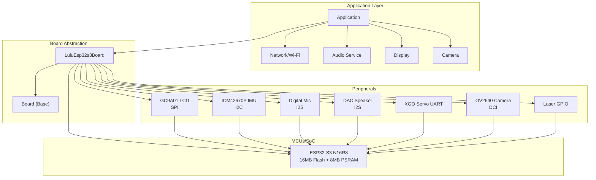
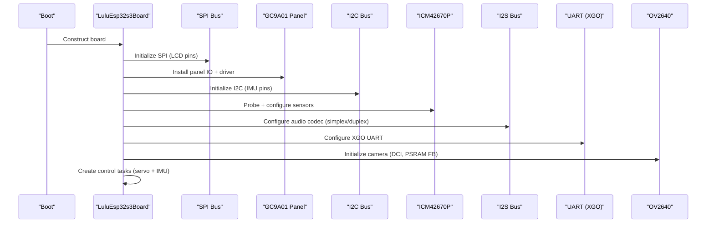
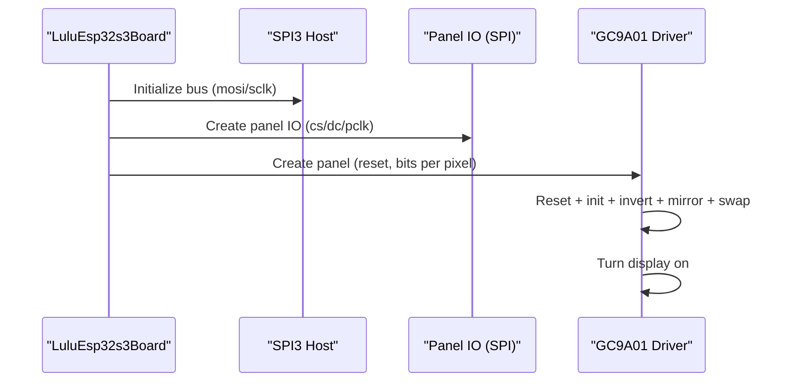
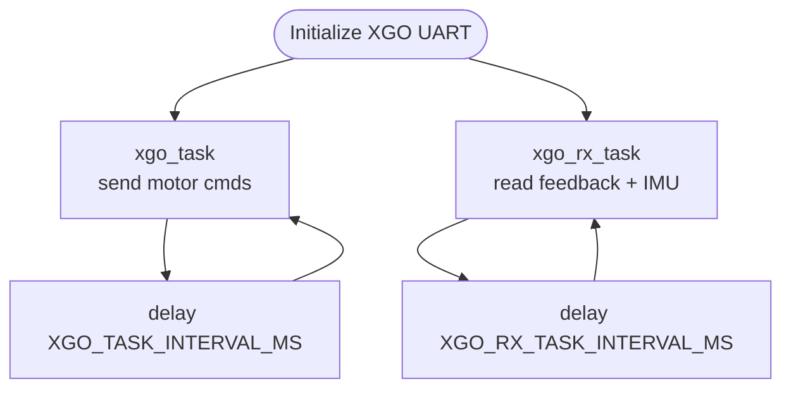
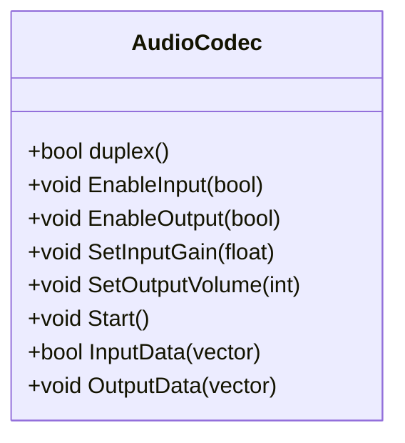
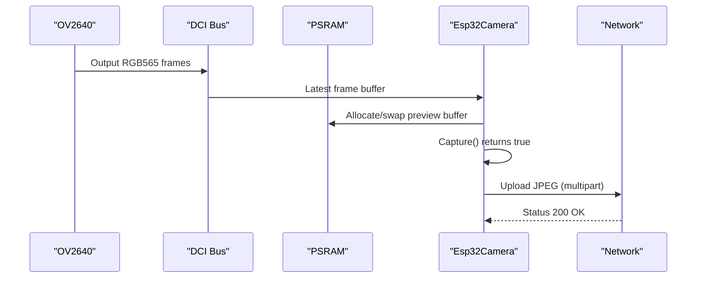
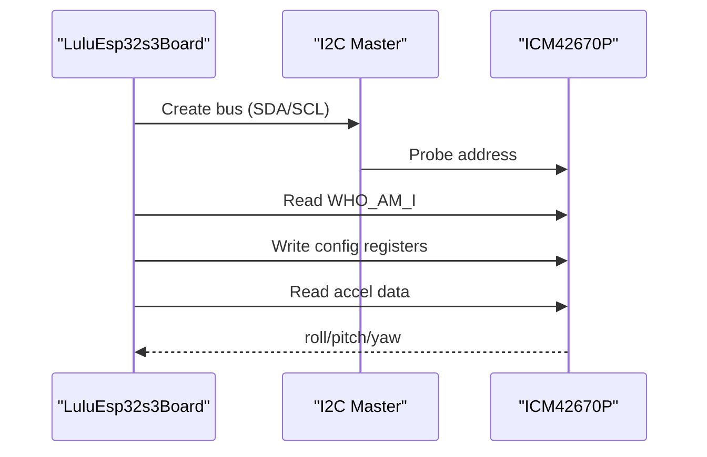
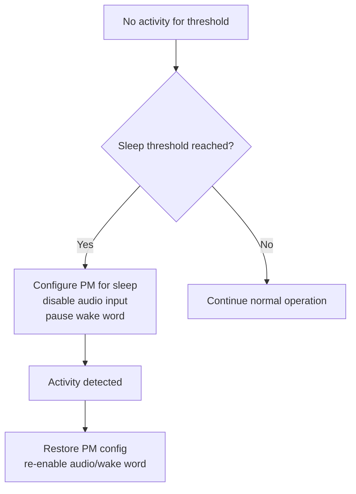
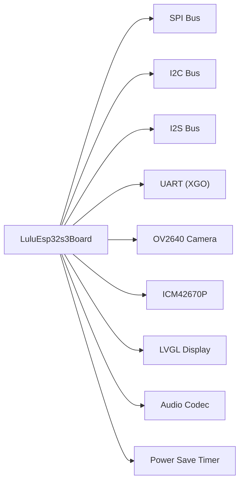

# Hardware Architecture

<cite>
**Referenced Files in This Document**
- [config.h](file://main/boards/lulu-esp32s3/config.h)
- [config.json](file://main/boards/lulu-esp32s3/config.json)
- [lulu-esp32s3.cc](file://main/boards/lulu-esp32s3/lulu-esp32s3.cc)
- [board.h](file://main/boards/common/board.h)
- [board.cc](file://main/boards/common/board.cc)
- [imu.h](file://main/boards/lulu-esp32s3/imu.h)
- [imu.cc](file://main/boards/lulu-esp32s3/imu.cc)
- [esp32_camera.h](file://main/boards/common/esp32_camera.h)
- [esp32_camera.cc](file://main/boards/common/esp32_camera.cc)
- [lvgl_display.h](file://main/display/lvgl_display/lvgl_display.h)
- [audio_codec.h](file://main/audio/audio_codec.h)
- [power_save_timer.h](file://main/boards/common/power_save_timer.h)
- [power_save_timer.cc](file://main/boards/common/power_save_timer.cc)
- [sy6970.h](file://main/boards/common/sy6970.h)
</cite>

## Table of Contents
1. [Introduction](#introduction)
2. [Project Structure](#project-structure)
3. [Core Components](#core-components)
4. [Architecture Overview](#architecture-overview)
5. [Detailed Component Analysis](#detailed-component-analysis)
6. [Dependency Analysis](#dependency-analysis)
7. [Performance Considerations](#performance-considerations)
8. [Troubleshooting Guide](#troubleshooting-guide)
9. [Conclusion](#conclusion)
10. [Appendices](#appendices)

## Introduction
This document describes the hardware architecture of the RIG-Puppy robot platform built around the ESP32-S3 SoC. It focuses on the LULU board abstraction, the ESP32-S3 N16R8 configuration (16 MB flash, 8 MB octal PSRAM), and the integration of peripherals including a GC9A01 round LCD, five-axis servo motors controlled via UART/XGO, an I2S digital microphone, an I2S DAC speaker, and an optional OV2640 camera. It also documents pin assignments, I2C/SPI/I2S bus configurations, power management, GPIO usage patterns, interrupts, real-time constraints, thermal and power optimization, and debugging interfaces.

## Project Structure
The hardware architecture is implemented as a board abstraction layered over ESP-IDF drivers and middleware. The LULU board class initializes and orchestrates:
- SPI for GC9A01 LCD
- I2C for IMU and PMIC
- I2S for audio input/output
- UART for XGO servo control
- Camera subsystem for OV2640
- Power save timer for duty-cycling

**Diagram sources**
- [lulu-esp32s3.cc:58–621:58-621](file://main/boards/lulu-esp32s3/lulu-esp32s3.cc#L58-L621)
- [board.h:52–93:52-93](file://main/boards/common/board.h#L52-L93)
- [config.h:14–84:14-84](file://main/boards/lulu-esp32s3/config.h#L14-L84)

**Section sources**
- [config.json:1–8:1-8](file://main/boards/lulu-esp32s3/config.json#L1-L8)
- [board.h:52–93:52-93](file://main/boards/common/board.h#L52-L93)
- [board.cc:70–178:70-178](file://main/boards/common/board.cc#L70-L178)

## Core Components
- LULU Board Abstraction: Implements board lifecycle, peripheral initialization, tasks, and tooling APIs.
- GC9A01 LCD: SPI-driven round display with configurable orientation and color order.
- IMU (ICM42670P): I2C-accelerometer/gyroscope for posture estimation.
- Audio: I2S simplex or duplex configuration for digital mic and DAC speaker.
- XGO Servos: UART-based control for five-axis servo motors.
- OV2640 Camera: DCI interface with PSRAM-backed frame buffers.
- Power Management: Power save timer and PM configuration; optional PMIC support.

**Section sources**
- [lulu-esp32s3.cc:37–742:37-742](file://main/boards/lulu-esp32s3/lulu-esp32s3.cc#L37-L742)
- [config.h:54–84:54-84](file://main/boards/lulu-esp32s3/config.h#L54-L84)
- [imu.cc:57–170:57-170](file://main/boards/lulu-esp32s3/imu.cc#L57-L170)
- [audio_codec.h:17–62:17-62](file://main/audio/audio_codec.h#L17-L62)
- [esp32_camera.cc:20–52:20-52](file://main/boards/common/esp32_camera.cc#L20-L52)

## Architecture Overview
The LULU board initializes buses and devices, spawns periodic tasks for servo control and sensor reads, and exposes a unified board interface for higher layers. The ESP32-S3 integrates peripherals with dedicated DMA channels and memory regions (PSRAM for camera).

**Diagram sources**
- [lulu-esp32s3.cc:87–130:87-130](file://main/boards/lulu-esp32s3/lulu-esp32s3.cc#L87-L130)
- [lulu-esp32s3.cc:132–183:132-183](file://main/boards/lulu-esp32s3/lulu-esp32s3.cc#L132-L183)
- [lulu-esp32s3.cc:580–621:580-621](file://main/boards/lulu-esp32s3/lulu-esp32s3.cc#L580-L621)

## Detailed Component Analysis

### ESP32-S3 N16R8 Hardware Platform
- Flash: 16 MB (as indicated by partition tables and configuration).
- PSRAM: 8 MB octal (used for camera frame buffers).
- Real-time tasks: Dedicated cores pinned tasks for servo control and sensor reads.
- Power management: PM lock and light sleep via power save timer.

**Section sources**
- [board.cc:110–116:110-116](file://main/boards/common/board.cc#L110-L116)
- [esp32_camera.cc:110–114:110-114](file://main/boards/common/esp32_camera.cc#L110-L114)
- [power_save_timer.cc:92–98:92-98](file://main/boards/common/power_save_timer.cc#L92-L98)

### GC9A01 240x240 Round LCD
- SPI interface: MOSI, SCLK, DC, CS, RST configured.
- Panel IO and driver installed with specific color order and inversion/mirror/swap settings.
- Refresh via panel IO SPI with configurable PCLK and queue depth.

**Diagram sources**
- [lulu-esp32s3.cc:87–130:87-130](file://main/boards/lulu-esp32s3/lulu-esp32s3.cc#L87-L130)
- [config.h:54–74:54-74](file://main/boards/lulu-esp32s3/config.h#L54-L74)

**Section sources**
- [lulu-esp32s3.cc:98–130:98-130](file://main/boards/lulu-esp32s3/lulu-esp32s3.cc#L98-L130)
- [config.h:54–74:54-74](file://main/boards/lulu-esp32s3/config.h#L54-L74)

### Five-Axis Servo Motors (XGO UART)
- UART configuration for XGO control with 1 Mbps baud.
- Two periodic tasks:
  - Control loop sending motor commands at a fixed interval.
  - RX loop reading feedback and IMU data at a slower interval.
- Tools expose actions and motor angle setting via MCP server.

**Diagram sources**
- [lulu-esp32s3.cc:48–59:48-59](file://main/boards/lulu-esp32s3/lulu-esp32s3.cc#L48-L59)
- [lulu-esp32s3.cc:602–621:602-621](file://main/boards/lulu-esp32s3/lulu-esp32s3.cc#L602-L621)
- [config.h:87–88:87-88](file://main/boards/lulu-esp32s3/config.h#L87-L88)

**Section sources**
- [lulu-esp32s3.cc:48–59:48-59](file://main/boards/lulu-esp32s3/lulu-esp32s3.cc#L48-L59)
- [lulu-esp32s3.cc:602–621:602-621](file://main/boards/lulu-esp32s3/lulu-esp32s3.cc#L602-L621)
- [config.h:75–88:75-88](file://main/boards/lulu-esp32s3/config.h#L75-L88)

### I2S Digital Microphone and DAC Speaker
- Sample rates configured for input/output.
- Two modes:
  - Simplex: Separate mic and speaker pins.
  - Duplex: Shared pins for input/output.
- Audio codec base class manages I2S channels, gains, volumes, and duplex mode.

**Diagram sources**
- [audio_codec.h:17–62:17-62](file://main/audio/audio_codec.h#L17-L62)

**Section sources**
- [config.h:6–10:6-10](file://main/boards/lulu-esp32s3/config.h#L6-L10)
- [config.h:12–28:12-28](file://main/boards/lulu-esp32s3/config.h#L12-L28)
- [lulu-esp32s3.cc:623–633:623-633](file://main/boards/lulu-esp32s3/lulu-esp32s3.cc#L623-L633)
- [audio_codec.h:17–62:17-62](file://main/audio/audio_codec.h#L17-L62)

### Optional OV2640 Camera
- DCI interface with XCLK, PCLK, HREF, VSYNC, D0–D7, SIOC/SIOD for SCCB.
- Frame buffer allocation in PSRAM; supports RGB565 capture and JPEG upload pipeline.
- Preview path uses PSRAM buffers; encoder runs in a separate thread.

**Diagram sources**
- [lulu-esp32s3.cc:132–183:132-183](file://main/boards/lulu-esp32s3/lulu-esp32s3.cc#L132-L183)
- [esp32_camera.cc:20–52:20-52](file://main/boards/common/esp32_camera.cc#L20-L52)
- [esp32_camera.cc:90–114:90-114](file://main/boards/common/esp32_camera.cc#L90-L114)
- [esp32_camera.cc:177–328:177-328](file://main/boards/common/esp32_camera.cc#L177-L328)

**Section sources**
- [config.h:35–52:35-52](file://main/boards/lulu-esp32s3/config.h#L35-L52)
- [lulu-esp32s3.cc:132–183:132-183](file://main/boards/lulu-esp32s3/lulu-esp32s3.cc#L132-L183)
- [esp32_camera.cc:20–52:20-52](file://main/boards/common/esp32_camera.cc#L20-L52)
- [esp32_camera.cc:90–114:90-114](file://main/boards/common/esp32_camera.cc#L90-L114)

### IMU I2C (ICM42670P)
- I2C master bus configured with pull-ups and probe.
- WHO_AM_I verification and register programming for accelerometer/gyroscope.
- Exported attitude estimates (roll, pitch, yaw) and acceleration.

**Diagram sources**
- [imu.cc:57–129:57-129](file://main/boards/lulu-esp32s3/imu.cc#L57-L129)
- [imu.cc:132–155:132-155](file://main/boards/lulu-esp32s3/imu.cc#L132-L155)

**Section sources**
- [config.h:82–84:82-84](file://main/boards/lulu-esp32s3/config.h#L82-L84)
- [imu.cc:57–129:57-129](file://main/boards/lulu-esp32s3/imu.cc#L57-L129)
- [imu.cc:132–155:132-155](file://main/boards/lulu-esp32s3/imu.cc#L132-L155)

### Power Management and Thermal Considerations
- Power save timer periodically reduces CPU frequency and enters light sleep when idle.
- Disables audio input and temporarily halts wake word detection during sleep.
- PM lock used by LVGL display to maintain performance during rendering bursts.
- Optional PMIC monitoring via SY6970 interface.

**Diagram sources**
- [power_save_timer.cc:62–104:62-104](file://main/boards/common/power_save_timer.cc#L62-L104)
- [power_save_timer.cc:106–132:106-132](file://main/boards/common/power_save_timer.cc#L106-L132)
- [lvgl_display.h:29](file://main/display/lvgl_display/lvgl_display.h#L29)

**Section sources**
- [power_save_timer.h:8–35:8-35](file://main/boards/common/power_save_timer.h#L8-L35)
- [power_save_timer.cc:62–104:62-104](file://main/boards/common/power_save_timer.cc#L62-L104)
- [power_save_timer.cc:106–132:106-132](file://main/boards/common/power_save_timer.cc#L106-L132)
- [lvgl_display.h:29](file://main/display/lvgl_display/lvgl_display.h#L29)
- [sy6970.h:6–21:6-21](file://main/boards/common/sy6970.h#L6-L21)

### GPIO Usage Patterns and Interrupts
- Boot button with long-press detection using a one-shot timer.
- Laser control via dedicated GPIO configured as output.
- IMU I2C shares SDA/SCL with camera SCCB on different I2C ports to avoid conflicts.
- Boot button uses internal pull-up; other pins configured for peripheral use.

**Section sources**
- [lulu-esp32s3.cc:74–85:74-85](file://main/boards/lulu-esp32s3/lulu-esp32s3.cc#L74-L85)
- [lulu-esp32s3.cc:61–72:61-72](file://main/boards/lulu-esp32s3/lulu-esp32s3.cc#L61-L72)
- [config.h:30–34:30-34](file://main/boards/lulu-esp32s3/config.h#L30-L34)
- [config.h:82–84:82-84](file://main/boards/lulu-esp32s3/config.h#L82-L84)
- [lulu-esp32s3.cc:159](file://main/boards/lulu-esp32s3/lulu-esp32s3.cc#L159)

### Real-Time Constraints
- Servo control and sensor read tasks run at fixed intervals to maintain deterministic timing.
- Display updates and camera capture use DMA and PSRAM to minimize CPU load.
- Audio I2S operates with DMA descriptors and fixed frame sizes for jitter control.

**Section sources**
- [lulu-esp32s3.cc:602–621:602-621](file://main/boards/lulu-esp32s3/lulu-esp32s3.cc#L602-L621)
- [lulu-esp32s3.cc:107](file://main/boards/lulu-esp32s3/lulu-esp32s3.cc#L107)
- [audio_codec.h:14–16:14-16](file://main/audio/audio_codec.h#L14-L16)

### Hardware Debugging Interfaces
- NVS reset via long-press of the boot button triggers a visual emotion and erases NVS.
- Device status JSON includes IMU state and readings for diagnostics.
- Logging via ESP-IDF logging macros for initialization and runtime events.

**Section sources**
- [lulu-esp32s3.cc:218–283:218-283](file://main/boards/lulu-esp32s3/lulu-esp32s3.cc#L218-L283)
- [lulu-esp32s3.cc:651–673:651-673](file://main/boards/lulu-esp32s3/lulu-esp32s3.cc#L651-L673)

## Dependency Analysis
The LULU board composes multiple subsystems with explicit dependencies and minimal coupling.

**Diagram sources**
- [lulu-esp32s3.cc:87–130:87-130](file://main/boards/lulu-esp32s3/lulu-esp32s3.cc#L87-L130)
- [lulu-esp32s3.cc:132–183:132-183](file://main/boards/lulu-esp32s3/lulu-esp32s3.cc#L132-L183)
- [lulu-esp32s3.cc:580–621:580-621](file://main/boards/lulu-esp32s3/lulu-esp32s3.cc#L580-L621)

**Section sources**
- [board.h:52–93:52-93](file://main/boards/common/board.h#L52-L93)
- [board.cc:138–178:138-178](file://main/boards/common/board.cc#L138-L178)

## Performance Considerations
- Prefer PSRAM for camera frame buffers to reduce CPU bandwidth and latency.
- Use DMA and fixed-size buffers for audio to avoid jitter.
- Keep display updates synchronized with VSYNC or refresh boundaries when possible.
- Tune power save thresholds to balance idle power savings with responsiveness.
- Avoid sharing I2C buses between high-speed and sensitive sensors without proper port separation.

## Troubleshooting Guide
- IMU not detected: Verify I2C address probing and pull-up resistors; check bus selection for conflicts with camera SCCB.
- Camera capture fails: Confirm PSRAM availability and frame buffer allocation; verify XCLK frequency and DCI timings.
- Servo jitter or missed commands: Adjust task intervals and ensure deterministic scheduling; verify UART baud and cable integrity.
- Audio glitches: Check I2S DMA descriptors and sample rate alignment; disable power save during audio sessions.
- Boot button misfires: Ensure internal pull-up is enabled and debounce logic is not conflicting with long-press timer.

**Section sources**
- [imu.cc:83–117:83-117](file://main/boards/lulu-esp32s3/imu.cc#L83-L117)
- [esp32_camera.cc:20–52:20-52](file://main/boards/common/esp32_camera.cc#L20-L52)
- [lulu-esp32s3.cc:602–621:602-621](file://main/boards/lulu-esp32s3/lulu-esp32s3.cc#L602-L621)
- [audio_codec.h:14–16:14-16](file://main/audio/audio_codec.h#L14-L16)

## Conclusion
The LULU board integrates a wide range of peripherals around the ESP32-S3 N16R8, leveraging dedicated buses and PSRAM for real-time performance. The board abstraction cleanly separates hardware concerns from application logic, enabling modular development and maintenance. Proper configuration of I2C/SPI/I2S, careful GPIO usage, and power management strategies are essential for reliable operation under real-time constraints.

## Appendices

### Pin Assignments Summary
- LCD: MOSI, SCLK, DC, CS, RST
- IMU I2C: SDA, SCL
- Audio I2S: BCLK, LRC, DOUT (and DIN in duplex)
- XGO UART: TX, RX
- Camera: D0–D7, PCLK, VSYNC, HREF, SIOC, SIOD, XCLK
- Laser: Dedicated GPIO output

**Section sources**
- [config.h:14–84:14-84](file://main/boards/lulu-esp32s3/config.h#L14-L84)

### Datasheets and References
- GC9A01 LCD driver: Integrated via ESP-IDF panel driver.
- ICM42670P IMU: I2C interface and register programming implemented in-board.
- OV2640 Camera: DCI interface with ESP-IDF camera driver.
- SY6970 PMIC: I2C-based charging/status monitoring interface.

**Section sources**
- [lulu-esp32s3.cc:114–119:114-119](file://main/boards/lulu-esp32s3/lulu-esp32s3.cc#L114-L119)
- [imu.cc:108–117:108-117](file://main/boards/lulu-esp32s3/imu.cc#L108-L117)
- [esp32_camera.cc:20–34:20-34](file://main/boards/common/esp32_camera.cc#L20-L34)
- [sy6970.h:6–21:6-21](file://main/boards/common/sy6970.h#L6-L21)