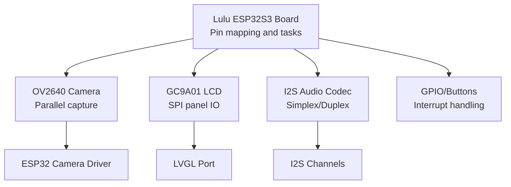
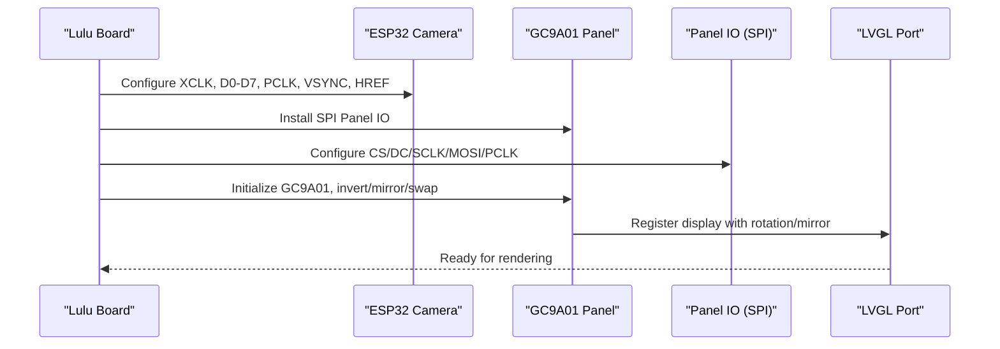
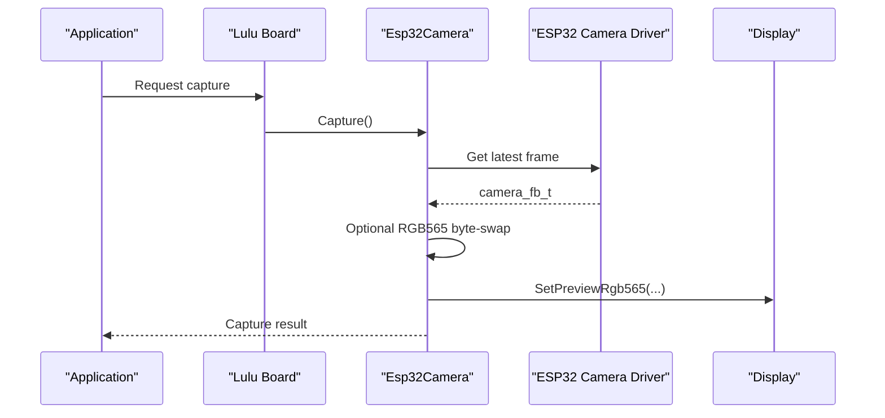
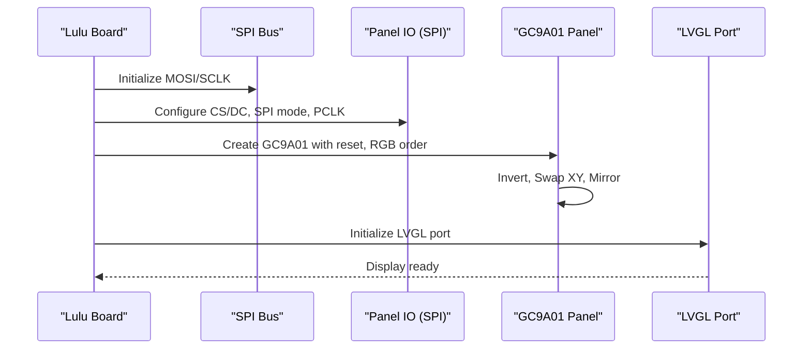
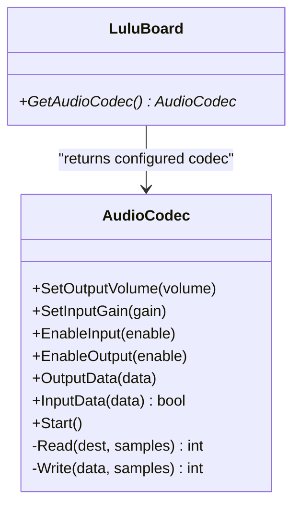
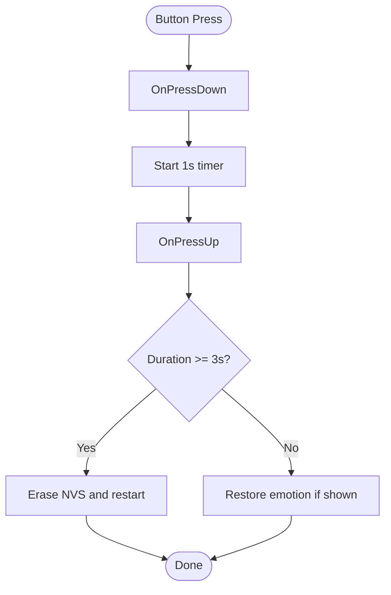
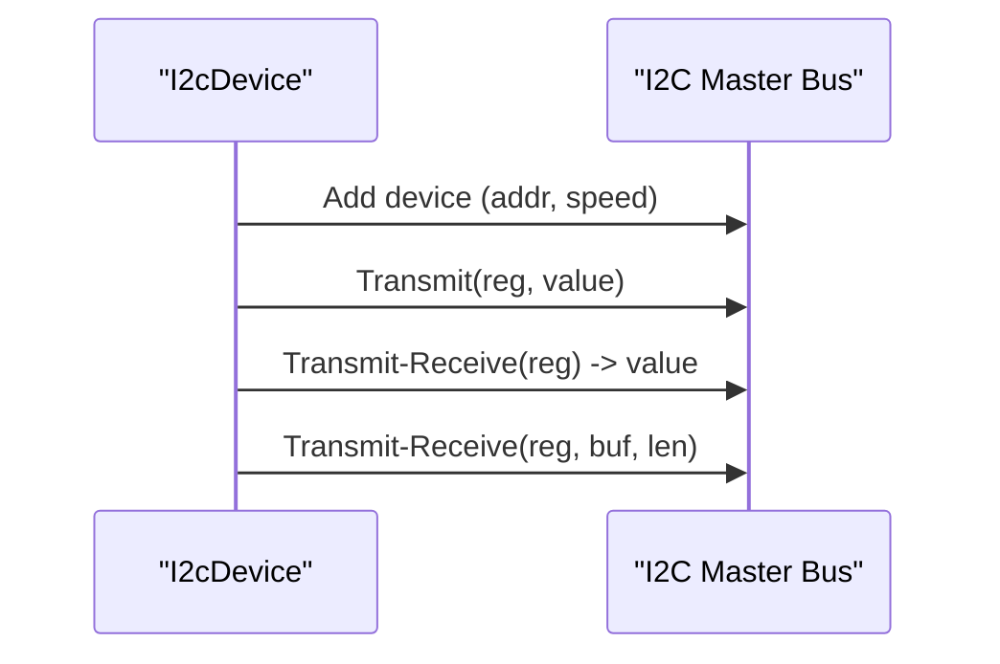
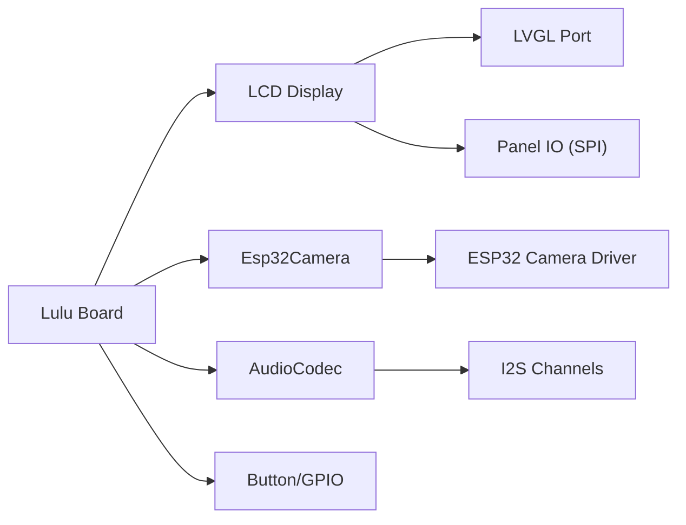

# Peripheral Component Integration

<cite>
**Referenced Files in This Document**
- [config.h](file://main/boards/lulu-esp32s3/config.h)
- [lulu-esp32s3.cc](file://main/boards/lulu-esp32s3/lulu-esp32s3.cc)
- [esp32_camera.h](file://main/boards/common/esp32_camera.h)
- [esp32_camera.cc](file://main/boards/common/esp32_camera.cc)
- [camera.h](file://main/boards/common/camera.h)
- [lcd_display.h](file://main/display/lcd_display.h)
- [lcd_display.cc](file://main/display/lcd_display.cc)
- [audio_codec.h](file://main/audio/audio_codec.h)
- [audio_codec.cc](file://main/audio/audio_codec.cc)
- [i2c_device.h](file://main/boards/common/i2c_device.h)
- [i2c_device.cc](file://main/boards/common/i2c_device.cc)
- [button.h](file://main/boards/common/button.h)
- [button.cc](file://main/boards/common/button.cc)
- [board.h](file://main/boards/common/board.h)
- [board.cc](file://main/boards/common/board.cc)
- [blufi.h](file://main/boards/common/blufi.h)
- [blufi.cpp](file://main/boards/common/blufi.cpp)
</cite>

## Table of Contents
1. [Introduction](#introduction)
2. [Project Structure](#project-structure)
3. [Core Components](#core-components)
4. [Architecture Overview](#architecture-overview)
5. [Detailed Component Analysis](#detailed-component-analysis)
6. [Dependency Analysis](#dependency-analysis)
7. [Performance Considerations](#performance-considerations)
8. [Troubleshooting Guide](#troubleshooting-guide)
9. [Conclusion](#conclusion)
10. [Appendices](#appendices)

## Introduction
This document explains the peripheral component integration and hardware interfaces implemented in the project. It covers:
- OV2640-compatible camera interface via parallel data capture and XCLK configuration
- GC9A01 LCD display over SPI, including initialization and rotation/mirroring controls
- I2S audio interface supporting simplex and duplex modes for microphone and speaker
- GPIO expansion, interrupts, and pin multiplexing strategies
- Component compatibility, sourcing alternatives, and hardware debugging techniques

Where applicable, we map implementation details to actual source files and provide diagrams that reflect the code structure and runtime flows.

## Project Structure
The integration spans board-specific configuration, display drivers, camera capture, audio codec abstraction, and GPIO/interrupt handling. The board layer defines pins and modes; the display layer initializes panels; the camera layer configures sensors; the audio layer abstracts I2S channels; and GPIO/interrupt utilities manage buttons and peripherals.

**Diagram sources**
- [lulu-esp32s3.cc:98-130](file://main/boards/lulu-esp32s3/lulu-esp32s3.cc#L98-L130)
- [lulu-esp32s3.cc:132-183](file://main/boards/lulu-esp32s3/lulu-esp32s3.cc#L132-L183)
- [lulu-esp32s3.cc:656-666](file://main/boards/lulu-esp32s3/lulu-esp32s3.cc#L656-L666)
- [config.h:35-74](file://main/boards/lulu-esp32s3/config.h#L35-L74)

**Section sources**
- [config.h:1-91](file://main/boards/lulu-esp32s3/config.h#L1-L91)
- [lulu-esp32s3.cc:98-130](file://main/boards/lulu-esp32s3/lulu-esp32s3.cc#L98-L130)
- [lulu-esp32s3.cc:132-183](file://main/boards/lulu-esp32s3/lulu-esp32s3.cc#L132-L183)
- [lulu-esp32s3.cc:656-666](file://main/boards/lulu-esp32s3/lulu-esp32s3.cc#L656-L666)

## Core Components
- Board configuration header defines pin assignments, XCLK frequency, and I2S simplex/duplex selection.
- Camera subsystem initializes the ESP32 camera driver with parallel pins and XCLK, captures frames, and optionally encodes to JPEG.
- LCD subsystem installs SPI panel IO and GC9A01 driver, applies inversion, mirroring, and rotation, then integrates with LVGL.
- Audio codec abstracts I2S channels and exposes input/output APIs; board selects simplex or duplex implementation.
- GPIO and button utilities configure interrupts and event handlers for user interaction.

**Section sources**
- [config.h:6-28](file://main/boards/lulu-esp32s3/config.h#L6-L28)
- [config.h:35-74](file://main/boards/lulu-esp32s3/config.h#L35-L74)
- [esp32_camera.h:22-44](file://main/boards/common/esp32_camera.h#L22-L44)
- [lcd_display.h:17-85](file://main/display/lcd_display.h#L17-L85)
- [audio_codec.h:17-62](file://main/audio/audio_codec.h#L17-L62)
- [button.h:11-34](file://main/boards/common/button.h#L11-L34)

## Architecture Overview
The board orchestrates initialization of camera, display, and audio, and manages GPIO and button interrupts. The display pipeline uses LVGL port with SPI panel IO for GC9A01. The camera pipeline uses ESP32’s native camera driver with parallel data and XCLK. Audio uses I2S channels configured per board mode.

**Diagram sources**
- [lulu-esp32s3.cc:98-130](file://main/boards/lulu-esp32s3/lulu-esp32s3.cc#L98-L130)
- [lulu-esp32s3.cc:132-183](file://main/boards/lulu-esp32s3/lulu-esp32s3.cc#L132-L183)
- [lcd_display.cc:128-172](file://main/display/lcd_display.cc#L128-L172)

**Section sources**
- [lulu-esp32s3.cc:98-130](file://main/boards/lulu-esp32s3/lulu-esp32s3.cc#L98-L130)
- [lulu-esp32s3.cc:132-183](file://main/boards/lulu-esp32s3/lulu-esp32s3.cc#L132-L183)
- [lcd_display.cc:128-172](file://main/display/lcd_display.cc#L128-L172)

## Detailed Component Analysis

### OV2640 Camera Interface (Parallel Capture and XCLK)
- Pin assignments and XCLK frequency are defined in the board config header.
- The board constructs a camera configuration with XCLK pin, parallel data pins (D0–D7), and control signals (PCLK, VSYNC, HREF).
- The ESP32 camera driver is initialized with pixel format, frame size, and framebuffer location in PSRAM.
- Frame capture retrieves the latest frame, supports optional RGB565 byte-swapping for downstream consumers, and triggers JPEG encoding in a background thread.
- Preview images are pushed to the display subsystem for immediate feedback.

**Diagram sources**
- [esp32_camera.cc:59-136](file://main/boards/common/esp32_camera.cc#L59-L136)
- [esp32_camera.cc:177-240](file://main/boards/common/esp32_camera.cc#L177-L240)
- [lulu-esp32s3.cc:132-183](file://main/boards/lulu-esp32s3/lulu-esp32s3.cc#L132-L183)

Key implementation references:
- Camera pin mapping and XCLK: [config.h:35-52](file://main/boards/lulu-esp32s3/config.h#L35-L52)
- Camera initialization and sensor retrieval: [lulu-esp32s3.cc:132-183](file://main/boards/lulu-esp32s3/lulu-esp32s3.cc#L132-L183)
- Capture and preview logic: [esp32_camera.cc:59-136](file://main/boards/common/esp32_camera.cc#L59-L136)
- JPEG encoding pipeline: [esp32_camera.cc:177-328](file://main/boards/common/esp32_camera.cc#L177-L328)

**Section sources**
- [config.h:35-52](file://main/boards/lulu-esp32s3/config.h#L35-L52)
- [lulu-esp32s3.cc:132-183](file://main/boards/lulu-esp32s3/lulu-esp32s3.cc#L132-L183)
- [esp32_camera.cc:59-136](file://main/boards/common/esp32_camera.cc#L59-L136)
- [esp32_camera.cc:177-328](file://main/boards/common/esp32_camera.cc#L177-L328)

### GC9A01 LCD Display (SPI Interface and Initialization)
- SPI bus is initialized with MOSI, SCLK, and max transfer size.
- Panel IO SPI is configured with CS, DC, SPI mode, pixel clock, and command/parameter bit widths.
- GC9A01 panel is instantiated with reset pin, RGB element order, and bits-per-pixel.
- Orientation transformations (invert, swap XY, mirror) and display on are applied.
- LVGL port is initialized and the display is registered with rotation and mirroring flags.

**Diagram sources**
- [lulu-esp32s3.cc:87-130](file://main/boards/lulu-esp32s3/lulu-esp32s3.cc#L87-L130)
- [lulu-esp32s3.cc:98-130](file://main/boards/lulu-esp32s3/lulu-esp32s3.cc#L98-L130)
- [lcd_display.cc:128-172](file://main/display/lcd_display.cc#L128-L172)

Implementation references:
- SPI bus configuration: [lulu-esp32s3.cc:87-96](file://main/boards/lulu-esp32s3/lulu-esp32s3.cc#L87-L96)
- Panel IO SPI configuration: [lulu-esp32s3.cc:103-111](file://main/boards/lulu-esp32s3/lulu-esp32s3.cc#L103-L111)
- GC9A01 initialization and transforms: [lulu-esp32s3.cc:113-126](file://main/boards/lulu-esp32s3/lulu-esp32s3.cc#L113-L126)
- LVGL port and display registration: [lcd_display.cc:128-172](file://main/display/lcd_display.cc#L128-L172)

**Section sources**
- [lulu-esp32s3.cc:87-130](file://main/boards/lulu-esp32s3/lulu-esp32s3.cc#L87-L130)
- [lulu-esp32s3.cc:113-126](file://main/boards/lulu-esp32s3/lulu-esp32s3.cc#L113-L126)
- [lcd_display.cc:128-172](file://main/display/lcd_display.cc#L128-L172)

### I2S Audio Interface (Microphone and Speaker)
- The board selects either simplex or duplex I2S mode based on compile-time macros.
- In simplex mode, separate pins are used for microphone and speaker.
- In duplex mode, shared pins handle both input and output.
- The audio codec base class exposes output/input APIs and maintains state for volume/gain and enable flags.

**Diagram sources**
- [audio_codec.h:17-62](file://main/audio/audio_codec.h#L17-L62)
- [lulu-esp32s3.cc:656-666](file://main/boards/lulu-esp32s3/lulu-esp32s3.cc#L656-L666)

Implementation references:
- I2S pin definitions and mode selection: [config.h:6-28](file://main/boards/lulu-esp32s3/config.h#L6-L28)
- Audio codec base behavior: [audio_codec.cc:1-68](file://main/audio/audio_codec.cc#L1-L68)
- Board-provided codec instances (simplex/duplex): [lulu-esp32s3.cc:656-666](file://main/boards/lulu-esp32s3/lulu-esp32s3.cc#L656-L666)

**Section sources**
- [config.h:6-28](file://main/boards/lulu-esp32s3/config.h#L6-L28)
- [audio_codec.h:17-62](file://main/audio/audio_codec.h#L17-L62)
- [audio_codec.cc:1-68](file://main/audio/audio_codec.cc#L1-L68)
- [lulu-esp32s3.cc:656-666](file://main/boards/lulu-esp32s3/lulu-esp32s3.cc#L656-L666)

### GPIO Expansion, Interrupt Handling, and Pin Multiplexing
- Boot button and long-press detection use ESP-IDF button components with timers.
- GPIO for laser control is configured as output; toggling switches the state.
- UART is configured for XGO control with dedicated TX/RX pins.
- IMU I2C pins are separated from camera SIO pins to avoid bus conflicts.

**Diagram sources**
- [button.cc:44-125](file://main/boards/common/button.cc#L44-L125)
- [lulu-esp32s3.cc:197-283](file://main/boards/lulu-esp32s3/lulu-esp32s3.cc#L197-L283)

Implementation references:
- Button event wiring: [button.cc:44-125](file://main/boards/common/button.cc#L44-L125)
- Long-press timer and NVS reset: [lulu-esp32s3.cc:197-283](file://main/boards/lulu-esp32s3/lulu-esp32s3.cc#L197-L283)
- Laser GPIO control: [lulu-esp32s3.cc:61-72](file://main/boards/lulu-esp32s3/lulu-esp32s3.cc#L61-L72)
- UART for XGO: [lulu-esp32s3.cc:48-59](file://main/boards/lulu-esp32s3/lulu-esp32s3.cc#L48-L59)
- IMU I2C separation from camera SIO: [config.h:82-84](file://main/boards/lulu-esp32s3/config.h#L82-L84)

**Section sources**
- [button.cc:44-125](file://main/boards/common/button.cc#L44-L125)
- [lulu-esp32s3.cc:48-72](file://main/boards/lulu-esp32s3/lulu-esp32s3.cc#L48-L72)
- [lulu-esp32s3.cc:197-283](file://main/boards/lulu-esp32s3/lulu-esp32s3.cc#L197-L283)
- [config.h:82-84](file://main/boards/lulu-esp32s3/config.h#L82-L84)

### I2C Device Abstraction
- A generic I2C device wrapper configures a device handle on a master bus, enabling write/read of single and multiple registers.

**Diagram sources**
- [i2c_device.cc:8-35](file://main/boards/common/i2c_device.cc#L8-L35)

Implementation references:
- Device creation and register helpers: [i2c_device.h:6-16](file://main/boards/common/i2c_device.h#L6-L16)
- Bus configuration and transactions: [i2c_device.cc:8-35](file://main/boards/common/i2c_device.cc#L8-L35)

**Section sources**
- [i2c_device.h:6-16](file://main/boards/common/i2c_device.h#L6-L16)
- [i2c_device.cc:8-35](file://main/boards/common/i2c_device.cc#L8-L35)

## Dependency Analysis
The board depends on display, camera, and audio subsystems. The display depends on LVGL port and panel IO. The camera depends on ESP32 camera driver. The audio depends on I2S channels. GPIO and button utilities are used across the board.

**Diagram sources**
- [lulu-esp32s3.cc:98-130](file://main/boards/lulu-esp32s3/lulu-esp32s3.cc#L98-L130)
- [lulu-esp32s3.cc:132-183](file://main/boards/lulu-esp32s3/lulu-esp32s3.cc#L132-L183)
- [lulu-esp32s3.cc:656-666](file://main/boards/lulu-esp32s3/lulu-esp32s3.cc#L656-L666)
- [lcd_display.cc:128-172](file://main/display/lcd_display.cc#L128-L172)

**Section sources**
- [lulu-esp32s3.cc:98-130](file://main/boards/lulu-esp32s3/lulu-esp32s3.cc#L98-L130)
- [lulu-esp32s3.cc:132-183](file://main/boards/lulu-esp32s3/lulu-esp32s3.cc#L132-L183)
- [lulu-esp32s3.cc:656-666](file://main/boards/lulu-esp32s3/lulu-esp32s3.cc#L656-L666)
- [lcd_display.cc:128-172](file://main/display/lcd_display.cc#L128-L172)

## Performance Considerations
- Camera capture discards older frames to maintain real-time performance and uses PSRAM for framebuffers.
- JPEG encoding runs in a background thread with a queue to avoid blocking the main loop.
- LVGL buffer sizing and DMA flags are tuned per display type to balance throughput and latency.
- I2S DMA descriptors and frame sizes are configured to minimize underruns/overruns.

[No sources needed since this section provides general guidance]

## Troubleshooting Guide
- Camera not initializing:
  - Verify XCLK frequency and pin assignments match hardware.
  - Check sensor presence and I2C conflict with IMU on separate ports.
  - Review initialization logs and sensor ID retrieval.
  - References: [lulu-esp32s3.cc:132-183](file://main/boards/lulu-esp32s3/lulu-esp32s3.cc#L132-L183), [config.h:35-52](file://main/boards/lulu-esp32s3/config.h#L35-L52)

- LCD not displaying:
  - Confirm SPI bus and panel IO configuration.
  - Ensure reset, DC, CS pins are correct and polarity matches.
  - Validate inversion/mirror/swap settings for orientation.
  - References: [lulu-esp32s3.cc:87-130](file://main/boards/lulu-esp32s3/lulu-esp32s3.cc#L87-L130), [lulu-esp32s3.cc:113-126](file://main/boards/lulu-esp32s3/lulu-esp32s3.cc#L113-L126)

- Audio artifacts or no sound:
  - Check I2S pin mapping for simplex vs duplex.
  - Adjust sample rates and DMA buffer sizes.
  - Verify codec enable flags and volume/gain settings.
  - References: [config.h:6-28](file://main/boards/lulu-esp32s3/config.h#L6-L28), [audio_codec.cc:1-68](file://main/audio/audio_codec.cc#L1-L68)

- Button not responding:
  - Ensure pull-up/pull-down configuration matches hardware.
  - Validate interrupt callbacks and timer usage.
  - References: [button.cc:44-125](file://main/boards/common/button.cc#L44-L125), [lulu-esp32s3.cc:197-283](file://main/boards/lulu-esp32s3/lulu-esp32s3.cc#L197-L283)

**Section sources**
- [lulu-esp32s3.cc:132-183](file://main/boards/lulu-esp32s3/lulu-esp32s3.cc#L132-L183)
- [config.h:35-52](file://main/boards/lulu-esp32s3/config.h#L35-L52)
- [lulu-esp32s3.cc:87-130](file://main/boards/lulu-esp32s3/lulu-esp32s3.cc#L87-L130)
- [lulu-esp32s3.cc:113-126](file://main/boards/lulu-esp32s3/lulu-esp32s3.cc#L113-L126)
- [config.h:6-28](file://main/boards/lulu-esp32s3/config.h#L6-L28)
- [audio_codec.cc:1-68](file://main/audio/audio_codec.cc#L1-L68)
- [button.cc:44-125](file://main/boards/common/button.cc#L44-L125)
- [lulu-esp32s3.cc:197-283](file://main/boards/lulu-esp32s3/lulu-esp32s3.cc#L197-L283)

## Conclusion
The project integrates the OV2640-compatible camera, GC9A01 LCD, and I2S audio with a clear separation of concerns across board configuration, display, camera, and audio layers. The design leverages ESP-IDF drivers and LVGL for robust peripheral control, with GPIO and button utilities providing responsive user interaction. The modular structure allows straightforward adaptation to alternative components and debug-friendly initialization flows.

[No sources needed since this section summarizes without analyzing specific files]

## Appendices

### Component Compatibility and Alternatives
- Camera: The camera subsystem targets an OV2640-compatible sensor via ESP32’s parallel interface. Alternative OV7670 or OV3660 sensors can be adapted by adjusting pixel format and frame size in the camera configuration.
- Display: GC9A01 is SPI-driven; alternatives include ST7735, ILI9341, or SSD1306 (I2C/OLED). Adjust panel IO configuration and LVGL flags accordingly.
- Audio: I2S supports multiple codecs (e.g., ES8311, ES8374). The codec abstraction allows plugging in alternative implementations by extending the base class.

[No sources needed since this section provides general guidance]

### Electrical Characteristics and Timing Notes
- Camera XCLK typically operates at 20 MHz; ensure clock generator stability and routing to minimize jitter.
- SPI LCD requires proper CS/DC timing; confirm panel IO PCLK and mode settings match panel capabilities.
- I2S sampling rates should align with codec capabilities; verify BCLK/LRCK relationships and bit depths.

[No sources needed since this section provides general guidance]

### Hardware Debugging Techniques
- Use oscilloscope to verify XCLK, PCLK, VSYNC, HREF waveforms during capture.
- Monitor SPI MOSI/MISO/SCLK for display initialization sequences.
- Validate I2S BCLK/LRCK with logic analyzer; confirm mono/stereo and word width.
- Utilize logging from camera and display initialization routines to confirm successful setup.

[No sources needed since this section provides general guidance]