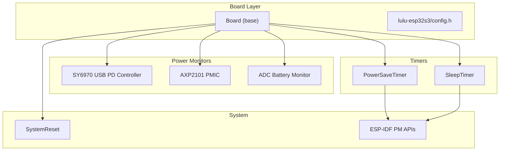
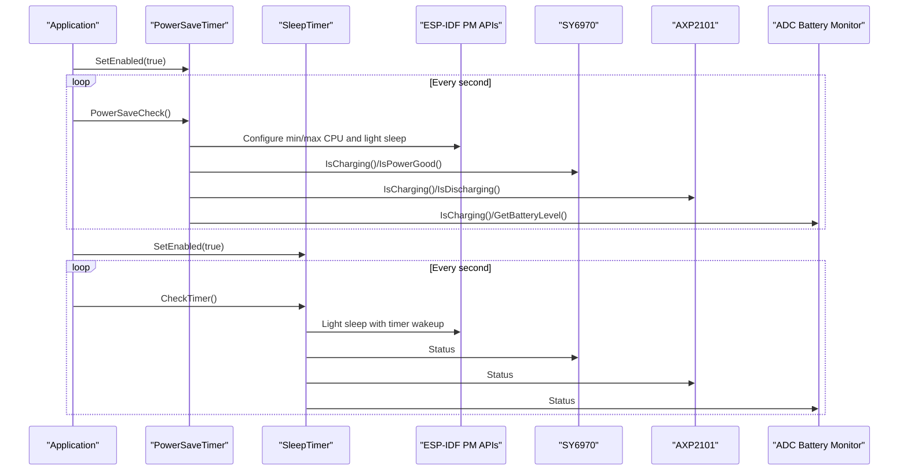
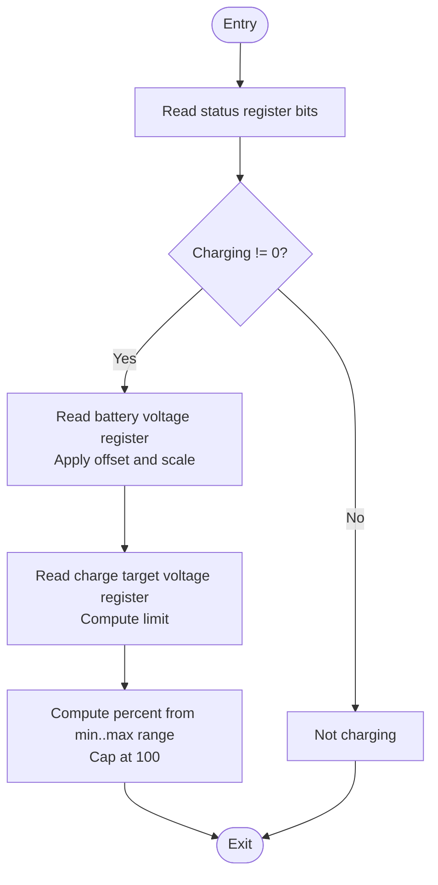
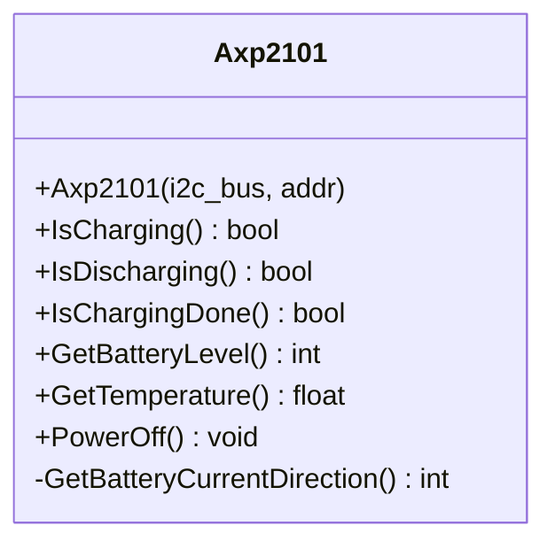
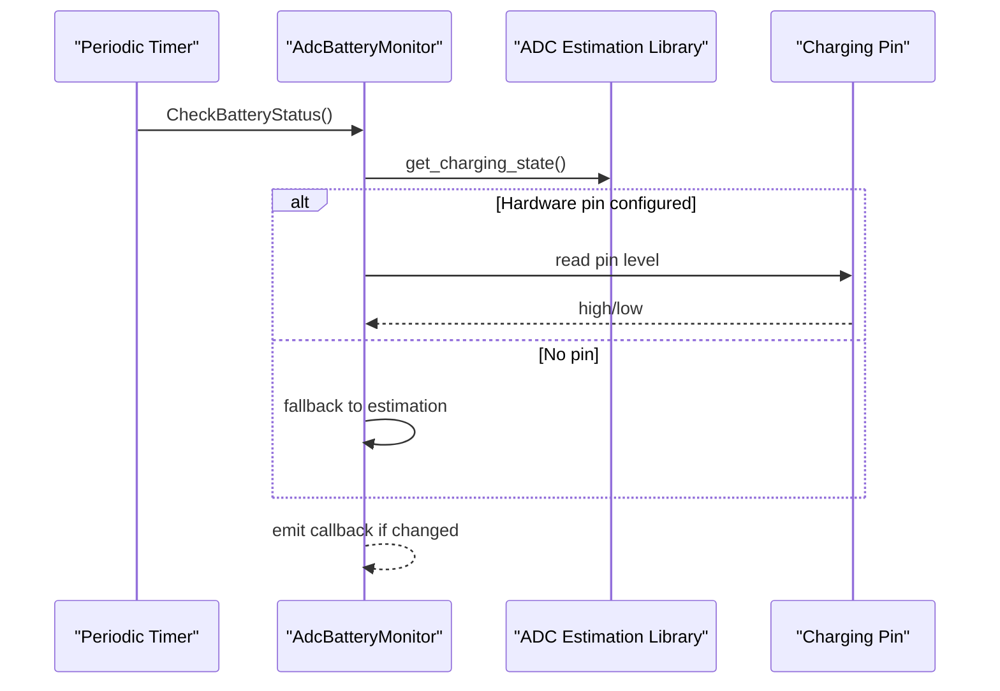
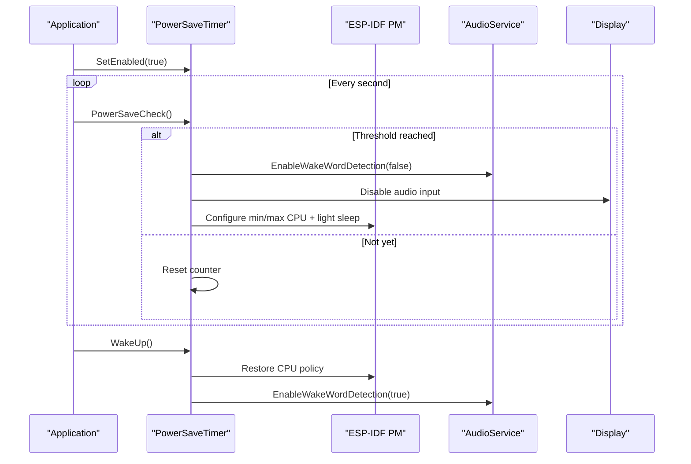
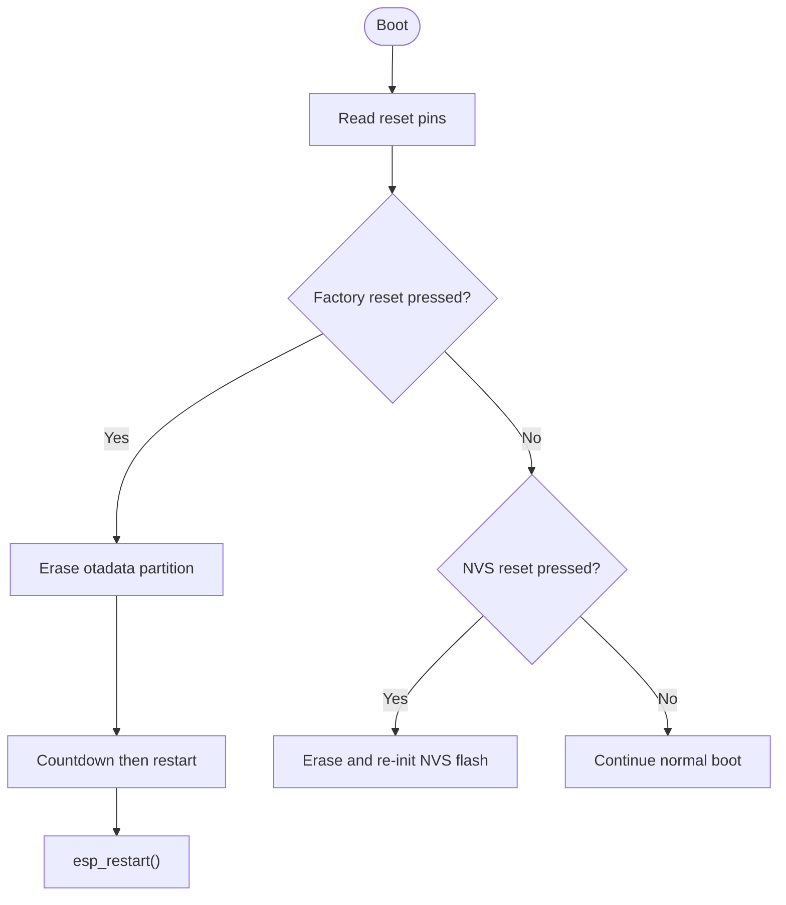
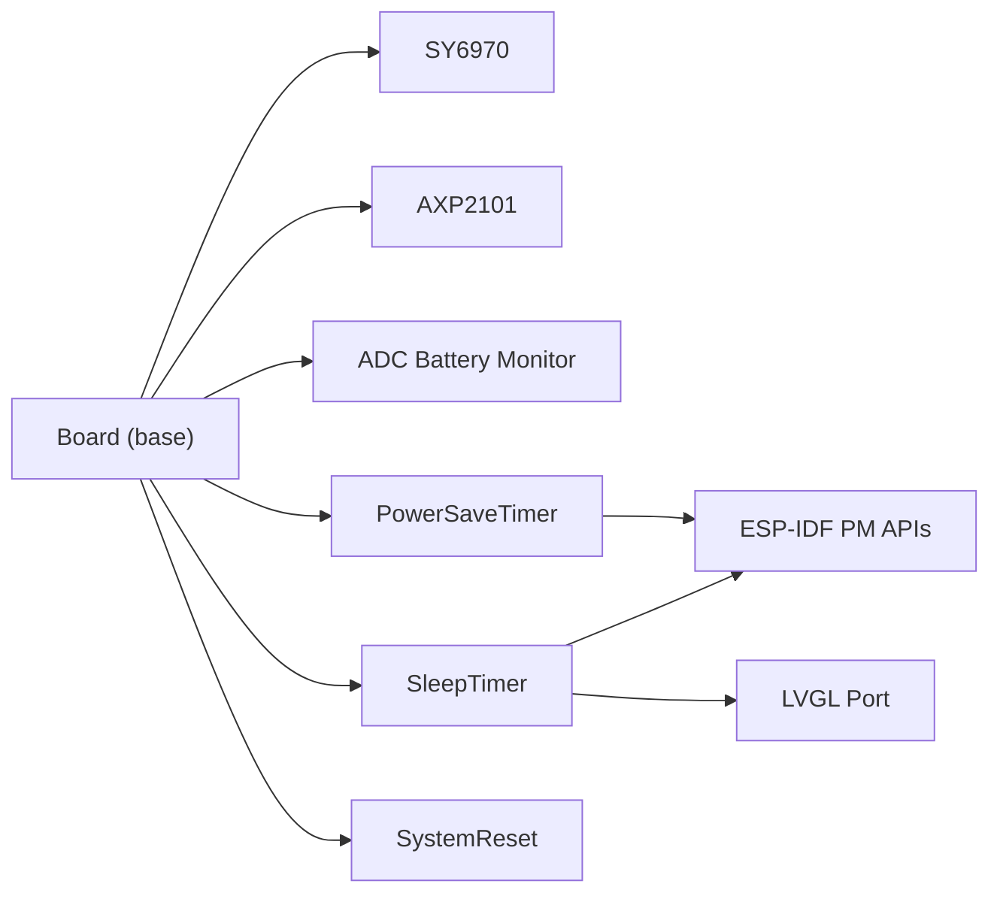

# Power Management and Circuitry

<cite>
**Referenced Files in This Document**
- [axp2101.cc](file://main/boards/common/axp2101.cc)
- [axp2101.h](file://main/boards/common/axp2101.h)
- [sy6970.cc](file://main/boards/common/sy6970.cc)
- [sy6970.h](file://main/boards/common/sy6970.h)
- [adc_battery_monitor.cc](file://main/boards/common/adc_battery_monitor.cc)
- [adc_battery_monitor.h](file://main/boards/common/adc_battery_monitor.h)
- [power_save_timer.cc](file://main/boards/common/power_save_timer.cc)
- [power_save_timer.h](file://main/boards/common/power_save_timer.h)
- [sleep_timer.cc](file://main/boards/common/sleep_timer.cc)
- [sleep_timer.h](file://main/boards/common/sleep_timer.h)
- [system_reset.cc](file://main/boards/common/system_reset.cc)
- [system_reset.h](file://main/boards/common/system_reset.h)
- [board.cc](file://main/boards/common/board.cc)
- [board.h](file://main/boards/common/board.h)
- [config.h](file://main/boards/lulu-esp32s3/config.h)
</cite>

## Table of Contents
1. [Introduction](#introduction)
2. [Project Structure](#project-structure)
3. [Core Components](#core-components)
4. [Architecture Overview](#architecture-overview)
5. [Detailed Component Analysis](#detailed-component-analysis)
6. [Dependency Analysis](#dependency-analysis)
7. [Performance Considerations](#performance-considerations)
8. [Troubleshooting Guide](#troubleshooting-guide)
9. [Conclusion](#conclusion)
10. [Appendices](#appendices)

## Introduction
This document explains the power management and optimization strategies implemented in the project. It focuses on the USB PD controller (SY6970), battery fuel gauge and charger monitoring (AXP2101), battery voltage and charging state estimation (ADC-based), power-saving timers and sleep modes, dynamic power management via ESP-IDF PM APIs, system reset and factory reset mechanisms, and practical guidance for power budgeting, efficiency, and thermal considerations. The goal is to help developers configure, operate, and optimize the device’s power behavior across normal operation, idle periods, and deep sleep.

## Project Structure
The power-related logic is primarily located under main/boards/common and board-specific configuration under main/boards/lulu-esp32s3. The components include:
- USB PD controller driver (SY6970)
- Power management IC driver (AXP2101)
- ADC-based battery monitoring
- Power-save and sleep timers
- Dynamic power management via ESP-IDF PM APIs
- System reset and factory reset handlers

**Diagram sources**
- [board.cc:1-179](file://main/boards/common/board.cc#L1-L179)
- [config.h:1-91](file://main/boards/lulu-esp32s3/config.h#L1-L91)
- [sy6970.cc:1-66](file://main/boards/common/sy6970.cc#L1-L66)
- [axp2101.cc:1-42](file://main/boards/common/axp2101.cc#L1-L42)
- [adc_battery_monitor.cc:1-116](file://main/boards/common/adc_battery_monitor.cc#L1-L116)
- [power_save_timer.cc:1-133](file://main/boards/common/power_save_timer.cc#L1-L133)
- [sleep_timer.cc:1-134](file://main/boards/common/sleep_timer.cc#L1-L134)
- [system_reset.cc:1-73](file://main/boards/common/system_reset.cc#L1-L73)

**Section sources**
- [board.cc:1-179](file://main/boards/common/board.cc#L1-L179)
- [config.h:1-91](file://main/boards/lulu-esp32s3/config.h#L1-L91)

## Core Components
- SY6970 USB PD controller: Provides charging status, power-good indication, and battery voltage estimation with a derived percentage.
- AXP2101 PMIC: Reports charging/discharging direction, charging completion, battery level register, temperature, and supports power-off.
- ADC Battery Monitor: Uses an external library to estimate charging state and capacity via ADC sampling and optional hardware charging pin detection.
- PowerSaveTimer: Periodically checks conditions to enter reduced-performance sleep mode and optionally trigger shutdown.
- SleepTimer: Manages light and deep sleep transitions with wake-up sources and LVGL port lifecycle.
- SystemReset: Handles NVS reset and factory reset via GPIO inputs, followed by controlled restart.

**Section sources**
- [sy6970.cc:1-66](file://main/boards/common/sy6970.cc#L1-L66)
- [axp2101.cc:1-42](file://main/boards/common/axp2101.cc#L1-L42)
- [adc_battery_monitor.cc:1-116](file://main/boards/common/adc_battery_monitor.cc#L1-L116)
- [power_save_timer.cc:1-133](file://main/boards/common/power_save_timer.cc#L1-L133)
- [sleep_timer.cc:1-134](file://main/boards/common/sleep_timer.cc#L1-L134)
- [system_reset.cc:1-73](file://main/boards/common/system_reset.cc#L1-L73)

## Architecture Overview
The power subsystem integrates hardware monitoring with runtime control loops:
- Hardware drivers expose status and measurements from SY6970 and AXP2101.
- ADC-based monitoring complements hardware state with capacity estimation.
- Timers coordinate entering sleep modes and reducing CPU frequency.
- ESP-IDF power management APIs adjust min/max CPU frequency and enable light sleep.
- SystemReset provides recovery paths for misconfiguration or factory defaults.

**Diagram sources**
- [power_save_timer.cc:62-104](file://main/boards/common/power_save_timer.cc#L62-L104)
- [sleep_timer.cc:66-123](file://main/boards/common/sleep_timer.cc#L66-L123)
- [sy6970.cc:12-26](file://main/boards/common/sy6970.cc#L12-L26)
- [axp2101.cc:12-27](file://main/boards/common/axp2101.cc#L12-L27)
- [adc_battery_monitor.cc:68-102](file://main/boards/common/adc_battery_monitor.cc#L68-L102)

## Detailed Component Analysis

### SY6970 USB PD Controller
- Functionality:
  - Charging status decoding from a status register.
  - Power-good detection via a status bit.
  - Battery voltage calculation from a register value with offset and scale.
  - Charge target voltage calculation from a register field.
  - Derived battery level percentage bounded by minimum and maximum thresholds.
  - Power-off command via register write.
- Input voltage ranges and charging characteristics:
  - Battery voltage register is converted to millivolts with a fixed offset and step.
  - Charge target voltage register yields the programmed termination threshold.
  - Percentage is computed as a normalized linear interpolation between a minimum and maximum voltage, capped at 100.
- Practical implications:
  - Use IsCharging() and IsPowerGood() to gate operations during charging.
  - Use GetBatteryVoltage() and GetChargeTargetVoltage() to estimate health and detect abnormal states.
  - Use GetBatteryLevel() for UI reporting and thresholds.

**Diagram sources**
- [sy6970.cc:12-61](file://main/boards/common/sy6970.cc#L12-L61)

**Section sources**
- [sy6970.cc:1-66](file://main/boards/common/sy6970.cc#L1-L66)
- [sy6970.h:1-21](file://main/boards/common/sy6970.h#L1-L21)

### AXP2101 Power Management IC
- Functionality:
  - Determines current direction (charge/discharge) from a status byte.
  - Indicates charging completion via a status bit.
  - Reads battery level and temperature registers.
  - Initiates power-off by setting a control bit.
- Practical implications:
  - Use IsCharging()/IsDischarging() to confirm power path direction.
  - Use IsChargingDone() to decide when to reduce monitoring cadence.
  - Use GetTemperature() for thermal-aware behavior and throttling.

**Diagram sources**
- [axp2101.h:6-18](file://main/boards/common/axp2101.h#L6-L18)
- [axp2101.cc:12-35](file://main/boards/common/axp2101.cc#L12-L35)

**Section sources**
- [axp2101.cc:1-42](file://main/boards/common/axp2101.cc#L1-L42)
- [axp2101.h:1-21](file://main/boards/common/axp2101.h#L1-L21)

### ADC-Based Battery Monitoring
- Functionality:
  - Initializes ADC with attenuation and channel selection.
  - Optionally detects charging via a dedicated GPIO pin.
  - Periodically queries charging state and capacity via an ADC estimation library.
  - Emits change callbacks when charging state flips.
- Practical implications:
  - Use IsCharging()/IsDischarging() for coarse state decisions.
  - Use GetBatteryLevel() for periodic UI updates and thresholds.
  - Provide a charging pin to leverage hardware detection for robustness.

**Diagram sources**
- [adc_battery_monitor.cc:44-116](file://main/boards/common/adc_battery_monitor.cc#L44-L116)

**Section sources**
- [adc_battery_monitor.cc:1-116](file://main/boards/common/adc_battery_monitor.cc#L1-L116)
- [adc_battery_monitor.h:1-31](file://main/boards/common/adc_battery_monitor.h#L1-L31)

### Power Saving Timers and Sleep Mode
- PowerSaveTimer:
  - Periodic check to enter reduced CPU frequency and light sleep after a configurable delay.
  - Temporarily disables wake word detection and audio input to minimize leakage.
  - Restores original CPU policy and re-enables components on exit.
  - Supports optional shutdown callback after another delay.
- SleepTimer:
  - Manages light sleep with timer-based wakeups and deep sleep after another delay.
  - Coordinates LVGL port suspend/resume around sleep.
  - Disables wake word detection during light sleep.
- Dynamic Voltage Scaling:
  - Uses ESP-IDF power management configuration to set min/max CPU frequencies and enable light sleep.

**Diagram sources**
- [power_save_timer.cc:62-104](file://main/boards/common/power_save_timer.cc#L62-L104)
- [power_save_timer.cc:106-132](file://main/boards/common/power_save_timer.cc#L106-L132)

**Section sources**
- [power_save_timer.cc:1-133](file://main/boards/common/power_save_timer.cc#L1-L133)
- [power_save_timer.h:1-35](file://main/boards/common/power_save_timer.h#L1-L35)
- [sleep_timer.cc:1-134](file://main/boards/common/sleep_timer.cc#L1-L134)
- [sleep_timer.h:1-33](file://main/boards/common/sleep_timer.h#L1-L33)

### System Reset Mechanisms
- GPIO-driven reset:
  - Two buttons are configured as inputs with pull-ups; pressing triggers actions.
  - One resets NVS flash; another erases OTA metadata and reboots after a countdown.
- Factory reset flow:
  - Erase otadata partition, log countdown, then restart the system.

**Diagram sources**
- [system_reset.cc:26-72](file://main/boards/common/system_reset.cc#L26-L72)

**Section sources**
- [system_reset.cc:1-73](file://main/boards/common/system_reset.cc#L1-L73)
- [system_reset.h:1-22](file://main/boards/common/system_reset.h#L1-L22)

## Dependency Analysis
- Board base class defines virtual interfaces for battery and power controls; concrete implementations can integrate SY6970, AXP2101, and ADC monitors.
- PowerSaveTimer and SleepTimer depend on Application state and ESP-IDF timers and PM APIs.
- ADC Battery Monitor depends on an external estimation library and optional GPIO pin.
- SY6970 and AXP2101 are I2C devices; their base class is shared with other I2C peripherals.

**Diagram sources**
- [board.h:52-93](file://main/boards/common/board.h#L52-L93)
- [power_save_timer.cc:92-98](file://main/boards/common/power_save_timer.cc#L92-L98)
- [sleep_timer.cc:93-100](file://main/boards/common/sleep_timer.cc#L93-L100)

**Section sources**
- [board.h:1-101](file://main/boards/common/board.h#L1-L101)
- [board.cc:1-179](file://main/boards/common/board.cc#L1-L179)

## Performance Considerations
- CPU frequency scaling:
  - PowerSaveTimer configures min/max CPU frequency and enables light sleep to reduce dynamic power.
  - Restore original CPU policy on wake to maintain responsiveness.
- Audio and display impact:
  - Temporarily disabling audio input and wake word detection reduces leakage during sleep.
  - LVGL port suspend/resume minimizes display activity during light sleep.
- Monitoring cadence:
  - ADC-based monitoring runs periodically; reduce frequency when sleeping to conserve power.
- Thermal awareness:
  - Use AXP2101 temperature readings to trigger throttling or extended sleep windows.

[No sources needed since this section provides general guidance]

## Troubleshooting Guide
- Charging state flapping:
  - Verify hardware charging pin wiring if using ADC monitor fallback logic.
  - Confirm SY6970 status bits for power-good and charging state coherence.
- Battery level jumps or exceeds 100%:
  - SY6970 percentage computation caps at 100; ensure minimum and maximum thresholds are reasonable.
- Sleep mode not triggering:
  - Check Application.canEnterSleepMode() and settings enabling sleep mode.
  - Ensure timers are started and not stopped prematurely.
- Deep sleep not resuming:
  - Confirm timer wakeup source is configured before entering deep sleep.
  - Validate wake cause handling after wakeup.
- Factory reset not erasing OTA metadata:
  - Ensure the correct partition subtype is found and erased.

**Section sources**
- [adc_battery_monitor.cc:68-102](file://main/boards/common/adc_battery_monitor.cc#L68-L102)
- [sy6970.cc:46-61](file://main/boards/common/sy6970.cc#L46-L61)
- [power_save_timer.cc:62-104](file://main/boards/common/power_save_timer.cc#L62-L104)
- [sleep_timer.cc:95-122](file://main/boards/common/sleep_timer.cc#L95-L122)
- [system_reset.cc:51-64](file://main/boards/common/system_reset.cc#L51-L64)

## Conclusion
The project implements a layered power management strategy combining hardware monitoring (SY6970 and AXP2101), ADC-based estimation, and runtime control via timers and ESP-IDF PM APIs. Together, these components enable efficient power savings, safe sleep transitions, and robust recovery mechanisms. Proper configuration of thresholds, sleep timings, and component gating ensures long battery life and responsive operation.

[No sources needed since this section summarizes without analyzing specific files]

## Appendices

### Power Budgeting and Efficiency Guidance
- Estimate average current draw by summing active components and their quiescent currents.
- Account for converter inefficiencies (DC-DC, LDO) and cable/connector resistances.
- Use sleep timers to reduce duty cycle; leverage light sleep to keep minimal responsiveness.
- Monitor AXP2101 temperature to avoid thermal derating.

[No sources needed since this section provides general guidance]

### Low-Power Operation Modes Checklist
- Disable unused peripherals and sensors.
- Reduce screen brightness and refresh rate.
- Use light sleep with periodic wakeups for maintenance tasks.
- Gate audio input and wake word detection during sleep.
- Apply factory reset only when necessary to recover from persistent issues.

[No sources needed since this section provides general guidance]