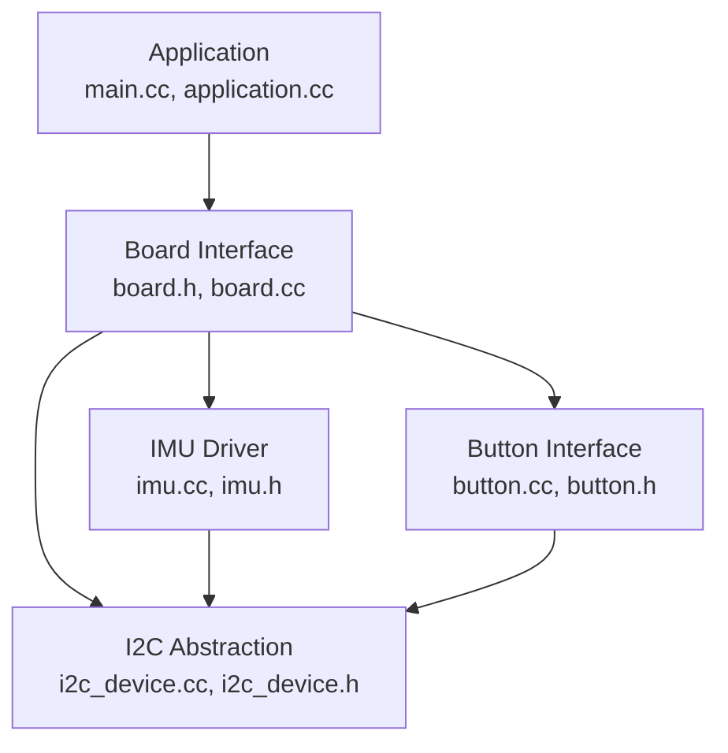
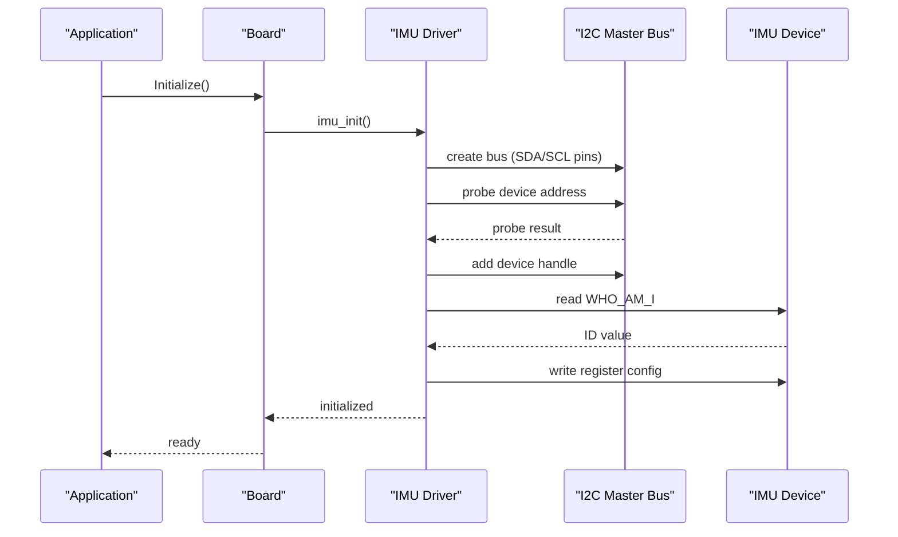
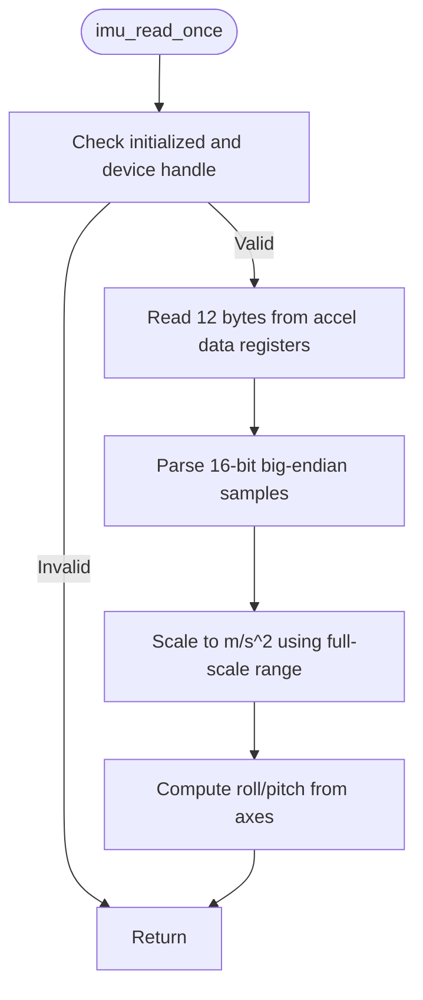
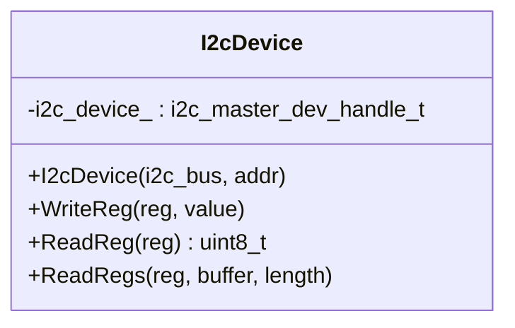
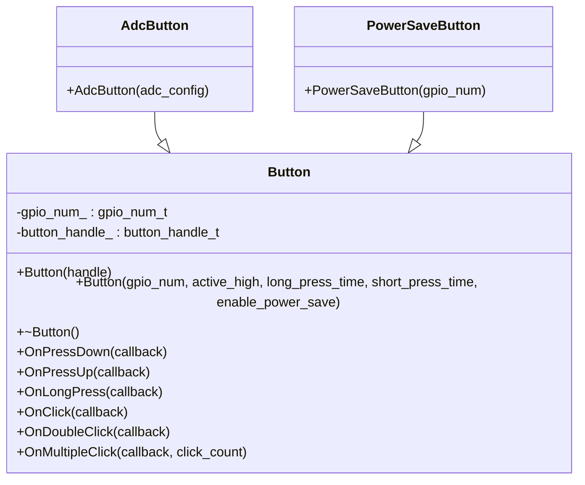
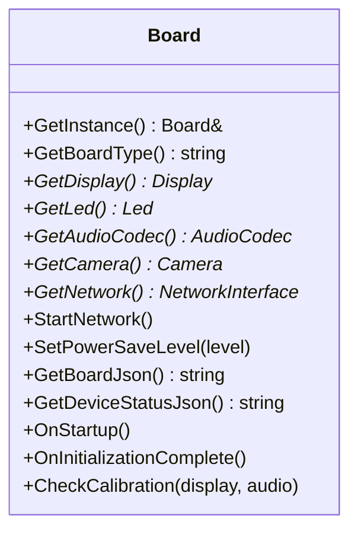
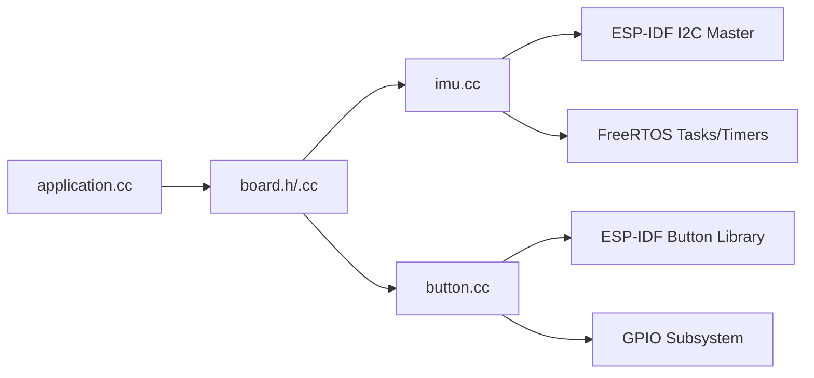

# Sensor Interfaces and IMU Integration

<cite>
**Referenced Files in This Document**
- [imu.h](file://main/boards/lulu-esp32s3/imu.h)
- [imu.cc](file://main/boards/lulu-esp32s3/imu.cc)
- [config.h](file://main/boards/lulu-esp32s3/config.h)
- [i2c_device.h](file://main/boards/common/i2c_device.h)
- [i2c_device.cc](file://main/boards/common/i2c_device.cc)
- [button.h](file://main/boards/common/button.h)
- [button.cc](file://main/boards/common/button.cc)
- [board.h](file://main/boards/common/board.h)
- [board.cc](file://main/boards/common/board.cc)
- [main.cc](file://main/main.cc)
- [application.cc](file://main/application.cc)
</cite>

## Table of Contents
1. [Introduction](#introduction)
2. [Project Structure](#project-structure)
3. [Core Components](#core-components)
4. [Architecture Overview](#architecture-overview)
5. [Detailed Component Analysis](#detailed-component-analysis)
6. [Dependency Analysis](#dependency-analysis)
7. [Performance Considerations](#performance-considerations)
8. [Troubleshooting Guide](#troubleshooting-guide)
9. [Conclusion](#conclusion)
10. [Appendices](#appendices)

## Introduction
This document explains the sensor interfaces and inertial measurement unit (IMU) integration for the Lulu ESP32-S3 board. It covers I2C bus configuration for IMU communication, register mapping, data acquisition behavior, accelerometer and gyroscope scaling, coordinate transformations, and practical considerations for sensor fusion. It also documents the button interface implementation, debouncing and interrupt handling via the ESP-IDF button library, and the I2C device abstraction layer used for multi-device bus management. Guidance is included for sensor placement, mounting, and environmental factors affecting performance.

## Project Structure
The sensor-related code is organized by board and shared components:
- Board-specific IMU driver and configuration for Lulu ESP32-S3
- Shared I2C device abstraction layer
- Button interface abstraction built on ESP-IDF’s button library
- Board-level interfaces and application lifecycle

**Diagram sources**
- [main.cc:14-29](file://main/main.cc#L14-L29)
- [application.cc:62-178](file://main/application.cc#L62-L178)
- [board.h:52-93](file://main/boards/common/board.h#L52-L93)
- [board.cc:15-46](file://main/boards/common/board.cc#L15-L46)
- [imu.cc:57-129](file://main/boards/lulu-esp32s3/imu.cc#L57-L129)
- [i2c_device.cc:8-20](file://main/boards/common/i2c_device.cc#L8-L20)
- [button.cc:18-42](file://main/boards/common/button.cc#L18-L42)

**Section sources**
- [main.cc:14-29](file://main/main.cc#L14-L29)
- [application.cc:62-178](file://main/application.cc#L62-L178)
- [board.h:52-93](file://main/boards/common/board.h#L52-L93)
- [board.cc:15-46](file://main/boards/common/board.cc#L15-L46)

## Core Components
- IMU driver for ICM42670P over I2C
- I2C device abstraction for device handle management
- Button interface abstraction using ESP-IDF button library
- Board interface for integrating sensors into the system

Key responsibilities:
- IMU: initialize bus, probe device, configure registers, read and scale acceleration, compute basic attitude angles
- I2C Abstraction: encapsulate device creation and register read/write
- Button: provide event-driven callbacks for press-down, press-up, long press, single-click, double-click, and multiple-click
- Board: define board capabilities and lifecycle hooks

**Section sources**
- [imu.h:4-18](file://main/boards/lulu-esp32s3/imu.h#L4-L18)
- [imu.cc:57-129](file://main/boards/lulu-esp32s3/imu.cc#L57-L129)
- [i2c_device.h:6-16](file://main/boards/common/i2c_device.h#L6-L16)
- [i2c_device.cc:8-35](file://main/boards/common/i2c_device.cc#L8-L35)
- [button.h:11-47](file://main/boards/common/button.h#L11-L47)
- [button.cc:18-125](file://main/boards/common/button.cc#L18-L125)
- [board.h:52-93](file://main/boards/common/board.h#L52-L93)

## Architecture Overview
The IMU is accessed via the ESP-IDF master I2C driver. The board initializes the I2C bus and adds the IMU device, then performs a WHO_AM_I check and register configuration. The application lifecycle triggers initialization and integrates sensor data into higher-level systems.

**Diagram sources**
- [application.cc:62-178](file://main/application.cc#L62-L178)
- [board.h:52-93](file://main/boards/common/board.h#L52-L93)
- [imu.cc:57-129](file://main/boards/lulu-esp32s3/imu.cc#L57-L129)

## Detailed Component Analysis

### IMU Integration (ICM42670P)
- I2C configuration
  - Address: 0x69 (7-bit)
  - Frequency: 400 kHz
  - Pins: configured via board config header
- Initialization steps
  - Create I2C master bus with internal pullups enabled
  - Probe device address
  - Add device handle with 400 kHz speed
  - Verify device ID via WHO_AM_I
  - Configure power and sensor ranges
- Data acquisition
  - Reads 12 bytes of accelerometer data (two bytes per axis)
  - Converts 16-bit signed values to m/s² using a fixed range
  - Computes roll/pitch from accelerometer vector

**Diagram sources**
- [imu.cc:132-155](file://main/boards/lulu-esp32s3/imu.cc#L132-L155)

Implementation highlights:
- Register mapping and bank selection are applied prior to reading
- WHO_AM_I verification ensures correct device presence
- Scaling uses a fixed conversion factor derived from full-scale range

Operational notes:
- The driver exports roll, pitch, yaw, and acceleration vectors
- Yaw is computed from accelerometer data; gyroscope data is not integrated in this driver
- The driver does not implement filtering; downstream systems may apply filters

**Section sources**
- [imu.cc:12-26](file://main/boards/lulu-esp32s3/imu.cc#L12-L26)
- [imu.cc:57-129](file://main/boards/lulu-esp32s3/imu.cc#L57-L129)
- [imu.cc:132-155](file://main/boards/lulu-esp32s3/imu.cc#L132-L155)
- [imu.h:10-18](file://main/boards/lulu-esp32s3/imu.h#L10-L18)
- [config.h:82-88](file://main/boards/lulu-esp32s3/config.h#L82-L88)

### I2C Device Abstraction Layer
The abstraction encapsulates device creation and register-level operations:
- Constructor attaches a 7-bit address device to a master bus at 400 kHz
- Provides WriteReg, ReadReg, and ReadRegs helpers
- Uses ESP-IDF I2C transmit/receive primitives with timeouts

**Diagram sources**
- [i2c_device.h:6-16](file://main/boards/common/i2c_device.h#L6-L16)
- [i2c_device.cc:8-35](file://main/boards/common/i2c_device.cc#L8-L35)

Usage pattern:
- The IMU driver creates a master bus and adds a device handle directly
- The abstraction is suitable for other devices sharing the same bus

**Section sources**
- [i2c_device.h:6-16](file://main/boards/common/i2c_device.h#L6-L16)
- [i2c_device.cc:8-35](file://main/boards/common/i2c_device.cc#L8-L35)

### Button Interface Implementation
The button abstraction wraps ESP-IDF’s button library:
- Constructors support GPIO-based buttons and ADC-based buttons
- Provides event callbacks for press-down, press-up, long press, single-click, double-click, and multiple-click
- Integrates with power-save modes when enabled

**Diagram sources**
- [button.h:11-47](file://main/boards/common/button.h#L11-L47)
- [button.cc:18-42](file://main/boards/common/button.cc#L18-L42)
- [button.cc:8-16](file://main/boards/common/button.cc#L8-L16)

Debouncing and interrupts:
- Debouncing and interrupt handling are managed by the underlying ESP-IDF button library
- The abstraction registers callbacks for each event type

**Section sources**
- [button.h:11-47](file://main/boards/common/button.h#L11-L47)
- [button.cc:18-125](file://main/boards/common/button.cc#L18-L125)

### Board Integration and Lifecycle
The board interface defines capabilities and lifecycle hooks used by the application:
- Provides access to display, LED, audio codec, camera, and network
- Offers UUID generation and system info JSON
- Supports power-save level configuration

**Diagram sources**
- [board.h:52-93](file://main/boards/common/board.h#L52-L93)
- [board.cc:15-46](file://main/boards/common/board.cc#L15-L46)

**Section sources**
- [board.h:52-93](file://main/boards/common/board.h#L52-L93)
- [board.cc:15-46](file://main/boards/common/board.cc#L15-L46)

## Dependency Analysis
- IMU depends on ESP-IDF I2C master driver and FreeRTOS timing primitives
- Button depends on ESP-IDF button library and GPIO subsystem
- Board provides the integration surface for sensors and peripherals
- Application orchestrates initialization and runtime behavior

**Diagram sources**
- [imu.cc:3-8](file://main/boards/lulu-esp32s3/imu.cc#L3-L8)
- [button.cc:3-4](file://main/boards/common/button.cc#L3-L4)
- [application.cc:62-178](file://main/application.cc#L62-L178)
- [board.h:52-93](file://main/boards/common/board.h#L52-L93)

**Section sources**
- [imu.cc:3-8](file://main/boards/lulu-esp32s3/imu.cc#L3-L8)
- [button.cc:3-4](file://main/boards/common/button.cc#L3-L4)
- [application.cc:62-178](file://main/application.cc#L62-L178)
- [board.h:52-93](file://main/boards/common/board.h#L52-L93)

## Performance Considerations
- I2C bus speed: 400 kHz is standard and appropriate for typical embedded environments
- Data read frequency: The driver reads accelerometer data in a dedicated function; integrate periodic sampling according to application needs
- Scaling and math: Basic arithmetic is lightweight; avoid repeated conversions in tight loops
- Memory and heap: Monitor minimum free heap during initialization and runtime to prevent fragmentation
- Power save: Use board-level power-save controls to reduce activity when sensors are not needed

[No sources needed since this section provides general guidance]

## Troubleshooting Guide
Common issues and checks:
- Device not found at address
  - Verify wiring and pullups; confirm SDA/SCL pin assignments
  - Ensure the I2C bus is created successfully and device probe passes
- WHO_AM_I mismatch
  - Confirm device type and bank selection before reading identification
  - Check register writes for correctness
- Read failures
  - Validate device handle validity and transaction timeouts
  - Inspect bus glitch-ignore settings and interrupt priority
- Button events not firing
  - Ensure button handle is created and callbacks registered
  - Check GPIO configuration and active-high/low settings
- Initialization order
  - Initialize NVS and board before sensor drivers
  - Confirm application event loop is running to process callbacks

**Section sources**
- [imu.cc:84-89](file://main/boards/lulu-esp32s3/imu.cc#L84-L89)
- [imu.cc:108-117](file://main/boards/lulu-esp32s3/imu.cc#L108-L117)
- [button.cc:18-42](file://main/boards/common/button.cc#L18-L42)
- [main.cc:16-23](file://main/main.cc#L16-L23)

## Conclusion
The Lulu ESP32-S3 board integrates an ICM42670P IMU via a robust I2C path with explicit device probing and register configuration. The button interface leverages ESP-IDF’s button library for reliable event handling. The board abstraction cleanly exposes sensor capabilities to the application. While the current IMU driver focuses on accelerometer scaling and basic attitude computation, the architecture supports extension for gyroscope integration, filtering, and advanced sensor fusion in downstream components.

[No sources needed since this section summarizes without analyzing specific files]

## Appendices

### I2C Bus Configuration Reference
- Address: 0x69 (7-bit)
- Speed: 400 kHz
- Pins: SDA/SCL defined in board config
- Bus creation includes internal pullups and glitch filter

**Section sources**
- [imu.cc:13-14](file://main/boards/lulu-esp32s3/imu.cc#L13-L14)
- [imu.cc:66-75](file://main/boards/lulu-esp32s3/imu.cc#L66-L75)
- [config.h:82-84](file://main/boards/lulu-esp32s3/config.h#L82-L84)

### Accelerometer Scaling and Coordinate Frame
- Full-scale range is applied to raw 16-bit values
- Conversion yields units of m/s²
- Roll and pitch computed from accelerometer vector
- Yaw is not computed in this driver

**Section sources**
- [imu.cc:147-150](file://main/boards/lulu-esp32s3/imu.cc#L147-L150)
- [imu.cc:152-154](file://main/boards/lulu-esp32s3/imu.cc#L152-L154)

### Sensor Fusion and Calibration Notes
- Gyroscope data is not read by the current driver; gyroscope scaling and fusion are not implemented here
- Calibration procedures are board-specific and typically performed offline or via board-level utilities
- Coordinate transformations depend on mechanical mounting; ensure axes alignment with body frame

[No sources needed since this section provides general guidance]

### Mounting and Environmental Factors
- Secure mounting minimizes vibration and shock-induced noise
- Avoid strong electromagnetic interference near I2C traces
- Temperature extremes can affect sensor offsets; consider thermal compensation in higher layers
- Mechanical bias and misalignment should be accounted for in calibration routines

[No sources needed since this section provides general guidance]