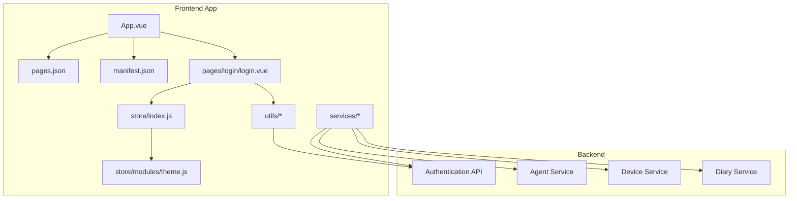
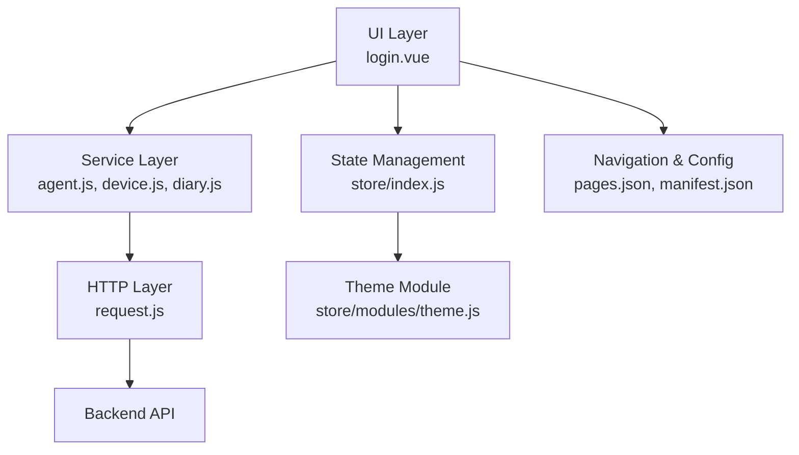
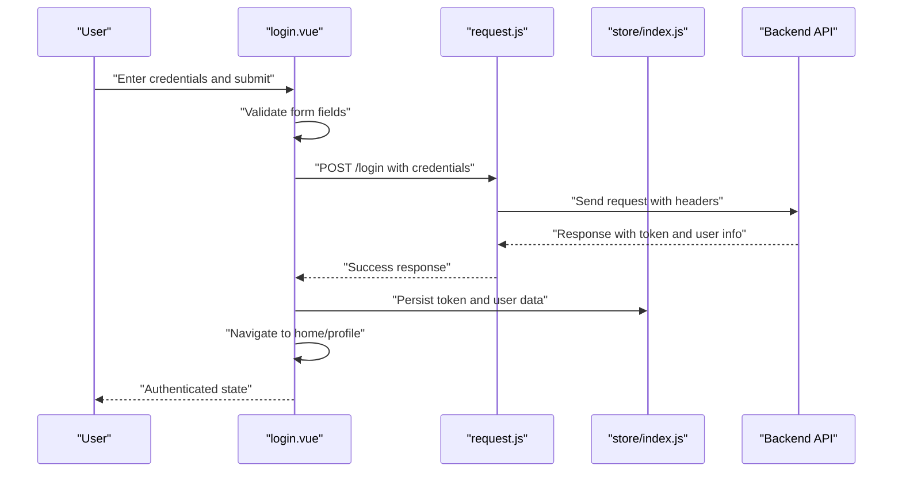
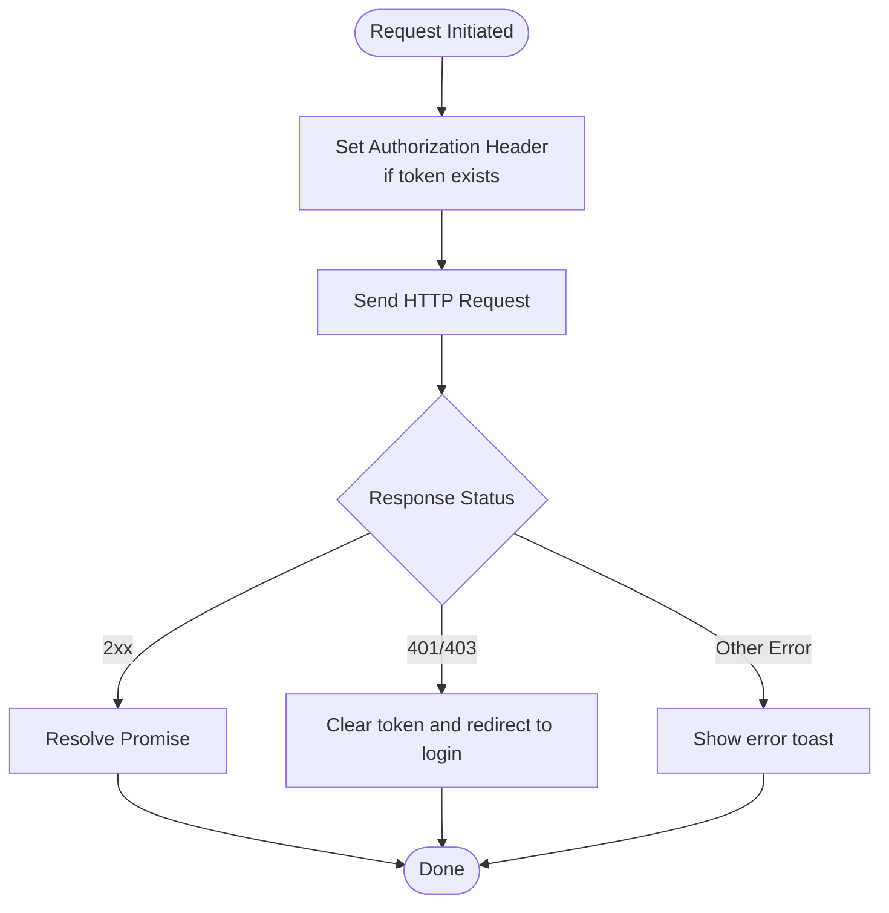
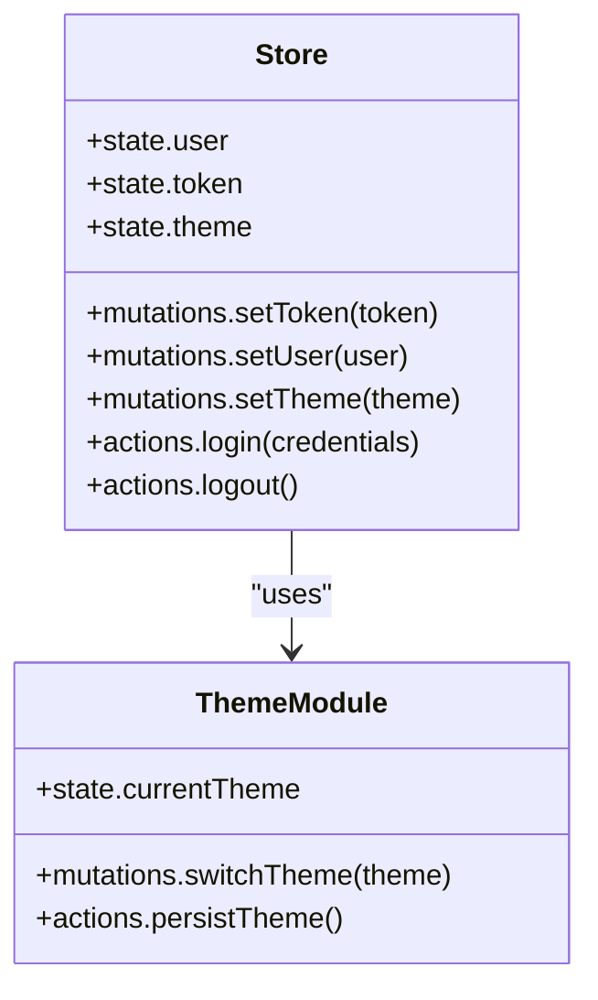
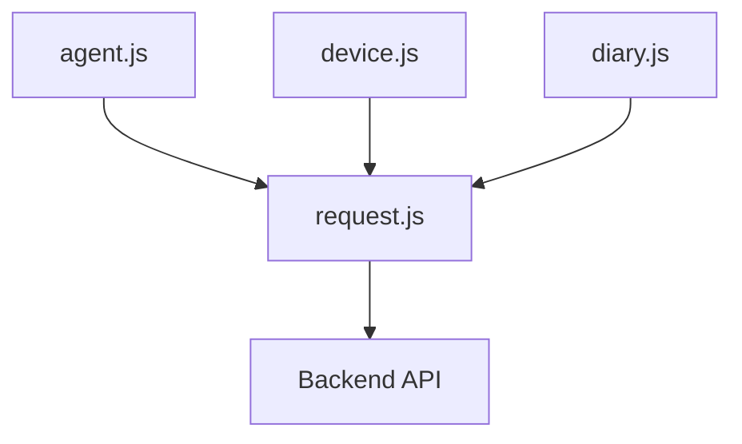
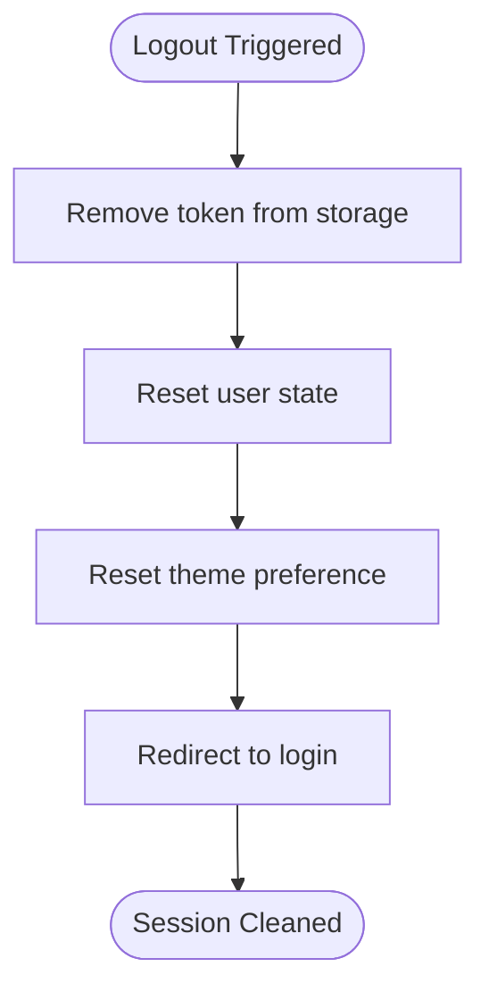
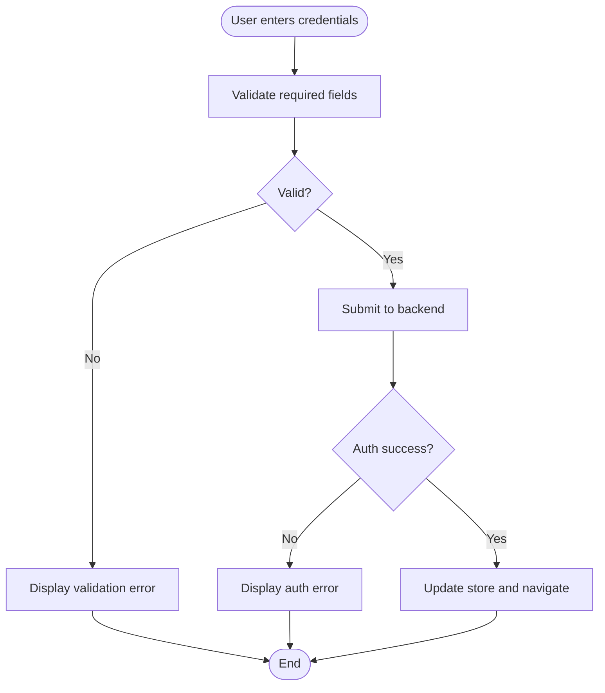
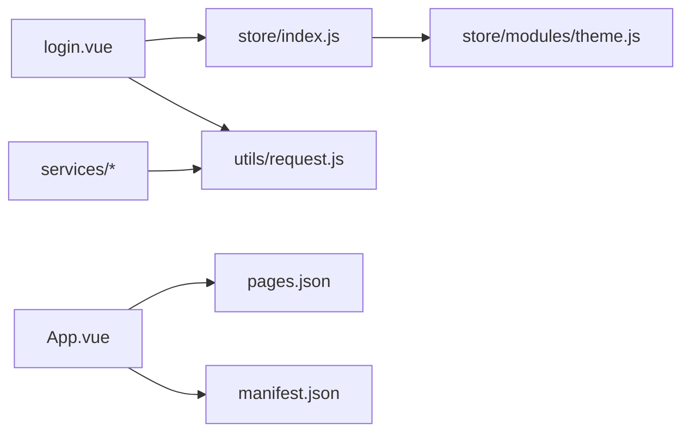

# Authentication System

<cite>
**Referenced Files in This Document**
- [App.vue](file://docs/xiaolu-mini/App.vue)
- [login.vue](file://docs/xiaolu-mini/pages/login/login.vue)
- [request.js](file://docs/xiaolu-mini/utils/request.js)
- [index.js](file://docs/xiaolu-mini/store/index.js)
- [theme.js](file://docs/xiaolu-mini/store/modules/theme.js)
- [pages.json](file://docs/xiaolu-mini/pages.json)
- [manifest.json](file://docs/xiaolu-mini/manifest.json)
- [agent.js](file://docs/xiaolu-mini/services/agent.js)
- [device.js](file://docs/xiaolu-mini/services/device.js)
- [diary.js](file://docs/xiaolu-mini/services/diary.js)
- [blufi.js](file://docs/xiaolu-mini/utils/blufi.js)
</cite>

## Table of Contents
1. [Introduction](#introduction)
2. [Project Structure](#project-structure)
3. [Core Components](#core-components)
4. [Architecture Overview](#architecture-overview)
5. [Detailed Component Analysis](#detailed-component-analysis)
6. [Dependency Analysis](#dependency-analysis)
7. [Performance Considerations](#performance-considerations)
8. [Troubleshooting Guide](#troubleshooting-guide)
9. [Conclusion](#conclusion)

## Introduction
This document provides comprehensive documentation for the authentication system in the uni-app frontend of the project. It covers login/logout workflows, user session management, state persistence mechanisms, uni-app authentication patterns, token handling, security considerations, backend integration, and local storage management. It also includes practical guidance for implementing secure login flows, handling authentication errors, and maintaining user sessions across app restarts, along with password validation, form handling, and user experience considerations.

## Project Structure
The authentication system spans several key areas:
- Application bootstrap and global configuration
- Login page and form handling
- HTTP client and request utilities
- Global state management for user/session data
- Backend service integrations
- Theme and navigation configuration

**Diagram sources**
- [App.vue](file://docs/xiaolu-mini/App.vue)
- [login.vue](file://docs/xiaolu-mini/pages/login/login.vue)
- [request.js](file://docs/xiaolu-mini/utils/request.js)
- [index.js](file://docs/xiaolu-mini/store/index.js)
- [theme.js](file://docs/xiaolu-mini/store/modules/theme.js)
- [pages.json](file://docs/xiaolu-mini/pages.json)
- [manifest.json](file://docs/xiaolu-mini/manifest.json)
- [agent.js](file://docs/xiaolu-mini/services/agent.js)
- [device.js](file://docs/xiaolu-mini/services/device.js)
- [diary.js](file://docs/xiaolu-mini/services/diary.js)

**Section sources**
- [App.vue](file://docs/xiaolu-mini/App.vue)
- [login.vue](file://docs/xiaolu-mini/pages/login/login.vue)
- [request.js](file://docs/xiaolu-mini/utils/request.js)
- [index.js](file://docs/xiaolu-mini/store/index.js)
- [theme.js](file://docs/xiaolu-mini/store/modules/theme.js)
- [pages.json](file://docs/xiaolu-mini/pages.json)
- [manifest.json](file://docs/xiaolu-mini/manifest.json)
- [agent.js](file://docs/xiaolu-mini/services/agent.js)
- [device.js](file://docs/xiaolu-mini/services/device.js)
- [diary.js](file://docs/xiaolu-mini/services/diary.js)

## Core Components
- App bootstrap and lifecycle: Initializes global configurations, routes, and platform-specific adapters.
- Login page: Handles user credentials input, form validation, submission, and redirects upon successful authentication.
- Request utility: Centralizes HTTP client configuration, request/response interceptors, and token injection.
- Global store: Manages user state, session tokens, and UI theme preferences.
- Services: Encapsulate backend API calls for agents, devices, and diaries, leveraging the shared request utility.
- Theme module: Provides theme switching and persists user preferences.

Key responsibilities:
- Token acquisition and storage during login
- Automatic token injection for protected requests
- Session invalidation on logout
- Cross-page navigation and route guards
- Error handling and user feedback

**Section sources**
- [App.vue](file://docs/xiaolu-mini/App.vue)
- [login.vue](file://docs/xiaolu-mini/pages/login/login.vue)
- [request.js](file://docs/xiaolu-mini/utils/request.js)
- [index.js](file://docs/xiaolu-mini/store/index.js)
- [theme.js](file://docs/xiaolu-mini/store/modules/theme.js)

## Architecture Overview
The authentication architecture follows a layered pattern:
- UI Layer: Login page and other pages
- Service Layer: API clients for agents, devices, and diaries
- HTTP Layer: Shared request utility with interceptors
- State Management: Vuex store for user/session/theme
- Navigation: Route configuration and page registration

**Diagram sources**
- [login.vue](file://docs/xiaolu-mini/pages/login/login.vue)
- [agent.js](file://docs/xiaolu-mini/services/agent.js)
- [device.js](file://docs/xiaolu-mini/services/device.js)
- [diary.js](file://docs/xiaolu-mini/services/diary.js)
- [request.js](file://docs/xiaolu-mini/utils/request.js)
- [index.js](file://docs/xiaolu-mini/store/index.js)
- [theme.js](file://docs/xiaolu-mini/store/modules/theme.js)
- [pages.json](file://docs/xiaolu-mini/pages.json)
- [manifest.json](file://docs/xiaolu-mini/manifest.json)

## Detailed Component Analysis

### Login Page Workflow
The login page captures user credentials, validates inputs, submits to the backend, and manages navigation and state updates upon success or failure.

**Diagram sources**
- [login.vue](file://docs/xiaolu-mini/pages/login/login.vue)
- [request.js](file://docs/xiaolu-mini/utils/request.js)
- [index.js](file://docs/xiaolu-mini/store/index.js)

**Section sources**
- [login.vue](file://docs/xiaolu-mini/pages/login/login.vue)

### Request Utility and Token Handling
The request utility centralizes HTTP configuration, including base URL, timeout, headers, and interceptors for token injection and error handling.

**Diagram sources**
- [request.js](file://docs/xiaolu-mini/utils/request.js)
- [index.js](file://docs/xiaolu-mini/store/index.js)

**Section sources**
- [request.js](file://docs/xiaolu-mini/utils/request.js)

### State Management and Session Persistence
The global store maintains user state and session tokens. It integrates with the theme module for UI preferences and supports persistence across app restarts via local storage.

**Diagram sources**
- [index.js](file://docs/xiaolu-mini/store/index.js)
- [theme.js](file://docs/xiaolu-mini/store/modules/theme.js)

**Section sources**
- [index.js](file://docs/xiaolu-mini/store/index.js)
- [theme.js](file://docs/xiaolu-mini/store/modules/theme.js)

### Backend Service Integrations
Services encapsulate API calls for agents, devices, and diaries, reusing the shared request utility for consistent behavior.

**Diagram sources**
- [agent.js](file://docs/xiaolu-mini/services/agent.js)
- [device.js](file://docs/xiaolu-mini/services/device.js)
- [diary.js](file://docs/xiaolu-mini/services/diary.js)
- [request.js](file://docs/xiaolu-mini/utils/request.js)

**Section sources**
- [agent.js](file://docs/xiaolu-mini/services/agent.js)
- [device.js](file://docs/xiaolu-mini/services/device.js)
- [diary.js](file://docs/xiaolu-mini/services/diary.js)

### Logout and Session Cleanup
Logout clears stored tokens and user data, resets theme preferences, and navigates to the login page.

**Diagram sources**
- [index.js](file://docs/xiaolu-mini/store/index.js)
- [theme.js](file://docs/xiaolu-mini/store/modules/theme.js)

**Section sources**
- [index.js](file://docs/xiaolu-mini/store/index.js)
- [theme.js](file://docs/xiaolu-mini/store/modules/theme.js)

### Password Validation and Form Handling
Form validation ensures required fields are present and meet basic criteria. On submission, credentials are sanitized and sent to the backend. Error messages are surfaced to the user, and successful authentication updates the UI state.

**Section sources**
- [login.vue](file://docs/xiaolu-mini/pages/login/login.vue)

### Security Considerations
- Token storage: Persist tokens securely using platform-safe storage APIs and avoid exposing sensitive data in logs.
- Transport security: Enforce HTTPS for all API communications.
- Input sanitization: Validate and sanitize user inputs to prevent injection attacks.
- CSRF protection: Implement anti-CSRF measures if applicable.
- Session timeouts: Configure automatic logout after inactivity.
- Error handling: Do not leak sensitive information in error responses.

**Section sources**
- [request.js](file://docs/xiaolu-mini/utils/request.js)
- [index.js](file://docs/xiaolu-mini/store/index.js)

### Implementing Secure Login Flows
- Redirect unauthenticated users from protected routes to the login page.
- Persist tokens and user data in the store and local storage.
- Use HTTPS endpoints and secure cookies/local storage where applicable.
- Implement rate limiting and account lockout policies on the backend.
- Provide clear feedback for authentication failures and guide users to recovery actions.

**Section sources**
- [login.vue](file://docs/xiaolu-mini/pages/login/login.vue)
- [request.js](file://docs/xiaolu-mini/utils/request.js)
- [index.js](file://docs/xiaolu-mini/store/index.js)

### Managing Sessions Across App Restarts
- On app startup, check for existing tokens and user data.
- Attempt silent re-authentication if refresh tokens are available.
- If tokens are missing or invalid, redirect to the login page.
- Ensure theme preferences persist across restarts.

**Section sources**
- [index.js](file://docs/xiaolu-mini/store/index.js)
- [theme.js](file://docs/xiaolu-mini/store/modules/theme.js)

### User Experience Considerations
- Provide loading indicators during authentication.
- Offer clear error messages without exposing internal details.
- Support keyboard navigation and accessibility.
- Maintain consistent branding and theme alignment.
- Allow users to easily switch themes and preferences.

**Section sources**
- [theme.js](file://docs/xiaolu-mini/store/modules/theme.js)
- [pages.json](file://docs/xiaolu-mini/pages.json)
- [manifest.json](file://docs/xiaolu-mini/manifest.json)

## Dependency Analysis
The authentication system exhibits low coupling and high cohesion:
- UI depends on the store for state and on the request utility for HTTP operations.
- Services depend on the request utility, ensuring consistent behavior.
- The store depends on the theme module for UI preferences.
- Navigation configuration defines entry points and page routing.

**Diagram sources**
- [login.vue](file://docs/xiaolu-mini/pages/login/login.vue)
- [index.js](file://docs/xiaolu-mini/store/index.js)
- [theme.js](file://docs/xiaolu-mini/store/modules/theme.js)
- [request.js](file://docs/xiaolu-mini/utils/request.js)
- [agent.js](file://docs/xiaolu-mini/services/agent.js)
- [device.js](file://docs/xiaolu-mini/services/device.js)
- [diary.js](file://docs/xiaolu-mini/services/diary.js)
- [App.vue](file://docs/xiaolu-mini/App.vue)
- [pages.json](file://docs/xiaolu-mini/pages.json)
- [manifest.json](file://docs/xiaolu-mini/manifest.json)

**Section sources**
- [login.vue](file://docs/xiaolu-mini/pages/login/login.vue)
- [request.js](file://docs/xiaolu-mini/utils/request.js)
- [index.js](file://docs/xiaolu-mini/store/index.js)
- [theme.js](file://docs/xiaolu-mini/store/modules/theme.js)
- [agent.js](file://docs/xiaolu-mini/services/agent.js)
- [device.js](file://docs/xiaolu-mini/services/device.js)
- [diary.js](file://docs/xiaolu-mini/services/diary.js)
- [App.vue](file://docs/xiaolu-mini/App.vue)
- [pages.json](file://docs/xiaolu-mini/pages.json)
- [manifest.json](file://docs/xiaolu-mini/manifest.json)

## Performance Considerations
- Minimize unnecessary re-renders by structuring store state efficiently.
- Debounce rapid authentication attempts to reduce server load.
- Cache frequently accessed user data locally to improve perceived performance.
- Use lazy loading for heavy components after authentication.

## Troubleshooting Guide
Common issues and resolutions:
- Authentication fails silently: Verify request interceptor configuration and network connectivity.
- Token not applied to requests: Confirm token storage and header injection logic.
- Navigation stuck on login: Ensure route guards redirect unauthenticated users.
- Theme not persisting: Check theme module persistence and storage permissions.
- Backend errors: Inspect service calls and error handling in the request utility.

**Section sources**
- [request.js](file://docs/xiaolu-mini/utils/request.js)
- [index.js](file://docs/xiaolu-mini/store/index.js)
- [theme.js](file://docs/xiaolu-mini/store/modules/theme.js)
- [login.vue](file://docs/xiaolu-mini/pages/login/login.vue)

## Conclusion
The authentication system leverages a clean separation of concerns with a centralized request utility, a robust global store, and modular services. By enforcing secure token handling, consistent error management, and thoughtful UX design, the system provides reliable and user-friendly authentication across the application. Adhering to the outlined security and performance recommendations will further strengthen the system’s resilience and usability.