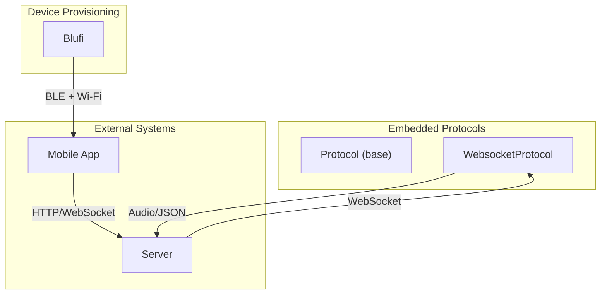
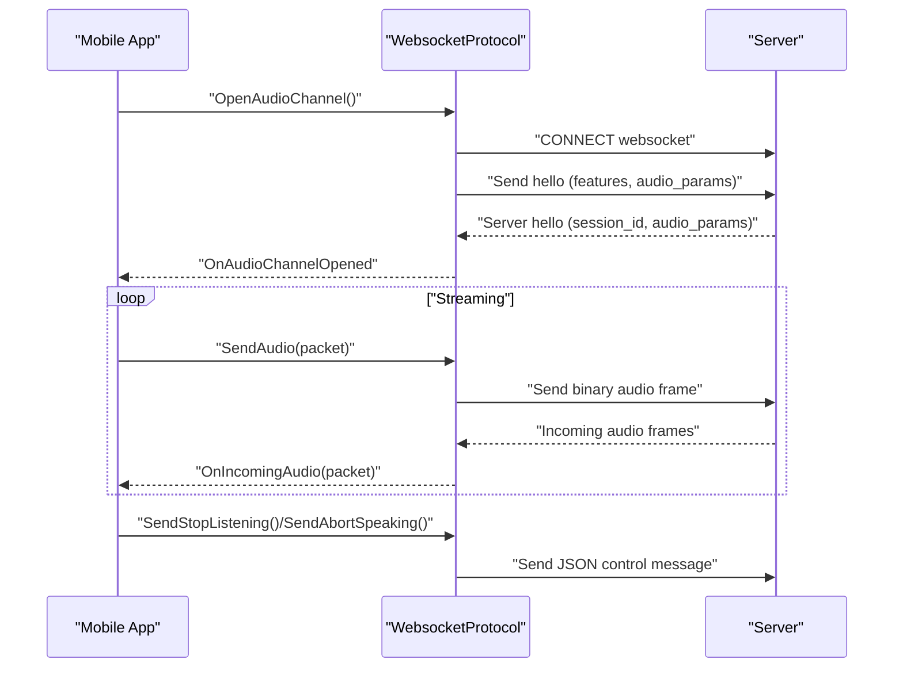
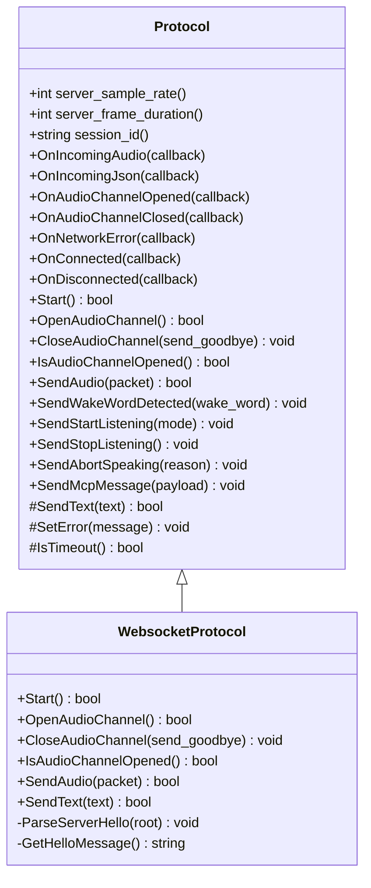
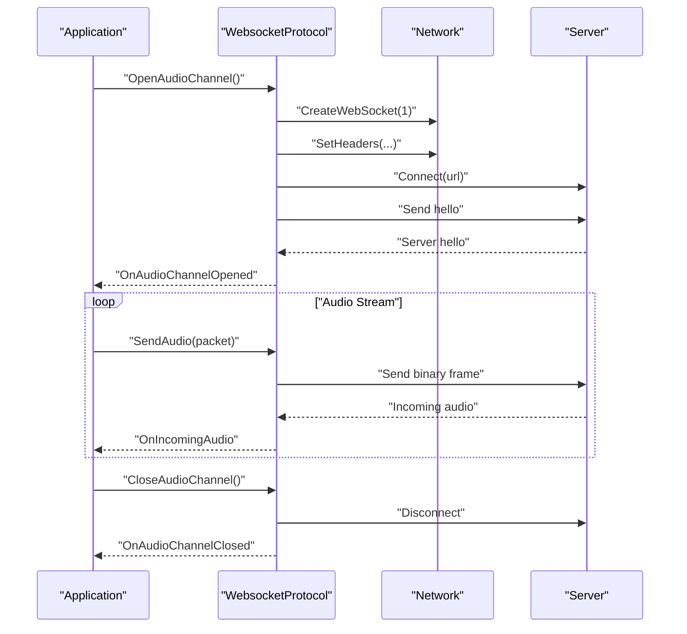
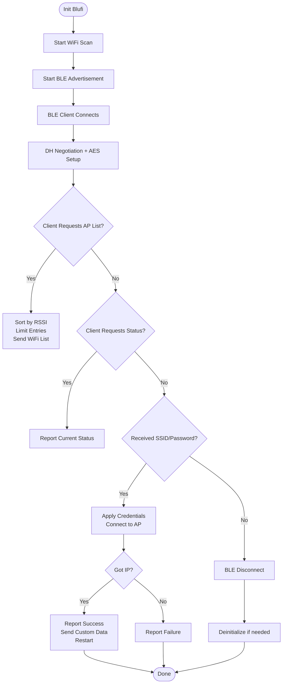
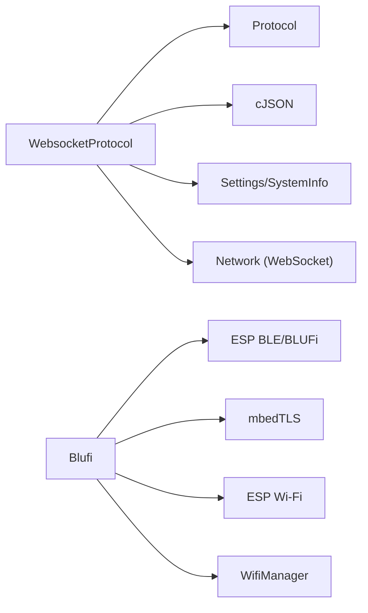

# Communication Layer

<cite>
**Referenced Files in This Document**
- [websocket_protocol.h](file://main/protocols/websocket_protocol.h)
- [websocket_protocol.cc](file://main/protocols/websocket_protocol.cc)
- [protocol.h](file://main/protocols/protocol.h)
- [protocol.cc](file://main/protocols/protocol.cc)
- [blufi.h](file://main/boards/common/blufi.h)
- [blufi.cpp](file://main/boards/common/blufi.cpp)
</cite>

## Table of Contents
1. [Introduction](#introduction)
2. [Project Structure](#project-structure)
3. [Core Components](#core-components)
4. [Architecture Overview](#architecture-overview)
5. [Detailed Component Analysis](#detailed-component-analysis)
6. [Dependency Analysis](#dependency-analysis)
7. [Performance Considerations](#performance-considerations)
8. [Troubleshooting Guide](#troubleshooting-guide)
9. [Conclusion](#conclusion)
10. [Appendices](#appendices)

## Introduction
This document describes the communication layer responsible for real-time data exchange between the mobile interface and embedded devices. It covers:
- HTTP request utilities and WebSocket connections used for streaming audio and control messages
- Blufi-based Wi-Fi configuration for device provisioning
- Request/response patterns, error handling, and retry strategies
- Integration with embedded device APIs, data serialization formats, and real-time event handling
- Guidance for implementing custom API endpoints, handling connection failures, and optimizing network performance
- Security considerations and debugging techniques for network-related issues

## Project Structure
The communication layer is implemented in two primary areas:
- Embedded protocols: WebSocket audio streaming and generic protocol abstractions
- Device provisioning: Blufi-based Wi-Fi configuration with BLE transport

**Diagram sources**
- [websocket_protocol.h:13-32](file://main/protocols/websocket_protocol.h#L13-L32)
- [websocket_protocol.cc:23-201](file://main/protocols/websocket_protocol.cc#L23-L201)
- [protocol.h:44-95](file://main/protocols/protocol.h#L44-L95)
- [blufi.h:16-147](file://main/boards/common/blufi.h#L16-L147)
- [blufi.cpp:104-138](file://main/boards/common/blufi.cpp#L104-L138)

**Section sources**
- [websocket_protocol.h:1-35](file://main/protocols/websocket_protocol.h#L1-L35)
- [websocket_protocol.cc:1-255](file://main/protocols/websocket_protocol.cc#L1-L255)
- [protocol.h:1-99](file://main/protocols/protocol.h#L1-L99)
- [protocol.cc:1-92](file://main/protocols/protocol.cc#L1-L92)
- [blufi.h:1-148](file://main/boards/common/blufi.h#L1-L148)
- [blufi.cpp:1-958](file://main/boards/common/blufi.cpp#L1-L958)

## Core Components
- Protocol base class: Defines the contract for audio streaming and control messages, including callbacks for incoming audio/json, channel open/close events, and network errors.
- WebsocketProtocol: Implements WebSocket-based audio streaming with support for multiple binary protocol versions, JSON control messages, and server hello handshake.
- Blufi: Implements BLE-based Wi-Fi provisioning, including BLE callbacks, DH/AES-based security, Wi-Fi scanning, and connection management.

Key responsibilities:
- Audio streaming: Encodes audio packets according to negotiated protocol version and sends via WebSocket
- Control plane: Sends JSON messages for listening state, MCP commands, abort speaking, and wake word detection
- Provisioning: Manages BLE advertisement, pairing, Wi-Fi credentials exchange, and connection verification

**Section sources**
- [protocol.h:44-95](file://main/protocols/protocol.h#L44-L95)
- [protocol.cc:7-92](file://main/protocols/protocol.cc#L7-L92)
- [websocket_protocol.h:13-32](file://main/protocols/websocket_protocol.h#L13-L32)
- [websocket_protocol.cc:23-201](file://main/protocols/websocket_protocol.cc#L23-L201)
- [blufi.h:16-147](file://main/boards/common/blufi.h#L16-L147)
- [blufi.cpp:104-138](file://main/boards/common/blufi.cpp#L104-L138)

## Architecture Overview
The communication layer integrates three major flows:
- Real-time audio streaming over WebSocket with server hello negotiation and binary protocol framing
- Control plane messaging via JSON over WebSocket
- BLE-based Wi-Fi provisioning for device configuration

**Diagram sources**
- [websocket_protocol.cc:83-201](file://main/protocols/websocket_protocol.cc#L83-L201)
- [protocol.cc:42-80](file://main/protocols/protocol.cc#L42-L80)

## Detailed Component Analysis

### Protocol Base Class
The Protocol base class defines the common interface for communication protocols:
- Audio streaming: OnIncomingAudio, OnIncomingJson, SendAudio
- Control messages: SendStartListening, SendStopListening, SendAbortSpeaking, SendMcpMessage, SendWakeWordDetected
- Lifecycle: OpenAudioChannel, CloseAudioChannel, IsAudioChannelOpened
- Error handling: OnNetworkError, SetError, IsTimeout

**Diagram sources**
- [protocol.h:44-95](file://main/protocols/protocol.h#L44-L95)
- [websocket_protocol.h:13-32](file://main/protocols/websocket_protocol.h#L13-L32)

**Section sources**
- [protocol.h:10-95](file://main/protocols/protocol.h#L10-L95)
- [protocol.cc:7-92](file://main/protocols/protocol.cc#L7-L92)

### WebsocketProtocol
WebsocketProtocol implements:
- Channel lifecycle: Connects to server, sets headers (Authorization, Protocol-Version, Device-Id, Client-Id), and waits for server hello
- Binary protocol framing: Supports versions 2 and 3 with appropriate field conversions and payload sizes
- JSON control plane: Parses server hello, forwards JSON messages to registered callbacks
- Event handling: OnData for incoming audio and JSON, OnDisconnected for closure notifications

**Diagram sources**
- [websocket_protocol.cc:83-201](file://main/protocols/websocket_protocol.cc#L83-L201)
- [websocket_protocol.h:13-32](file://main/protocols/websocket_protocol.h#L13-L32)

**Section sources**
- [websocket_protocol.h:13-32](file://main/protocols/websocket_protocol.h#L13-L32)
- [websocket_protocol.cc:23-201](file://main/protocols/websocket_protocol.cc#L23-L201)

### Blufi Wi-Fi Provisioning
Blufi manages BLE-based Wi-Fi provisioning:
- Initialization: Initializes BLE controller/host, registers callbacks, starts advertisement
- Security: Performs DH key exchange and AES-CFB encryption for secure data transfer
- Wi-Fi scanning: Dedicated scan to collect AP list; sorts by RSSI and limits number of entries
- Connection: Applies received credentials, connects to AP, verifies IP acquisition, reports status
- Lifecycle: Handles BLE connect/disconnect, deinitialization, and restart after successful provisioning

**Diagram sources**
- [blufi.cpp:104-138](file://main/boards/common/blufi.cpp#L104-L138)
- [blufi.cpp:531-613](file://main/boards/common/blufi.cpp#L531-L613)
- [blufi.cpp:644-936](file://main/boards/common/blufi.cpp#L644-L936)
- [blufi.cpp:800-847](file://main/boards/common/blufi.cpp#L800-L847)

**Section sources**
- [blufi.h:16-147](file://main/boards/common/blufi.h#L16-L147)
- [blufi.cpp:104-138](file://main/boards/common/blufi.cpp#L104-L138)
- [blufi.cpp:531-613](file://main/boards/common/blufi.cpp#L531-L613)
- [blufi.cpp:644-936](file://main/boards/common/blufi.cpp#L644-L936)
- [blufi.cpp:800-847](file://main/boards/common/blufi.cpp#L800-L847)

## Dependency Analysis
- WebsocketProtocol depends on:
  - Protocol base for callbacks and shared error handling
  - Network abstraction for WebSocket creation and connectivity
  - cJSON for JSON parsing and serialization
  - Settings/SystemInfo for configuration and identity
- Blufi depends on:
  - ESP-IDF BLE/BLUFi APIs for BLE transport
  - mbedTLS for DH negotiation and AES encryption
  - ESP Wi-Fi APIs for scanning and connection
  - WifiManager for higher-level Wi-Fi control

**Diagram sources**
- [websocket_protocol.cc:1-14](file://main/protocols/websocket_protocol.cc#L1-L14)
- [blufi.cpp:1-17](file://main/boards/common/blufi.cpp#L1-L17)

**Section sources**
- [websocket_protocol.cc:1-14](file://main/protocols/websocket_protocol.cc#L1-L14)
- [blufi.cpp:1-17](file://main/boards/common/blufi.cpp#L1-L17)

## Performance Considerations
- WebSocket binary framing:
  - Version 2 and 3 introduce fixed-size headers and payload sizing; ensure alignment with server expectations to avoid retransmissions
  - Prefer version 3 for reduced header overhead when supported
- Audio streaming:
  - Tune frame duration and sample rate to balance latency and bandwidth
  - Monitor channel timeout to detect stalled streams proactively
- Blufi provisioning:
  - Limit AP list size during transmission to reduce BLE congestion
  - Use dedicated scan to pre-collect APs and avoid blocking during client requests
- Retry and backoff:
  - Implement exponential backoff for WebSocket reconnect attempts
  - Validate server hello receipt before considering channel ready

[No sources needed since this section provides general guidance]

## Troubleshooting Guide
Common issues and resolutions:
- WebSocket connection fails:
  - Verify Authorization header and Protocol-Version headers
  - Confirm server URL and network connectivity
  - Check server hello timeout and event signaling
- Audio stream stalls:
  - Inspect channel timeout logic and last incoming time updates
  - Validate binary protocol version and payload sizes
- Blufi provisioning timeouts:
  - Ensure BLE is advertising and client can connect
  - Confirm Wi-Fi scan completion before sending AP list
  - Check DHCP acquisition and IP availability before reporting success
- Security errors:
  - Validate DH parameter handling and AES context initialization
  - Ensure checksum and IV handling are consistent across endpoints

**Section sources**
- [websocket_protocol.cc:168-201](file://main/protocols/websocket_protocol.cc#L168-L201)
- [websocket_protocol.cc:83-110](file://main/protocols/websocket_protocol.cc#L83-L110)
- [blufi.cpp:644-936](file://main/boards/common/blufi.cpp#L644-L936)
- [blufi.cpp:348-377](file://main/boards/common/blufi.cpp#L348-L377)

## Conclusion
The communication layer combines a robust WebSocket-based audio streaming protocol with a secure Blufi-based Wi-Fi provisioning mechanism. The Protocol base class provides a consistent interface for control and audio data, while WebsocketProtocol and Blufi implement concrete transports. Proper error handling, timeouts, and security measures ensure reliable operation in embedded environments.

[No sources needed since this section summarizes without analyzing specific files]

## Appendices

### Implementing Custom API Endpoints
- Extend Protocol callbacks to handle new JSON message types
- Add new Send* methods for custom control messages
- Integrate with WebsocketProtocol’s SendText to emit structured JSON payloads
- Ensure server-side handlers mirror the message schema and maintain backward compatibility

**Section sources**
- [protocol.h:58-76](file://main/protocols/protocol.h#L58-L76)
- [protocol.cc:42-80](file://main/protocols/protocol.cc#L42-L80)
- [websocket_protocol.cc:60-72](file://main/protocols/websocket_protocol.cc#L60-L72)

### Security Considerations
- Use TLS-enabled WebSocket connections when possible
- Validate server certificates and enforce strict hostname verification
- Protect sensitive headers (Authorization) and avoid logging raw credentials
- For Blufi, ensure DH parameters and AES contexts are properly initialized and cleaned up

**Section sources**
- [blufi.cpp:348-377](file://main/boards/common/blufi.cpp#L348-L377)
- [websocket_protocol.cc:101-107](file://main/protocols/websocket_protocol.cc#L101-L107)