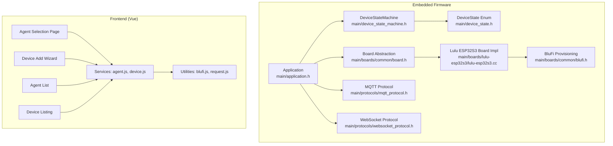
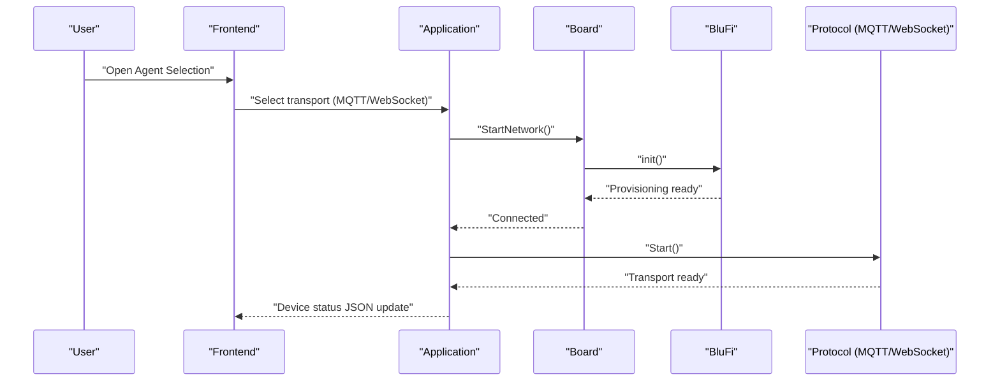
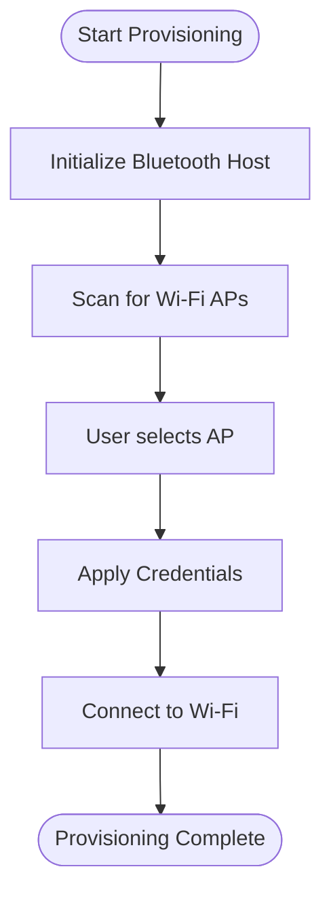
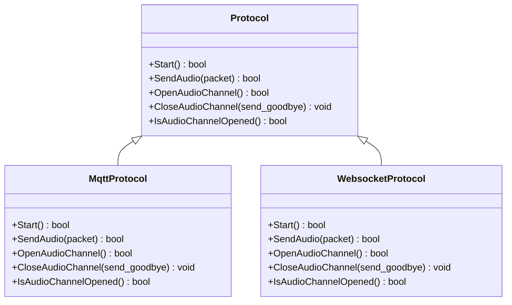
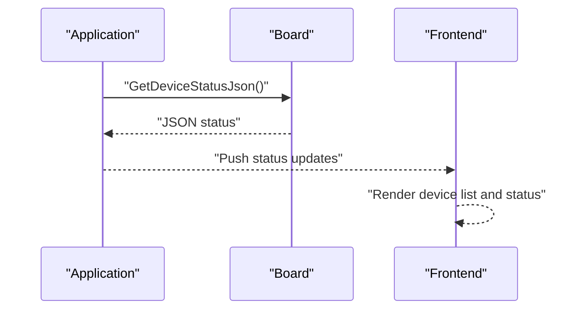
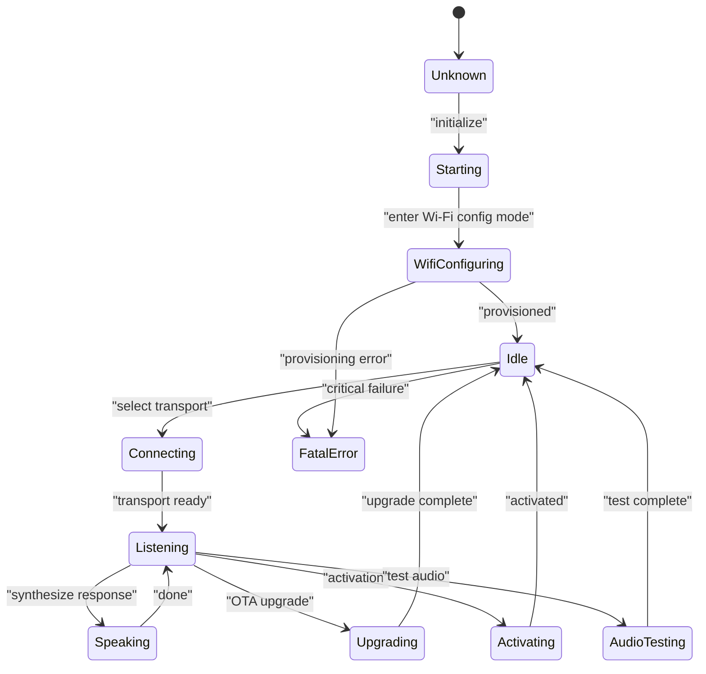
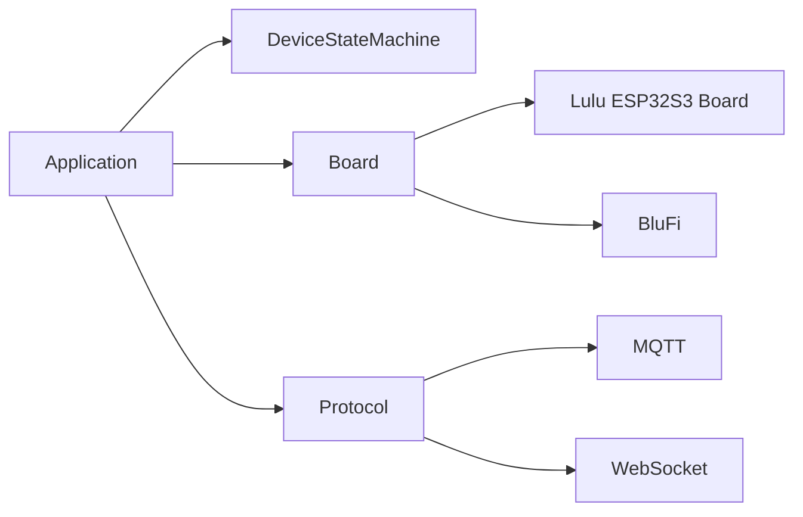

# Device Management

<cite>
**Referenced Files in This Document**
- [application.h](file://main/application.h)
- [device_state_machine.h](file://main/device_state_machine.h)
- [device_state.h](file://main/device_state.h)
- [board.h](file://main/boards/common/board.h)
- [blufi.h](file://main/boards/common/blufi.h)
- [lulu-esp32s3.cc](file://main/boards/lulu-esp32s3/lulu-esp32s3.cc)
- [mqtt_protocol.h](file://main/protocols/mqtt_protocol.h)
- [websocket_protocol.h](file://main/protocols/websocket_protocol.h)
</cite>

## Table of Contents
1. [Introduction](#introduction)
2. [Project Structure](#project-structure)
3. [Core Components](#core-components)
4. [Architecture Overview](#architecture-overview)
5. [Detailed Component Analysis](#detailed-component-analysis)
6. [Dependency Analysis](#dependency-analysis)
7. [Performance Considerations](#performance-considerations)
8. [Troubleshooting Guide](#troubleshooting-guide)
9. [Conclusion](#conclusion)
10. [Appendices](#appendices)

## Introduction
This document describes the device management system for the embedded platform, focusing on device discovery, registration, and configuration workflows. It explains the device listing interface, add device wizard, and agent selection processes conceptually, and documents the integration with embedded device communication protocols and real-time status updates. It also covers the device lifecycle management including pairing procedures, initial setup, and ongoing maintenance operations. Guidance is included for extending device support, adding new device types, and implementing custom device configuration screens. Error handling for connectivity issues and troubleshooting common setup problems are addressed.

## Project Structure
The device management system spans both the embedded firmware and the companion frontend. The embedded side orchestrates device state, networking, and protocol selection, while the frontend provides user-facing flows for device discovery and configuration.

- Embedded core:
  - Application orchestration and state machine
  - Board abstraction and device-specific implementations
  - Communication protocols (MQTT/WebSocket)
  - Provisioning via BluFi

- Frontend (Vue):
  - Pages for agent selection, device add, and related flows
  - Services for device and agent interactions
  - Utilities for protocol-specific operations

**Diagram sources**
- [application.h:42-177](file://main/application.h#L42-L177)
- [device_state_machine.h:17-81](file://main/device_state_machine.h#L17-L81)
- [device_state.h:4-16](file://main/device_state.h#L4-L16)
- [board.h:52-93](file://main/boards/common/board.h#L52-L93)
- [blufi.h:16-147](file://main/boards/common/blufi.h#L16-L147)
- [lulu-esp32s3.cc:37-778](file://main/boards/lulu-esp32s3/lulu-esp32s3.cc#L37-L778)
- [mqtt_protocol.h:26-62](file://main/protocols/mqtt_protocol.h#L26-L62)
- [websocket_protocol.h:13-32](file://main/protocols/websocket_protocol.h#L13-L32)

**Section sources**
- [application.h:42-177](file://main/application.h#L42-L177)
- [device_state_machine.h:17-81](file://main/device_state_machine.h#L17-L81)
- [device_state.h:4-16](file://main/device_state.h#L4-L16)
- [board.h:52-93](file://main/boards/common/board.h#L52-L93)
- [blufi.h:16-147](file://main/boards/common/blufi.h#L16-L147)
- [lulu-esp32s3.cc:37-778](file://main/boards/lulu-esp32s3/lulu-esp32s3.cc#L37-L778)
- [mqtt_protocol.h:26-62](file://main/protocols/mqtt_protocol.h#L26-L62)
- [websocket_protocol.h:13-32](file://main/protocols/websocket_protocol.h#L13-L32)

## Core Components
- Application: Central runtime that initializes subsystems, manages the event loop, and controls protocol selection and state transitions.
- DeviceStateMachine: Enforces valid state transitions and notifies observers of state changes.
- Board Abstraction: Provides a unified interface for hardware capabilities and exposes device status JSON for monitoring.
- Protocol Implementations: MQTT and WebSocket protocols encapsulate transport-specific logic and audio channel management.
- BluFi: Implements Wi-Fi provisioning via Bluetooth Low Energy for out-of-band device registration.

Key responsibilities:
- Device discovery and registration: Triggered by entering Wi-Fi configuration mode and scanning for devices.
- Agent selection: Chooses between MQTT or WebSocket based on device capability and user preference.
- Real-time status updates: Device status JSON includes network, battery, and board-specific metrics.
- Lifecycle management: Handles transitions from starting, Wi-Fi configuring, connecting, listening, speaking, upgrading, activating, audio testing, to fatal error.

**Section sources**
- [application.h:42-177](file://main/application.h#L42-L177)
- [device_state_machine.h:17-81](file://main/device_state_machine.h#L17-L81)
- [board.h:52-93](file://main/boards/common/board.h#L52-L93)
- [blufi.h:16-147](file://main/boards/common/blufi.h#L16-L147)
- [mqtt_protocol.h:26-62](file://main/protocols/mqtt_protocol.h#L26-L62)
- [websocket_protocol.h:13-32](file://main/protocols/websocket_protocol.h#L13-L32)

## Architecture Overview
The system integrates a state-driven embedded runtime with protocol-aware transports and a board abstraction layer. Provisioning occurs over Bluetooth LE (BluFi), after which the device connects to Wi-Fi and selects a transport protocol. The board exposes device status JSON for real-time monitoring.

**Diagram sources**
- [application.h:57-127](file://main/application.h#L57-L127)
- [board.h:80-88](file://main/boards/common/board.h#L80-L88)
- [blufi.h:36-42](file://main/boards/common/blufi.h#L36-L42)
- [mqtt_protocol.h:31-35](file://main/protocols/mqtt_protocol.h#L31-L35)
- [websocket_protocol.h:18-22](file://main/protocols/websocket_protocol.h#L18-L22)

## Detailed Component Analysis

### Device Discovery and Registration (Wi-Fi Provisioning)
- Entry point: Board triggers Wi-Fi configuration mode and starts BluFi provisioning.
- Workflow:
  - Initialize Bluetooth controller and host.
  - Perform Wi-Fi scan and present AP list.
  - Negotiate security and apply credentials to device Wi-Fi station.
  - Device connects to the selected network and exits provisioning mode.
- Integration points:
  - Board-level callbacks for Wi-Fi config start/end.
  - Device status JSON includes Wi-Fi and network state.

**Diagram sources**
- [blufi.h:36-42](file://main/boards/common/blufi.h#L36-L42)
- [blufi.h:87-90](file://main/boards/common/blufi.h#L87-L90)
- [lulu-esp32s3.cc:721-733](file://main/boards/lulu-esp32s3/lulu-esp32s3.cc#L721-L733)

**Section sources**
- [blufi.h:16-147](file://main/boards/common/blufi.h#L16-L147)
- [lulu-esp32s3.cc:721-733](file://main/boards/lulu-esp32s3/lulu-esp32s3.cc#L721-L733)

### Agent Selection and Transport Protocol
- Agent selection page allows choosing between MQTT and WebSocket.
- Application initializes the selected protocol after network connection.
- Protocols manage audio channels and handle server hello messages.

**Diagram sources**
- [mqtt_protocol.h:26-62](file://main/protocols/mqtt_protocol.h#L26-L62)
- [websocket_protocol.h:13-32](file://main/protocols/websocket_protocol.h#L13-L32)

**Section sources**
- [application.h:171-172](file://main/application.h#L171-L172)
- [mqtt_protocol.h:31-35](file://main/protocols/mqtt_protocol.h#L31-L35)
- [websocket_protocol.h:18-22](file://main/protocols/websocket_protocol.h#L18-L22)

### Device Listing Interface and Status Updates
- Device status JSON is generated by the board and includes network, battery, and board-specific metrics.
- Real-time updates occur during state transitions and network events.
- The embedded application exposes alerting and status reporting mechanisms.

**Diagram sources**
- [board.h:87-88](file://main/boards/common/board.h#L87-L88)
- [lulu-esp32s3.cc:684-706](file://main/boards/lulu-esp32s3/lulu-esp32s3.cc#L684-L706)
- [application.h:83-84](file://main/application.h#L83-L84)

**Section sources**
- [board.h:87-88](file://main/boards/common/board.h#L87-L88)
- [lulu-esp32s3.cc:684-706](file://main/boards/lulu-esp32s3/lulu-esp32s3.cc#L684-L706)
- [application.h:83-84](file://main/application.h#L83-L84)

### Device Lifecycle Management
- States include unknown, starting, Wi-Fi configuring, idle, connecting, listening, speaking, upgrading, activating, audio testing, and fatal error.
- StateMachine validates transitions and notifies listeners.
- Application reacts to state changes and network events to orchestrate lifecycle actions.

**Diagram sources**
- [device_state.h:4-16](file://main/device_state.h#L4-L16)
- [device_state_machine.h:36-41](file://main/device_state_machine.h#L36-L41)
- [application.h:154-162](file://main/application.h#L154-L162)

**Section sources**
- [device_state.h:4-16](file://main/device_state.h#L4-L16)
- [device_state_machine.h:17-81](file://main/device_state_machine.h#L17-L81)
- [application.h:154-162](file://main/application.h#L154-L162)

### Extending Device Support and Adding New Device Types
- Implement a new board class inheriting from the board abstraction and register it via the board factory macro.
- Provide overrides for hardware-specific capabilities (display, camera, audio codec, power save, etc.).
- Integrate provisioning and status reporting by leveraging the board’s network and device status JSON.

Implementation steps:
- Derive a new board class and implement required virtual methods.
- Register the board via the provided macro.
- Ensure Wi-Fi provisioning and status JSON generation are aligned with the new hardware.

**Section sources**
- [board.h:52-93](file://main/boards/common/board.h#L52-L93)
- [lulu-esp32s3.cc:775-778](file://main/boards/lulu-esp32s3/lulu-esp32s3.cc#L775-L778)

### Implementing Custom Device Configuration Screens
- Use the agent selection and device add wizards to collect configuration inputs.
- Persist configuration via board APIs and trigger provisioning or transport initialization accordingly.
- Surface real-time feedback using device status JSON and alerts.

[No sources needed since this section provides general guidance]

### Integrating Embedded Communication Protocols
- MQTT and WebSocket protocols encapsulate transport-specific logic, including hello messages and audio channel management.
- Application initializes the chosen protocol after network connectivity.

**Section sources**
- [mqtt_protocol.h:26-62](file://main/protocols/mqtt_protocol.h#L26-L62)
- [websocket_protocol.h:13-32](file://main/protocols/websocket_protocol.h#L13-L32)
- [application.h:171-172](file://main/application.h#L171-L172)

## Dependency Analysis
The embedded system exhibits clear separation of concerns:
- Application depends on DeviceStateMachine and Board abstractions.
- Board implementations depend on protocol implementations for transport.
- BluFi provisioning is decoupled from transport protocols and is board-specific.

**Diagram sources**
- [application.h:135-136](file://main/application.h#L135-L136)
- [device_state_machine.h:67-68](file://main/device_state_machine.h#L67-L68)
- [board.h:52-93](file://main/boards/common/board.h#L52-L93)
- [blufi.h:16-147](file://main/boards/common/blufi.h#L16-L147)
- [mqtt_protocol.h:26-62](file://main/protocols/mqtt_protocol.h#L26-L62)
- [websocket_protocol.h:13-32](file://main/protocols/websocket_protocol.h#L13-L32)

**Section sources**
- [application.h:135-136](file://main/application.h#L135-L136)
- [device_state_machine.h:67-68](file://main/device_state_machine.h#L67-L68)
- [board.h:52-93](file://main/boards/common/board.h#L52-L93)
- [blufi.h:16-147](file://main/boards/common/blufi.h#L16-L147)
- [mqtt_protocol.h:26-62](file://main/protocols/mqtt_protocol.h#L26-L62)
- [websocket_protocol.h:13-32](file://main/protocols/websocket_protocol.h#L13-L32)

## Performance Considerations
- Minimize blocking operations in the main event loop; schedule heavy tasks to background threads.
- Use event-driven state transitions to avoid polling and reduce CPU usage.
- Optimize protocol initialization and audio channel opening/closing to reduce latency.
- Ensure Wi-Fi provisioning scans are efficient and avoid unnecessary re-scans.

[No sources needed since this section provides general guidance]

## Troubleshooting Guide
Common issues and resolutions:
- Provisioning failures:
  - Verify Bluetooth availability and proper initialization.
  - Confirm Wi-Fi credentials correctness and AP accessibility.
- Connectivity issues:
  - Check network event callbacks and state transitions.
  - Validate protocol initialization order and error reporting.
- Status reporting anomalies:
  - Inspect device status JSON generation and ensure all fields are populated.
- Fatal errors:
  - Review state machine transitions and error handling paths.

**Section sources**
- [blufi.h:57-63](file://main/boards/common/blufi.h#L57-L63)
- [application.h:158-159](file://main/application.h#L158-L159)
- [lulu-esp32s3.cc:684-706](file://main/boards/lulu-esp32s3/lulu-esp32s3.cc#L684-L706)
- [device_state_machine.h:75-80](file://main/device_state_machine.h#L75-L80)

## Conclusion
The device management system combines a robust state machine, board abstraction, and protocol implementations to deliver a reliable device lifecycle. Provisioning via BluFi, transport selection, and real-time status updates form the backbone of the user experience. Extensibility is achieved through board implementations and protocol interfaces, enabling straightforward addition of new device types and custom configuration flows.

[No sources needed since this section summarizes without analyzing specific files]

## Appendices
- Device states and transitions are defined centrally for consistency across the system.
- Board implementations centralize hardware-specific behavior and expose a unified status interface.

**Section sources**
- [device_state.h:4-16](file://main/device_state.h#L4-L16)
- [board.h:87-88](file://main/boards/common/board.h#L87-L88)