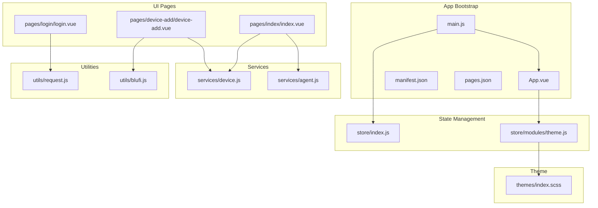
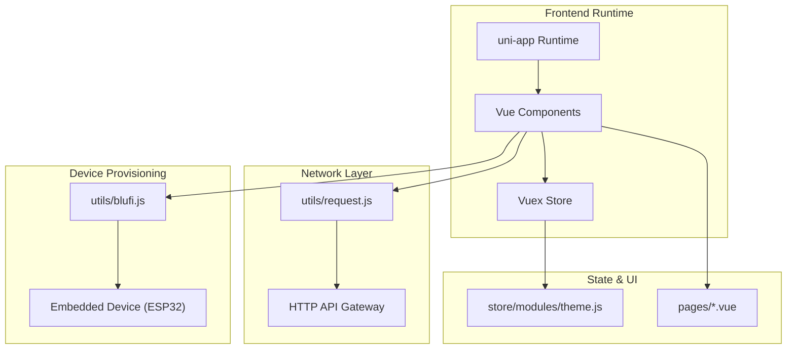
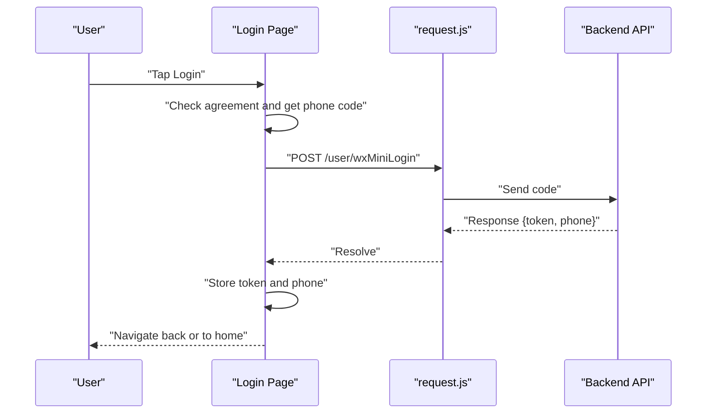
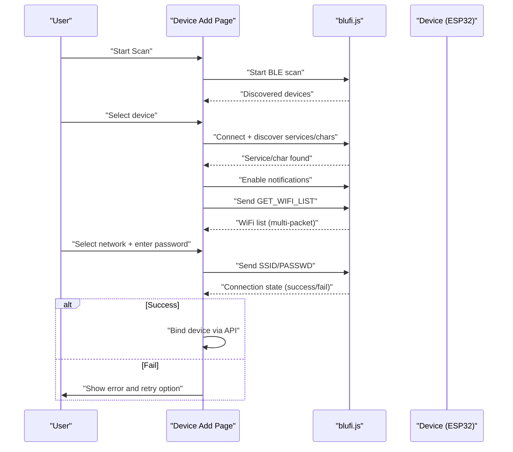
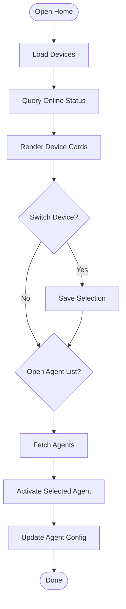
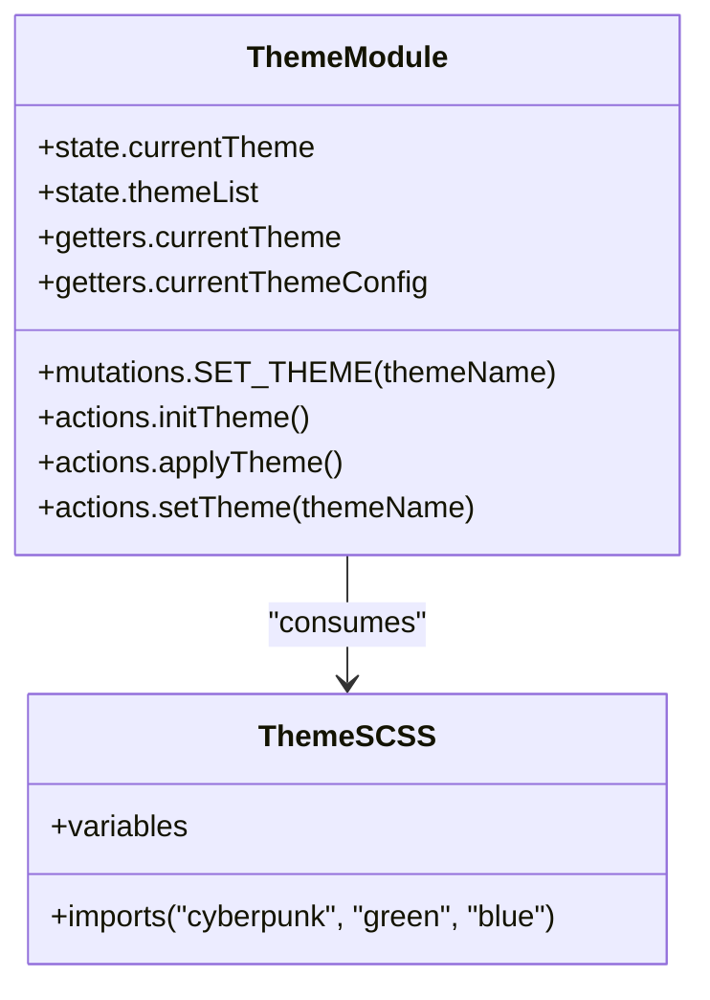
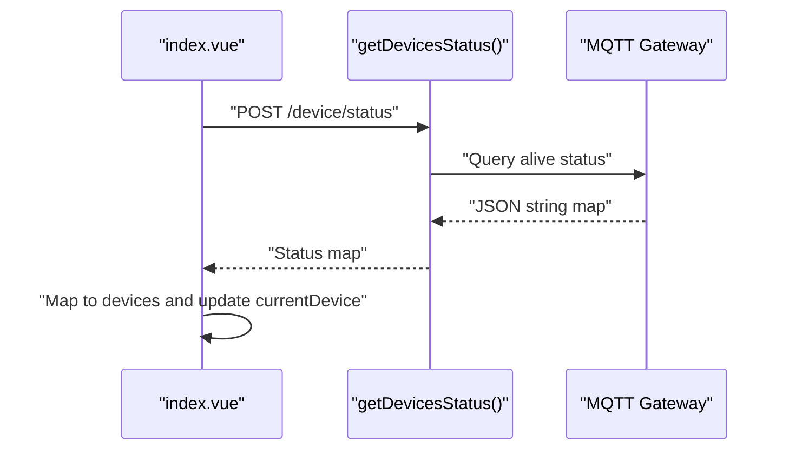
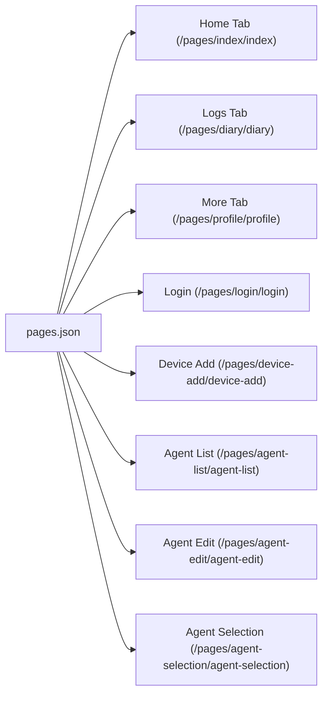
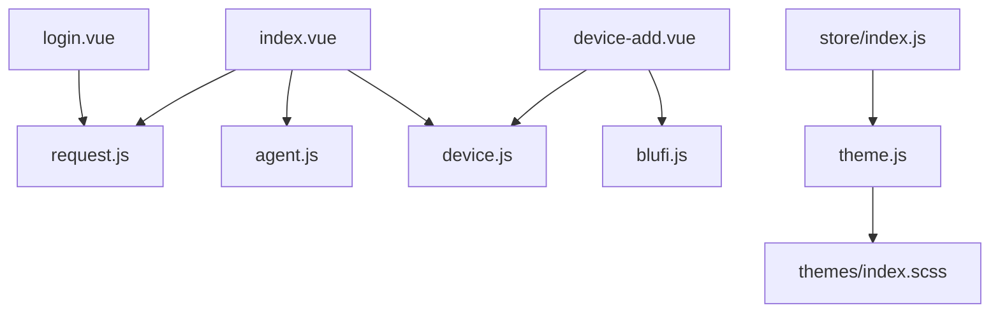

# Mobile Web Interface

<cite>
**Referenced Files in This Document**
- [App.vue](file://docs/xiaolu-mini/App.vue)
- [main.js](file://docs/xiaolu-mini/main.js)
- [pages.json](file://docs/xiaolu-mini/pages.json)
- [manifest.json](file://docs/xiaolu-mini/manifest.json)
- [store/index.js](file://docs/xiaolu-mini/store/index.js)
- [store/modules/theme.js](file://docs/xiaolu-mini/store/modules/theme.js)
- [themes/index.scss](file://docs/xiaolu-mini/themes/index.scss)
- [utils/request.js](file://docs/xiaolu-mini/utils/request.js)
- [utils/blufi.js](file://docs/xiaolu-mini/utils/blufi.js)
- [services/device.js](file://docs/xiaolu-mini/services/device.js)
- [services/agent.js](file://docs/xiaolu-mini/services/agent.js)
- [pages/login/login.vue](file://docs/xiaolu-mini/pages/login/login.vue)
- [pages/index/index.vue](file://docs/xiaolu-mini/pages/index/index.vue)
- [pages/device-add/device-add.vue](file://docs/xiaolu-mini/pages/device-add/device-add.vue)
</cite>

## Table of Contents
1. [Introduction](#introduction)
2. [Project Structure](#project-structure)
3. [Core Components](#core-components)
4. [Architecture Overview](#architecture-overview)
5. [Detailed Component Analysis](#detailed-component-analysis)
6. [Dependency Analysis](#dependency-analysis)
7. [Performance Considerations](#performance-considerations)
8. [Troubleshooting Guide](#troubleshooting-guide)
9. [Conclusion](#conclusion)
10. [Appendices](#appendices)

## Introduction
This document describes the Vue.js-based mobile web interface built with the uni-app framework for cross-platform deployment on iOS and Android. It focuses on device configuration and control, authentication flows, theme system, state management, routing, and real-time communication with embedded devices via BLE (BluFi) and HTTP APIs. The interface includes device discovery and configuration wizard for WiFi provisioning, device pairing, and initial calibration procedures. It also documents the page structure covering device list, agent management, profile settings, and diagnostic interfaces.

## Project Structure
The project follows a uni-app structure with a clear separation of concerns:
- Application bootstrap and global initialization
- Pages organized per feature (authentication, device management, agents, diagnostics)
- Services for backend API interactions
- Utilities for BLE communication (BluFi)
- Theme system with SCSS-based color schemes
- State management via Vuex

**Diagram sources**
- [main.js:1-25](file://docs/xiaolu-mini/main.js#L1-L25)
- [App.vue:1-28](file://docs/xiaolu-mini/App.vue#L1-L28)
- [manifest.json:1-35](file://docs/xiaolu-mini/manifest.json#L1-L35)
- [pages.json:1-104](file://docs/xiaolu-mini/pages.json#L1-L104)
- [store/index.js:1-11](file://docs/xiaolu-mini/store/index.js#L1-L11)
- [store/modules/theme.js:1-110](file://docs/xiaolu-mini/store/modules/theme.js#L1-L110)
- [pages/index/index.vue:1-1024](file://docs/xiaolu-mini/pages/index/index.vue#L1-L1024)
- [pages/login/login.vue:1-257](file://docs/xiaolu-mini/pages/login/login.vue#L1-L257)
- [pages/device-add/device-add.vue:1-1615](file://docs/xiaolu-mini/pages/device-add/device-add.vue#L1-L1615)
- [services/device.js:1-79](file://docs/xiaolu-mini/services/device.js#L1-L79)
- [services/agent.js:1-105](file://docs/xiaolu-mini/services/agent.js#L1-L105)
- [utils/request.js:1-51](file://docs/xiaolu-mini/utils/request.js#L1-L51)
- [utils/blufi.js:1-138](file://docs/xiaolu-mini/utils/blufi.js#L1-L138)
- [themes/index.scss:1-37](file://docs/xiaolu-mini/themes/index.scss#L1-L37)

**Section sources**
- [main.js:1-25](file://docs/xiaolu-mini/main.js#L1-L25)
- [App.vue:1-28](file://docs/xiaolu-mini/App.vue#L1-L28)
- [pages.json:1-104](file://docs/xiaolu-mini/pages.json#L1-L104)
- [manifest.json:1-35](file://docs/xiaolu-mini/manifest.json#L1-L35)

## Core Components
- Authentication and session management: Login page with mini-program phone authorization, token storage, and guarded actions.
- Device management: Device list page with online status detection, device switching, and personality visualization.
- Device configuration wizard: BLE-based BluFi provisioning for WiFi setup, with step-by-step UI and robust retry logic.
- Theme system: Multi-theme support with persistent selection and dynamic UI updates.
- State management: Vuex store with namespaced theme module.
- Routing and permissions: uni-app pages configuration and platform-specific permissions.

**Section sources**
- [pages/login/login.vue:1-257](file://docs/xiaolu-mini/pages/login/login.vue#L1-L257)
- [pages/index/index.vue:1-1024](file://docs/xiaolu-mini/pages/index/index.vue#L1-L1024)
- [pages/device-add/device-add.vue:1-1615](file://docs/xiaolu-mini/pages/device-add/device-add.vue#L1-L1615)
- [store/modules/theme.js:1-110](file://docs/xiaolu-mini/store/modules/theme.js#L1-L110)
- [store/index.js:1-11](file://docs/xiaolu-mini/store/index.js#L1-L11)

## Architecture Overview
The system architecture centers around uni-app’s cross-platform runtime, with Vue components driving UI and Vuex managing theme state. Backend communication is handled via a unified request wrapper, while BLE provisioning is implemented with a dedicated BluFi utility.

**Diagram sources**
- [utils/request.js:1-51](file://docs/xiaolu-mini/utils/request.js#L1-L51)
- [utils/blufi.js:1-138](file://docs/xiaolu-mini/utils/blufi.js#L1-L138)
- [store/modules/theme.js:1-110](file://docs/xiaolu-mini/store/modules/theme.js#L1-L110)
- [pages/index/index.vue:1-1024](file://docs/xiaolu-mini/pages/index/index.vue#L1-L1024)
- [pages/device-add/device-add.vue:1-1615](file://docs/xiaolu-mini/pages/device-add/device-add.vue#L1-L1615)

## Detailed Component Analysis

### Authentication and Session Management
- Login flow:
  - Requires user agreement and mini-program phone authorization.
  - On success, stores token and optional phone number in local storage.
  - Navigates back or to home depending on navigation stack.
- Token propagation:
  - Global request wrapper attaches token to headers for protected endpoints.
  - Handles 401 by clearing stored credentials and prompting re-login.
- Guarded actions:
  - Device list checks for token presence and prompts login when missing.

**Diagram sources**
- [pages/login/login.vue:63-99](file://docs/xiaolu-mini/pages/login/login.vue#L63-L99)
- [utils/request.js:6-48](file://docs/xiaolu-mini/utils/request.js#L6-L48)

**Section sources**
- [pages/login/login.vue:1-257](file://docs/xiaolu-mini/pages/login/login.vue#L1-L257)
- [utils/request.js:1-51](file://docs/xiaolu-mini/utils/request.js#L1-L51)

### Device Discovery and Configuration Wizard (WiFi Setup via BluFi)
- BLE lifecycle:
  - Initializes Bluetooth adapter, handles permission prompts (especially Android location), and manages scanning.
  - Stops and restarts discovery to avoid stale caches.
- Connection and provisioning:
  - Connects to device, discovers BluFi service and characteristics, enables notifications.
  - Requests WiFi list, parses multi-packet payloads, and presents selectable networks.
  - Sends SSID/password to device; monitors connection state; persists device STA MAC; binds device post-success.
- Robustness:
  - Automatic retry loop for WiFi scanning with capped attempts.
  - Graceful error handling and user feedback.

**Diagram sources**
- [pages/device-add/device-add.vue:471-800](file://docs/xiaolu-mini/pages/device-add/device-add.vue#L471-L800)
- [utils/blufi.js:109-137](file://docs/xiaolu-mini/utils/blufi.js#L109-L137)
- [services/device.js:14-35](file://docs/xiaolu-mini/services/device.js#L14-L35)

**Section sources**
- [pages/device-add/device-add.vue:1-1615](file://docs/xiaolu-mini/pages/device-add/device-add.vue#L1-L1615)
- [utils/blufi.js:1-138](file://docs/xiaolu-mini/utils/blufi.js#L1-L138)
- [services/device.js:1-79](file://docs/xiaolu-mini/services/device.js#L1-L79)

### Device List, Agent Management, and Diagnostics
- Device list:
  - Loads user devices, restores last selected device, queries online status via status API, and renders device cards with MAC-derived display names.
  - Supports switching devices and unbinding with confirmation.
- Personality visualization:
  - Renders a radar chart for five-dimensional personality metrics from agent service.
- Agent management:
  - Fetches agents, activates a selected agent, updates agent configuration, and retrieves model/voice options and templates.
- Diagnostics:
  - Dedicated page for logs and diagnostics.

**Diagram sources**
- [pages/index/index.vue:193-295](file://docs/xiaolu-mini/pages/index/index.vue#L193-L295)
- [services/agent.js:13-104](file://docs/xiaolu-mini/services/agent.js#L13-L104)

**Section sources**
- [pages/index/index.vue:1-1024](file://docs/xiaolu-mini/pages/index/index.vue#L1-L1024)
- [services/agent.js:1-105](file://docs/xiaolu-mini/services/agent.js#L1-L105)

### Theme System and Customization
- Themes:
  - Namespaced Vuex module manages current theme and theme list.
  - Applies theme to navigation bar and tab bar styles dynamically.
  - Persists theme preference in storage.
- SCSS variables:
  - Centralized theme variable definitions with per-theme overrides.
  - Root-level defaults overridden by theme imports.

**Diagram sources**
- [store/modules/theme.js:1-110](file://docs/xiaolu-mini/store/modules/theme.js#L1-L110)
- [themes/index.scss:1-37](file://docs/xiaolu-mini/themes/index.scss#L1-L37)

**Section sources**
- [store/modules/theme.js:1-110](file://docs/xiaolu-mini/store/modules/theme.js#L1-L110)
- [themes/index.scss:1-37](file://docs/xiaolu-mini/themes/index.scss#L1-L37)
- [App.vue:1-28](file://docs/xiaolu-mini/App.vue#L1-L28)

### Real-time Communication and Polling
- HTTP polling:
  - Device list page polls device status via a dedicated endpoint and maps MQTT client IDs to device entries.
- BLE notifications:
  - BluFi notification handler parses multi-packet WiFi lists and connection state reports; supports fragmentation and custom data frames.

**Diagram sources**
- [pages/index/index.vue:241-277](file://docs/xiaolu-mini/pages/index/index.vue#L241-L277)
- [services/device.js:72-79](file://docs/xiaolu-mini/services/device.js#L72-L79)

**Section sources**
- [pages/index/index.vue:1-1024](file://docs/xiaolu-mini/pages/index/index.vue#L1-L1024)
- [utils/blufi.js:622-757](file://docs/xiaolu-mini/utils/blufi.js#L622-L757)

### Routing Patterns and Page Structure
- Pages configuration defines navigation bar titles, tab bar, and permissions.
- Platform-specific manifest settings enable component usage and permission scopes.

**Diagram sources**
- [pages.json:1-104](file://docs/xiaolu-mini/pages.json#L1-L104)

**Section sources**
- [pages.json:1-104](file://docs/xiaolu-mini/pages.json#L1-L104)
- [manifest.json:1-35](file://docs/xiaolu-mini/manifest.json#L1-L35)

## Dependency Analysis
- Component coupling:
  - Pages depend on services and utilities; services depend on the request wrapper.
  - Theme module is decoupled from UI pages via computed getters.
- External dependencies:
  - uni-app runtime APIs for BLE, storage, navigation, and UI.
  - Backend API for device and agent operations.

**Diagram sources**
- [pages/login/login.vue:1-257](file://docs/xiaolu-mini/pages/login/login.vue#L1-L257)
- [pages/index/index.vue:1-1024](file://docs/xiaolu-mini/pages/index/index.vue#L1-L1024)
- [pages/device-add/device-add.vue:1-1615](file://docs/xiaolu-mini/pages/device-add/device-add.vue#L1-L1615)
- [utils/request.js:1-51](file://docs/xiaolu-mini/utils/request.js#L1-L51)
- [utils/blufi.js:1-138](file://docs/xiaolu-mini/utils/blufi.js#L1-L138)
- [services/device.js:1-79](file://docs/xiaolu-mini/services/device.js#L1-L79)
- [services/agent.js:1-105](file://docs/xiaolu-mini/services/agent.js#L1-L105)
- [store/modules/theme.js:1-110](file://docs/xiaolu-mini/store/modules/theme.js#L1-L110)
- [themes/index.scss:1-37](file://docs/xiaolu-mini/themes/index.scss#L1-L37)
- [store/index.js:1-11](file://docs/xiaolu-mini/store/index.js#L1-L11)

**Section sources**
- [store/index.js:1-11](file://docs/xiaolu-mini/store/index.js#L1-L11)
- [store/modules/theme.js:1-110](file://docs/xiaolu-mini/store/modules/theme.js#L1-L110)

## Performance Considerations
- BLE scanning and retries:
  - Implement timeouts and capped retry counts to prevent indefinite waits.
  - Reinitialize BLE adapter to clear stale state when restarting scans.
- UI rendering:
  - Defer heavy canvas drawing until after data loads and use minimal re-renders.
- Network requests:
  - Centralize headers and error handling in the request wrapper to reduce duplication and improve consistency.
- Theme application:
  - Apply theme styles once during initialization and avoid frequent re-computation.

## Troubleshooting Guide
- Authentication failures:
  - 401 responses clear stored tokens; ensure token refresh or re-authentication flow is triggered.
- BLE provisioning issues:
  - Verify Bluetooth and location permissions, especially on Android.
  - If WiFi list scanning fails, use automatic retry mechanism; otherwise guide the user to re-initiate provisioning.
- Device status discrepancies:
  - Confirm MQTT gateway connectivity and that status keys match expected board/mac formats.
- Theme not applying:
  - Ensure theme initialization action runs on app launch and that SCSS variables are correctly imported.

**Section sources**
- [utils/request.js:27-40](file://docs/xiaolu-mini/utils/request.js#L27-L40)
- [pages/device-add/device-add.vue:369-459](file://docs/xiaolu-mini/pages/device-add/device-add.vue#L369-L459)
- [pages/index/index.vue:241-277](file://docs/xiaolu-mini/pages/index/index.vue#L241-L277)
- [App.vue:7-8](file://docs/xiaolu-mini/App.vue#L7-L8)

## Conclusion
The mobile web interface leverages uni-app to deliver a cohesive, cross-platform experience for device configuration and control. The authentication system integrates with mini-program capabilities and secure token handling. The BluFi-based provisioning wizard provides a robust, stepwise path to WiFi setup with resilient retry logic. The theme system offers flexible customization persisted across sessions. Together with Vuex state management, structured services, and clear routing, the system supports scalable extension and maintenance.

## Appendices
- Extending functionality:
  - Add new pages under the pages directory and register them in pages.json.
  - Introduce new services in the services folder and wrap HTTP calls in the request utility.
  - Extend the theme module with new color schemes and update SCSS accordingly.
- Customizing UI components:
  - Use SCSS variables and theme getters to maintain consistent styling across components.
  - Keep component styles scoped and leverage theme variables for colors and shadows.
- Integrating additional device features:
  - Follow the existing patterns in device-add.vue for BLE interactions and status handling.
  - Use services to encapsulate backend endpoints and keep pages focused on presentation and orchestration.