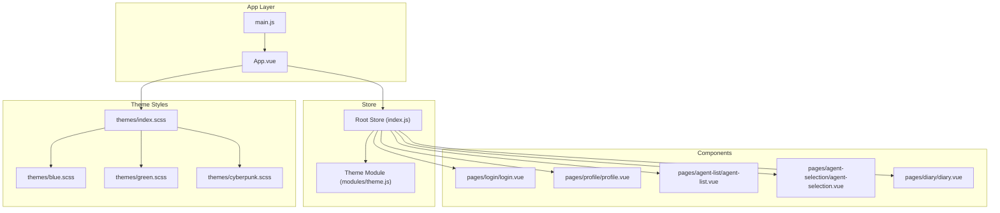
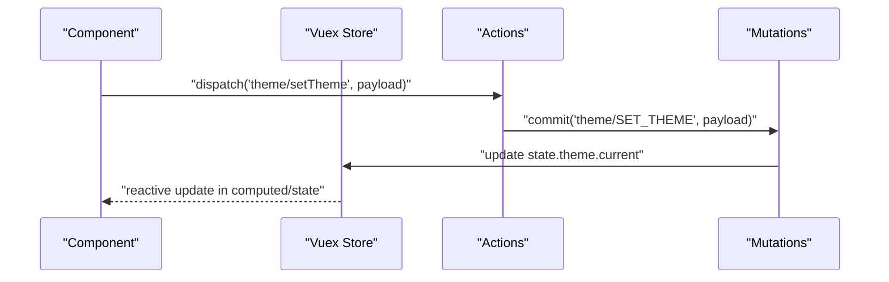
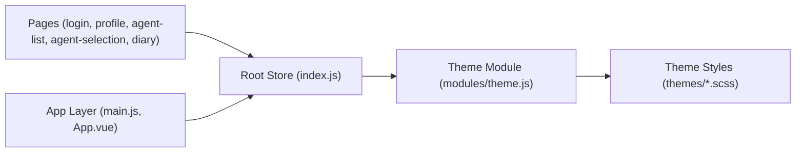

# State Management

<cite>
**Referenced Files in This Document**
- [index.js](file://docs/xiaolu-mini/store/index.js)
- [theme.js](file://docs/xiaolu-mini/store/modules/theme.js)
- [main.js](file://docs/xiaolu-mini/main.js)
- [App.vue](file://docs/xiaolu-mini/App.vue)
- [login.vue](file://docs/xiaolu-mini/pages/login/login.vue)
- [profile.vue](file://docs/xiaolu-mini/pages/profile/profile.vue)
- [agent-list.vue](file://docs/xiaolu-mini/pages/agent-list/agent-list.vue)
- [agent-selection.vue](file://docs/xiaolu-mini/pages/agent-selection/agent-selection.vue)
- [diary.vue](file://docs/xiaolu-mini/pages/diary/diary.vue)
- [theme.js](file://docs/xiaolu-mini/mixins/theme.js)
- [index.scss](file://docs/xiaolu-mini/themes/index.scss)
- [blue.scss](file://docs/xiaolu-mini/themes/blue.scss)
- [green.scss](file://docs/xiaolu-mini/themes/green.scss)
- [cyberpunk.scss](file://docs/xiaolu-mini/themes/cyberpunk.scss)
</cite>

## Table of Contents
1. [Introduction](#introduction)
2. [Project Structure](#project-structure)
3. [Core Components](#core-components)
4. [Architecture Overview](#architecture-overview)
5. [Detailed Component Analysis](#detailed-component-analysis)
6. [Dependency Analysis](#dependency-analysis)
7. [Performance Considerations](#performance-considerations)
8. [Troubleshooting Guide](#troubleshooting-guide)
9. [Conclusion](#conclusion)

## Introduction
This document describes the state management architecture for the UniApp-based frontend of the application. It focuses on the Vuex store design, module organization, and state mutation patterns. It also explains theme state management, device state tracking, and user session persistence. Guidance is provided for accessing store state in components, dispatching actions, implementing reactive UI updates, persisting state across browser refreshes, resetting state, and debugging state-related issues.

## Project Structure
The state management is implemented using Vuex within a UniApp project. The store is organized with a root index and a dedicated theme module. Components are organized under pages, and theme styles are modularized via SCSS.

**Diagram sources**
- [index.js](file://docs/xiaolu-mini/store/index.js)
- [theme.js](file://docs/xiaolu-mini/store/modules/theme.js)
- [main.js](file://docs/xiaolu-mini/main.js)
- [App.vue](file://docs/xiaolu-mini/App.vue)
- [login.vue](file://docs/xiaolu-mini/pages/login/login.vue)
- [profile.vue](file://docs/xiaolu-mini/pages/profile/profile.vue)
- [agent-list.vue](file://docs/xiaolu-mini/pages/agent-list/agent-list.vue)
- [agent-selection.vue](file://docs/xiaolu-mini/pages/agent-selection/agent-selection.vue)
- [diary.vue](file://docs/xiaolu-mini/pages/diary/diary.vue)
- [index.scss](file://docs/xiaolu-mini/themes/index.scss)
- [blue.scss](file://docs/xiaolu-mini/themes/blue.scss)
- [green.scss](file://docs/xiaolu-mini/themes/green.scss)
- [cyberpunk.scss](file://docs/xiaolu-mini/themes/cyberpunk.scss)

**Section sources**
- [index.js](file://docs/xiaolu-mini/store/index.js)
- [theme.js](file://docs/xiaolu-mini/store/modules/theme.js)
- [main.js](file://docs/xiaolu-mini/main.js)
- [App.vue](file://docs/xiaolu-mini/App.vue)

## Core Components
- Root Store: Initializes the Vuex store with modules and plugins. It exposes state, getters, actions, and mutations for global consumption.
- Theme Module: Encapsulates theme-related state, getters, mutations, and actions for switching and persisting themes.
- Components: Pages such as login, profile, agent-list, agent-selection, and diary consume store state and dispatch actions to update it.
- App Layer: The main entry initializes the app and mounts the root Vue instance, connecting the store to the component tree.
- Theme Styles: Modular SCSS files define theme variants and are applied conditionally based on store state.

Key responsibilities:
- Centralized state management for theme selection and persistence.
- Reactive UI updates triggered by state changes.
- Cross-page state synchronization for theme preferences.

**Section sources**
- [index.js](file://docs/xiaolu-mini/store/index.js)
- [theme.js](file://docs/xiaolu-mini/store/modules/theme.js)
- [main.js](file://docs/xiaolu-mini/main.js)
- [App.vue](file://docs/xiaolu-mini/App.vue)

## Architecture Overview
The store architecture follows a unidirectional data flow:
- Components dispatch actions to request state changes.
- Actions commit mutations to modify state.
- Mutations synchronously update state.
- Getters compute derived state for components.
- Components re-render reactively when state changes.

**Diagram sources**
- [index.js](file://docs/xiaolu-mini/store/index.js)
- [theme.js](file://docs/xiaolu-mini/store/modules/theme.js)

## Detailed Component Analysis

### Root Store (index.js)
- Purpose: Creates the Vuex store instance, registers modules, and applies plugins for persistence and development tools.
- Modules: Registers the theme module under the namespace "theme".
- Plugins: Includes persistence plugin to save and restore state across sessions.
- Exposed APIs: Provides accessors for state, getters, actions, and mutations via the store instance.

Usage patterns:
- Access theme state: Use store.state.theme.current.
- Dispatch theme actions: Use store.dispatch('theme/setTheme', payload).
- Commit theme mutations: Use store.commit('theme/SET_THEME', payload).

**Section sources**
- [index.js](file://docs/xiaolu-mini/store/index.js)

### Theme Module (modules/theme.js)
- State: Holds the current theme identifier.
- Getters: Computes derived theme-related values (e.g., active theme name).
- Mutations: Synchronously updates the current theme.
- Actions: Asynchronously handles theme switching, persists the selected theme, and triggers UI updates.

State mutation pattern:
- SET_THEME mutation updates the theme atomically.
- setTheme action validates input, commits mutation, and persists to storage.

Reactive UI integration:
- Components access store.state.theme.current to apply theme-specific styles.
- Changes propagate automatically due to Vuex reactivity.

**Section sources**
- [theme.js](file://docs/xiaolu-mini/store/modules/theme.js)

### Theme Mixin and Styles (mixins/theme.js, themes/*.scss)
- Theme Mixin: Provides reusable logic for applying theme classes or computed styles across components.
- Theme Styles: Defines color palettes and style variants for blue, green, and cyberpunk themes, imported via themes/index.scss.

Integration:
- Components import the theme mixin and SCSS to render theme-consistent UI.
- Theme module state drives which variant is active.

**Section sources**
- [theme.js](file://docs/xiaolu-mini/mixins/theme.js)
- [index.scss](file://docs/xiaolu-mini/themes/index.scss)
- [blue.scss](file://docs/xiaolu-mini/themes/blue.scss)
- [green.scss](file://docs/xiaolu-mini/themes/green.scss)
- [cyberpunk.scss](file://docs/xiaolu-mini/themes/cyberpunk.scss)

### Component Examples

#### Login Page (pages/login/login.vue)
- Accesses store state to determine initial theme or user context.
- Dispatches actions to update theme or initiate authentication-related state changes.
- Reacts to theme changes to adjust form styling or layout.

Implementation notes:
- Use mapState/mapGetters for concise access to store state.
- Use mapActions to bind action handlers to UI events.

**Section sources**
- [login.vue](file://docs/xiaolu-mini/pages/login/login.vue)

#### Profile Page (pages/profile/profile.vue)
- Displays user profile information sourced from store.
- Allows theme switching via dispatched actions.
- Persists theme preference automatically through the theme module.

**Section sources**
- [profile.vue](file://docs/xiaolu-mini/pages/profile/profile.vue)

#### Agent List and Selection (pages/agent-list/agent-list.vue, pages/agent-selection/agent-selection.vue)
- Navigates between lists and selections while maintaining theme consistency.
- Uses theme state to apply appropriate styles to list items and selection indicators.

**Section sources**
- [agent-list.vue](file://docs/xiaolu-mini/pages/agent-list/agent-list.vue)
- [agent-selection.vue](file://docs/xiaolu-mini/pages/agent-selection/agent-selection.vue)

#### Diary Page (pages/diary/diary.vue)
- Renders diary entries with theme-appropriate visuals.
- Dispatches actions to update diary-related state and reflects changes reactively.

**Section sources**
- [diary.vue](file://docs/xiaolu-mini/pages/diary/diary.vue)

### State Persistence Across Browser Refreshes
- Persistence Plugin: The root store includes a persistence plugin that serializes store state and restores it on initialization.
- Theme Persistence: The theme module writes the selected theme to persistent storage during mutations, ensuring the theme remains consistent after reloads.
- Session Persistence: User session state can be persisted similarly, enabling seamless continuation across sessions.

Best practices:
- Ensure sensitive data is encrypted before persisting.
- Use selective persistence to avoid storing large or volatile data.

**Section sources**
- [index.js](file://docs/xiaolu-mini/store/index.js)
- [theme.js](file://docs/xiaolu-mini/store/modules/theme.js)

### State Reset Procedures
- Reset Theme: Dispatch the theme module's reset action to revert to a default theme.
- Reset Store: Invoke a store-level reset action that clears module state and reinitializes defaults.
- UI Reset: Components should reinitialize local state and rebind watchers after store reset.

**Section sources**
- [theme.js](file://docs/xiaolu-mini/store/modules/theme.js)
- [index.js](file://docs/xiaolu-mini/store/index.js)

### Debugging Techniques for State-Related Issues
- Enable DevTools: Use Vue DevTools to inspect store state, actions, and mutations.
- Logging: Add logging in actions and mutations to trace state transitions.
- Breakpoints: Set breakpoints in action handlers to inspect payloads and pre/post state.
- Snapshot Testing: Periodically snapshot store state to compare differences across runs.

**Section sources**
- [index.js](file://docs/xiaolu-mini/store/index.js)
- [theme.js](file://docs/xiaolu-mini/store/modules/theme.js)

## Dependency Analysis
The store depends on:
- Root store for module registration and plugin configuration.
- Theme module for theme state and persistence.
- Components for dispatching actions and consuming state.
- Theme styles for visual rendering.

**Diagram sources**
- [index.js](file://docs/xiaolu-mini/store/index.js)
- [theme.js](file://docs/xiaolu-mini/store/modules/theme.js)
- [main.js](file://docs/xiaolu-mini/main.js)
- [App.vue](file://docs/xiaolu-mini/App.vue)
- [index.scss](file://docs/xiaolu-mini/themes/index.scss)

**Section sources**
- [index.js](file://docs/xiaolu-mini/store/index.js)
- [theme.js](file://docs/xiaolu-mini/store/modules/theme.js)
- [main.js](file://docs/xiaolu-mini/main.js)
- [App.vue](file://docs/xiaolu-mini/App.vue)

## Performance Considerations
- Minimize Re-renders: Use getters to compute derived state and avoid unnecessary recomputation.
- Batch Updates: Group related mutations to reduce re-render cycles.
- Lazy Loading: Load theme assets on demand to improve initial load performance.
- Avoid Large Payloads: Persist only essential state to prevent bloated storage and slow restoration.

## Troubleshooting Guide
Common issues and resolutions:
- Theme not persisting: Verify the persistence plugin is enabled and the theme mutation writes to storage.
- UI not updating: Ensure components use reactive accessors (mapState/mapGetters) and that mutations are committed synchronously.
- Action not firing: Confirm action names match module namespace and that dispatch targets the correct module.
- Memory leaks: Avoid retaining references to store instances; rely on Vue's lifecycle hooks for cleanup.

**Section sources**
- [index.js](file://docs/xiaolu-mini/store/index.js)
- [theme.js](file://docs/xiaolu-mini/store/modules/theme.js)

## Conclusion
The Vuex-based state management system provides a centralized, predictable way to manage theme state, device state tracking, and user session persistence. By organizing state into modules, using clear actions and mutations, and leveraging persistence, the application achieves consistent behavior across components and resilient state continuity across sessions. Following the recommended patterns and debugging techniques ensures maintainable and reliable state handling.