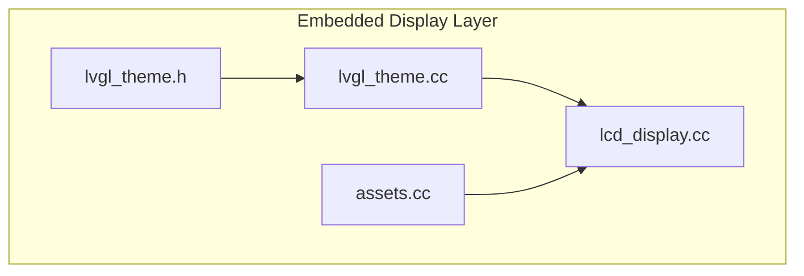
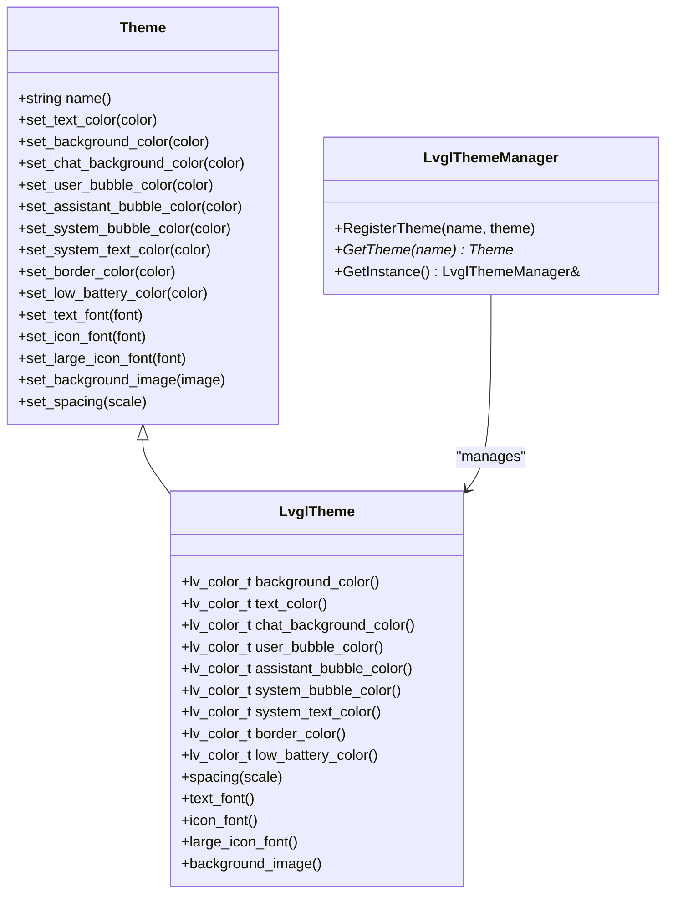
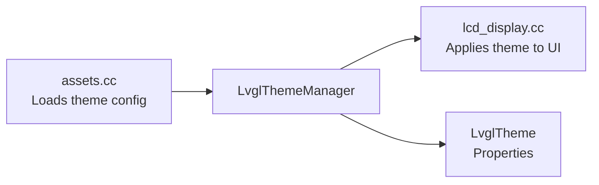

# Theme System

<cite>
**Referenced Files in This Document**
- [lvgl_theme.h](file://main/display/lvgl_display/lvgl_theme.h)
- [lvgl_theme.cc](file://main/display/lvgl_display/lvgl_theme.cc)
- [lcd_display.cc](file://main/display/lcd_display.cc)
- [assets.cc](file://main/assets.cc)
</cite>

## Table of Contents
1. [Introduction](#introduction)
2. [Project Structure](#project-structure)
3. [Core Components](#core-components)
4. [Architecture Overview](#architecture-overview)
5. [Detailed Component Analysis](#detailed-component-analysis)
6. [Dependency Analysis](#dependency-analysis)
7. [Performance Considerations](#performance-considerations)
8. [Troubleshooting Guide](#troubleshooting-guide)
9. [Conclusion](#conclusion)

## Introduction
This document describes the embedded theme system used in the firmware for LVGL-based displays. It covers the theme architecture, color property management, runtime theme registration and selection, and how theme properties are applied to UI elements. The system supports multiple built-in themes and allows dynamic theme switching at runtime. It also documents how theme properties are loaded from asset configuration and applied to various UI components such as backgrounds, text, and status indicators.

## Project Structure
The theme system resides in the embedded display subsystem and is implemented in C++ with LVGL integration. Key files include:
- Theme interface and manager declarations
- Theme manager implementation
- Theme registration and application in display initialization
- Runtime theme property loading from assets

**Diagram sources**
- [lvgl_theme.h:14-94](file://main/display/lvgl_display/lvgl_theme.h#L14-L94)
- [lvgl_theme.cc:1-30](file://main/display/lvgl_display/lvgl_theme.cc#L1-L30)
- [lcd_display.cc:45-1201](file://main/display/lcd_display.cc#L45-L1201)
- [assets.cc:289-311](file://main/assets.cc#L289-L311)

**Section sources**
- [lvgl_theme.h:14-94](file://main/display/lvgl_display/lvgl_theme.h#L14-L94)
- [lvgl_theme.cc:1-30](file://main/display/lvgl_display/lvgl_theme.cc#L1-L30)
- [lcd_display.cc:45-1201](file://main/display/lcd_display.cc#L45-L1201)
- [assets.cc:289-311](file://main/assets.cc#L289-L311)

## Core Components
- Theme interface and properties: Defines color and font properties used by the LVGL theme.
- Theme manager: Provides registration and retrieval of named themes.
- Theme instances: Built-in themes registered during display initialization.
- Asset-driven theme configuration: Loads theme colors and images from configuration data.

Key responsibilities:
- Expose theme properties (colors, fonts, spacing) via getters.
- Manage a registry of available themes by name.
- Apply theme properties to LVGL objects at runtime.
- Support runtime updates by selecting a registered theme.

**Section sources**
- [lvgl_theme.h:14-94](file://main/display/lvgl_display/lvgl_theme.h#L14-L94)
- [lvgl_theme.cc:17-30](file://main/display/lvgl_display/lvgl_theme.cc#L17-L30)
- [lcd_display.cc:45-63](file://main/display/lcd_display.cc#L45-L63)
- [assets.cc:289-311](file://main/assets.cc#L289-L311)

## Architecture Overview
The theme system follows a simple but effective pattern:
- Themes encapsulate visual properties (colors, fonts, spacing).
- A singleton manager registers and retrieves themes by name.
- Display initialization creates built-in themes and registers them.
- Runtime selection applies the chosen theme to UI elements.
- Asset configuration can override theme properties at startup.

**Diagram sources**
- [lvgl_theme.h:14-94](file://main/display/lvgl_display/lvgl_theme.h#L14-L94)

## Detailed Component Analysis

### Theme Manager
- Purpose: Central registry for named themes.
- Operations:
  - Register a theme with a unique name.
  - Retrieve a theme by name.
  - Provide a global singleton instance.

Behavior:
- Maintains a map of theme name to theme pointer.
- Returns null if a requested theme is not found.

**Section sources**
- [lvgl_theme.cc:20-30](file://main/display/lvgl_display/lvgl_theme.cc#L20-L30)
- [lvgl_theme.h:79-94](file://main/display/lvgl_display/lvgl_theme.h#L79-L94)

### Theme Properties and Application
- Properties exposed by themes include:
  - Background and text colors
  - Chat bubble colors (user, assistant, system)
  - Border and low battery colors
  - Fonts for text, icons, and large icons
  - Spacing scale factor
  - Optional background image
- Application:
  - During display initialization, built-in themes are created and registered.
  - The selected theme is retrieved from persistent settings and applied to UI containers and labels.
  - Top bar and status labels adopt theme colors and opacities.

**Section sources**
- [lvgl_theme.h:20-36](file://main/display/lvgl_display/lvgl_theme.h#L20-L36)
- [lcd_display.cc:45-63](file://main/display/lcd_display.cc#L45-L63)
- [lcd_display.cc:74-1201](file://main/display/lcd_display.cc#L74-L1201)

### Color Parsing Utility
- Converts hex color strings (e.g., "#RRGGBB") into LVGL color types.
- Used when applying colors from asset configuration.

**Section sources**
- [lvgl_theme.cc:6-15](file://main/display/lvgl_display/lvgl_theme.cc#L6-L15)

### Asset-Driven Theme Configuration
- Theme colors and background images can be loaded from configuration JSON.
- Supported keys include text color, background color, and background image.
- On successful asset lookup, the theme’s properties are updated accordingly.

**Section sources**
- [assets.cc:289-311](file://main/assets.cc#L289-L311)

### Built-in Theme Registration
- Light and dark themes are created during display initialization.
- They are registered with the theme manager and later selectable by name.

**Section sources**
- [lcd_display.cc:45-63](file://main/display/lcd_display.cc#L45-L63)

### Runtime Theme Switching
- The current theme is selected from persistent settings.
- After selection, theme properties are applied to the screen container and various UI elements.

**Section sources**
- [lcd_display.cc:74-1201](file://main/display/lcd_display.cc#L74-L1201)

## Dependency Analysis
The theme system has minimal external dependencies and cleanly separates concerns:
- Theme defines the contract for visual properties.
- LvglTheme implements the contract for LVGL-specific types.
- LvglThemeManager centralizes theme lifecycle and selection.
- Display code depends on the manager to apply the selected theme.
- Assets code influences theme properties at startup.

**Diagram sources**
- [assets.cc:289-311](file://main/assets.cc#L289-L311)
- [lvgl_theme.cc:20-30](file://main/display/lvgl_display/lvgl_theme.cc#L20-L30)
- [lcd_display.cc:74-1201](file://main/display/lcd_display.cc#L74-L1201)

**Section sources**
- [lvgl_theme.cc:20-30](file://main/display/lvgl_display/lvgl_theme.cc#L20-L30)
- [assets.cc:289-311](file://main/assets.cc#L289-L311)
- [lcd_display.cc:74-1201](file://main/display/lcd_display.cc#L74-L1201)

## Performance Considerations
- Theme property caching: Theme getters return cached values, minimizing repeated computation.
- Efficient color parsing: Hex-to-color conversion is O(1) per color.
- Minimal allocations: Theme manager stores pointers; assets allocate images only when present.
- UI updates: Applying theme properties to LVGL objects is batched during initialization and on selection changes.

## Troubleshooting Guide
Common issues and resolutions:
- Theme not found by name:
  - Verify the theme was registered during initialization.
  - Check the theme name spelling and case.
- Colors not applied:
  - Ensure asset configuration keys match expected names.
  - Confirm the asset lookup succeeds and background image path exists.
- UI elements retain old colors:
  - Re-apply the selected theme after changing settings.
  - Confirm the theme manager returns a valid theme pointer.

**Section sources**
- [lvgl_theme.cc:20-26](file://main/display/lvgl_display/lvgl_theme.cc#L20-L26)
- [assets.cc:289-311](file://main/assets.cc#L289-L311)
- [lcd_display.cc:74-1201](file://main/display/lcd_display.cc#L74-L1201)

## Conclusion
The embedded theme system provides a clean separation between theme definition, registration, and application. It supports built-in themes, runtime selection, and asset-driven customization. By leveraging LVGL’s native color and font APIs, it ensures efficient rendering while maintaining flexibility for future enhancements such as additional theme variants or dynamic property updates.