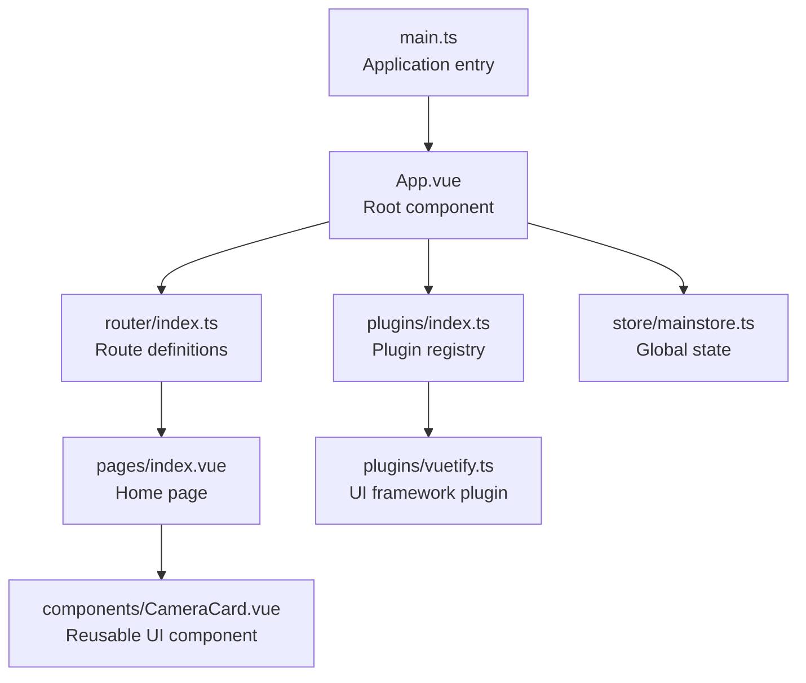
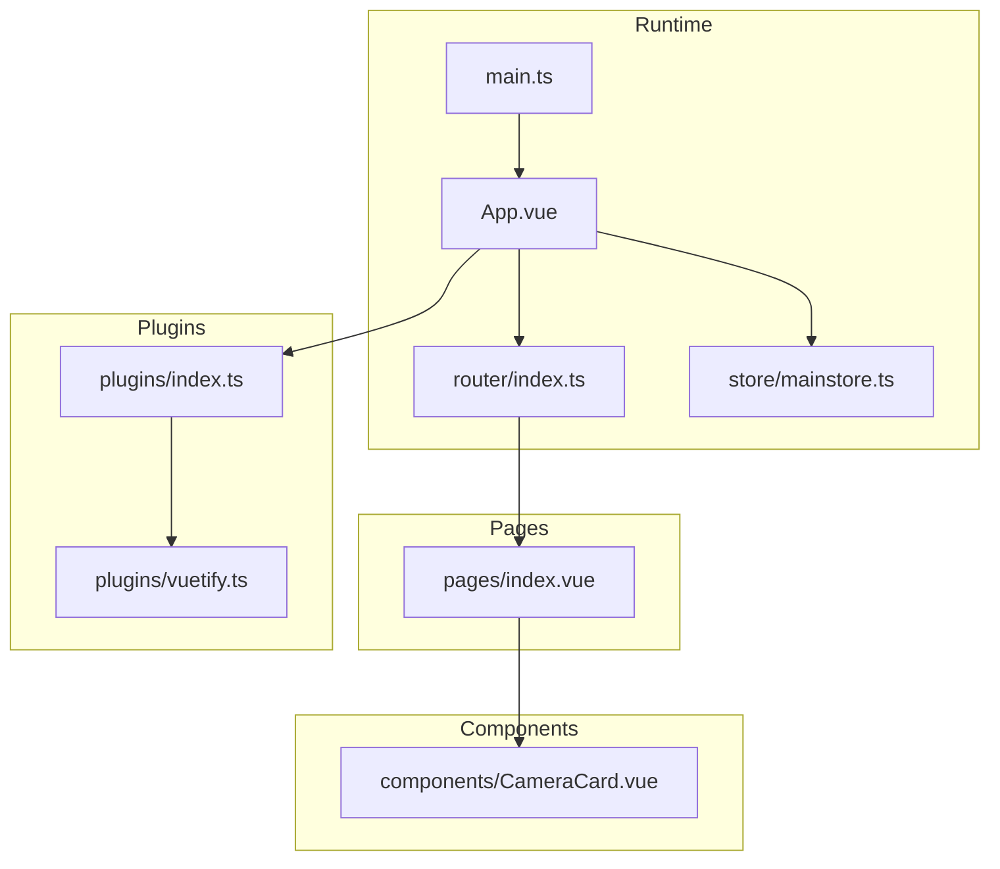
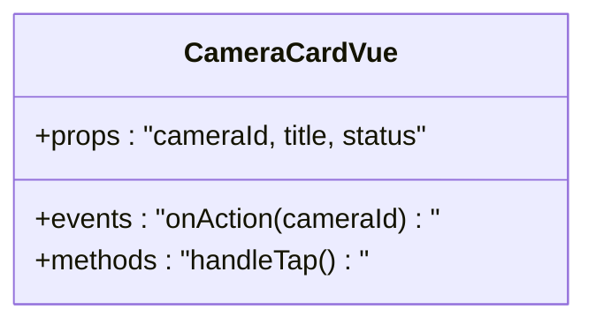
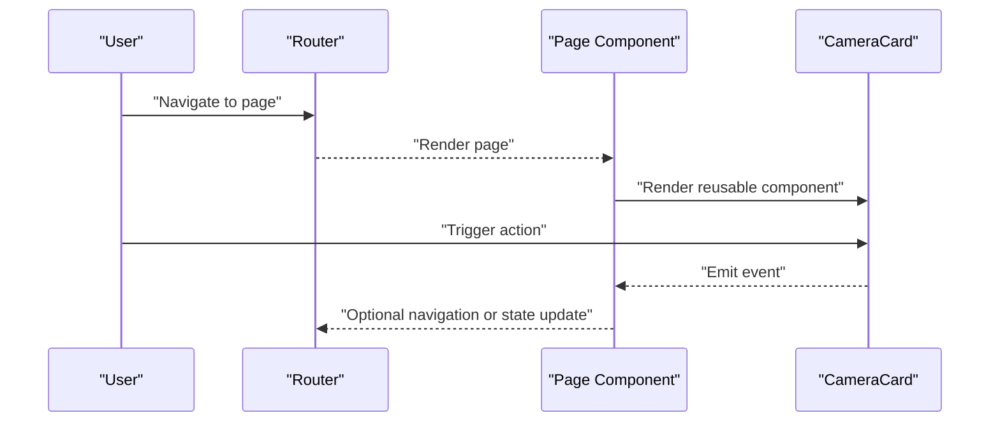
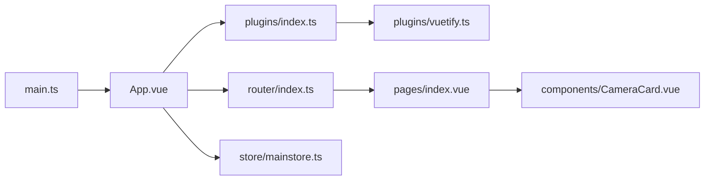

# UI Components and Pages

<cite>
**Referenced Files in This Document**
- [App.vue](file://managed_components/espressif__esp_video/examples/simple_video_server/frontend/src/App.vue)
- [index.vue](file://managed_components/espressif__esp_video/examples/simple_video_server/frontend/src/pages/index.vue)
- [CameraCard.vue](file://managed_components/espressif__esp_video/examples/simple_video_server/frontend/src/components/CameraCard.vue)
- [router/index.ts](file://managed_components/espressif__esp_video/examples/simple_video_server/frontend/src/router/index.ts)
- [plugins/index.ts](file://managed_components/espressif__esp_video/examples/simple_video_server/frontend/src/plugins/index.ts)
- [store/mainstore.ts](file://managed_components/espressif__esp_video/examples/simple_video_server/frontend/src/store/mainstore.ts)
- [vuetify.ts](file://managed_components/espressif__esp_video/examples/simple_video_server/frontend/src/plugins/vuetify.ts)
- [main.ts](file://managed_components/espressif__esp_video/examples/simple_video_server/frontend/src/main.ts)
</cite>

## Table of Contents
1. [Introduction](#introduction)
2. [Project Structure](#project-structure)
3. [Core Components](#core-components)
4. [Architecture Overview](#architecture-overview)
5. [Detailed Component Analysis](#detailed-component-analysis)
6. [Dependency Analysis](#dependency-analysis)
7. [Performance Considerations](#performance-considerations)
8. [Troubleshooting Guide](#troubleshooting-guide)
9. [Conclusion](#conclusion)

## Introduction
This document describes the UI components and page structure for the uni-app frontend used in the video server example. It focuses on the application shell, routing, navigation patterns, reusable components, and integration with a UI framework plugin. The goal is to explain how pages are organized, how components are composed, and how to maintain consistent UI patterns across platforms while ensuring responsive behavior and cross-platform compatibility for iOS and Android.

## Project Structure
The uni-app frontend is structured around a small set of core files:
- Application shell and entry point
- Page components
- Reusable UI components
- Routing and plugin integrations
- Global state management

**Diagram sources**
- [main.ts](file://managed_components/espressif__esp_video/examples/simple_video_server/frontend/src/main.ts)
- [App.vue](file://managed_components/espressif__esp_video/examples/simple_video_server/frontend/src/App.vue)
- [router/index.ts](file://managed_components/espressif__esp_video/examples/simple_video_server/frontend/src/router/index.ts)
- [index.vue](file://managed_components/espressif__esp_video/examples/simple_video_server/frontend/src/pages/index.vue)
- [plugins/index.ts](file://managed_components/espressif__esp_video/examples/simple_video_server/frontend/src/plugins/index.ts)
- [vuetify.ts](file://managed_components/espressif__esp_video/examples/simple_video_server/frontend/src/plugins/vuetify.ts)
- [store/mainstore.ts](file://managed_components/espressif__esp_video/examples/simple_video_server/frontend/src/store/mainstore.ts)
- [CameraCard.vue](file://managed_components/espressif__esp_video/examples/simple_video_server/frontend/src/components/CameraCard.vue)

**Section sources**
- [main.ts](file://managed_components/espressif__esp_video/examples/simple_video_server/frontend/src/main.ts)
- [App.vue](file://managed_components/espressif__esp_video/examples/simple_video_server/frontend/src/App.vue)
- [router/index.ts](file://managed_components/espressif__esp_video/examples/simple_video_server/frontend/src/router/index.ts)
- [index.vue](file://managed_components/espressif__esp_video/examples/simple_video_server/frontend/src/pages/index.vue)
- [plugins/index.ts](file://managed_components/espressif__esp_video/examples/simple_video_server/frontend/src/plugins/index.ts)
- [vuetify.ts](file://managed_components/espressif__esp_video/examples/simple_video_server/frontend/src/plugins/vuetify.ts)
- [store/mainstore.ts](file://managed_components/espressif__esp_video/examples/simple_video_server/frontend/src/store/mainstore.ts)
- [CameraCard.vue](file://managed_components/espressif__esp_video/examples/simple_video_server/frontend/src/components/CameraCard.vue)

## Core Components
- Application shell: The root component sets up the app lifecycle and hosts routes.
- Home page: A minimal page component demonstrating content rendering.
- Reusable UI component: A camera card component designed for consistent presentation and interaction.
- Routing: Centralized route definitions for navigation.
- Plugin system: Registry for optional UI framework integration.
- Global state: A simple store module for shared application state.

Key responsibilities:
- App.vue: Declares the application shell and integrates plugins and router.
- index.vue: Renders the primary page content.
- CameraCard.vue: Encapsulates camera-related UI and interactions.
- router/index.ts: Defines navigable routes.
- plugins/index.ts: Registers plugins such as Vuetify.
- store/mainstore.ts: Provides global state access.

**Section sources**
- [App.vue](file://managed_components/espressif__esp_video/examples/simple_video_server/frontend/src/App.vue)
- [index.vue](file://managed_components/espressif__esp_video/examples/simple_video_server/frontend/src/pages/index.vue)
- [CameraCard.vue](file://managed_components/espressif__esp_video/examples/simple_video_server/frontend/src/components/CameraCard.vue)
- [router/index.ts](file://managed_components/espressif__esp_video/examples/simple_video_server/frontend/src/router/index.ts)
- [plugins/index.ts](file://managed_components/espressif__esp_video/examples/simple_video_server/frontend/src/plugins/index.ts)
- [store/mainstore.ts](file://managed_components/espressif__esp_video/examples/simple_video_server/frontend/src/store/mainstore.ts)

## Architecture Overview
The frontend follows a layered architecture:
- Entry point initializes the app and mounts the root component.
- Root component manages plugins and routes.
- Pages are rendered based on current route.
- Reusable components encapsulate UI concerns and are composed within pages.
- Optional UI framework plugin extends component capabilities.

**Diagram sources**
- [main.ts](file://managed_components/espressif__esp_video/examples/simple_video_server/frontend/src/main.ts)
- [App.vue](file://managed_components/espressif__esp_video/examples/simple_video_server/frontend/src/App.vue)
- [router/index.ts](file://managed_components/espressif__esp_video/examples/simple_video_server/frontend/src/router/index.ts)
- [store/mainstore.ts](file://managed_components/espressif__esp_video/examples/simple_video_server/frontend/src/store/mainstore.ts)
- [index.vue](file://managed_components/espressif__esp_video/examples/simple_video_server/frontend/src/pages/index.vue)
- [plugins/index.ts](file://managed_components/espressif__esp_video/examples/simple_video_server/frontend/src/plugins/index.ts)
- [vuetify.ts](file://managed_components/espressif__esp_video/examples/simple_video_server/frontend/src/plugins/vuetify.ts)
- [CameraCard.vue](file://managed_components/espressif__esp_video/examples/simple_video_server/frontend/src/components/CameraCard.vue)

## Detailed Component Analysis

### Application Shell and Entry Point
- The entry point initializes the application and mounts the root component.
- The root component integrates plugins and routes, serving as the container for all pages.

Implementation highlights:
- Entry point wiring and mounting logic.
- Root component composition and plugin registration.

**Section sources**
- [main.ts](file://managed_components/espressif__esp_video/examples/simple_video_server/frontend/src/main.ts)
- [App.vue](file://managed_components/espressif__esp_video/examples/simple_video_server/frontend/src/App.vue)

### Home Page
- The home page demonstrates basic content rendering and serves as the primary route target.
- It can host reusable components and act as a container for page-specific logic.

Composition patterns:
- Use the root component’s slot/container to render page content.
- Compose reusable components inside the page for consistent UI.

**Section sources**
- [index.vue](file://managed_components/espressif__esp_video/examples/simple_video_server/frontend/src/pages/index.vue)

### Reusable UI Component: Camera Card
- Purpose: Present camera-related information and actions in a consistent way.
- Composition: Designed as a self-contained unit that can be reused across pages.
- Interaction: Exposes props and events to integrate with parent pages and global state.

**Diagram sources**
- [CameraCard.vue](file://managed_components/espressif__esp_video/examples/simple_video_server/frontend/src/components/CameraCard.vue)

**Section sources**
- [CameraCard.vue](file://managed_components/espressif__esp_video/examples/simple_video_server/frontend/src/components/CameraCard.vue)

### Routing and Navigation Patterns
- Routes are centralized to ensure predictable navigation and easy maintenance.
- Navigation patterns should remain consistent across pages to improve usability.

**Diagram sources**
- [router/index.ts](file://managed_components/espressif__esp_video/examples/simple_video_server/frontend/src/router/index.ts)
- [index.vue](file://managed_components/espressif__esp_video/examples/simple_video_server/frontend/src/pages/index.vue)
- [CameraCard.vue](file://managed_components/espressif__esp_video/examples/simple_video_server/frontend/src/components/CameraCard.vue)

**Section sources**
- [router/index.ts](file://managed_components/espressif__esp_video/examples/simple_video_server/frontend/src/router/index.ts)

### Plugin System and UI Framework Integration
- Plugins are registered centrally to avoid duplication and ensure consistent initialization.
- The UI framework plugin can extend component capabilities and provide standardized UI primitives.

Integration points:
- Plugin registry imports and initialization.
- UI framework plugin configuration and availability.

**Section sources**
- [plugins/index.ts](file://managed_components/espressif__esp_video/examples/simple_video_server/frontend/src/plugins/index.ts)
- [vuetify.ts](file://managed_components/espressif__esp_video/examples/simple_video_server/frontend/src/plugins/vuetify.ts)

### Global State Management
- A simple store module provides shared state access across components.
- State updates should be explicit and scoped to minimize coupling.

Usage patterns:
- Access state in pages and components.
- Dispatch actions or mutations to update shared state.

**Section sources**
- [store/mainstore.ts](file://managed_components/espressif__esp_video/examples/simple_video_server/frontend/src/store/mainstore.ts)

## Dependency Analysis
The frontend exhibits low coupling and high cohesion:
- Entry point depends on the root component.
- Root component depends on router, plugins, and store.
- Pages depend on router and reusable components.
- Reusable components depend on props/events contracts and global state.

**Diagram sources**
- [main.ts](file://managed_components/espressif__esp_video/examples/simple_video_server/frontend/src/main.ts)
- [App.vue](file://managed_components/espressif__esp_video/examples/simple_video_server/frontend/src/App.vue)
- [router/index.ts](file://managed_components/espressif__esp_video/examples/simple_video_server/frontend/src/router/index.ts)
- [plugins/index.ts](file://managed_components/espressif__esp_video/examples/simple_video_server/frontend/src/plugins/index.ts)
- [vuetify.ts](file://managed_components/espressif__esp_video/examples/simple_video_server/frontend/src/plugins/vuetify.ts)
- [store/mainstore.ts](file://managed_components/espressif__esp_video/examples/simple_video_server/frontend/src/store/mainstore.ts)
- [index.vue](file://managed_components/espressif__esp_video/examples/simple_video_server/frontend/src/pages/index.vue)
- [CameraCard.vue](file://managed_components/espressif__esp_video/examples/simple_video_server/frontend/src/components/CameraCard.vue)

**Section sources**
- [main.ts](file://managed_components/espressif__esp_video/examples/simple_video_server/frontend/src/main.ts)
- [App.vue](file://managed_components/espressif__esp_video/examples/simple_video_server/frontend/src/App.vue)
- [router/index.ts](file://managed_components/espressif__esp_video/examples/simple_video_server/frontend/src/router/index.ts)
- [plugins/index.ts](file://managed_components/espressif__esp_video/examples/simple_video_server/frontend/src/plugins/index.ts)
- [vuetify.ts](file://managed_components/espressif__esp_video/examples/simple_video_server/frontend/src/plugins/vuetify.ts)
- [store/mainstore.ts](file://managed_components/espressif__esp_video/examples/simple_video_server/frontend/src/store/mainstore.ts)
- [index.vue](file://managed_components/espressif__esp_video/examples/simple_video_server/frontend/src/pages/index.vue)
- [CameraCard.vue](file://managed_components/espressif__esp_video/examples/simple_video_server/frontend/src/components/CameraCard.vue)

## Performance Considerations
- Keep component props shallow and typed to reduce re-render overhead.
- Use lazy loading for heavy components or images within pages.
- Minimize global state updates to only necessary changes.
- Prefer functional components where appropriate for simpler logic and lower memory footprint.
- Defer non-critical plugin initialization until after the initial render.

## Troubleshooting Guide
Common issues and resolutions:
- Route not updating: Verify router configuration and ensure the page component is mounted under the correct route.
- Plugin not applied: Confirm plugin registration order and initialization steps.
- Component not receiving props: Check prop definitions and event emissions in reusable components.
- State not updating: Ensure state updates are dispatched via the store module and that components subscribe to state changes.

**Section sources**
- [router/index.ts](file://managed_components/espressif__esp_video/examples/simple_video_server/frontend/src/router/index.ts)
- [plugins/index.ts](file://managed_components/espressif__esp_video/examples/simple_video_server/frontend/src/plugins/index.ts)
- [store/mainstore.ts](file://managed_components/espressif__esp_video/examples/simple_video_server/frontend/src/store/mainstore.ts)
- [CameraCard.vue](file://managed_components/espressif__esp_video/examples/simple_video_server/frontend/src/components/CameraCard.vue)

## Conclusion
The uni-app frontend follows a clean, modular structure with a clear separation of concerns. The root component orchestrates plugins and routing, pages compose reusable components, and global state supports shared data. By adhering to consistent navigation patterns, component contracts, and plugin integration, the application remains maintainable and scalable across iOS and Android deployments.