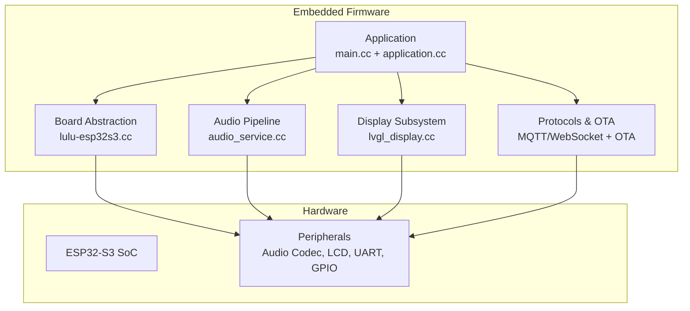
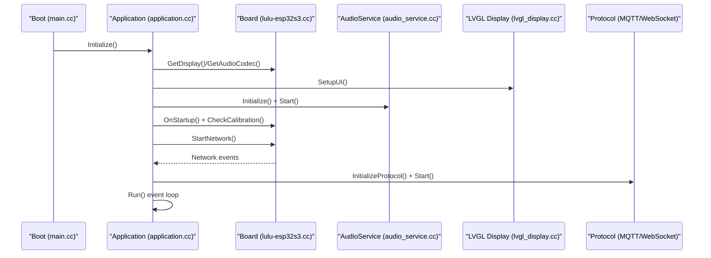
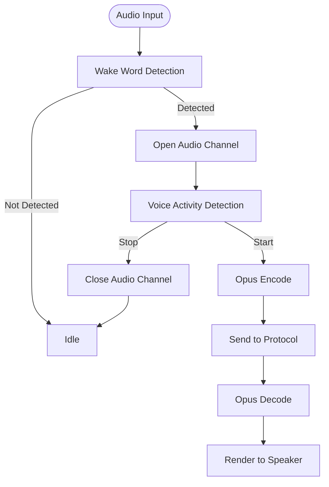
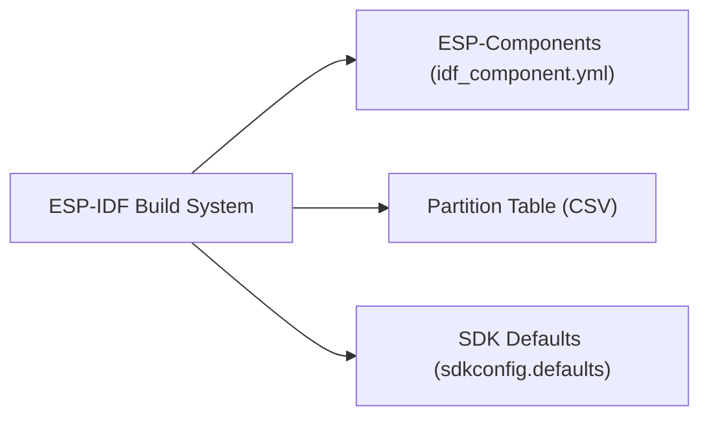

# Introduction and Purpose

<cite>
**Referenced Files in This Document**
- [README.md](file://README.md)
- [main.cc](file://main/main.cc)
- [application.cc](file://main/application.cc)
- [lulu-esp32s3.cc](file://main/boards/lulu-esp32s3/lulu-esp32s3.cc)
- [lvgl_display.cc](file://main/display/lvgl_display/lvgl_display.cc)
- [audio_service.cc](file://main/audio/audio_service.cc)
- [CMakeLists.txt](file://CMakeLists.txt)
- [sdkconfig.defaults](file://sdkconfig.defaults)
- [idf_component.yml](file://main/idf_component.yml)
- [config.h](file://main/boards/lulu-esp32s3/config.h)
- [RIG-Puppy-TestList.md](file://docs/RIG-Puppy-TestList.md)
</cite>

## Table of Contents
1. [Introduction](#introduction)
2. [Project Structure](#project-structure)
3. [Core Components](#core-components)
4. [Architecture Overview](#architecture-overview)
5. [Detailed Component Analysis](#detailed-component-analysis)
6. [Dependency Analysis](#dependency-analysis)
7. [Performance Considerations](#performance-considerations)
8. [Troubleshooting Guide](#troubleshooting-guide)
9. [Conclusion](#conclusion)

## Introduction
RIG-Puppy is an open-source embedded AI assistant built around a standard robot dog (XGO-style) to deliver an intelligent, expressive, and interactive companion. It transforms the robot dog into a capable conversational agent with voice interaction, facial expression playback, and autonomous movement, all running on a compact embedded platform.

Mission and core objectives:
- Voice-first interaction: Offline wake word detection, far-field voice capture, VAD-driven speech segmentation, and cloud-based ASR/TTS for natural dialogue.
- Expressive communication: Real-time EAF/LVGL-based facial animations and status indicators synchronized with conversation and system states.
- Autonomous motion: Precise 5-axis servo control, pre-defined actions, and IMU-assisted head-following behavior.
- Full offline capability: Local wake word detection and UI rendering, with optional cloud services for ASR/TTS and LLM orchestration.
- Educational empowerment: A practical, hands-on platform for embedded developers, robotics enthusiasts, and AI researchers to learn and experiment with real-time audio, display, motion control, and networking on constrained hardware.

Target audience:
- Embedded developers: Building real-time systems, managing audio/video pipelines, and optimizing resource-constrained environments.
- Robotics enthusiasts: Exploring locomotion control, sensor fusion, and expressive actuators in a fun, tangible form factor.
- AI researchers: Experimenting with speech processing, NLU/NLG, and multimodal interaction on edge devices.

Platform positioning:
- Open-source embedded AI assistant with a focus on accessibility and reproducibility.
- Designed for rapid prototyping and education, with modular components and clear separation of concerns across audio, display, motion, and networking.

## Project Structure
The repository is organized around a layered embedded architecture:
- Application layer orchestrates lifecycle, state transitions, and event-driven workflows.
- Board abstraction encapsulates hardware-specific drivers (display, audio codec, motors, sensors).
- Audio pipeline handles encoding, decoding, VAD, wake word detection, and streaming.
- Display subsystem renders UI, notifications, and animated expressions via LVGL.
- Protocols and OTA manage connectivity, device activation, and remote updates.
- Scripts and tools support asset packaging, model conversion, and firmware builds.

**Diagram sources**
- [main.cc:14-29](file://main/main.cc#L14-L29)
- [application.cc:62-178](file://main/application.cc#L62-L178)
- [lulu-esp32s3.cc:37-778](file://main/boards/lulu-esp32s3/lulu-esp32s3.cc#L37-L778)
- [audio_service.cc:62-200](file://main/audio/audio_service.cc#L62-L200)
- [lvgl_display.cc:18-200](file://main/display/lvgl_display/lvgl_display.cc#L18-L200)

**Section sources**
- [README.md:117-137](file://README.md#L117-L137)
- [CMakeLists.txt:10-14](file://CMakeLists.txt#L10-L14)
- [sdkconfig.defaults:18-20](file://sdkconfig.defaults#L18-L20)

## Core Components
- Application core: Initializes subsystems, manages device states, and coordinates audio, display, and protocol events.
- Board abstraction: Encapsulates display, audio codec, buttons, camera, servo control, and IMU; exposes standardized APIs for higher layers.
- Audio service: Provides Opus encode/decode, VAD, wake word detection, resampling, and audio I/O tasks.
- Display subsystem: LVGL-based UI with status bars, notifications, and animated expressions.
- Protocols and OTA: MQTT/WebSocket audio channels, device activation, and firmware upgrades.

Key capabilities highlighted by the codebase:
- Voice interaction: Wake word detection, VAD, ASR/TTS integration, and audio streaming.
- Facial expressions: EAF playback and emotion switching synchronized with conversation and system events.
- Motion control: 5-axis servo control, calibration, actions, and IMU-based head following.
- Networking: BluFi Wi-Fi provisioning, OTA, and device activation.

**Section sources**
- [application.cc:62-178](file://main/application.cc#L62-L178)
- [lulu-esp32s3.cc:37-778](file://main/boards/lulu-esp32s3/lulu-esp32s3.cc#L37-L778)
- [audio_service.cc:62-200](file://main/audio/audio_service.cc#L62-L200)
- [lvgl_display.cc:72-111](file://main/display/lvgl_display/lvgl_display.cc#L72-L111)

## Architecture Overview
The runtime architecture centers on a main event loop that reacts to audio events, network state changes, and device state transitions. The board abstraction isolates hardware specifics, while the audio and display subsystems provide modular services.

**Diagram sources**
- [main.cc:14-29](file://main/main.cc#L14-L29)
- [application.cc:62-178](file://main/application.cc#L62-L178)
- [lulu-esp32s3.cc:708-733](file://main/boards/lulu-esp32s3/lulu-esp32s3.cc#L708-L733)
- [audio_service.cc:125-200](file://main/audio/audio_service.cc#L125-L200)
- [lvgl_display.cc:18-41](file://main/display/lvgl_display/lvgl_display.cc#L18-L41)

## Detailed Component Analysis

### Hardware Platform: ESP32-S3
- MCU: ESP32-S3 (N16R8) with integrated PSRAM and Wi-Fi/Bluetooth.
- Storage: Flash partitioning tailored for assets and firmware.
- Peripherals: I2S audio interface, SPI LCD (GC9A01), UART for servo control, GPIO for buttons and laser, and optional camera.

**Section sources**
- [README.md:36-47](file://README.md#L36-L47)
- [sdkconfig.defaults:18-20](file://sdkconfig.defaults#L18-L20)
- [config.h:62-88](file://main/boards/lulu-esp32s3/config.h#L62-L88)

### Software Stack
- ESP-IDF: Build system, RTOS, and peripheral drivers.
- LVGL: Lightweight graphics library for UI and animated expressions.
- Audio: Opus codec, VAD, wake word detection, and resampling via ESP-Audio components.
- Protocols: MQTT/WebSocket for audio streaming and device control.
- Asset pipeline: SPIFFS/mmap assets for animations and sounds.

**Section sources**
- [CMakeLists.txt:8-10](file://CMakeLists.txt#L8-L10)
- [sdkconfig.defaults:47-82](file://sdkconfig.defaults#L47-L82)
- [idf_component.yml:34-67](file://main/idf_component.yml#L34-L67)

### Voice Interaction Pipeline
- Wake word detection and VAD drive conversation initiation and termination.
- Audio encoding/decoding with Opus, resampling to match codec capabilities.
- Streaming to MQTT/WebSocket audio channel for ASR/TTS and LLM orchestration.

**Diagram sources**
- [audio_service.cc:62-200](file://main/audio/audio_service.cc#L62-L200)
- [application.cc:235-241](file://main/application.cc#L235-L241)
- [application.cc:522-543](file://main/application.cc#L522-L543)

**Section sources**
- [audio_service.cc:62-200](file://main/audio/audio_service.cc#L62-L200)
- [application.cc:235-241](file://main/application.cc#L235-L241)
- [application.cc:522-543](file://main/application.cc#L522-L543)

### Facial Expressions and Display
- Animated expressions rendered via LVGL-based EmoteDisplay.
- Status messages, notifications, and battery/network indicators.
- Emotion synchronization with audio and protocol events.

**Section sources**
- [lvgl_display.cc:72-111](file://main/display/lvgl_display/lvgl_display.cc#L72-L111)
- [application.cc:545-588](file://main/application.cc#L545-L588)
- [lulu-esp32s3.cc:708-714](file://main/boards/lulu-esp32s3/lulu-esp32s3.cc#L708-L714)

### Motion Control and IMU
- 5-axis servo control via UART to XGO servos.
- Calibration workflow and stall detection with automatic recovery.
- IMU-assisted head-following behavior.

**Section sources**
- [lulu-esp32s3.cc:185-297](file://main/boards/lulu-esp32s3/lulu-esp32s3.cc#L185-L297)
- [lulu-esp32s3.cc:299-323](file://main/boards/lulu-esp32s3/lulu-esp32s3.cc#L299-L323)
- [lulu-esp32s3.cc:597-627](file://main/boards/lulu-esp32s3/lulu-esp32s3.cc#L597-L627)
- [lulu-esp32s3.cc:631-653](file://main/boards/lulu-esp32s3/lulu-esp32s3.cc#L631-L653)

### Networking and OTA
- BluFi Wi-Fi provisioning and device activation.
- MQTT/WebSocket audio channel selection based on OTA configuration.
- Remote firmware and asset upgrades with progress reporting.

**Section sources**
- [application.cc:278-314](file://main/application.cc#L278-L314)
- [application.cc:416-495](file://main/application.cc#L416-L495)
- [application.cc:497-634](file://main/application.cc#L497-L634)

## Dependency Analysis
The project leverages ESP-IDF and a curated set of ESP-Components for audio, display, camera, and sensors. Partition tables and SDK defaults optimize memory footprint and performance for the ESP32-S3.

**Diagram sources**
- [CMakeLists.txt:8-10](file://CMakeLists.txt#L8-L10)
- [idf_component.yml:1-128](file://main/idf_component.yml#L1-L128)
- [sdkconfig.defaults:18-20](file://sdkconfig.defaults#L18-L20)

**Section sources**
- [CMakeLists.txt:8-10](file://CMakeLists.txt#L8-L10)
- [sdkconfig.defaults:18-20](file://sdkconfig.defaults#L18-L20)
- [idf_component.yml:1-128](file://main/idf_component.yml#L1-L128)

## Performance Considerations
- Memory optimization: Minimal component build, PSRAM allocation for audio tasks, and compressed assets.
- Power-aware display updates: PM locks and periodic status updates to balance responsiveness and power.
- Audio quality: Resampling and VAD tuning for robust far-field performance.
- Stability: Long-running tests validate reliability under continuous operation and repeated interactions.

[No sources needed since this section provides general guidance]

## Troubleshooting Guide
Common issues and resolutions derived from the codebase:
- WiFi scanning timeouts: Limited AP list size and signal-based ordering to improve UX.
- Slow wake response: Ensure emotion updates occur after enabling voice processing.
- Servo jitter: Verify calibration values and power stability.

**Section sources**
- [README.md:196-206](file://README.md#L196-L206)

## Conclusion
RIG-Puppy demonstrates how modern embedded technologies can be combined to create an accessible, expressive, and capable AI assistant on a robot dog. By leveraging ESP32-S3, ESP-IDF, LVGL, and a modular audio pipeline, it offers a practical platform for experimentation and learning. Its open-source nature and emphasis on offline-first capabilities position it as a strong educational and development resource for embedded AI robotics.