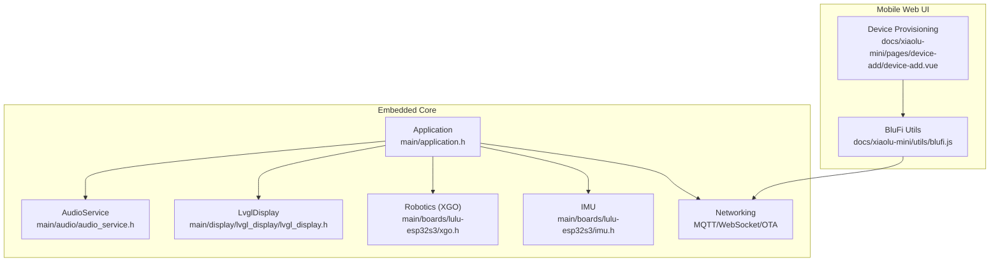
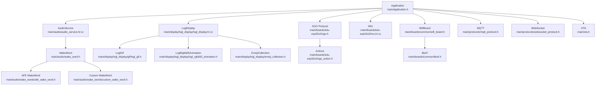
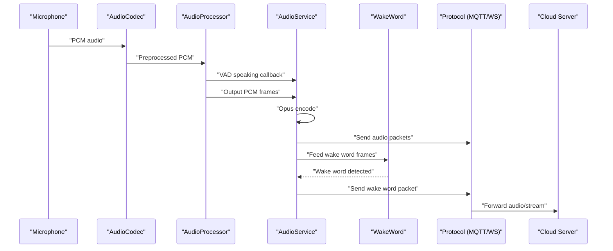
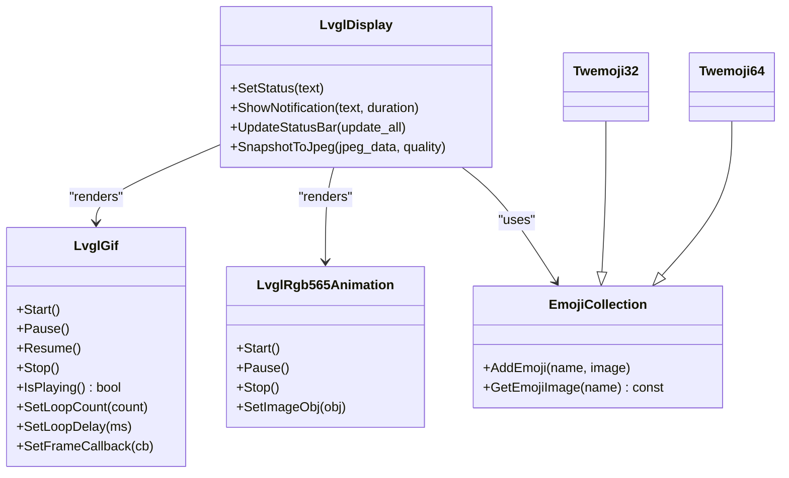
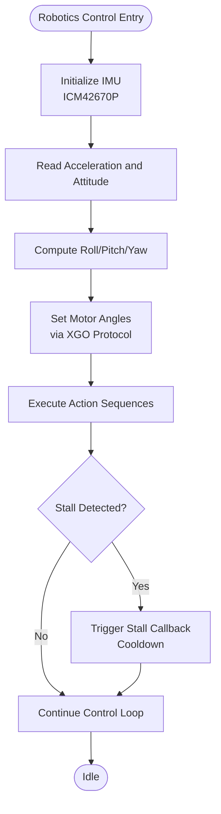
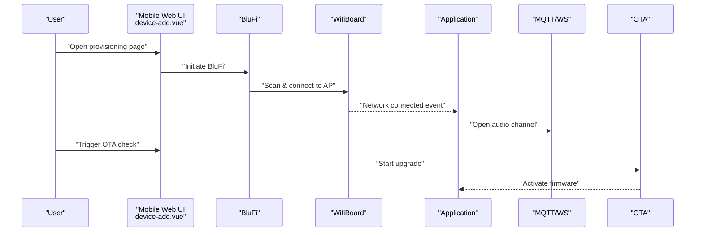
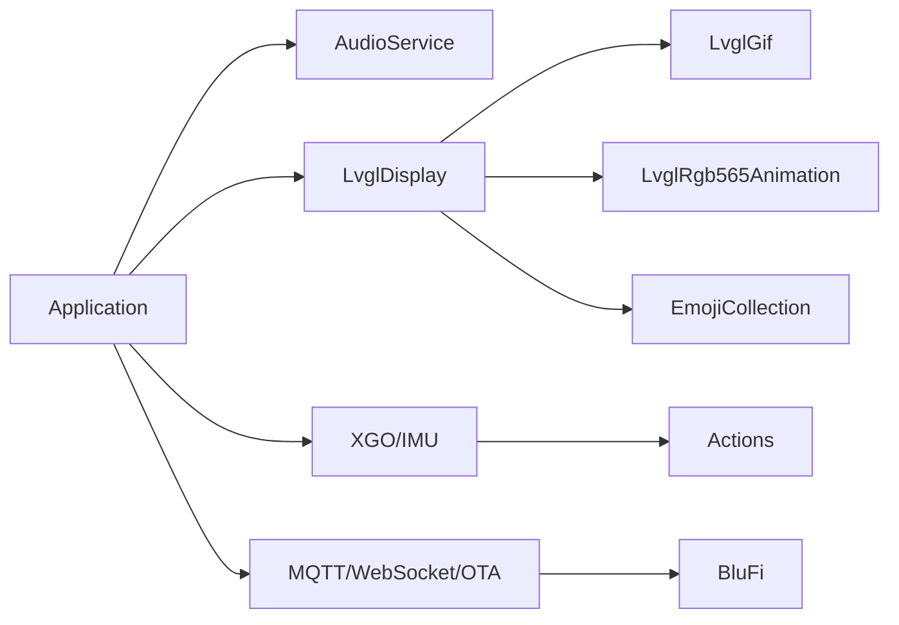

# Key Features and Capabilities

<cite>
**Referenced Files in This Document**
- [README.md](file://README.md)
- [main/application.h](file://main/application.h)
- [main/audio/audio_service.h](file://main/audio/audio_service.h)
- [main/audio/audio_service.cc](file://main/audio/audio_service.cc)
- [main/audio/wake_word.h](file://main/audio/wake_word.h)
- [main/audio/wake_words/afe_wake_word.h](file://main/audio/wake_words/afe_wake_word.h)
- [main/audio/wake_words/custom_wake_word.h](file://main/audio/wake_words/custom_wake_word.h)
- [main/display/lvgl_display/lvgl_display.h](file://main/display/lvgl_display/lvgl_display.h)
- [main/display/lvgl_display/lvgl_display.cc](file://main/display/lvgl_display/lvgl_display.cc)
- [main/display/lvgl_display/emoji_collection.h](file://main/display/lvgl_display/emoji_collection.h)
- [main/display/lvgl_display/gif/lvgl_gif.h](file://main/display/lvgl_display/gif/lvgl_gif.h)
- [main/display/lvgl_display/lvgl_rgb565_animation.h](file://main/display/lvgl_display/lvgl_rgb565_animation.h)
- [main/boards/lulu-esp32s3/xgo.h](file://main/boards/lulu-esp32s3/xgo.h)
- [main/boards/lulu-esp32s3/xgo_action.h](file://main/boards/lulu-esp32s3/xgo_action.h)
- [main/boards/lulu-esp32s3/imu.h](file://main/boards/lulu-esp32s3/imu.h)
- [main/boards/lulu-esp32s3/imu.cc](file://main/boards/lulu-esp32s3/imu.cc)
- [main/boards/common/blufi.h](file://main/boards/common/blufi.h)
- [main/boards/common/wifi_board.h](file://main/boards/common/wifi_board.h)
- [main/protocols/mqtt_protocol.h](file://main/protocols/mqtt_protocol.h)
- [main/protocols/websocket_protocol.h](file://main/protocols/websocket_protocol.h)
- [main/ota.h](file://main/ota.h)
- [docs/xiaolu-mini/pages/device-add/device-add.vue](file://docs/xiaolu-mini/pages/device-add/device-add.vue)
- [docs/xiaolu-mini/utils/blufi.js](file://docs/xiaolu-mini/utils/blufi.js)
</cite>

## Table of Contents
1. [Introduction](#introduction)
2. [Project Structure](#project-structure)
3. [Core Components](#core-components)
4. [Architecture Overview](#architecture-overview)
5. [Detailed Component Analysis](#detailed-component-analysis)
6. [Dependency Analysis](#dependency-analysis)
7. [Performance Considerations](#performance-considerations)
8. [Troubleshooting Guide](#troubleshooting-guide)
9. [Conclusion](#conclusion)
10. [Appendices](#appendices)

## Introduction
This document presents the key features and capabilities of the RIG-Puppy platform, focusing on its integrated functionality. It covers voice interaction (offline wake word detection, real-time speech processing, and cloud-based audio streaming), visual interface (LVGL-based rendering, EAF/animated GIF playback, and emoji collections), robotics control (5-axis servo motor control via XGO protocol, IMU orientation sensing, and automated behaviors), and network connectivity (BluFi WiFi provisioning, MQTT/WebSocket communication, and OTA updates). It also documents the mobile web interface for device configuration and monitoring, and provides concrete examples of feature interactions and use cases.

## Project Structure
RIG-Puppy is organized around a modular embedded application with cross-cutting subsystems:
- Voice pipeline: audio capture, processing, wake word detection, encoding, and streaming
- Visual pipeline: LVGL rendering, image/GIF/EAF playback, and emoji collections
- Robotics control: 5-axis motors, actions, and IMU orientation
- Networking: BluFi provisioning, MQTT/WebSocket protocols, OTA firmware upgrades
- Mobile web UI: device provisioning and monitoring

**Diagram sources**
- [main/application.h:1-195](file://main/application.h#L1-L195)
- [main/audio/audio_service.h:1-204](file://main/audio/audio_service.h#L1-L204)
- [main/display/lvgl_display/lvgl_display.h:1-54](file://main/display/lvgl_display/lvgl_display.h#L1-L54)
- [main/boards/lulu-esp32s3/xgo.h:1-74](file://main/boards/lulu-esp32s3/xgo.h#L1-L74)
- [main/boards/lulu-esp32s3/imu.h:1-19](file://main/boards/lulu-esp32s3/imu.h#L1-L19)
- [docs/xiaolu-mini/pages/device-add/device-add.vue](file://docs/xiaolu-mini/pages/device-add/device-add.vue)
- [docs/xiaolu-mini/utils/blufi.js](file://docs/xiaolu-mini/utils/blufi.js)

**Section sources**
- [README.md](file://README.md)
- [main/application.h:1-195](file://main/application.h#L1-L195)

## Core Components
- Voice Interaction System
  - Offline wake word detection via AFE/Custom wake word modules
  - Real-time audio processing and VAD (voice activity detection)
  - Cloud-based audio streaming via Opus encoding and protocol channels (MQTT/WebSocket)
- Visual Interface
  - LVGL-based graphics rendering and status UI
  - Animated playback: GIFs and pre-decoded RGB565 animations (EAF-like)
  - Emoji collection management (Twemoji variants)
- Robotics Control
  - 5-axis servo motor control via XGO protocol
  - IMU orientation sensing (roll/pitch/yaw, acceleration)
  - Automated behaviors/actions (predefined motion sequences)
- Network Connectivity
  - BluFi WiFi provisioning for initial device setup
  - MQTT and WebSocket protocols for persistent communication
  - OTA firmware upgrade with version checks and activation
- Mobile Web Interface
  - Device provisioning page and BluFi utilities for WiFi configuration

**Section sources**
- [main/audio/audio_service.h:1-204](file://main/audio/audio_service.h#L1-L204)
- [main/audio/wake_word.h:1-27](file://main/audio/wake_word.h#L1-L27)
- [main/audio/wake_words/afe_wake_word.h:1-68](file://main/audio/wake_words/afe_wake_word.h#L1-L68)
- [main/audio/wake_words/custom_wake_word.h:1-72](file://main/audio/wake_words/custom_wake_word.h#L1-L72)
- [main/display/lvgl_display/lvgl_display.h:1-54](file://main/display/lvgl_display/lvgl_display.h#L1-L54)
- [main/display/lvgl_display/gif/lvgl_gif.h:1-118](file://main/display/lvgl_display/gif/lvgl_gif.h#L1-L118)
- [main/display/lvgl_display/lvgl_rgb565_animation.h:1-106](file://main/display/lvgl_display/lvgl_rgb565_animation.h#L1-L106)
- [main/display/lvgl_display/emoji_collection.h:1-35](file://main/display/lvgl_display/emoji_collection.h#L1-L35)
- [main/boards/lulu-esp32s3/xgo.h:1-74](file://main/boards/lulu-esp32s3/xgo.h#L1-L74)
- [main/boards/lulu-esp32s3/xgo_action.h:1-49](file://main/boards/lulu-esp32s3/xgo_action.h#L1-L49)
- [main/boards/lulu-esp32s3/imu.h:1-19](file://main/boards/lulu-esp32s3/imu.h#L1-L19)
- [main/boards/common/blufi.h:1-148](file://main/boards/common/blufi.h#L1-L148)
- [main/boards/common/wifi_board.h:1-76](file://main/boards/common/wifi_board.h#L1-L76)
- [main/protocols/mqtt_protocol.h:1-66](file://main/protocols/mqtt_protocol.h#L1-L66)
- [main/protocols/websocket_protocol.h:1-35](file://main/protocols/websocket_protocol.h#L1-L35)
- [main/ota.h:1-59](file://main/ota.h#L1-L59)
- [docs/xiaolu-mini/pages/device-add/device-add.vue](file://docs/xiaolu-mini/pages/device-add/device-add.vue)
- [docs/xiaolu-mini/utils/blufi.js](file://docs/xiaolu-mini/utils/blufi.js)

## Architecture Overview
The platform centers on an Application orchestrator that coordinates audio, display, robotics, and networking. The voice pipeline integrates wake word detection, audio processing, and streaming protocols. The visual pipeline renders UI and animations. Robotics and IMU sensors feed orientation and movement control. Networking enables secure provisioning and over-the-air updates.

**Diagram sources**
- [main/application.h:1-195](file://main/application.h#L1-L195)
- [main/audio/audio_service.h:1-204](file://main/audio/audio_service.h#L1-L204)
- [main/audio/audio_service.cc:1-200](file://main/audio/audio_service.cc#L1-L200)
- [main/audio/wake_word.h:1-27](file://main/audio/wake_word.h#L1-L27)
- [main/audio/wake_words/afe_wake_word.h:1-68](file://main/audio/wake_words/afe_wake_word.h#L1-L68)
- [main/audio/wake_words/custom_wake_word.h:1-72](file://main/audio/wake_words/custom_wake_word.h#L1-L72)
- [main/display/lvgl_display/lvgl_display.h:1-54](file://main/display/lvgl_display/lvgl_display.h#L1-L54)
- [main/display/lvgl_display/lvgl_display.cc:1-200](file://main/display/lvgl_display/lvgl_display.cc#L1-L200)
- [main/display/lvgl_display/gif/lvgl_gif.h:1-118](file://main/display/lvgl_display/gif/lvgl_gif.h#L1-L118)
- [main/display/lvgl_display/lvgl_rgb565_animation.h:1-106](file://main/display/lvgl_display/lvgl_rgb565_animation.h#L1-L106)
- [main/display/lvgl_display/emoji_collection.h:1-35](file://main/display/lvgl_display/emoji_collection.h#L1-L35)
- [main/boards/lulu-esp32s3/xgo.h:1-74](file://main/boards/lulu-esp32s3/xgo.h#L1-L74)
- [main/boards/lulu-esp32s3/xgo_action.h:1-49](file://main/boards/lulu-esp32s3/xgo_action.h#L1-L49)
- [main/boards/lulu-esp32s3/imu.h:1-19](file://main/boards/lulu-esp32s3/imu.h#L1-L19)
- [main/boards/lulu-esp32s3/imu.cc:1-170](file://main/boards/lulu-esp32s3/imu.cc#L1-L170)
- [main/boards/common/wifi_board.h:1-76](file://main/boards/common/wifi_board.h#L1-L76)
- [main/boards/common/blufi.h:1-148](file://main/boards/common/blufi.h#L1-L148)
- [main/protocols/mqtt_protocol.h:1-66](file://main/protocols/mqtt_protocol.h#L1-L66)
- [main/protocols/websocket_protocol.h:1-35](file://main/protocols/websocket_protocol.h#L1-L35)
- [main/ota.h:1-59](file://main/ota.h#L1-L59)

## Detailed Component Analysis

### Voice Interaction System
- Offline Wake Word Detection
  - AFE-based wake word module supports onboard detection with configurable models and queueing for encoded wake word packets.
  - Custom wake word module integrates multinet-based detection with language-specific thresholds and command parsing.
- Real-Time Speech Recognition and Processing
  - AudioService manages Opus encoder/decoder, resamplers, and VAD state changes. It maintains separate queues for encode/decode/testing and provides callbacks for wake word detection and VAD transitions.
- Cloud-Based Streaming
  - Protocols (MQTT/WebSocket) open audio channels, send encoded packets, and handle reconnection and AES-handshake flows.

**Diagram sources**
- [main/audio/audio_service.h:1-204](file://main/audio/audio_service.h#L1-L204)
- [main/audio/audio_service.cc:1-200](file://main/audio/audio_service.cc#L1-L200)
- [main/audio/wake_word.h:1-27](file://main/audio/wake_word.h#L1-L27)
- [main/audio/wake_words/afe_wake_word.h:1-68](file://main/audio/wake_words/afe_wake_word.h#L1-L68)
- [main/audio/wake_words/custom_wake_word.h:1-72](file://main/audio/wake_words/custom_wake_word.h#L1-L72)
- [main/protocols/mqtt_protocol.h:1-66](file://main/protocols/mqtt_protocol.h#L1-L66)
- [main/protocols/websocket_protocol.h:1-35](file://main/protocols/websocket_protocol.h#L1-L35)

**Section sources**
- [main/audio/audio_service.h:1-204](file://main/audio/audio_service.h#L1-L204)
- [main/audio/audio_service.cc:1-200](file://main/audio/audio_service.cc#L1-L200)
- [main/audio/wake_word.h:1-27](file://main/audio/wake_word.h#L1-L27)
- [main/audio/wake_words/afe_wake_word.h:1-68](file://main/audio/wake_words/afe_wake_word.h#L1-L68)
- [main/audio/wake_words/custom_wake_word.h:1-72](file://main/audio/wake_words/custom_wake_word.h#L1-L72)
- [main/protocols/mqtt_protocol.h:1-66](file://main/protocols/mqtt_protocol.h#L1-L66)
- [main/protocols/websocket_protocol.h:1-35](file://main/protocols/websocket_protocol.h#L1-L35)

### Visual Interface Capabilities
- LVGL Graphics Rendering
  - LvglDisplay provides status notifications, battery/network indicators, and snapshot-to-JPEG functionality. It manages UI locks and power management locks for smooth updates.
- EAF and GIF Playback
  - RGB565 pre-decoded animations support zero-runtime decoding with timer-driven frame updates.
  - GIF playback uses gifdec with loop controls, delays, and frame callbacks.
- Emoji Collection Management
  - EmojiCollection interface supports adding and retrieving emoji images; Twemoji32/Twemoji64 variants provide scalable emoji sets.

**Diagram sources**
- [main/display/lvgl_display/lvgl_display.h:1-54](file://main/display/lvgl_display/lvgl_display.h#L1-L54)
- [main/display/lvgl_display/lvgl_display.cc:1-200](file://main/display/lvgl_display/lvgl_display.cc#L1-L200)
- [main/display/lvgl_display/gif/lvgl_gif.h:1-118](file://main/display/lvgl_display/gif/lvgl_gif.h#L1-L118)
- [main/display/lvgl_display/lvgl_rgb565_animation.h:1-106](file://main/display/lvgl_display/lvgl_rgb565_animation.h#L1-L106)
- [main/display/lvgl_display/emoji_collection.h:1-35](file://main/display/lvgl_display/emoji_collection.h#L1-L35)

**Section sources**
- [main/display/lvgl_display/lvgl_display.h:1-54](file://main/display/lvgl_display/lvgl_display.h#L1-L54)
- [main/display/lvgl_display/lvgl_display.cc:1-200](file://main/display/lvgl_display/lvgl_display.cc#L1-L200)
- [main/display/lvgl_display/gif/lvgl_gif.h:1-118](file://main/display/lvgl_display/gif/lvgl_gif.h#L1-L118)
- [main/display/lvgl_display/lvgl_rgb565_animation.h:1-106](file://main/display/lvgl_display/lvgl_rgb565_animation.h#L1-L106)
- [main/display/lvgl_display/emoji_collection.h:1-35](file://main/display/lvgl_display/emoji_collection.h#L1-L35)

### Robotics Control System
- 5-Axis Servo Motor Control via XGO Protocol
  - Motor control functions include position/angle setting, stall detection, and calibration routines. Movement and control functions coordinate motor actions.
- Automated Behaviors
  - Action definitions and functions encapsulate predefined motion sequences (e.g., wave, swing, scratch, hug).
- IMU Orientation Sensing
  - IMU driver initializes I2C, validates device, configures sensors, and reads acceleration and attitude angles.

**Diagram sources**
- [main/boards/lulu-esp32s3/imu.h:1-19](file://main/boards/lulu-esp32s3/imu.h#L1-L19)
- [main/boards/lulu-esp32s3/imu.cc:1-170](file://main/boards/lulu-esp32s3/imu.cc#L1-L170)
- [main/boards/lulu-esp32s3/xgo.h:1-74](file://main/boards/lulu-esp32s3/xgo.h#L1-L74)
- [main/boards/lulu-esp32s3/xgo_action.h:1-49](file://main/boards/lulu-esp32s3/xgo_action.h#L1-L49)

**Section sources**
- [main/boards/lulu-esp32s3/xgo.h:1-74](file://main/boards/lulu-esp32s3/xgo.h#L1-L74)
- [main/boards/lulu-esp32s3/xgo_action.h:1-49](file://main/boards/lulu-esp32s3/xgo_action.h#L1-L49)
- [main/boards/lulu-esp32s3/imu.h:1-19](file://main/boards/lulu-esp32s3/imu.h#L1-L19)
- [main/boards/lulu-esp32s3/imu.cc:1-170](file://main/boards/lulu-esp32s3/imu.cc#L1-L170)

### Network Connectivity Options
- BluFi WiFi Provisioning
  - BluFi singleton manages BLE/WiFi provisioning, secure negotiation, and AP scanning. It exposes initialization, deinitialization, and Wi-Fi scan APIs.
- MQTT and WebSocket Communication
  - MQTT protocol opens audio channels, handles reconnection, and parses server hello messages. WebSocket protocol mirrors similar functionality for alternate transport.
- OTA Update Capabilities
  - OTA class checks versions, activates firmware, and exposes upgrade APIs with progress callbacks.

**Diagram sources**
- [docs/xiaolu-mini/pages/device-add/device-add.vue](file://docs/xiaolu-mini/pages/device-add/device-add.vue)
- [docs/xiaolu-mini/utils/blufi.js](file://docs/xiaolu-mini/utils/blufi.js)
- [main/boards/common/blufi.h:1-148](file://main/boards/common/blufi.h#L1-L148)
- [main/boards/common/wifi_board.h:1-76](file://main/boards/common/wifi_board.h#L1-L76)
- [main/application.h:1-195](file://main/application.h#L1-L195)
- [main/protocols/mqtt_protocol.h:1-66](file://main/protocols/mqtt_protocol.h#L1-L66)
- [main/protocols/websocket_protocol.h:1-35](file://main/protocols/websocket_protocol.h#L1-L35)
- [main/ota.h:1-59](file://main/ota.h#L1-L59)

**Section sources**
- [main/boards/common/blufi.h:1-148](file://main/boards/common/blufi.h#L1-L148)
- [main/boards/common/wifi_board.h:1-76](file://main/boards/common/wifi_board.h#L1-L76)
- [main/protocols/mqtt_protocol.h:1-66](file://main/protocols/mqtt_protocol.h#L1-L66)
- [main/protocols/websocket_protocol.h:1-35](file://main/protocols/websocket_protocol.h#L1-L35)
- [main/ota.h:1-59](file://main/ota.h#L1-L59)
- [docs/xiaolu-mini/pages/device-add/device-add.vue](file://docs/xiaolu-mini/pages/device-add/device-add.vue)
- [docs/xiaolu-mini/utils/blufi.js](file://docs/xiaolu-mini/utils/blufi.js)

### Mobile Web Interface for Device Configuration and Monitoring
- Device Provisioning Page
  - Vue page for adding devices and configuring WiFi credentials via BluFi.
- BluFi Utilities
  - JavaScript utilities integrate with BluFi APIs to manage provisioning flows.

**Section sources**
- [docs/xiaolu-mini/pages/device-add/device-add.vue](file://docs/xiaolu-mini/pages/device-add/device-add.vue)
- [docs/xiaolu-mini/utils/blufi.js](file://docs/xiaolu-mini/utils/blufi.js)

## Dependency Analysis
The Application orchestrates subsystems and wires them together:
- AudioService depends on AudioCodec, WakeWord implementations, and protocol channels
- Display depends on LVGL and image/GIF/EAF renderers
- Robotics and IMU depend on board-specific drivers and XGO protocol
- Networking depends on BluFi, MQTT/WebSocket, and OTA
- Mobile UI depends on BluFi utilities and device provisioning page

**Diagram sources**
- [main/application.h:1-195](file://main/application.h#L1-L195)
- [main/audio/audio_service.h:1-204](file://main/audio/audio_service.h#L1-L204)
- [main/display/lvgl_display/lvgl_display.h:1-54](file://main/display/lvgl_display/lvgl_display.h#L1-L54)
- [main/display/lvgl_display/gif/lvgl_gif.h:1-118](file://main/display/lvgl_display/gif/lvgl_gif.h#L1-L118)
- [main/display/lvgl_display/lvgl_rgb565_animation.h:1-106](file://main/display/lvgl_display/lvgl_rgb565_animation.h#L1-L106)
- [main/display/lvgl_display/emoji_collection.h:1-35](file://main/display/lvgl_display/emoji_collection.h#L1-L35)
- [main/boards/lulu-esp32s3/xgo.h:1-74](file://main/boards/lulu-esp32s3/xgo.h#L1-L74)
- [main/boards/lulu-esp32s3/xgo_action.h:1-49](file://main/boards/lulu-esp32s3/xgo_action.h#L1-L49)
- [main/boards/common/blufi.h:1-148](file://main/boards/common/blufi.h#L1-L148)
- [main/protocols/mqtt_protocol.h:1-66](file://main/protocols/mqtt_protocol.h#L1-L66)
- [main/protocols/websocket_protocol.h:1-35](file://main/protocols/websocket_protocol.h#L1-L35)
- [main/ota.h:1-59](file://main/ota.h#L1-L59)

**Section sources**
- [main/application.h:1-195](file://main/application.h#L1-L195)

## Performance Considerations
- Audio Pipeline
  - PSRAM-backed static task stacks for audio input/output and codec tasks improve stability under load.
  - Resamplers adjust sample rates to encoder/decoder expectations; VAD-driven gating reduces unnecessary processing.
- Visual Rendering
  - Pre-decoded RGB565 animations eliminate runtime decode overhead; GIF playback uses efficient timers and loop controls.
- Robotics and IMU
  - Stall detection prevents motor overload; IMU polling avoids blocking by using non-blocking reads and computed angles.
- Networking
  - Reconnection timers and ping intervals maintain robust connectivity; AES contexts and nonces ensure secure transport.

[No sources needed since this section provides general guidance]

## Troubleshooting Guide
- Audio Not Playing or Stuttering
  - Verify Opus encoder/decoder creation and frame sizes; check VAD state transitions and queue depths.
- Wake Word Not Detected
  - Confirm wake word module initialization, model lists, and feed sizes; ensure detection task is running.
- Display UI Not Updating
  - Ensure UI setup is complete before calling status/notification setters; check power management locks and timer lifecycles.
- Robot Not Responding
  - Validate motor calibration and zero positions; confirm stall detection is enabled if needed; verify XGO protocol commands.
- IMU Readings Incorrect
  - Check I2C wiring and device probe; ensure initialization sequence completes and registers are configured.
- Network Provisioning Failures
  - Confirm BluFi initialization and BLE/WiFi stack readiness; verify AP scan results and credentials.
- OTA Upgrade Issues
  - Validate version checks and firmware URLs; ensure activation steps are completed and callbacks are registered.

**Section sources**
- [main/audio/audio_service.cc:1-200](file://main/audio/audio_service.cc#L1-L200)
- [main/display/lvgl_display/lvgl_display.cc:1-200](file://main/display/lvgl_display/lvgl_display.cc#L1-L200)
- [main/boards/lulu-esp32s3/imu.cc:1-170](file://main/boards/lulu-esp32s3/imu.cc#L1-L170)
- [main/boards/common/blufi.h:1-148](file://main/boards/common/blufi.h#L1-L148)
- [main/ota.h:1-59](file://main/ota.h#L1-L59)

## Conclusion
RIG-Puppy integrates a robust voice interaction pipeline, a responsive visual interface, precise robotics control, and reliable networking to deliver a versatile embedded platform. Its modular design and clear separation of concerns enable flexible feature combinations and seamless device management through both embedded and mobile interfaces.

[No sources needed since this section summarizes without analyzing specific files]

## Appendices
- Example Feature Interactions and Use Cases
  - Wake Word → Speech Streaming: Detect wake word, encode and stream audio via MQTT/WS, and render status on LVGL.
  - IMU → Motion Control: Read orientation, compute desired motor angles, and execute predefined actions.
  - BluFi → Network Provisioning: Scan networks, securely provision credentials, and establish MQTT/WS channels.
  - OTA → Firmware Update: Check version, download firmware, notify user, and activate new firmware.

[No sources needed since this section provides general guidance]