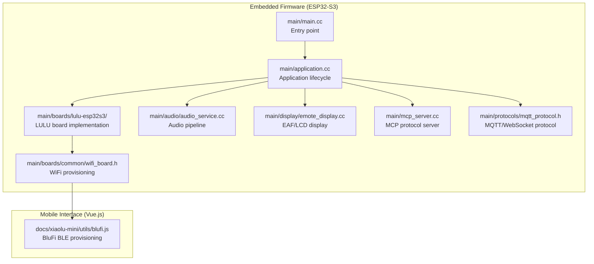
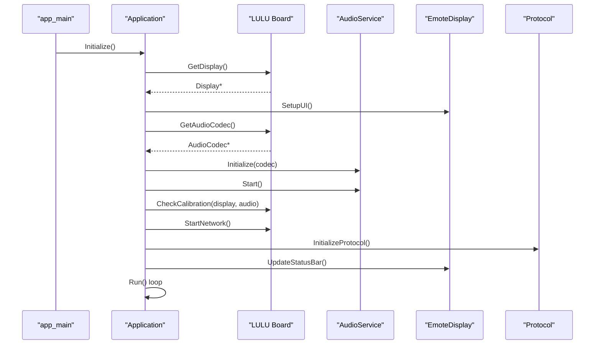
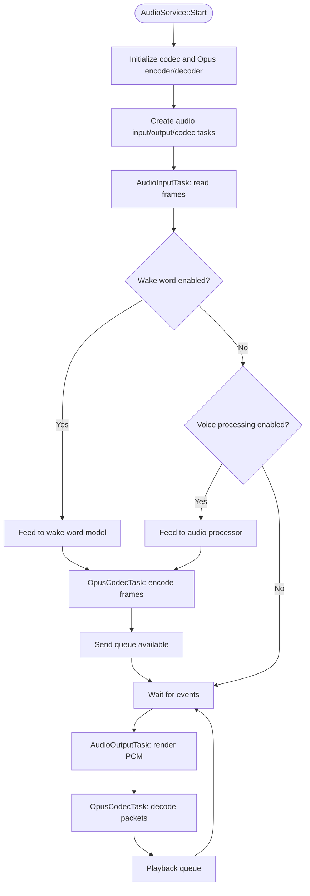
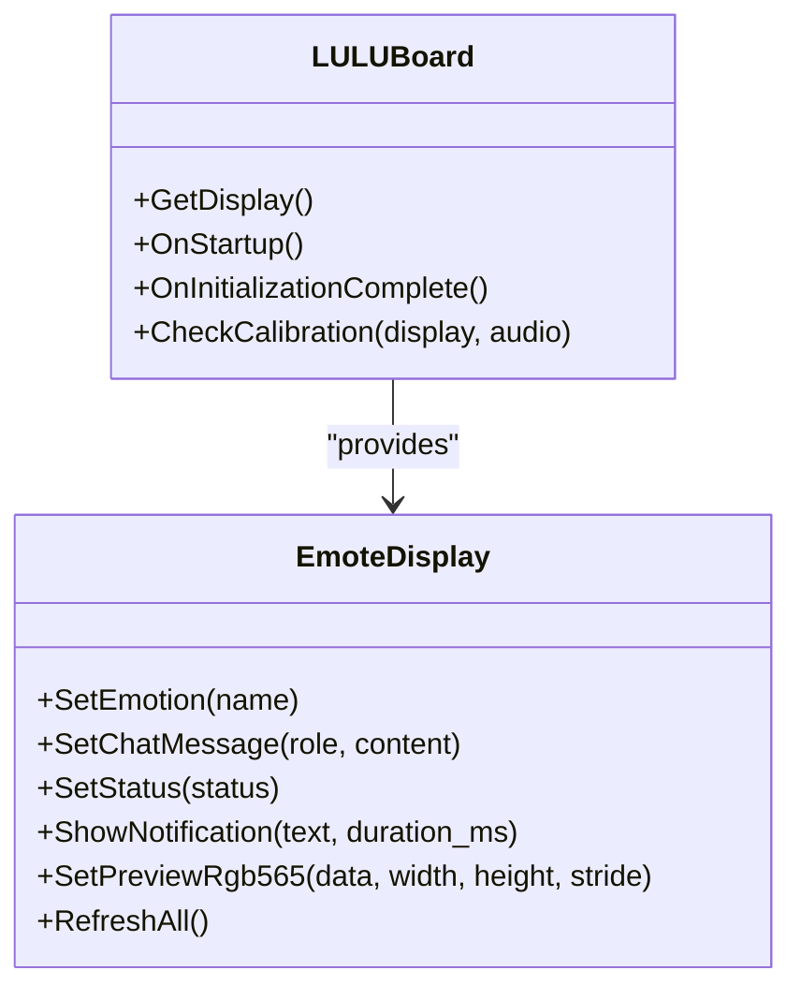
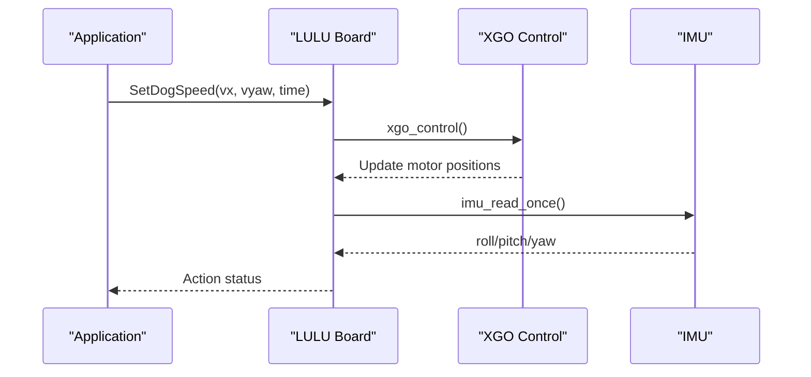
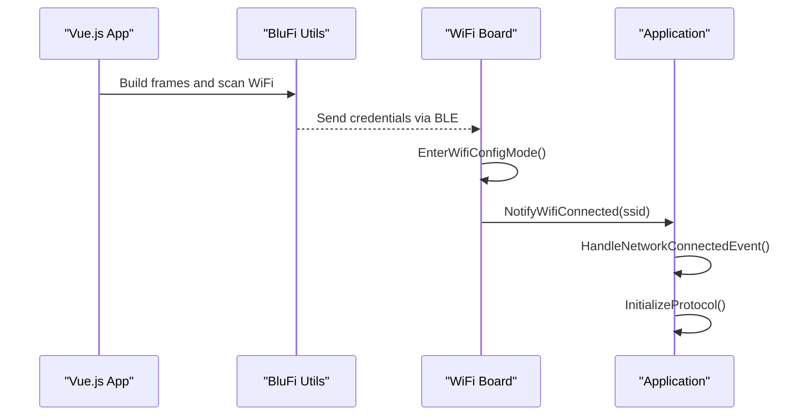
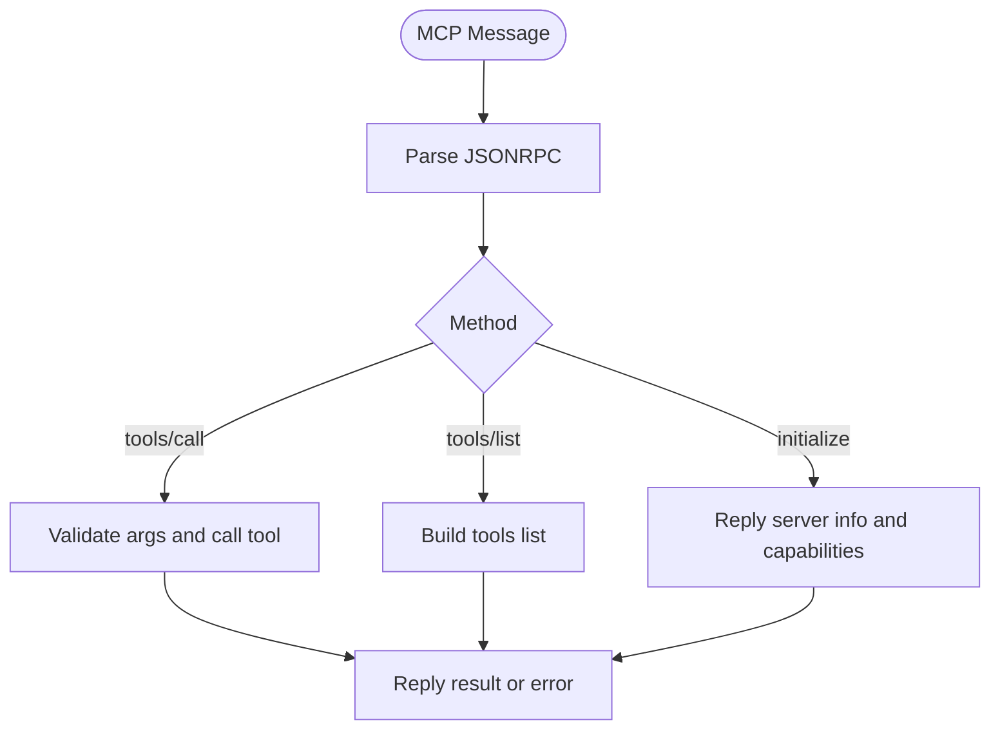
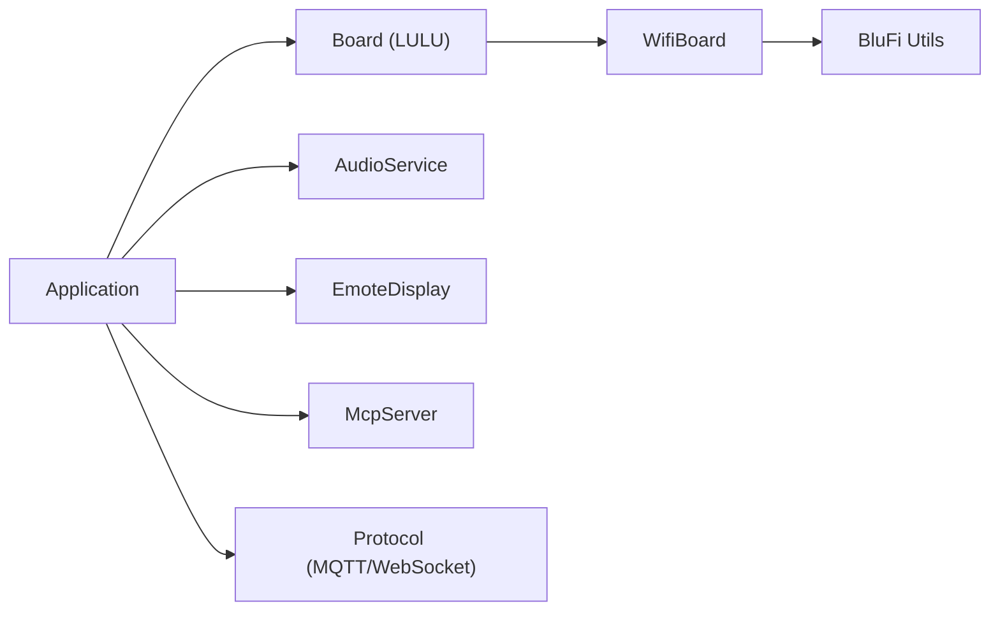

# Project Overview

<cite>
**Referenced Files in This Document**
- [README.md](file://README.md)
- [main/main.cc](file://main/main.cc)
- [main/application.cc](file://main/application.cc)
- [main/boards/lulu-esp32s3/lulu-esp32s3.cc](file://main/boards/lulu-esp32s3/lulu-esp32s3.cc)
- [main/audio/audio_service.cc](file://main/audio/audio_service.cc)
- [main/display/emote_display.cc](file://main/display/emote_display.cc)
- [docs/xiaolu-mini/utils/blufi.js](file://docs/xiaolu-mini/utils/blufi.js)
- [main/boards/lulu-esp32s3/xgo.h](file://main/boards/lulu-esp32s3/xgo.h)
- [main/mcp_server.cc](file://main/mcp_server.cc)
- [main/boards/common/wifi_board.h](file://main/boards/common/wifi_board.h)
- [main/protocols/mqtt_protocol.h](file://main/protocols/mqtt_protocol.h)
- [main/boards/lulu-esp32s3/config.h](file://main/boards/lulu-esp32s3/config.h)
</cite>

## Table of Contents
1. [Introduction](#introduction)
2. [Project Structure](#project-structure)
3. [Core Components](#core-components)
4. [Architecture Overview](#architecture-overview)
5. [Detailed Component Analysis](#detailed-component-analysis)
6. [Dependency Analysis](#dependency-analysis)
7. [Performance Considerations](#performance-considerations)
8. [Troubleshooting Guide](#troubleshooting-guide)
9. [Conclusion](#conclusion)

## Introduction
RIG-Puppy is an embedded AI assistant platform designed as a smart robot dog firmware. It integrates voice interaction, facial expression display, and 5-axis servo motor control on an ESP32-S3-based LULU board. The platform consists of two complementary parts:
- Embedded firmware (ESP32-S3): Handles audio processing, speech recognition/synthesis, EAF animation playback, servo control, and network connectivity.
- Mobile interface (Vue.js): Provides a companion app for device provisioning, monitoring, and control via the MCP protocol.

Key platform goals:
- Deliver an intelligent, expressive robot dog with offline wake word detection and cloud-based ASR/TTS.
- Enable rich visual feedback through EAF animations and a round LCD display.
- Provide precise 5-axis servo control for realistic movement and gestures.
- Simplify device setup with BluFi WiFi provisioning and robust OTA upgrades.
- Offer extensibility through the MCP framework for tool-based integrations.

## Project Structure
The repository is organized into modular components:
- main/: Core embedded firmware including application lifecycle, board abstraction, audio pipeline, display, protocols, and MCP server.
- docs/xiaolu-mini/: Vue.js mobile app for device provisioning and control.
- partitions/: ESP-IDF partition tables for firmware and assets.
- scripts/: Build and packaging utilities for assets, audio, and conversions.



**Diagram sources**
- [main/main.cc:14-29](file://main/main.cc#L14-L29)
- [main/application.cc:62-178](file://main/application.cc#L62-L178)
- [main/boards/lulu-esp32s3/lulu-esp32s3.cc:580-621](file://main/boards/lulu-esp32s3/lulu-esp32s3.cc#L580-L621)
- [main/audio/audio_service.cc:40-123](file://main/audio/audio_service.cc#L40-L123)
- [main/display/emote_display.cc:119-128](file://main/display/emote_display.cc#L119-L128)
- [main/mcp_server.cc:23-31](file://main/mcp_server.cc#L23-L31)
- [main/boards/common/wifi_board.h:9-73](file://main/boards/common/wifi_board.h#L9-L73)
- [docs/xiaolu-mini/utils/blufi.js:1-138](file://docs/xiaolu-mini/utils/blufi.js#L1-L138)

**Section sources**
- [README.md:117-137](file://README.md#L117-L137)

## Core Components
- Application lifecycle: Initializes NVS, displays UI, loads assets, starts audio service, handles network events, and manages state transitions.
- LULU board: Implements board-specific hardware (display, audio codec, buttons, camera, XGO servo control, IMU) and exposes MCP tools.
- Audio service: Manages Opus encoding/decoding, wake word detection, voice processing, and audio I/O with power-aware resampling.
- Display: Renders EAF animations and status messages on the GC9A01 LCD.
- Protocols: Supports MQTT/WebSocket for cloud audio streaming and control.
- MCP server: Exposes a tool-based API for device control and diagnostics.

Practical examples:
- Offline wake word detection triggers audio channel opening and conversation flow.
- Cloud ASR/TTS integrates via protocol handlers; incoming audio packets are decoded and rendered as speech.
- EAF animations play for emotions and notifications; camera preview can be shown on screen.
- 5-axis servo control enables actions like sitting, waving, and posture adjustments.

**Section sources**
- [main/main.cc:14-29](file://main/main.cc#L14-L29)
- [main/application.cc:62-178](file://main/application.cc#L62-L178)
- [main/boards/lulu-esp32s3/lulu-esp32s3.cc:580-621](file://main/boards/lulu-esp32s3/lulu-esp32s3.cc#L580-L621)
- [main/audio/audio_service.cc:40-123](file://main/audio/audio_service.cc#L40-L123)
- [main/display/emote_display.cc:151-184](file://main/display/emote_display.cc#L151-L184)
- [main/boards/lulu-esp32s3/xgo.h:24-56](file://main/boards/lulu-esp32s3/xgo.h#L24-L56)
- [main/mcp_server.cc:33-143](file://main/mcp_server.cc#L33-L143)

## Architecture Overview
The system architecture combines an ESP32-S3 embedded firmware with a Vue.js mobile companion app. The embedded firmware orchestrates audio, display, servo control, and network connectivity, while the mobile app provides provisioning and control via BluFi and MCP.

```mermaid
graph TB
subgraph "Embedded Firmware"
App["Application<br/>main/application.cc"]
Board["LULU Board<br/>boards/lulu-esp32s3"]
Audio["Audio Service<br/>audio/audio_service.cc"]
Display["Display<br/>display/emote_display.cc"]
MCP["MCP Server<br/>mcp_server.cc"]
Proto["Protocols<br/>mqtt_protocol.h"]
WiFi["WiFi Board<br/>boards/common/wifi_board.h"]
end
subgraph "Mobile Companion"
BluFi["BluFi Utils<br/>docs/xiaolu-mini/utils/blufi.js"]
end
App --> Board
App --> Audio
App --> Display
App --> MCP
App --> Proto
Board --> WiFi
WiFi <- --> BluFi
```

**Diagram sources**
- [main/application.cc:62-178](file://main/application.cc#L62-L178)
- [main/boards/lulu-esp32s3/lulu-esp32s3.cc:580-621](file://main/boards/lulu-esp32s3/lulu-esp32s3.cc#L580-L621)
- [main/audio/audio_service.cc:40-123](file://main/audio/audio_service.cc#L40-L123)
- [main/display/emote_display.cc:119-128](file://main/display/emote_display.cc#L119-L128)
- [main/mcp_server.cc:23-31](file://main/mcp_server.cc#L23-L31)
- [main/boards/common/wifi_board.h:9-73](file://main/boards/common/wifi_board.h#L9-L73)
- [docs/xiaolu-mini/utils/blufi.js:1-138](file://docs/xiaolu-mini/utils/blufi.js#L1-L138)

## Detailed Component Analysis

### Embedded Firmware Lifecycle and State Machine
The embedded firmware initializes NVS, sets up the UI, loads assets, starts audio, and manages device states (starting, activating, idle, listening, speaking, connecting, etc.). It reacts to network events, audio events, and user interactions.



**Diagram sources**
- [main/main.cc:14-29](file://main/main.cc#L14-L29)
- [main/application.cc:62-178](file://main/application.cc#L62-L178)
- [main/boards/lulu-esp32s3/lulu-esp32s3.cc:702-741](file://main/boards/lulu-esp32s3/lulu-esp32s3.cc#L702-L741)
- [main/audio/audio_service.cc:62-123](file://main/audio/audio_service.cc#L62-L123)
- [main/display/emote_display.cc:119-128](file://main/display/emote_display.cc#L119-L128)

**Section sources**
- [main/main.cc:14-29](file://main/main.cc#L14-L29)
- [main/application.cc:180-276](file://main/application.cc#L180-L276)

### Audio Pipeline: Wake Word Detection, Voice Processing, and Cloud ASR/TTS
The audio service manages Opus encoding/decoding, wake word detection, and voice processing. It feeds audio frames to wake word and audio processor, encodes for transmission, and decodes incoming audio for playback.



**Diagram sources**
- [main/audio/audio_service.cc:125-200](file://main/audio/audio_service.cc#L125-L200)
- [main/audio/audio_service.cc:263-321](file://main/audio/audio_service.cc#L263-L321)
- [main/audio/audio_service.cc:360-479](file://main/audio/audio_service.cc#L360-L479)

**Section sources**
- [main/audio/audio_service.cc:40-123](file://main/audio/audio_service.cc#L40-L123)
- [main/audio/audio_service.cc:582-610](file://main/audio/audio_service.cc#L582-L610)
- [main/audio/audio_service.cc:612-637](file://main/audio/audio_service.cc#L612-L637)

### EAF Animation Playback and Display Management
The EmoteDisplay component renders EAF animations and status messages on the GC9A01 LCD. It supports setting emotions, notifications, and preview images.



**Diagram sources**
- [main/display/emote_display.cc:151-184](file://main/display/emote_display.cc#L151-L184)
- [main/display/emote_display.cc:209-300](file://main/display/emote_display.cc#L209-L300)
- [main/boards/lulu-esp32s3/lulu-esp32s3.cc:675-686](file://main/boards/lulu-esp32s3/lulu-esp32s3.cc#L675-L686)

**Section sources**
- [main/display/emote_display.cc:119-128](file://main/display/emote_display.cc#L119-L128)
- [main/display/emote_display.cc:151-184](file://main/display/emote_display.cc#L151-L184)

### 5-Axis Servo Control and Actions (XGO Protocol)
The LULU board implements XGO protocol-based servo control for 5-axis movement and predefined actions. It exposes MCP tools for movement, calibration, and actions.



**Diagram sources**
- [main/boards/lulu-esp32s3/lulu-esp32s3.cc:285-297](file://main/boards/lulu-esp32s3/lulu-esp32s3.cc#L285-L297)
- [main/boards/lulu-esp32s3/lulu-esp32s3.cc:602-620](file://main/boards/lulu-esp32s3/lulu-esp32s3.cc#L602-L620)
- [main/boards/lulu-esp32s3/xgo.h:36-48](file://main/boards/lulu-esp32s3/xgo.h#L36-L48)

**Section sources**
- [main/boards/lulu-esp32s3/lulu-esp32s3.cc:285-297](file://main/boards/lulu-esp32s3/lulu-esp32s3.cc#L285-L297)
- [main/boards/lulu-esp32s3/lulu-esp32s3.cc:299-323](file://main/boards/lulu-esp32s3/lulu-esp32s3.cc#L299-L323)
- [main/boards/lulu-esp32s3/xgo.h:24-56](file://main/boards/lulu-esp32s3/xgo.h#L24-L56)

### BluFi WiFi Provisioning (Mobile App to Device)
The mobile app uses BluFi BLE protocol to provision WiFi credentials to the device. The embedded firmware integrates with the WiFi board to enter and exit configuration mode.



**Diagram sources**
- [docs/xiaolu-mini/utils/blufi.js:99-137](file://docs/xiaolu-mini/utils/blufi.js#L99-L137)
- [main/boards/common/wifi_board.h:32-73](file://main/boards/common/wifi_board.h#L32-L73)
- [main/application.cc:278-301](file://main/application.cc#L278-L301)

**Section sources**
- [docs/xiaolu-mini/utils/blufi.js:1-138](file://docs/xiaolu-mini/utils/blufi.js#L1-L138)
- [main/boards/common/wifi_board.h:9-73](file://main/boards/common/wifi_board.h#L9-L73)

### MCP Protocol and Tool-Based Control
The MCP server exposes tools for device control and diagnostics. Tools include device status, audio/video/screen controls, camera operations, and system functions.



**Diagram sources**
- [main/mcp_server.cc:370-453](file://main/mcp_server.cc#L370-L453)
- [main/mcp_server.cc:472-526](file://main/mcp_server.cc#L472-L526)
- [main/mcp_server.cc:528-580](file://main/mcp_server.cc#L528-L580)

**Section sources**
- [main/mcp_server.cc:33-143](file://main/mcp_server.cc#L33-L143)
- [main/mcp_server.cc:341-453](file://main/mcp_server.cc#L341-L453)

## Dependency Analysis
The embedded firmware relies on a layered architecture:
- Application depends on Board, Display, AudioService, MCP server, and Protocols.
- Board abstraction encapsulates hardware specifics (display, audio codec, buttons, camera, XGO).
- AudioService depends on codec and Opus libraries for encoding/decoding.
- Protocols abstract MQTT/WebSocket communication for cloud services.
- WiFi board integrates BluFi provisioning and network state management.



**Diagram sources**
- [main/application.cc:62-178](file://main/application.cc#L62-L178)
- [main/boards/lulu-esp32s3/lulu-esp32s3.cc:580-621](file://main/boards/lulu-esp32s3/lulu-esp32s3.cc#L580-L621)
- [main/audio/audio_service.cc:62-123](file://main/audio/audio_service.cc#L62-L123)
- [main/display/emote_display.cc:119-128](file://main/display/emote_display.cc#L119-L128)
- [main/mcp_server.cc:23-31](file://main/mcp_server.cc#L23-L31)
- [main/boards/common/wifi_board.h:9-73](file://main/boards/common/wifi_board.h#L9-L73)
- [docs/xiaolu-mini/utils/blufi.js:1-138](file://docs/xiaolu-mini/utils/blufi.js#L1-L138)

**Section sources**
- [main/application.cc:62-178](file://main/application.cc#L62-L178)
- [main/boards/lulu-esp32s3/lulu-esp32s3.cc:580-621](file://main/boards/lulu-esp32s3/lulu-esp32s3.cc#L580-L621)

## Performance Considerations
- Power-aware audio: Audio input/output are automatically powered down after inactivity to conserve energy.
- Resampling: Automatic resampling between decoder/sample rates ensures compatibility with device output.
- Task placement: Audio tasks use PSRAM to reduce CPU load and improve stability.
- Queue limits: Enforced limits on encode/decode/send queues prevent memory pressure and stalls.
- IMU and XGO tasks: Separate periodic tasks manage servo control and sensor reads efficiently.

[No sources needed since this section provides general guidance]

## Troubleshooting Guide
Common issues and resolutions:
- WiFi scanning timeouts: AP list is limited and sorted by signal strength.
- Slow wake word response: Ensure emotion updates occur after enabling voice processing.
- Servo jitter: Verify calibration values and power stability.

**Section sources**
- [README.md:196-206](file://README.md#L196-L206)

## Conclusion
RIG-Puppy delivers a cohesive embedded AI assistant platform combining ESP32-S3 firmware and a Vue.js mobile companion. Its architecture emphasizes modularity, real-time audio processing, expressive EAF animations, precise servo control, and seamless WiFi provisioning. The MCP framework enables extensible tool-based control, while cloud protocols support ASR/TTS workflows. This foundation allows rapid development of robot dog behaviors, integrations, and user experiences.