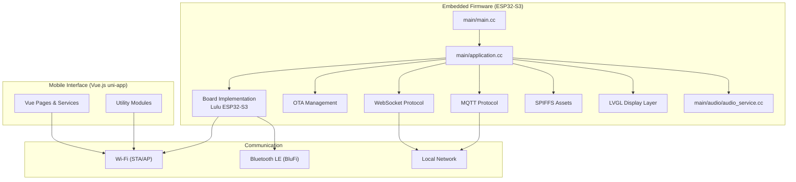
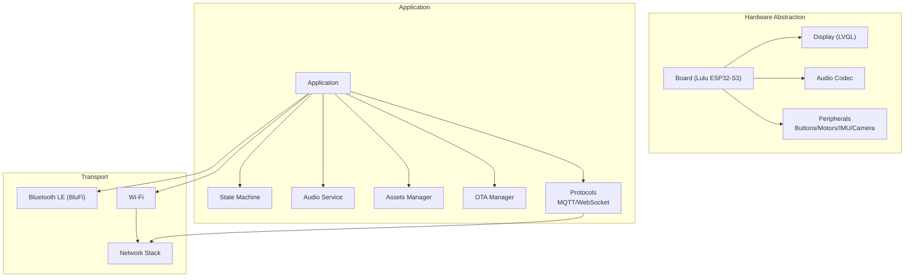
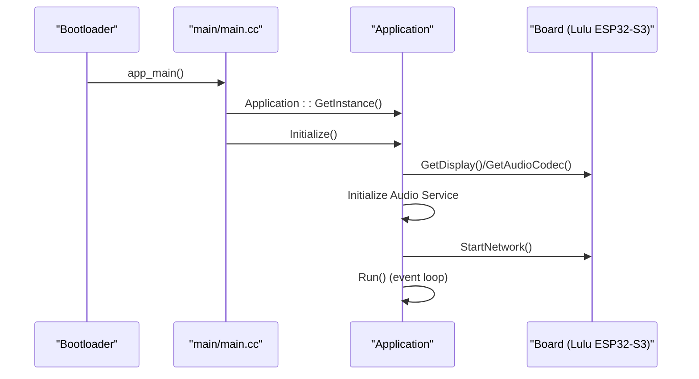
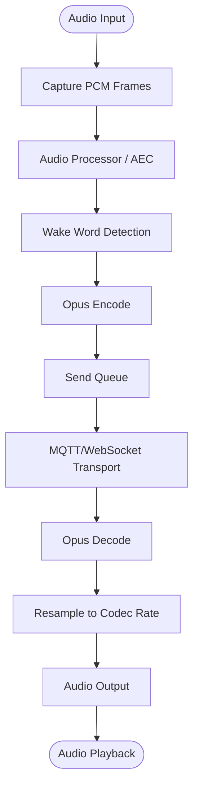
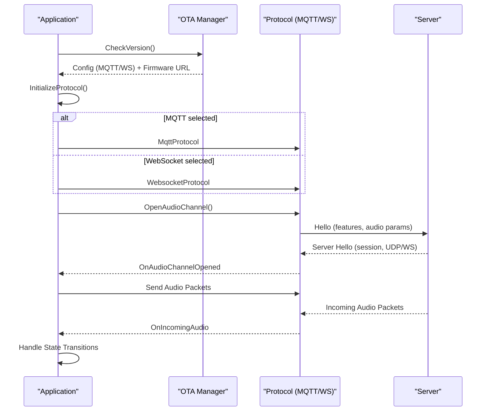
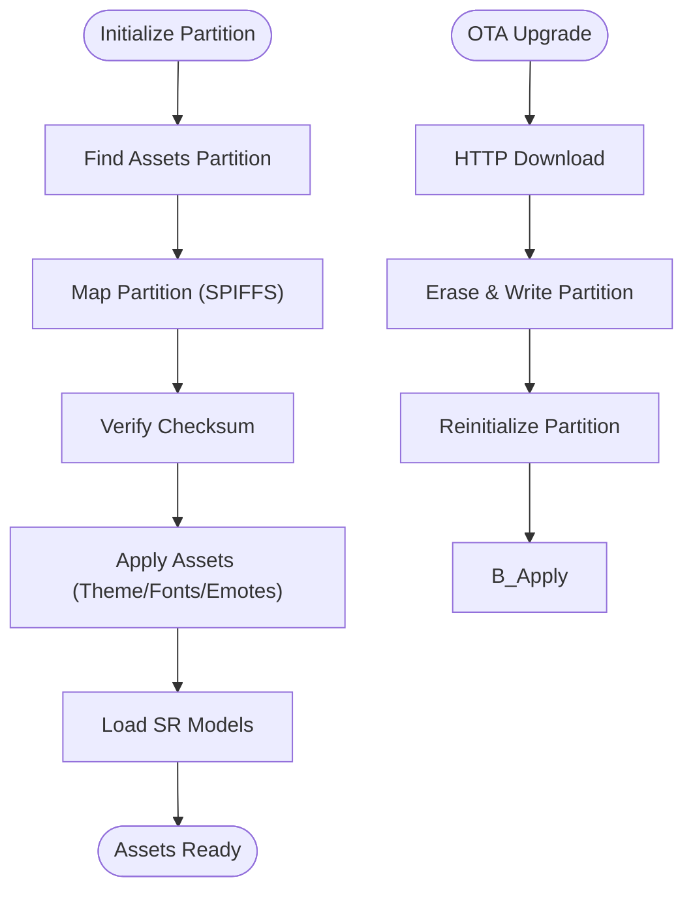
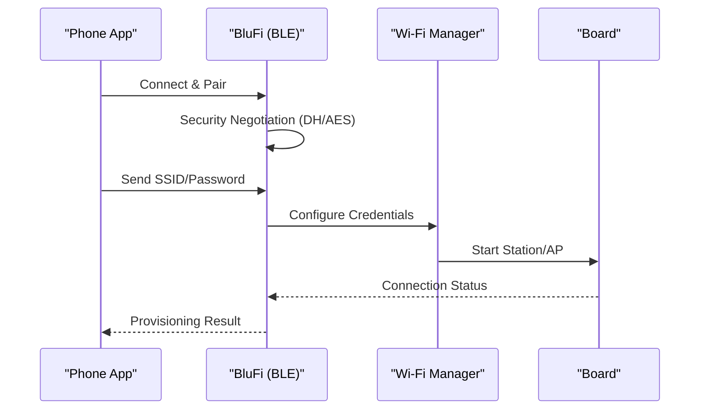
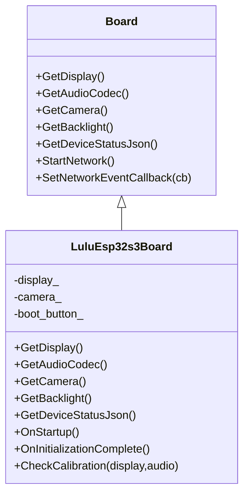
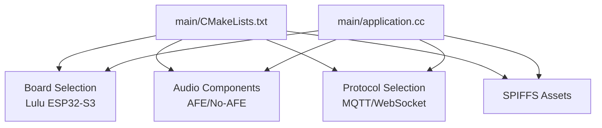

# System Architecture Overview

<cite>
**Referenced Files in This Document**
- [README.md](file://README.md)
- [main/main.cc](file://main/main.cc)
- [main/application.cc](file://main/application.cc)
- [main/CMakeLists.txt](file://main/CMakeLists.txt)
- [main/boards/lulu-esp32s3/lulu-esp32s3.cc](file://main/boards/lulu-esp32s3/lulu-esp32s3.cc)
- [main/protocols/mqtt_protocol.cc](file://main/protocols/mqtt_protocol.cc)
- [main/protocols/websocket_protocol.cc](file://main/protocols/websocket_protocol.cc)
- [main/assets.cc](file://main/assets.cc)
- [main/ota.cc](file://main/ota.cc)
- [main/audio/audio_service.cc](file://main/audio/audio_service.cc)
- [main/boards/common/blufi.cpp](file://main/boards/common/blufi.cpp)
</cite>

## Table of Contents
1. [Introduction](#introduction)
2. [Project Structure](#project-structure)
3. [Core Components](#core-components)
4. [Architecture Overview](#architecture-overview)
5. [Detailed Component Analysis](#detailed-component-analysis)
6. [Dependency Analysis](#dependency-analysis)
7. [Performance Considerations](#performance-considerations)
8. [Troubleshooting Guide](#troubleshooting-guide)
9. [Conclusion](#conclusion)

## Introduction
This document presents the high-level system architecture of RIG-Puppy, a smart robotic dog platform integrating ESP32-S3 embedded firmware with a Vue.js-based mobile interface. The embedded firmware implements real-time audio processing, LVGL-driven graphics, and device control via MQTT/WebSocket protocols. The mobile interface (built with uni-app) enables device configuration, control, and monitoring. Communication pathways include Bluetooth LE for initial Wi-Fi provisioning, local Wi-Fi for ongoing operations, and optional cellular connectivity. Asset management leverages SPIFFS partitions for model storage and OTA updates.

## Project Structure
The repository is organized into:
- Embedded firmware under main/: application lifecycle, audio processing, display, protocols, OTA, and board-specific implementations
- Mobile interface under docs/xiaolu-mini/: Vue.js pages, services, and utilities for device configuration and control
- Scripts under scripts/: asset packaging, conversion, and release automation
- Partitions under partitions/: partition tables for firmware and assets

**Diagram sources**
- [main/main.cc:14-29](file://main/main.cc#L14-L29)
- [main/application.cc:62-178](file://main/application.cc#L62-L178)
- [main/audio/audio_service.cc:40-123](file://main/audio/audio_service.cc#L40-L123)
- [main/boards/lulu-esp32s3/lulu-esp32s3.cc:37-130](file://main/boards/lulu-esp32s3/lulu-esp32s3.cc#L37-L130)
- [main/protocols/mqtt_protocol.cc:55-152](file://main/protocols/mqtt_protocol.cc#L55-L152)
- [main/protocols/websocket_protocol.cc:23-76](file://main/protocols/websocket_protocol.cc#L23-L76)
- [main/assets.cc:53-65](file://main/assets.cc#L53-L65)
- [main/ota.cc:77-244](file://main/ota.cc#L77-L244)
- [main/boards/common/blufi.cpp:104-138](file://main/boards/common/blufi.cpp#L104-L138)

**Section sources**
- [README.md:117-137](file://README.md#L117-L137)
- [main/CMakeLists.txt:1-80](file://main/CMakeLists.txt#L1-L80)

## Core Components
- Application Lifecycle: Initializes NVS, board, display, audio, network, and state machine; drives event loop and protocol activation
- Audio Service: Real-time Opus encoding/decoding, resampling, wake-word detection, and audio processor pipeline
- Protocols: MQTT and WebSocket clients supporting audio streaming and JSON control messages
- Assets Management: SPIFFS partition mapping, checksum verification, and runtime asset loading
- OTA Management: Version checking, firmware upgrade, activation handshake, and server time sync
- Board Abstraction: Lulu ESP32-S3 implementation with display, camera, buttons, motors, and IMU
- Mobile Interface: uni-app pages and services for device configuration and control

**Section sources**
- [main/main.cc:14-29](file://main/main.cc#L14-L29)
- [main/application.cc:24-115](file://main/application.cc#L24-L115)
- [main/audio/audio_service.cc:40-123](file://main/audio/audio_service.cc#L40-L123)
- [main/protocols/mqtt_protocol.cc:13-53](file://main/protocols/mqtt_protocol.cc#L13-L53)
- [main/protocols/websocket_protocol.cc:15-21](file://main/protocols/websocket_protocol.cc#L15-L21)
- [main/assets.cc:30-65](file://main/assets.cc#L30-L65)
- [main/ota.cc:28-44](file://main/ota.cc#L28-L44)
- [main/boards/lulu-esp32s3/lulu-esp32s3.cc:37-130](file://main/boards/lulu-esp32s3/lulu-esp32s3.cc#L37-L130)

## Architecture Overview
The system follows a layered architecture:
- Hardware Abstraction Layer (HAL): Board implementations encapsulate peripherals (display, audio codec, camera, buttons, motors, IMU)
- Application Layer: Central orchestration of UI, audio processing, protocols, OTA, and state machine
- Transport Layer: MQTT and WebSocket protocols for audio streaming and control
- Asset Layer: SPIFFS partition for models and UI assets with checksum validation
- Mobile Interface Layer: uni-app-based web app for device configuration and control

**Diagram sources**
- [main/boards/lulu-esp32s3/lulu-esp32s3.cc:37-130](file://main/boards/lulu-esp32s3/lulu-esp32s3.cc#L37-L130)
- [main/application.cc:62-178](file://main/application.cc#L62-L178)
- [main/audio/audio_service.cc:40-123](file://main/audio/audio_service.cc#L40-L123)
- [main/assets.cc:53-65](file://main/assets.cc#L53-L65)
- [main/ota.cc:77-244](file://main/ota.cc#L77-L244)
- [main/boards/common/blufi.cpp:104-138](file://main/boards/common/blufi.cpp#L104-L138)

## Detailed Component Analysis

### Embedded Firmware Initialization Flow
The firmware entry point initializes NVS, creates the Application singleton, and starts the main event loop.

**Diagram sources**
- [main/main.cc:14-29](file://main/main.cc#L14-L29)
- [main/application.cc:62-178](file://main/application.cc#L62-L178)
- [main/boards/lulu-esp32s3/lulu-esp32s3.cc:37-130](file://main/boards/lulu-esp32s3/lulu-esp32s3.cc#L37-L130)

**Section sources**
- [main/main.cc:14-29](file://main/main.cc#L14-L29)
- [main/application.cc:62-178](file://main/application.cc#L62-L178)

### Audio Processing Pipeline
Real-time audio processing integrates capture, preprocessing, wake-word detection, encoding, and playback.

**Diagram sources**
- [main/audio/audio_service.cc:263-479](file://main/audio/audio_service.cc#L263-L479)
- [main/protocols/mqtt_protocol.cc:166-190](file://main/protocols/mqtt_protocol.cc#L166-L190)
- [main/protocols/websocket_protocol.cc:28-58](file://main/protocols/websocket_protocol.cc#L28-L58)

**Section sources**
- [main/audio/audio_service.cc:40-123](file://main/audio/audio_service.cc#L40-L123)
- [main/audio/audio_service.cc:263-479](file://main/audio/audio_service.cc#L263-L479)

### Protocol Selection and Activation
The Application selects MQTT or WebSocket based on OTA configuration and manages audio channel lifecycle.

**Diagram sources**
- [main/application.cc:497-634](file://main/application.cc#L497-L634)
- [main/ota.cc:146-186](file://main/ota.cc#L146-L186)
- [main/protocols/mqtt_protocol.cc:215-295](file://main/protocols/mqtt_protocol.cc#L215-L295)
- [main/protocols/websocket_protocol.cc:83-201](file://main/protocols/websocket_protocol.cc#L83-L201)

**Section sources**
- [main/application.cc:497-634](file://main/application.cc#L497-L634)
- [main/ota.cc:146-186](file://main/ota.cc#L146-L186)

### Asset Management and OTA Updates
SPIFFS partition is mapped and validated; assets are applied and upgraded via HTTP downloads.

**Diagram sources**
- [main/assets.cc:53-65](file://main/assets.cc#L53-L65)
- [main/assets.cc:130-185](file://main/assets.cc#L130-L185)
- [main/assets.cc:426-560](file://main/assets.cc#L426-L560)
- [main/ota.cc:267-387](file://main/ota.cc#L267-L387)

**Section sources**
- [main/assets.cc:53-65](file://main/assets.cc#L53-L65)
- [main/assets.cc:130-185](file://main/assets.cc#L130-L185)
- [main/assets.cc:426-560](file://main/assets.cc#L426-L560)
- [main/ota.cc:267-387](file://main/ota.cc#L267-L387)

### Bluetooth LE Provisioning (BluFi)
Initial Wi-Fi provisioning uses Bluetooth LE to securely exchange credentials and connect to the network.

**Diagram sources**
- [main/boards/common/blufi.cpp:104-138](file://main/boards/common/blufi.cpp#L104-L138)
- [main/boards/common/blufi.cpp:531-613](file://main/boards/common/blufi.cpp#L531-L613)
- [main/boards/common/blufi.cpp:644-800](file://main/boards/common/blufi.cpp#L644-L800)

**Section sources**
- [main/boards/common/blufi.cpp:104-138](file://main/boards/common/blufi.cpp#L104-L138)
- [main/boards/common/blufi.cpp:531-613](file://main/boards/common/blufi.cpp#L531-L613)

### Board Abstraction: Lulu ESP32-S3
The board implementation wires peripherals, displays, and controls, and exposes device status JSON.

**Diagram sources**
- [main/boards/lulu-esp32s3/lulu-esp32s3.cc:37-130](file://main/boards/lulu-esp32s3/lulu-esp32s3.cc#L37-L130)
- [main/boards/lulu-esp32s3/lulu-esp32s3.cc:656-706](file://main/boards/lulu-esp32s3/lulu-esp32s3.cc#L656-L706)

**Section sources**
- [main/boards/lulu-esp32s3/lulu-esp32s3.cc:37-130](file://main/boards/lulu-esp32s3/lulu-esp32s3.cc#L37-L130)
- [main/boards/lulu-esp32s3/lulu-esp32s3.cc:656-706](file://main/boards/lulu-esp32s3/lulu-esp32s3.cc#L656-L706)

## Dependency Analysis
The build system dynamically selects board implementations and audio components based on Kconfig options. The Application depends on Board, AudioService, Protocols, Assets, OTA, and Settings.

**Diagram sources**
- [main/CMakeLists.txt:67-726](file://main/CMakeLists.txt#L67-L726)
- [main/application.cc:62-178](file://main/application.cc#L62-L178)

**Section sources**
- [main/CMakeLists.txt:67-726](file://main/CMakeLists.txt#L67-L726)
- [main/application.cc:62-178](file://main/application.cc#L62-L178)

## Performance Considerations
- Audio processing utilizes PSRAM-backed task stacks and resampling to maintain low latency
- Event-driven architecture with FreeRTOS event groups minimizes blocking and maximizes responsiveness
- OTA and assets upgrades leverage sector-erase writes and checksum validation to ensure reliability
- Power management toggles codec input/output to reduce power consumption when idle

[No sources needed since this section provides general guidance]

## Troubleshooting Guide
- Network connectivity issues: Monitor Wi-Fi scanning and connection events; verify BluFi provisioning and server reachability
- Audio quality problems: Check sample rate mismatches and resampling; validate AEC settings and VAD behavior
- OTA failures: Confirm partition size, checksum, and server responses; ensure proper rollback marking
- Asset loading errors: Verify SPIFFS partition presence and checksum validity; confirm index.json correctness

**Section sources**
- [main/application.cc:178-276](file://main/application.cc#L178-L276)
- [main/audio/audio_service.cc:715-728](file://main/audio/audio_service.cc#L715-L728)
- [main/ota.cc:267-387](file://main/ota.cc#L267-L387)
- [main/assets.cc:130-185](file://main/assets.cc#L130-L185)

## Conclusion
RIG-Puppy’s architecture cleanly separates hardware abstraction, application logic, and user interface concerns. The ESP32-S3 firmware provides robust real-time audio processing, flexible protocol support, and reliable asset/OTA management. The uni-app-based mobile interface offers intuitive device configuration and control. The system’s modular design facilitates extensibility and maintenance across firmware and mobile components.