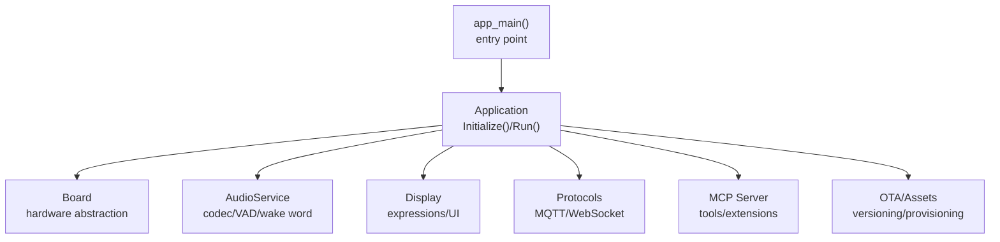
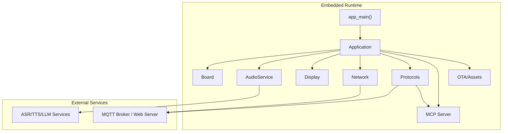
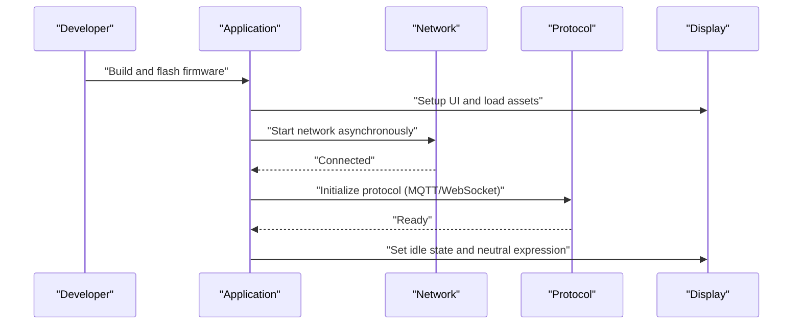
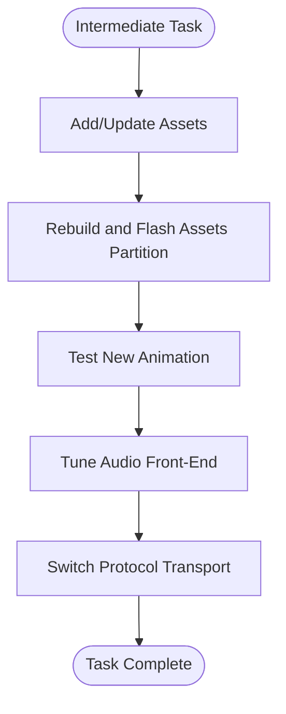
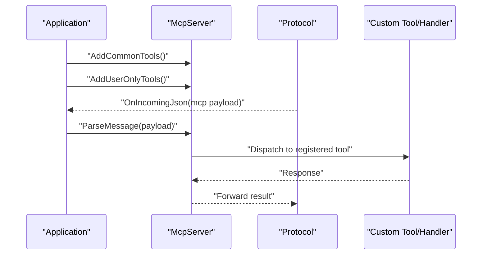
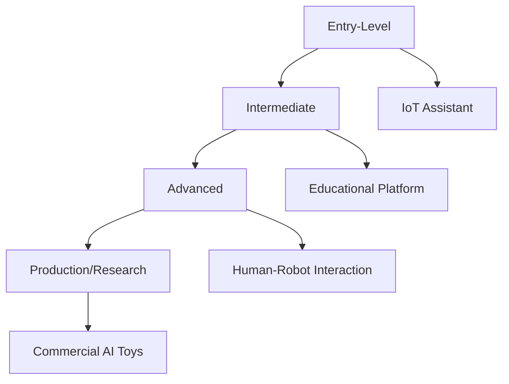
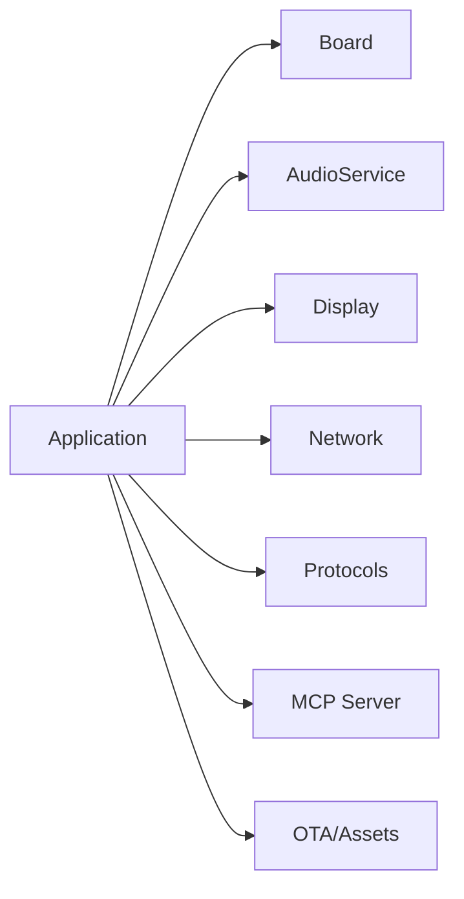

# Target Audience and Use Cases

<cite>
**Referenced Files in This Document**
- [README.md](file://README.md)
- [main.cc](file://main/main.cc)
- [application.cc](file://main/application.cc)
- [board.cc](file://main/boards/common/board.cc)
- [Kconfig.projbuild](file://main/Kconfig.projbuild)
- [CMakeLists.txt](file://main/CMakeLists.txt)
</cite>

## Table of Contents
1. [Introduction](#introduction)
2. [Project Structure](#project-structure)
3. [Core Components](#core-components)
4. [Architecture Overview](#architecture-overview)
5. [Detailed Component Analysis](#detailed-component-analysis)
6. [Dependency Analysis](#dependency-analysis)
7. [Performance Considerations](#performance-considerations)
8. [Troubleshooting Guide](#troubleshooting-guide)
9. [Conclusion](#conclusion)
10. [Appendices](#appendices)

## Introduction
This document describes the target audiences and use cases for the RIG-Puppy platform. It focuses on who can benefit from this platform and how, grounded in the platform’s capabilities and codebase. The primary audiences include:
- Embedded systems developers learning ESP-IDF and real-time programming
- Robotics hobbyists interested in AI integration
- Educators teaching embedded systems and AI concepts
- Makers exploring IoT device development

Use cases span from entry-level device setup and basic voice interaction to intermediate custom behaviors and animations, and advanced applications such as custom MCP tools and protocol extensions. The platform supports diverse hardware configurations and communication protocols, enabling rapid prototyping and production-ready deployments across domains like home automation assistants, educational robotics, research prototypes for human-robot interaction, and commercial AI toys.

## Project Structure
RIG-Puppy is an ESP-IDF-based embedded application targeting ESP32-S3. The repository organizes functionality into modular components:
- Application lifecycle and state machine orchestration
- Audio pipeline for wake word detection, VAD, ASR/TTS, and playback
- Display subsystem for animated expressions and UI
- Network stack for provisioning, OTA, and protocol transport
- Board abstraction layer supporting multiple hardware variants
- MCP server for extensibility and tooling

**Diagram sources**
- [main.cc:14-29](file://main/main.cc#L14-L29)
- [application.cc:62-178](file://main/application.cc#L62-L178)
- [board.cc:15-68](file://main/boards/common/board.cc#L15-L68)

**Section sources**
- [README.md:117-137](file://README.md#L117-L137)
- [main.cc:14-29](file://main/main.cc#L14-L29)
- [application.cc:62-178](file://main/application.cc#L62-L178)

## Core Components
- Application lifecycle: Initializes hardware, loads assets, sets up audio and display, manages network and state transitions, and orchestrates protocol communication.
- Board abstraction: Provides hardware identity, optional peripherals, and calibration routines.
- Audio pipeline: Integrates wake word detection, voice activity detection, and audio streaming to remote services.
- Display subsystem: Manages expression animations and chat UI.
- Protocols: Supports MQTT and WebSocket transports for bidirectional messaging.
- MCP server: Enables runtime tooling and protocol extension via a message-driven interface.
- OTA and assets: Handles firmware upgrades, asset versioning, and resource provisioning.

These components collectively enable a wide range of use cases from simple voice assistants to complex interactive robots.

**Section sources**
- [application.cc:62-178](file://main/application.cc#L62-L178)
- [board.cc:15-68](file://main/boards/common/board.cc#L15-L68)
- [application.cc:497-634](file://main/application.cc#L497-L634)
- [application.cc:111-115](file://main/application.cc#L111-L115)

## Architecture Overview
The platform follows a modular, event-driven architecture:
- The main task initializes the Application and enters a long-running event loop.
- The Application coordinates hardware, audio, display, networking, and protocol layers.
- The Board abstraction isolates hardware differences across supported targets.
- The MCP server exposes a common toolset and accepts user-defined tools for extensibility.
- Protocols encapsulate transport-specific logic for MQTT and WebSocket.

**Diagram sources**
- [main.cc:14-29](file://main/main.cc#L14-L29)
- [application.cc:62-178](file://main/application.cc#L62-L178)
- [application.cc:497-634](file://main/application.cc#L497-L634)

## Detailed Component Analysis

### Target Audiences and Use Cases

- Embedded systems developers learning ESP-IDF and real-time programming
  - Entry-level scenario: Build, flash, and observe device boot, UI, and basic voice interaction.
  - Intermediate scenario: Customize expressions, add new sounds, and adjust audio processing parameters.
  - Advanced scenario: Implement custom MCP tools, extend protocol handlers, and optimize power/performance.

- Robotics hobbyists interested in AI integration
  - Entry-level scenario: Pair device with a mobile app, configure Wi-Fi, and test voice commands.
  - Intermediate scenario: Program simple behaviors (e.g., head movement on wake word) and animate facial expressions.
  - Advanced scenario: Integrate external sensors, actuators, and custom motion control logic.

- Educators teaching embedded systems and AI concepts
  - Entry-level scenario: Demonstrate device setup, asset loading, and network provisioning.
  - Intermediate scenario: Explore audio front-end tuning, speech recognition latency, and display rendering.
  - Advanced scenario: Use MCP tools to inspect runtime state, log metrics, and validate protocol behavior.

- Makers exploring IoT device development
  - Entry-level scenario: Flash firmware, connect to Wi-Fi, and trigger basic voice interactions.
  - Intermediate scenario: Add custom animations, localize audio assets, and integrate with home automation hubs.
  - Advanced scenario: Develop custom protocol extensions, implement secure activation, and manage OTA updates.

Use cases mapped to platform capabilities:
- Home automation assistants: Voice-triggered actions, status feedback via expressions, and OTA updates.
- Educational robotics platforms: Interactive lessons combining speech, motion, and visuals.
- Research prototypes for human-robot interaction: Extensible MCP tools for logging, telemetry, and behavior analysis.
- Commercial AI toy development: Rapid iteration on expressive animations, voice synthesis, and secure device activation.

Success stories and community contributions:
- The platform supports a broad ecosystem of compatible boards and targets, enabling diverse form factors and feature sets.
- The MCP server and protocol abstractions facilitate community-driven tooling and extensions.
- Asset and OTA mechanisms streamline iterative development and product deployment.

**Section sources**
- [README.md:51-82](file://README.md#L51-L82)
- [README.md:139-163](file://README.md#L139-L163)
- [Kconfig.projbuild:80-443](file://main/Kconfig.projbuild#L80-L443)

### Entry-Level Scenarios
- Device setup and basic voice interaction
  - Build and flash firmware for ESP32-S3.
  - Configure Wi-Fi via Bluetooth-assisted provisioning.
  - Trigger wake word detection and observe response via audio and display.

**Diagram sources**
- [main.cc:14-29](file://main/main.cc#L14-L29)
- [application.cc:62-178](file://main/application.cc#L62-L178)
- [application.cc:497-634](file://main/application.cc#L497-L634)

**Section sources**
- [README.md:51-82](file://README.md#L51-L82)
- [application.cc:62-178](file://main/application.cc#L62-L178)

### Intermediate Use Cases
- Custom behaviors and animations
  - Add new EAF animations and update configuration.
  - Localize audio assets and rebuild assets partition.
  - Adjust audio processing parameters and observe effects on speech quality.

- Protocol and transport customization
  - Switch between MQTT and WebSocket based on environment.
  - Extend protocol message handling for custom payloads.

**Diagram sources**
- [README.md:139-163](file://README.md#L139-L163)
- [application.cc:497-634](file://main/application.cc#L497-L634)

**Section sources**
- [README.md:139-163](file://README.md#L139-L163)
- [application.cc:497-634](file://main/application.cc#L497-L634)

### Advanced Applications
- Custom MCP tools and protocol extensions
  - Register common and user-only tools during initialization.
  - Parse and route incoming MCP messages to specialized handlers.
  - Implement custom protocol handlers for domain-specific transports.

**Diagram sources**
- [application.cc:111-115](file://main/application.cc#L111-L115)
- [application.cc:589-594](file://main/application.cc#L589-L594)

**Section sources**
- [application.cc:111-115](file://main/application.cc#L111-L115)
- [application.cc:589-594](file://main/application.cc#L589-L594)

### Conceptual Overview
The platform’s flexibility enables cross-domain applications:
- Home automation: Voice commands trigger actions; device status is conveyed via expressions.
- Education: Students learn embedded concepts through hands-on experimentation with audio, display, and networking.
- Research: Developers instrument runtime behavior with MCP tools and analyze interaction logs.
- Industry: Makers and startups iterate quickly on expressive AI devices with OTA and asset management.

[No sources needed since this diagram shows conceptual workflow, not actual code structure]

[No sources needed since this section doesn't analyze specific source files]

## Dependency Analysis
The application depends on a layered set of components:
- Hardware abstraction via Board
- Audio and display services
- Network and protocol layers
- MCP server for extensibility
- OTA and assets for provisioning

**Diagram sources**
- [application.cc:62-178](file://main/application.cc#L62-L178)
- [board.cc:15-68](file://main/boards/common/board.cc#L15-L68)

**Section sources**
- [application.cc:62-178](file://main/application.cc#L62-L178)
- [board.cc:15-68](file://main/boards/common/board.cc#L15-L68)

## Performance Considerations
- Power management: The platform adjusts power save levels based on network and audio activity to balance performance and battery life.
- Audio processing: Resampling warnings highlight the importance of aligning server and device sample rates to minimize artifacts.
- Resource utilization: Periodic heap statistics printing helps track memory usage during extended operation.

[No sources needed since this section provides general guidance]

## Troubleshooting Guide
- Network connectivity issues: Verify provisioning mode and AP scanning limits; ensure credentials are stored and retrieved correctly.
- Wake word responsiveness: Confirm proper initialization order and avoid conflicting audio operations.
- Servo jitter: Validate calibration and power stability.
- Protocol errors: Inspect network error callbacks and alert handling for actionable diagnostics.

**Section sources**
- [application.cc:278-314](file://main/application.cc#L278-L314)
- [application.cc:517-521](file://main/application.cc#L517-L521)
- [README.md:196-206](file://README.md#L196-L206)

## Conclusion
RIG-Puppy offers a versatile foundation for building intelligent, expressive embedded devices across multiple domains. Its modular architecture, robust protocol support, and extensible MCP server enable users to start simple and scale to sophisticated applications. By aligning use cases with the platform’s capabilities—voice interaction, expressive displays, real-time audio processing, and secure provisioning—the target audiences can achieve rapid results while maintaining flexibility for advanced customization.

[No sources needed since this section summarizes without analyzing specific files]

## Appendices
- Supported boards and targets: The platform includes numerous board types and targets, enabling diverse hardware configurations and use cases.

**Section sources**
- [Kconfig.projbuild:80-443](file://main/Kconfig.projbuild#L80-L443)
- [CMakeLists.txt:816-852](file://main/CMakeLists.txt#L816-L852)