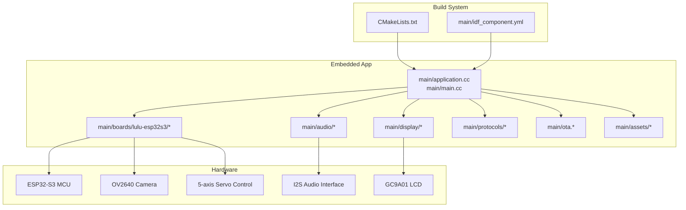
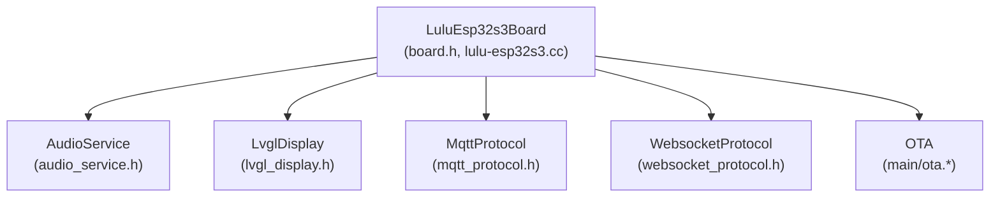
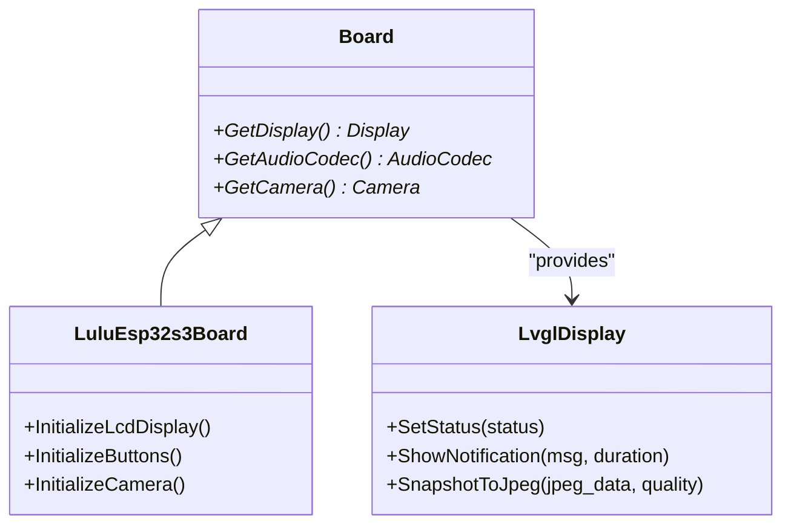
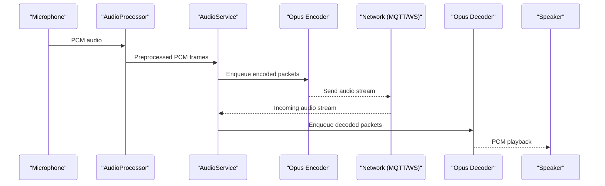
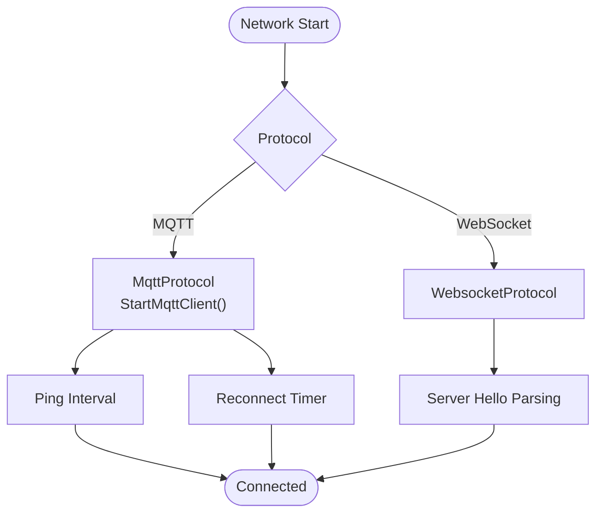
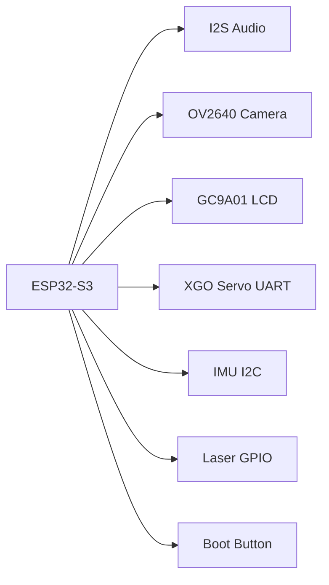
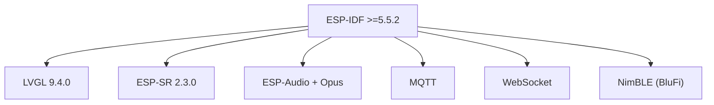

# Technology Stack

<cite>
**Referenced Files in This Document**
- [CMakeLists.txt](file://CMakeLists.txt)
- [idf_component.yml](file://main/idf_component.yml)
- [sdkconfig.defaults](file://sdkconfig.defaults)
- [sdkconfig.defaults.esp32s3](file://sdkconfig.defaults.esp32s3)
- [README.md](file://README.md)
- [audio_service.h](file://main/audio/audio_service.h)
- [lvgl_display.h](file://main/display/lvgl_display/lvgl_display.h)
- [config.h](file://main/boards/lulu-esp32s3/config.h)
- [lulu-esp32s3.cc](file://main/boards/lulu-esp32s3/lulu-esp32s3.cc)
- [mqtt_protocol.h](file://main/protocols/mqtt_protocol.h)
- [websocket_protocol.h](file://main/protocols/websocket_protocol.h)
- [board.h](file://main/boards/common/board.h)
- [versions.py](file://scripts/versions.py)
</cite>

## Table of Contents
1. [Introduction](#introduction)
2. [Project Structure](#project-structure)
3. [Core Components](#core-components)
4. [Architecture Overview](#architecture-overview)
5. [Detailed Component Analysis](#detailed-component-analysis)
6. [Dependency Analysis](#dependency-analysis)
7. [Performance Considerations](#performance-considerations)
8. [Troubleshooting Guide](#troubleshooting-guide)
9. [Conclusion](#conclusion)
10. [Appendices](#appendices)

## Introduction
This document describes the complete technology stack for the RIG-Puppy embedded robot firmware. It covers the embedded development platform (ESP-IDF), real-time operating system (FreeRTOS), speech recognition (ESP-SR), graphics and UI (LVGL), audio processing (ESP-Audio/Opus), networking (MQTT/WebSocket/Bluetooth LE), and the build system (CMake/IDF Component Manager). It also documents hardware components and pin mappings for the ESP32-S3-based LULU board, along with version compatibility and dependency relationships.

## Project Structure
The repository is organized around an ESP-IDF main application with modular subsystems:
- Embedded application and drivers under main/
- Build configuration via CMake and ESP-IDF
- Hardware abstraction for the LULU board under main/boards/lulu-esp32s3/
- Audio processing, display, protocols, OTA, and assets
- Scripts for asset conversion and firmware packaging

**Diagram sources**
- [CMakeLists.txt:1-14](file://CMakeLists.txt#L1-L14)
- [idf_component.yml:1-128](file://main/idf_component.yml#L1-L128)
- [lulu-esp32s3.cc:1-778](file://main/boards/lulu-esp32s3/lulu-esp32s3.cc#L1-L778)

**Section sources**
- [CMakeLists.txt:1-14](file://CMakeLists.txt#L1-L14)
- [README.md:117-137](file://README.md#L117-L137)

## Core Components
- Embedded framework and OS
  - ESP-IDF v5.5.2+ (required)
  - FreeRTOS kernel (enabled via SDK configuration)
- Speech recognition
  - ESP-SR v2.3.0 (via IDF Component Manager)
- Graphics and UI
  - LVGL v9.4.0 (via IDF Component Manager)
- Audio processing
  - ESP-Audio stack and Opus codec integration
- Networking
  - MQTT and WebSocket client protocols
  - Bluetooth LE (NimBLE) for BluFi provisioning
- Build system
  - CMake + ESP-IDF project.cmake
  - IDF Component Manager for dependencies
  - Python-based asset conversion and packaging scripts

**Section sources**
- [idf_component.yml:125-128](file://main/idf_component.yml#L125-L128)
- [sdkconfig.defaults:22-25](file://sdkconfig.defaults#L22-L25)
- [sdkconfig.defaults.esp32s3:38-57](file://sdkconfig.defaults.esp32s3#L38-L57)

## Architecture Overview
The system architecture integrates a board abstraction layer with audio, display, and protocol stacks. The LULU board initializes peripherals (I2S, SPI, UART), manages servo control, and coordinates UI updates and audio streaming.

**Diagram sources**
- [board.h:52-93](file://main/boards/common/board.h#L52-L93)
- [lulu-esp32s3.cc:37-778](file://main/boards/lulu-esp32s3/lulu-esp32s3.cc#L37-L778)
- [audio_service.h:106-204](file://main/audio/audio_service.h#L106-L204)
- [lvgl_display.h:15-54](file://main/display/lvgl_display/lvgl_display.h#L15-L54)
- [mqtt_protocol.h:26-66](file://main/protocols/mqtt_protocol.h#L26-L66)
- [websocket_protocol.h:13-35](file://main/protocols/websocket_protocol.h#L13-L35)

## Detailed Component Analysis

### Embedded Development Stack
- ESP-IDF framework
  - Version requirement: >=5.5.2 enforced in component manifest
  - Minimal build enabled to trim components
- C++ runtime
  - Exceptions and RTTI enabled for robustness
- FreeRTOS
  - Run-time stats and configurable tick (1000 Hz on ESP32-S3)
- Build system
  - CMake + project.cmake
  - IDF Component Manager for external components

**Section sources**
- [idf_component.yml:125-128](file://main/idf_component.yml#L125-L128)
- [CMakeLists.txt:8-14](file://CMakeLists.txt#L8-L14)
- [sdkconfig.defaults:22-25](file://sdkconfig.defaults#L22-L25)
- [sdkconfig.defaults.esp32s3:36](file://sdkconfig.defaults.esp32s3#L36)

### Speech Recognition (ESP-SR)
- ESP-SR v2.3.0 integrated via IDF Component Manager
- Wake word detection and model management supported
- Audio pipeline includes wake word capture and downstream processing

**Section sources**
- [idf_component.yml:34](file://main/idf_component.yml#L34)
- [audio_service.h:136-137](file://main/audio/audio_service.h#L136-L137)

### Graphics and UI Stack (LVGL + Display)
- LVGL v9.4.0 integrated via IDF Component Manager
- Emote/AE animation playback via EmoteDisplay
- SPI-based GC9A01 LCD with rotation/mirror/invert configuration
- Status bar, notifications, and snapshot-to-JPEG support

**Diagram sources**
- [board.h:52-93](file://main/boards/common/board.h#L52-L93)
- [lulu-esp32s3.cc:98-130](file://main/boards/lulu-esp32s3/lulu-esp32s3.cc#L98-L130)
- [lvgl_display.h:15-54](file://main/display/lvgl_display/lvgl_display.h#L15-L54)

**Section sources**
- [lvgl_display.h:15-54](file://main/display/lvgl_display/lvgl_display.h#L15-L54)
- [lulu-esp32s3.cc:98-130](file://main/boards/lulu-esp32s3/lulu-esp32s3.cc#L98-L130)

### Audio Processing Stack (ESP-Audio + Opus)
- AudioService orchestrates:
  - Audio input task and resamplers
  - Opus encoder/decoder tasks
  - Queues for encode/send and decode/playback
  - Wake word detection and VAD integration
- Opus configuration supports 16 kHz sampling, mono, variable bitrate, DTX/VBR, and configurable frame durations
- Real-time buffering and power-aware shutdown timers

**Diagram sources**
- [audio_service.h:29-50](file://main/audio/audio_service.h#L29-L50)
- [audio_service.h:66-77](file://main/audio/audio_service.h#L66-L77)
- [audio_service.h:196-202](file://main/audio/audio_service.h#L196-L202)

**Section sources**
- [audio_service.h:106-204](file://main/audio/audio_service.h#L106-L204)

### Networking Libraries
- MQTT
  - MqttProtocol wraps MQTT client lifecycle, ping intervals, reconnects, AES nonce handling, and UDP-based media channels
- WebSocket
  - WebsocketProtocol provides audio channel open/close and text messaging
- Bluetooth LE (NimBLE)
  - Enabled for BluFi Wi-Fi provisioning on ESP32-S3

**Diagram sources**
- [mqtt_protocol.h:26-66](file://main/protocols/mqtt_protocol.h#L26-L66)
- [websocket_protocol.h:13-35](file://main/protocols/websocket_protocol.h#L13-L35)
- [sdkconfig.defaults.esp32s3:38-57](file://sdkconfig.defaults.esp32s3#L38-L57)

**Section sources**
- [mqtt_protocol.h:26-66](file://main/protocols/mqtt_protocol.h#L26-L66)
- [websocket_protocol.h:13-35](file://main/protocols/websocket_protocol.h#L13-L35)
- [sdkconfig.defaults.esp32s3:38-57](file://sdkconfig.defaults.esp32s3#L38-L57)

### Build System and Asset Tooling
- CMake + ESP-IDF
  - project.cmake inclusion and minimal build trimming
- IDF Component Manager
  - Dependencies pinned by version ranges and target rules
- Python scripts
  - Firmware packaging and metadata extraction
  - Binary parsing, OSS upload, and server reporting

**Section sources**
- [CMakeLists.txt:8-14](file://CMakeLists.txt#L8-L14)
- [idf_component.yml:1-128](file://main/idf_component.yml#L1-L128)
- [versions.py:1-250](file://scripts/versions.py#L1-L250)

### Hardware Components and Pin Mapping (ESP32-S3 LULU Board)
- MCU: ESP32-S3 (N16R8)
- I2S audio: simplex or duplex configuration selectable
- Camera: OV2640 via SCCB/I2C and parallel interface pins
- Display: GC9A01 240x240 round LCD over SPI
- Servo control: UART-based XGO protocol with dedicated RX/TX pins
- IMU: I2C on separate SDA/SCL pins
- Laser: GPIO-controlled pin
- Buttons and LEDs: GPIO-based peripherals

**Diagram sources**
- [config.h:6-91](file://main/boards/lulu-esp32s3/config.h#L6-L91)
- [lulu-esp32s3.cc:48-96](file://main/boards/lulu-esp32s3/lulu-esp32s3.cc#L48-L96)
- [lulu-esp32s3.cc:132-183](file://main/boards/lulu-esp32s3/lulu-esp32s3.cc#L132-L183)
- [lulu-esp32s3.cc:634-653](file://main/boards/lulu-esp32s3/lulu-esp32s3.cc#L634-L653)

**Section sources**
- [config.h:6-91](file://main/boards/lulu-esp32s3/config.h#L6-L91)
- [lulu-esp32s3.cc:98-130](file://main/boards/lulu-esp32s3/lulu-esp32s3.cc#L98-L130)

## Dependency Analysis
- IDF version constraint: >=5.5.2
- LVGL: v9.4.0
- ESP-SR: v2.3.0
- ESP-Audio/codec: integrated via ESP-IDF components
- MQTT/WebSocket: ESP-IDF network clients
- Bluetooth LE: NimBLE stack enabled for BluFi

**Diagram sources**
- [idf_component.yml:125-128](file://main/idf_component.yml#L125-L128)
- [sdkconfig.defaults.esp32s3:38-57](file://sdkconfig.defaults.esp32s3#L38-L57)

**Section sources**
- [idf_component.yml:125-128](file://main/idf_component.yml#L125-L128)
- [sdkconfig.defaults.esp32s3:38-57](file://sdkconfig.defaults.esp32s3#L38-L57)

## Performance Considerations
- Audio processing uses dedicated tasks and PSRAM-backed stacks to minimize latency and jitter.
- LVGL rendering is configured to disable heavy widgets and enable snapshot support for efficient UI updates.
- ESP32-S3 overclock and SPIRAM settings tuned for multimedia performance.
- Power-aware timers and idle checks prevent unnecessary CPU wake-ups during audio inactivity.

[No sources needed since this section provides general guidance]

## Troubleshooting Guide
- WiFi scan/list timeouts: constrained AP list size and signal-based ordering.
- Slow wake word responsiveness: ensure emotion state is set after enabling voice processing.
- Servo jitter: verify calibration values and power stability.

**Section sources**
- [README.md:196-206](file://README.md#L196-L206)

## Conclusion
RIG-Puppy integrates a modern embedded stack centered on ESP-IDF v5.5.2+, FreeRTOS, LVGL v9.4.0, ESP-SR, and ESP-Audio/Opus. The LULU board provides a cohesive hardware platform with I2S audio, camera, GC9A01 display, servo control, and Bluetooth LE provisioning. The build system leverages CMake and IDF Component Manager, while Python scripts streamline asset conversion and firmware packaging.

[No sources needed since this section summarizes without analyzing specific files]

## Appendices

### Version Compatibility Matrix
- ESP-IDF: >=5.5.2
- LVGL: 9.4.0
- ESP-SR: 2.3.0
- MQTT/WebSocket: ESP-IDF network clients
- NimBLE: enabled for BluFi on ESP32-S3

**Section sources**
- [idf_component.yml:125-128](file://main/idf_component.yml#L125-L128)
- [sdkconfig.defaults.esp32s3:38-57](file://sdkconfig.defaults.esp32s3#L38-L57)