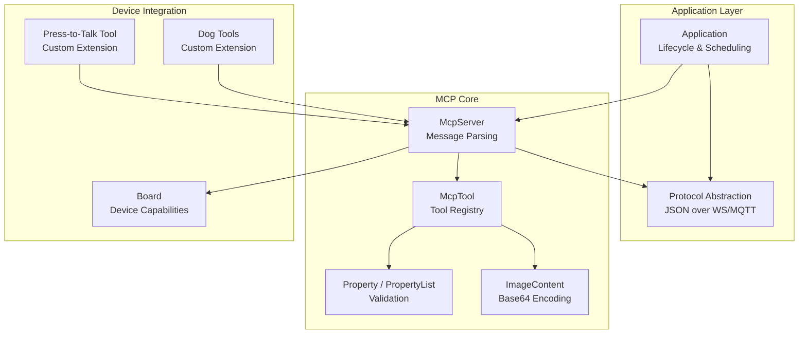
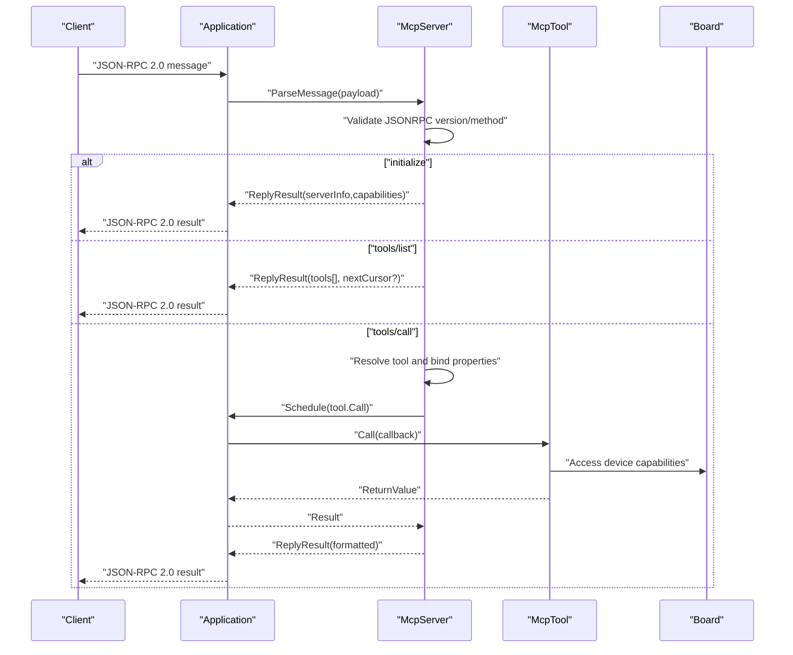
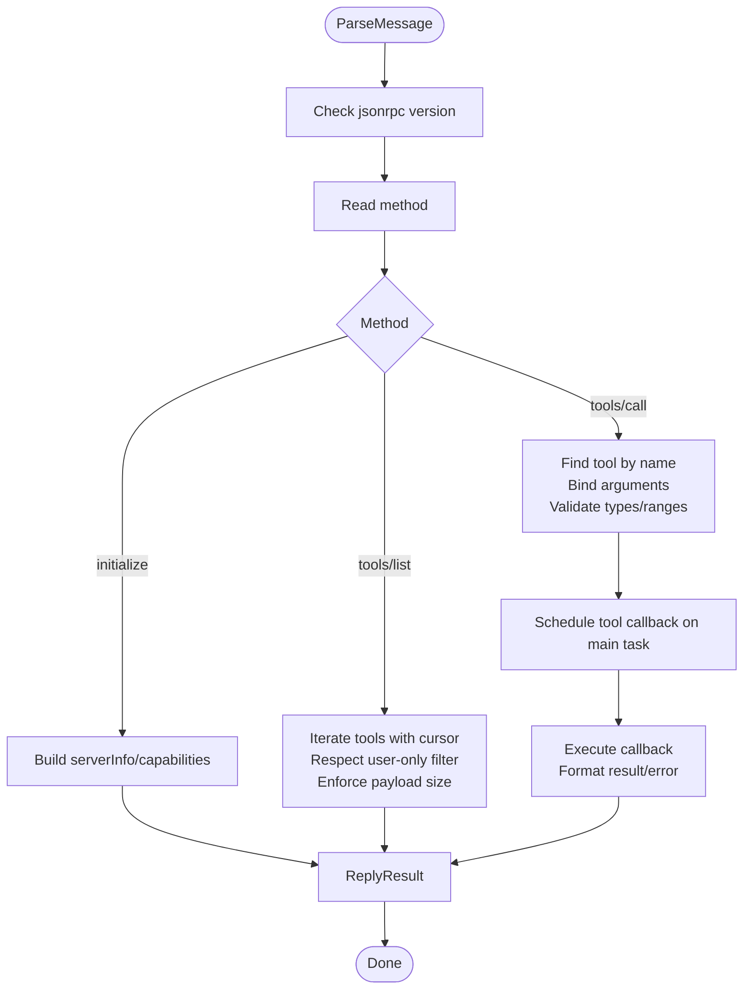
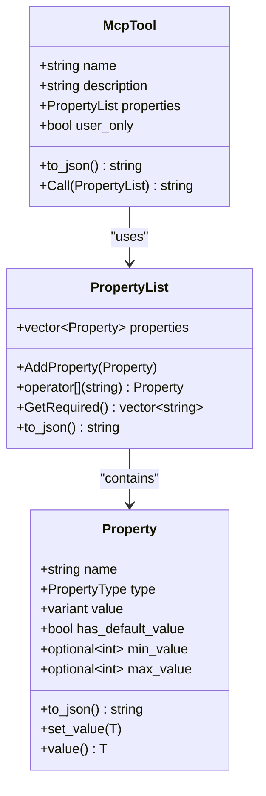
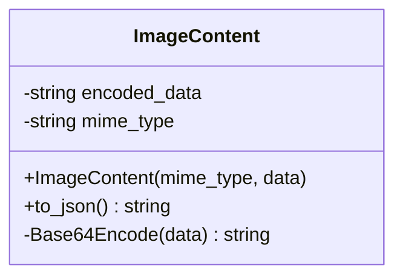
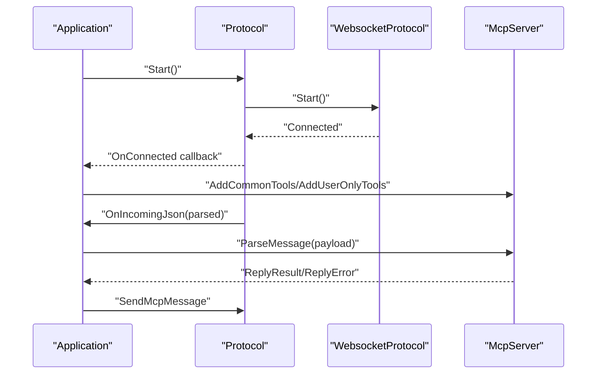
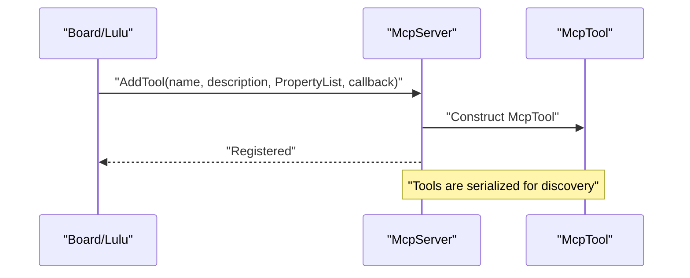
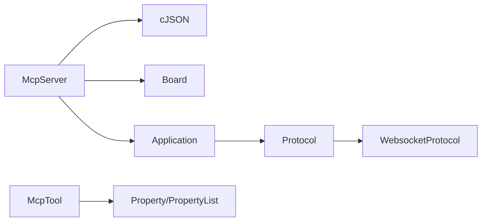

# Remote Control Framework (MCP)

<cite>
**Referenced Files in This Document**
- [mcp_server.h](file://main/mcp_server.h)
- [mcp_server.cc](file://main/mcp_server.cc)
- [application.h](file://main/application.h)
- [application.cc](file://main/application.cc)
- [main.cc](file://main/main.cc)
- [protocol.h](file://main/protocols/protocol.h)
- [websocket_protocol.h](file://main/protocols/websocket_protocol.h)
- [board.h](file://main/boards/common/board.h)
- [press_to_talk_mcp_tool.h](file://main/boards/common/press_to_talk_mcp_tool.h)
- [press_to_talk_mcp_tool.cc](file://main/boards/common/press_to_talk_mcp_tool.cc)
- [lulu-esp32s3.cc](file://main/boards/lulu-esp32s3/lulu-esp32s3.cc)
</cite>

## Table of Contents
1. [Introduction](#introduction)
2. [Project Structure](#project-structure)
3. [Core Components](#core-components)
4. [Architecture Overview](#architecture-overview)
5. [Detailed Component Analysis](#detailed-component-analysis)
6. [Dependency Analysis](#dependency-analysis)
7. [Performance Considerations](#performance-considerations)
8. [Troubleshooting Guide](#troubleshooting-guide)
9. [Conclusion](#conclusion)
10. [Appendices](#appendices)

## Introduction
This document describes the Machine Control Protocol (MCP) framework used to enable secure, extensible remote control of embedded devices. The framework supports:
- Secure command execution via JSON-RPC 2.0 over WebSocket/MQTT transport
- Dynamic tool registration for device capabilities
- Property validation and type safety for parameters
- Status reporting and image content encoding
- Concurrency handling with a main-thread scheduler
- Extensibility for custom tools and integration with external systems

The MCP server exposes a standardized interface for clients to discover tools, invoke commands, and receive structured responses, while the application orchestrates protocol transport and device state.

## Project Structure
The MCP implementation centers around a small set of core files:
- MCP server and tool model: mcp_server.h/.cc
- Application lifecycle and transport: application.h/.cc and main.cc
- Transport abstraction: protocol.h and websocket_protocol.h
- Board abstraction and device capabilities: board.h
- Example custom tools: press_to_talk_mcp_tool.* and lulu-esp32s3.cc

**Diagram sources**
- [mcp_server.h:16-344](file://main/mcp_server.h#L16-L344)
- [mcp_server.cc:1-581](file://main/mcp_server.cc#L1-L581)
- [application.h:42-195](file://main/application.h#L42-L195)
- [application.cc:1-1133](file://main/application.cc#L1-L1133)
- [protocol.h:44-99](file://main/protocols/protocol.h#L44-L99)
- [websocket_protocol.h:13-35](file://main/protocols/websocket_protocol.h#L13-L35)
- [board.h:52-101](file://main/boards/common/board.h#L52-L101)
- [press_to_talk_mcp_tool.h:8-29](file://main/boards/common/press_to_talk_mcp_tool.h#L8-L29)
- [press_to_talk_mcp_tool.cc:6-57](file://main/boards/common/press_to_talk_mcp_tool.cc#L6-L57)
- [lulu-esp32s3.cc:347-373](file://main/boards/lulu-esp32s3/lulu-esp32s3.cc#L347-L373)

**Section sources**
- [mcp_server.h:1-345](file://main/mcp_server.h#L1-L345)
- [mcp_server.cc:1-581](file://main/mcp_server.cc#L1-L581)
- [application.h:1-195](file://main/application.h#L1-L195)
- [application.cc:1-1133](file://main/application.cc#L1-L1133)
- [protocol.h:1-99](file://main/protocols/protocol.h#L1-L99)
- [websocket_protocol.h:1-35](file://main/protocols/websocket_protocol.h#L1-L35)
- [board.h:1-101](file://main/boards/common/board.h#L1-L101)
- [press_to_talk_mcp_tool.h:1-29](file://main/boards/common/press_to_talk_mcp_tool.h#L1-L29)
- [press_to_talk_mcp_tool.cc:1-57](file://main/boards/common/press_to_talk_mcp_tool.cc#L1-L57)
- [lulu-esp32s3.cc:347-373](file://main/boards/lulu-esp32s3/lulu-esp32s3.cc#L347-L373)

## Core Components
- McpServer: Central message router implementing JSON-RPC 2.0 methods initialize, tools/list, and tools/call. It validates messages, manages tool discovery, and dispatches calls to registered tools.
- McpTool: Encapsulates a callable capability with a name, description, input schema (PropertyList), and callback. Supports an “audience” annotation to hide tools from AI agents.
- Property and PropertyList: Define typed parameters with optional defaults and integer ranges. Validation occurs during argument binding.
- ImageContent: Encodes binary image data to Base64 for transport in MCP responses.
- Application: Initializes MCP tools, schedules work on the main task, and routes incoming JSON messages to McpServer.
- Protocol and WebsocketProtocol: Provide transport abstraction for JSON over WebSocket/MQTT channels.

Key behaviors:
- Tools are added during application initialization and can be extended per board.
- Argument validation rejects missing required parameters and invalid types.
- Responses are formatted as JSON-RPC 2.0 with either result or error payloads.
- Long-running operations lower task priority temporarily to reduce latency spikes.

**Section sources**
- [mcp_server.h:52-344](file://main/mcp_server.h#L52-L344)
- [mcp_server.cc:33-340](file://main/mcp_server.cc#L33-L340)
- [application.cc:111-115](file://main/application.cc#L111-L115)
- [protocol.h:44-99](file://main/protocols/protocol.h#L44-L99)
- [websocket_protocol.h:13-35](file://main/protocols/websocket_protocol.h#L13-L35)

## Architecture Overview
The MCP server integrates with the application’s event-driven architecture. Incoming JSON messages are parsed and dispatched to tool callbacks, which operate on device hardware via the Board abstraction. Responses are sent back over the configured transport.

**Diagram sources**
- [application.cc:589-634](file://main/application.cc#L589-L634)
- [mcp_server.cc:370-453](file://main/mcp_server.cc#L370-L453)
- [mcp_server.cc:528-580](file://main/mcp_server.cc#L528-L580)
- [board.h:52-101](file://main/boards/common/board.h#L52-L101)

## Detailed Component Analysis

### McpServer: Message Parsing and Dispatch
Responsibilities:
- Validate JSON-RPC 2.0 envelope and method presence
- Support initialize, tools/list, and tools/call
- Build tool listings with pagination and optional user-only filtering
- Bind arguments to PropertyList with strict type checks
- Enforce required parameters and integer ranges
- Serialize results to MCP-compliant response format

Concurrency:
- Uses Application::Schedule to run tool callbacks on the main task, ensuring thread safety for device operations.

Security and auditing:
- Logs errors and invalid inputs for diagnostics.
- User-only tools are annotated and can be filtered from AI-visible lists.

**Diagram sources**
- [mcp_server.cc:370-453](file://main/mcp_server.cc#L370-L453)
- [mcp_server.cc:472-526](file://main/mcp_server.cc#L472-L526)
- [mcp_server.cc:528-580](file://main/mcp_server.cc#L528-L580)

**Section sources**
- [mcp_server.cc:341-453](file://main/mcp_server.cc#L341-L453)
- [mcp_server.cc:472-526](file://main/mcp_server.cc#L472-L526)
- [mcp_server.cc:528-580](file://main/mcp_server.cc#L528-L580)

### McpTool and Property Validation
- McpTool stores metadata and a callback. It serializes its input schema for discovery.
- PropertyList aggregates Property entries with:
  - Type enforcement (boolean, integer, string)
  - Optional default values
  - Integer range constraints with runtime validation
- Argument binding during tools/call ensures:
  - Required parameters are present
  - Types match declared schema
  - Integer values fall within allowed ranges

**Diagram sources**
- [mcp_server.h:58-156](file://main/mcp_server.h#L58-L156)
- [mcp_server.h:208-312](file://main/mcp_server.h#L208-L312)

**Section sources**
- [mcp_server.h:58-156](file://main/mcp_server.h#L58-L156)
- [mcp_server.h:208-312](file://main/mcp_server.h#L208-L312)

### Image Content Encoding
- ImageContent wraps binary image data and encodes it to Base64 for transport.
- Responses can include either text content or image content blocks.

**Diagram sources**
- [mcp_server.h:16-47](file://main/mcp_server.h#L16-L47)

**Section sources**
- [mcp_server.h:16-47](file://main/mcp_server.h#L16-L47)

### Application and Transport Integration
- Application initializes MCP tools during startup and routes incoming JSON to McpServer.
- Protocol abstraction allows switching between WebSocket and MQTT transports.
- WebsocketProtocol implements JSON framing and hello negotiation.

**Diagram sources**
- [application.cc:497-634](file://main/application.cc#L497-L634)
- [protocol.h:44-99](file://main/protocols/protocol.h#L44-L99)
- [websocket_protocol.h:13-35](file://main/protocols/websocket_protocol.h#L13-L35)

**Section sources**
- [application.cc:111-115](file://main/application.cc#L111-L115)
- [application.cc:589-634](file://main/application.cc#L589-L634)
- [protocol.h:44-99](file://main/protocols/protocol.h#L44-L99)
- [websocket_protocol.h:13-35](file://main/protocols/websocket_protocol.h#L13-L35)

### Tool Registration Patterns
- Common tools: Added once during application initialization.
- User-only tools: Intended for human operators, hidden from AI audiences.
- Custom tools: Registered per board in board-specific initialization.

Examples:
- Press-to-Talk tool registers a mode toggle and persists state to settings.
- Dog movement and calibration tools demonstrate multi-parameter validation and device control.

**Diagram sources**
- [press_to_talk_mcp_tool.cc:10-29](file://main/boards/common/press_to_talk_mcp_tool.cc#L10-L29)
- [lulu-esp32s3.cc:347-373](file://main/boards/lulu-esp32s3/lulu-esp32s3.cc#L347-L373)
- [mcp_server.cc:331-339](file://main/mcp_server.cc#L331-L339)

**Section sources**
- [press_to_talk_mcp_tool.h:8-29](file://main/boards/common/press_to_talk_mcp_tool.h#L8-L29)
- [press_to_talk_mcp_tool.cc:10-57](file://main/boards/common/press_to_talk_mcp_tool.cc#L10-L57)
- [lulu-esp32s3.cc:347-373](file://main/boards/lulu-esp32s3/lulu-esp32s3.cc#L347-L373)
- [mcp_server.cc:331-339](file://main/mcp_server.cc#L331-L339)

## Dependency Analysis
- McpServer depends on:
  - cJSON for JSON parsing and serialization
  - Board for device capability access
  - Application for transport and scheduling
- McpTool depends on PropertyList and variant-returning callbacks.
- Application depends on Protocol implementations and McpServer.
- Transport depends on WebSocket/MQTT stacks.

**Diagram sources**
- [mcp_server.cc:1-20](file://main/mcp_server.cc#L1-L20)
- [mcp_server.h:14-14](file://main/mcp_server.h#L14-L14)
- [application.cc:1-11](file://main/application.cc#L1-L11)
- [protocol.h:44-99](file://main/protocols/protocol.h#L44-L99)
- [websocket_protocol.h:13-35](file://main/protocols/websocket_protocol.h#L13-L35)

**Section sources**
- [mcp_server.cc:1-20](file://main/mcp_server.cc#L1-L20)
- [application.cc:1-11](file://main/application.cc#L1-L11)
- [protocol.h:44-99](file://main/protocols/protocol.h#L44-L99)
- [websocket_protocol.h:13-35](file://main/protocols/websocket_protocol.h#L13-L35)

## Performance Considerations
- Payload size limiting in tools/list prevents oversized responses.
- Long-running operations temporarily lower task priority to minimize audio pipeline stalls.
- Tools are ordered to improve prompt caching effectiveness.
- Main-thread scheduling centralizes device access to avoid concurrency hazards.

Recommendations:
- Keep tool argument lists minimal and strongly typed.
- Avoid blocking operations inside tool callbacks; schedule heavy work via Application::Schedule.
- Use integer ranges to constrain unsafe inputs early.

**Section sources**
- [mcp_server.cc:472-526](file://main/mcp_server.cc#L472-L526)
- [mcp_server.cc:114-131](file://main/mcp_server.cc#L114-L131)
- [application.cc:256-263](file://main/application.cc#L256-L263)

## Troubleshooting Guide
Common issues and resolutions:
- Invalid JSON-RPC version or missing method: Verify client sends proper JSON-RPC 2.0 envelope.
- Unknown tool name: Confirm tool registration and spelling.
- Missing required arguments: Ensure all non-default properties are provided.
- Type mismatch: Align argument types with declared schema (boolean/int/string).
- Range violations: Respect integer min/max constraints.
- Payload size exceeded: Retry tools/list with nextCursor.

Operational tips:
- Use Application logs to inspect MCP traffic and errors.
- For camera operations, ensure adequate task priority adjustments.
- Validate transport connectivity before invoking tools requiring network.

**Section sources**
- [mcp_server.cc:370-453](file://main/mcp_server.cc#L370-L453)
- [mcp_server.cc:528-580](file://main/mcp_server.cc#L528-L580)
- [application.cc:589-634](file://main/application.cc#L589-L634)

## Conclusion
The MCP framework provides a robust, extensible foundation for secure, validated remote control of embedded devices. Its layered design separates concerns between transport, tooling, and device access, while strong typing and range constraints help prevent misuse. The architecture supports both AI-visible and user-only tools, enabling flexible deployment scenarios.

## Appendices

### Security Mechanisms
- Access control: User-only tools are annotated and can be filtered from AI-visible tool lists.
- Command authorization: Tools are explicitly registered; unknown tools are rejected.
- Audit logging: MCP server logs errors and invalid inputs for diagnostics.

**Section sources**
- [mcp_server.h:255-262](file://main/mcp_server.h#L255-L262)
- [mcp_server.cc:534-538](file://main/mcp_server.cc#L534-L538)
- [mcp_server.cc:344-346](file://main/mcp_server.cc#L344-L346)

### Extensibility Patterns
- Add common tools during application initialization.
- Register user-only tools for privileged operations.
- Implement custom tools per board to expose device-specific capabilities.
- Use PropertyList to define strict input schemas.

**Section sources**
- [application.cc:111-115](file://main/application.cc#L111-L115)
- [mcp_server.cc:331-339](file://main/mcp_server.cc#L331-L339)
- [press_to_talk_mcp_tool.cc:10-29](file://main/boards/common/press_to_talk_mcp_tool.cc#L10-L29)
- [lulu-esp32s3.cc:347-373](file://main/boards/lulu-esp32s3/lulu-esp32s3.cc#L347-L373)

### Debugging Capabilities
- Enable logging in MCP server and Application layers.
- Inspect JSON-RPC payloads and responses via transport logs.
- Use Application’s alert and status APIs to surface operational feedback.

**Section sources**
- [mcp_server.cc:344-346](file://main/mcp_server.cc#L344-L346)
- [application.cc:636-654](file://main/application.cc#L636-L654)