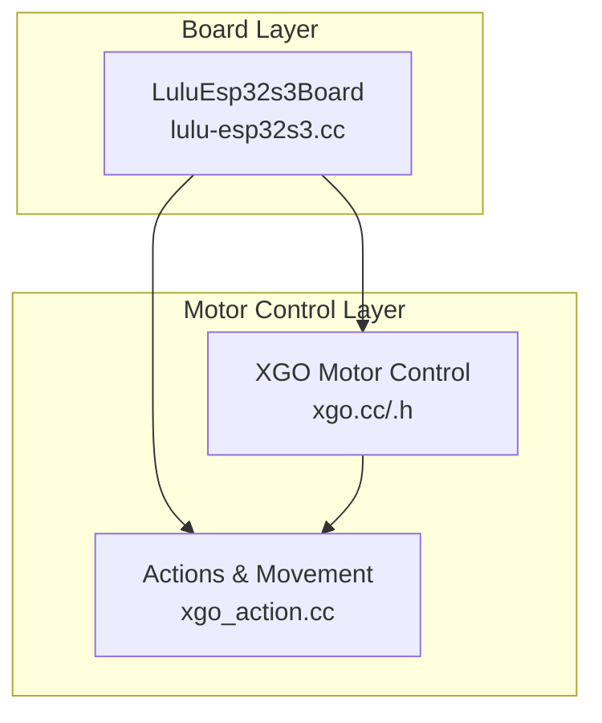
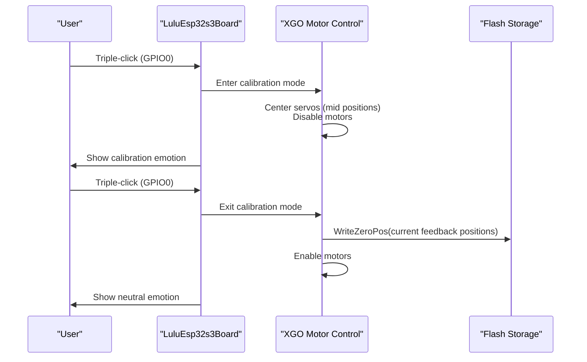
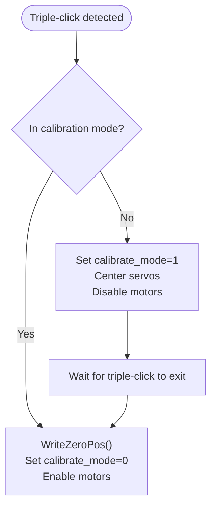
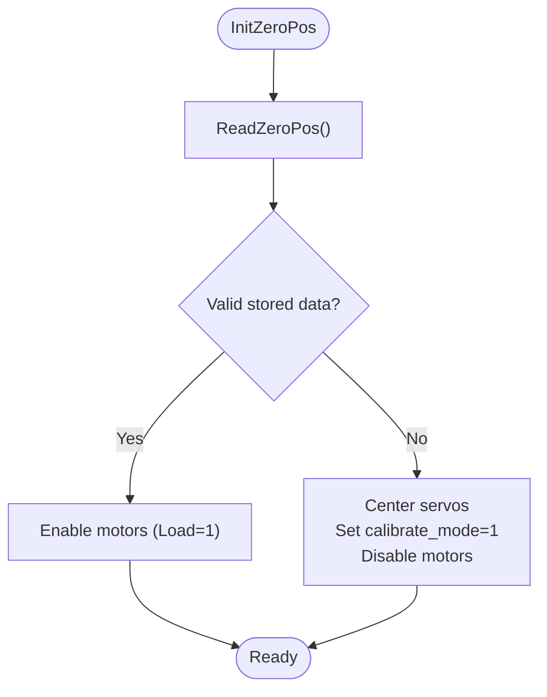
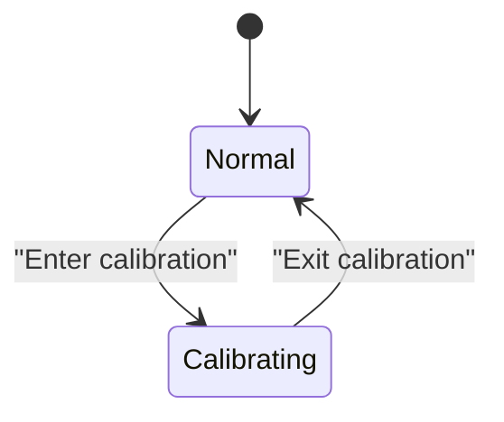
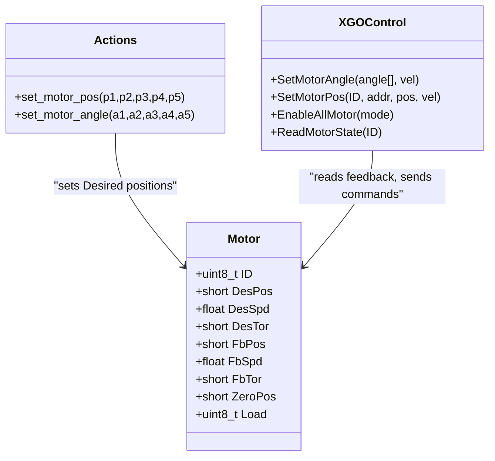
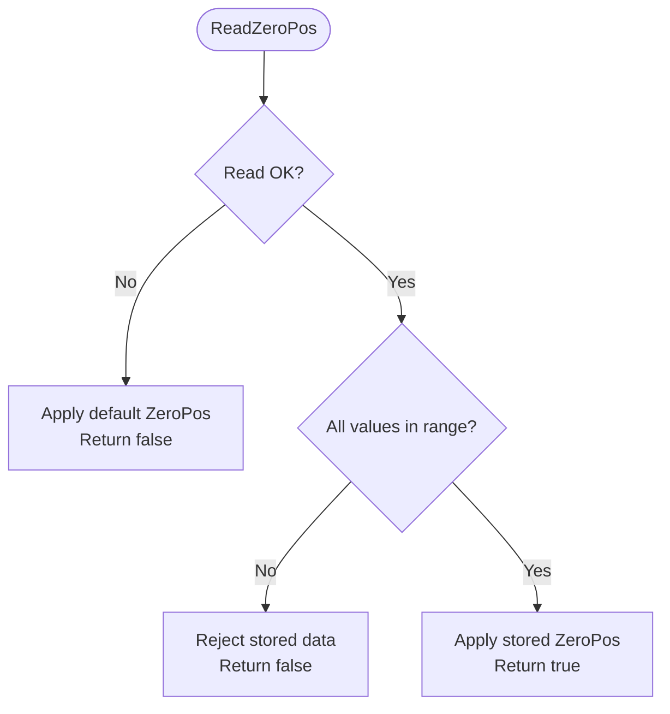
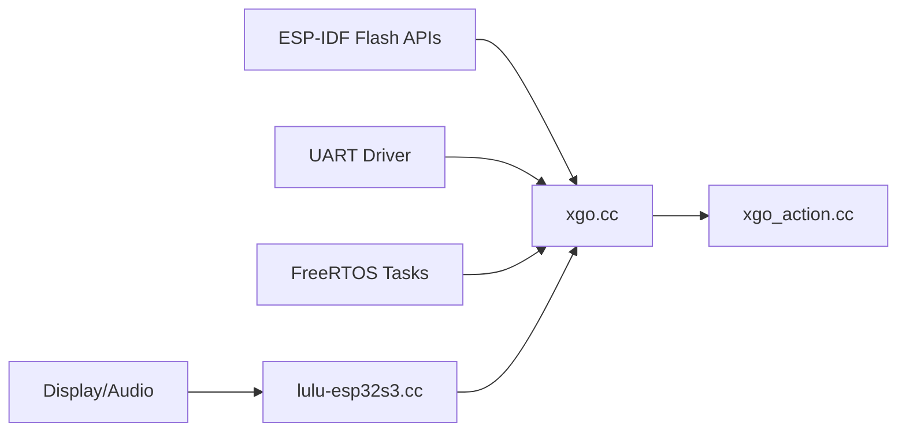

# Calibration and Zero-Position System

<cite>
**Referenced Files in This Document**
- [xgo.h](file://main/boards/lulu-esp32s3/xgo.h)
- [xgo.cc](file://main/boards/lulu-esp32s3/xgo.cc)
- [lulu-esp32s3.cc](file://main/boards/lulu-esp32s3/lulu-esp32s3.cc)
- [xgo_action.cc](file://main/boards/lulu-esp32s3/xgo_action.cc)
</cite>

## Table of Contents
1. [Introduction](#introduction)
2. [Project Structure](#project-structure)
3. [Core Components](#core-components)
4. [Architecture Overview](#architecture-overview)
5. [Detailed Component Analysis](#detailed-component-analysis)
6. [Dependency Analysis](#dependency-analysis)
7. [Performance Considerations](#performance-considerations)
8. [Troubleshooting Guide](#troubleshooting-guide)
9. [Conclusion](#conclusion)

## Introduction
This document describes the three-click calibration and zero-position system used to establish precise zero positions for all five servos. It explains the guided three-click process, persistent storage of calibration data in flash memory, calibration state management, and how zero-position offsets integrate into motor control and movement logic. It also covers calibration verification, error recovery, user workflows, and maintenance across firmware updates.

## Project Structure
The calibration and zero-position system spans several modules:
- Hardware interface and motor control: xgo.cc/xgo.h
- Board-level orchestration and user interaction: lulu-esp32s3.cc
- Movement and action logic that applies zero offsets: xgo_action.cc

**Diagram sources**
- [lulu-esp32s3.cc:299-323](file://main/boards/lulu-esp32s3/lulu-esp32s3.cc#L299-L323)
- [xgo.cc:108-175](file://main/boards/lulu-esp32s3/xgo.cc#L108-L175)
- [xgo_action.cc:95-110](file://main/boards/lulu-esp32s3/xgo_action.cc#L95-L110)

**Section sources**
- [xgo.h:1-74](file://main/boards/lulu-esp32s3/xgo.h#L1-L74)
- [xgo.cc:1-200](file://main/boards/lulu-esp32s3/xgo.cc#L1-L200)
- [lulu-esp32s3.cc:299-323](file://main/boards/lulu-esp32s3/lulu-esp32s3.cc#L299-L323)
- [xgo_action.cc:1-120](file://main/boards/lulu-esp32s3/xgo_action.cc#L1-L120)

## Core Components
- Flash address for zero-position storage: FLASH_ZERO_POS_ADDR
- Zero-position data structure: Motor.ZeroPos per servo
- Initialization routine: InitZeroPos reads stored zero positions and sets calibration state
- Persistence routines: WriteZeroPos writes current feedback positions to flash; ReadZeroPos reads and validates stored positions
- Calibration mode flags: calibrate_mode indicates whether the system is in calibration
- Movement integration: set_motor_pos and move apply ZeroPos offsets to desired positions

Key constants and types:
- FLASH_ZERO_POS_ADDR: persistent storage address for zero positions
- MOTOR_NUM: number of servos (five)
- Motor struct: holds ID, desired/fb positions/speeds/torques, ZeroPos, and Load flag

**Section sources**
- [xgo.h:7-28](file://main/boards/lulu-esp32s3/xgo.h#L7-L28)
- [xgo.cc:108-175](file://main/boards/lulu-esp32s3/xgo.cc#L108-L175)
- [xgo_action.cc:95-110](file://main/boards/lulu-esp32s3/xgo_action.cc#L95-L110)

## Architecture Overview
The calibration workflow is initiated via a three-click gesture on the device button. The system enters calibration mode, centers all servos, disables motion, and waits for the user to confirm completion by clicking three times again. Upon exit, the current feedback positions are written to flash as the new zero positions.

**Diagram sources**
- [xgo.cc:410-472](file://main/boards/lulu-esp32s3/xgo.cc#L410-L472)
- [lulu-esp32s3.cc:299-323](file://main/boards/lulu-esp32s3/lulu-esp32s3.cc#L299-L323)

## Detailed Component Analysis

### Three-Click Calibration Workflow
- Entry: Triple-click detection triggers when three presses occur within 1 second. If not in calibration, the system switches to calibration mode, centers servos, and disables motion.
- Exit: On the third click while in calibration, the system writes current feedback positions as zero positions, re-enables motors, and exits calibration mode.
- UI feedback: Display emotion transitions between calibration and neutral during mode changes.

**Diagram sources**
- [xgo.cc:410-472](file://main/boards/lulu-esp32s3/xgo.cc#L410-L472)

**Section sources**
- [xgo.cc:410-472](file://main/boards/lulu-esp32s3/xgo.cc#L410-L472)

### Flash Memory Storage for Zero Positions
- WriteZeroPos: Captures current feedback positions for all five servos, updates motor[].ZeroPos, erases a 4 KB region at FLASH_ZERO_POS_ADDR, and writes the array of positions.
- ReadZeroPos: Reads the stored array from flash, validates each value against bounds, and either initializes defaults or applies the stored values to motor[].ZeroPos. Returns a boolean indicating success.
- InitZeroPos: Attempts ReadZeroPos; if successful, enables motors; otherwise, centers servos, sets calibration mode, and disables motors.

**Diagram sources**
- [xgo.cc:108-175](file://main/boards/lulu-esp32s3/xgo.cc#L108-L175)

**Section sources**
- [xgo.cc:108-175](file://main/boards/lulu-esp32s3/xgo.cc#L108-L175)

### Calibration State Management
- calibrate_mode: Global flag toggled by triple-click logic and board-level calibration helpers.
- Board-level calibration: The board’s Calibrate method supports explicit entry/exit via external commands and mirrors the triple-click behavior.
- Blocking calibration wait: The board’s CheckCalibration blocks until calibrate_mode transitions out of calibration.

**Diagram sources**
- [xgo.cc:410-472](file://main/boards/lulu-esp32s3/xgo.cc#L410-L472)
- [lulu-esp32s3.cc:299-323](file://main/boards/lulu-esp32s3/lulu-esp32s3.cc#L299-L323)
- [lulu-esp32s3.cc:735-774](file://main/boards/lulu-esp32s3/lulu-esp32s3.cc#L735-L774)

**Section sources**
- [xgo.cc:410-472](file://main/boards/lulu-esp32s3/xgo.cc#L410-L472)
- [lulu-esp32s3.cc:299-323](file://main/boards/lulu-esp32s3/lulu-esp32s3.cc#L299-L323)
- [lulu-esp32s3.cc:735-774](file://main/boards/lulu-esp32s3/lulu-esp32s3.cc#L735-L774)

### Relationship Between Calibration Data and Motor Control
- Zero-position offsets: All desired positions are computed relative to ZeroPos. The actions layer adds offsets to ZeroPos, and the movement layer uses ZeroPos for gait calculations.
- Feedback loop: Servo feedback positions update motor[].FbPos; these inform stall detection and diagnostics.
- Control path: Desired positions are sent to servos only when not in calibration mode.

**Diagram sources**
- [xgo.h:17-28](file://main/boards/lulu-esp32s3/xgo.h#L17-L28)
- [xgo_action.cc:95-110](file://main/boards/lulu-esp32s3/xgo_action.cc#L95-L110)
- [xgo.cc:208-272](file://main/boards/lulu-esp32s3/xgo.cc#L208-L272)

**Section sources**
- [xgo_action.cc:95-110](file://main/boards/lulu-esp32s3/xgo_action.cc#L95-L110)
- [xgo.cc:274-318](file://main/boards/lulu-esp32s3/xgo.cc#L274-L318)

### Calibration Verification and Error Recovery
- ReadZeroPos validation: Values outside acceptable bounds are rejected; defaults are applied and false is returned.
- InitZeroPos fallback: If ReadZeroPos fails, the system centers servos, enables calibration mode, and disables motion to prompt user calibration.
- Stall detection: While not part of calibration, stall detection uses feedback to protect the system during operation.

**Diagram sources**
- [xgo.cc:127-147](file://main/boards/lulu-esp32s3/xgo.cc#L127-L147)

**Section sources**
- [xgo.cc:127-147](file://main/boards/lulu-esp32s3/xgo.cc#L127-L147)

### User Workflows
- Entering calibration:
  - Triple-click while idle to center servos and enter calibration mode.
  - System displays a calibration emotion and disables motion.
- Exiting calibration:
  - Triple-click again to save current positions as zero positions, re-enable motors, and resume normal operation.
- Board-level control:
  - An explicit Calibrate API allows entry/exit without physical button clicks.

**Section sources**
- [xgo.cc:410-472](file://main/boards/lulu-esp32s3/xgo.cc#L410-L472)
- [lulu-esp32s3.cc:299-323](file://main/boards/lulu-esp32s3/lulu-esp32s3.cc#L299-L323)

### Maintaining Calibration Integrity Across Firmware Updates
- Flash address: Zero positions are stored at a fixed address. Ensure the partition layout preserves this address across builds.
- Validation: ReadZeroPos bounds-checks stored values; if invalid, defaults are used and calibration is prompted.
- Best practice: Do not alter the zero-position storage layout without updating ReadZeroPos validation and migration logic.

**Section sources**
- [xgo.h:7-8](file://main/boards/lulu-esp32s3/xgo.h#L7-L8)
- [xgo.cc:127-147](file://main/boards/lulu-esp32s3/xgo.cc#L127-L147)

## Dependency Analysis
- xgo.cc depends on:
  - Flash APIs for erase/write/read
  - UART driver for servo communication
  - FreeRTOS tasks for timing and delays
- lulu-esp32s3.cc orchestrates:
  - Display and audio feedback during calibration
  - Blocking wait for calibration completion
- xgo_action.cc depends on:
  - Motor[].ZeroPos to compute desired positions

**Diagram sources**
- [xgo.cc:1-20](file://main/boards/lulu-esp32s3/xgo.cc#L1-L20)
- [lulu-esp32s3.cc:735-774](file://main/boards/lulu-esp32s3/lulu-esp32s3.cc#L735-L774)
- [xgo_action.cc:95-110](file://main/boards/lulu-esp32s3/xgo_action.cc#L95-L110)

**Section sources**
- [xgo.cc:1-20](file://main/boards/lulu-esp32s3/xgo.cc#L1-L20)
- [lulu-esp32s3.cc:735-774](file://main/boards/lulu-esp32s3/lulu-esp32s3.cc#L735-L774)
- [xgo_action.cc:95-110](file://main/boards/lulu-esp32s3/xgo_action.cc#L95-L110)

## Performance Considerations
- Flash operations: Erase and write are performed once per calibration exit. Minimize frequency of writes to prolong flash life.
- UART throughput: Servo state reads are rate-limited; ensure adequate delays to avoid overwhelming the bus.
- Stall detection: Debounce and cooldown thresholds prevent false positives and reduce unnecessary callbacks.

[No sources needed since this section provides general guidance]

## Troubleshooting Guide
Common issues and resolutions:
- Calibration does not complete:
  - Ensure triple-click timing is within the configured window.
  - Verify that the display emotion transitions to calibration and back to neutral after exit.
- Zero positions not saved:
  - Confirm ReadZeroPos validation bounds are met; if not, defaults are applied and calibration is restarted.
  - Check flash erase/write return codes for errors.
- Motors disabled after boot:
  - If no valid zero positions are found, the system intentionally disables motors and centers servos to enter calibration mode.
- Unexpected servo behavior:
  - Inspect feedback positions and torque thresholds for stall detection triggers.

**Section sources**
- [xgo.cc:127-175](file://main/boards/lulu-esp32s3/xgo.cc#L127-L175)
- [xgo.cc:410-472](file://main/boards/lulu-esp32s3/xgo.cc#L410-L472)

## Conclusion
The three-click calibration system provides a robust, user-friendly mechanism to establish precise zero positions for all five servos. By combining a guided workflow, persistent flash storage, and clear state management, the system ensures reliable operation and recoverable calibration failures. Integrating zero-position offsets into movement and action logic guarantees consistent behavior across all control modes.