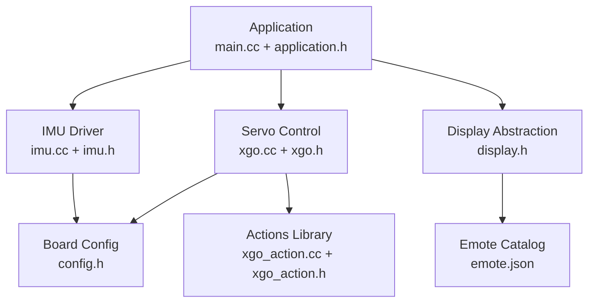
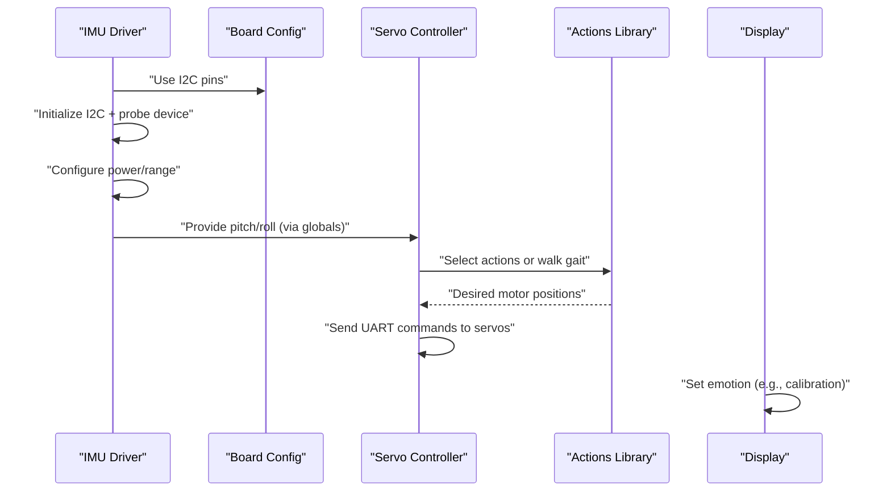
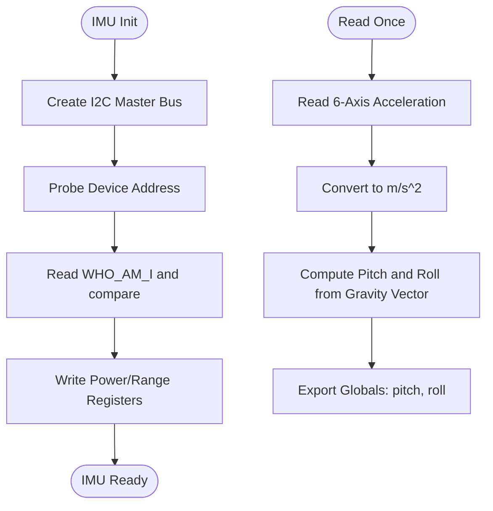
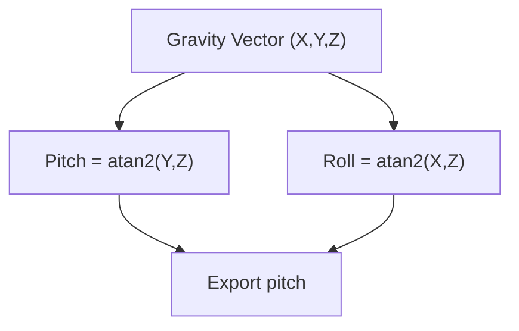
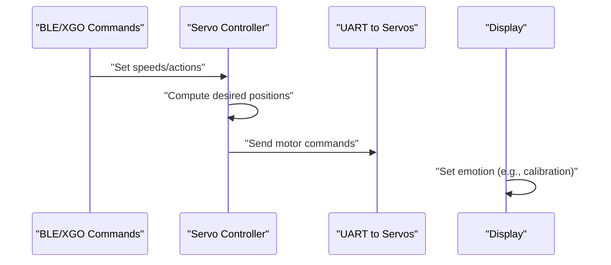
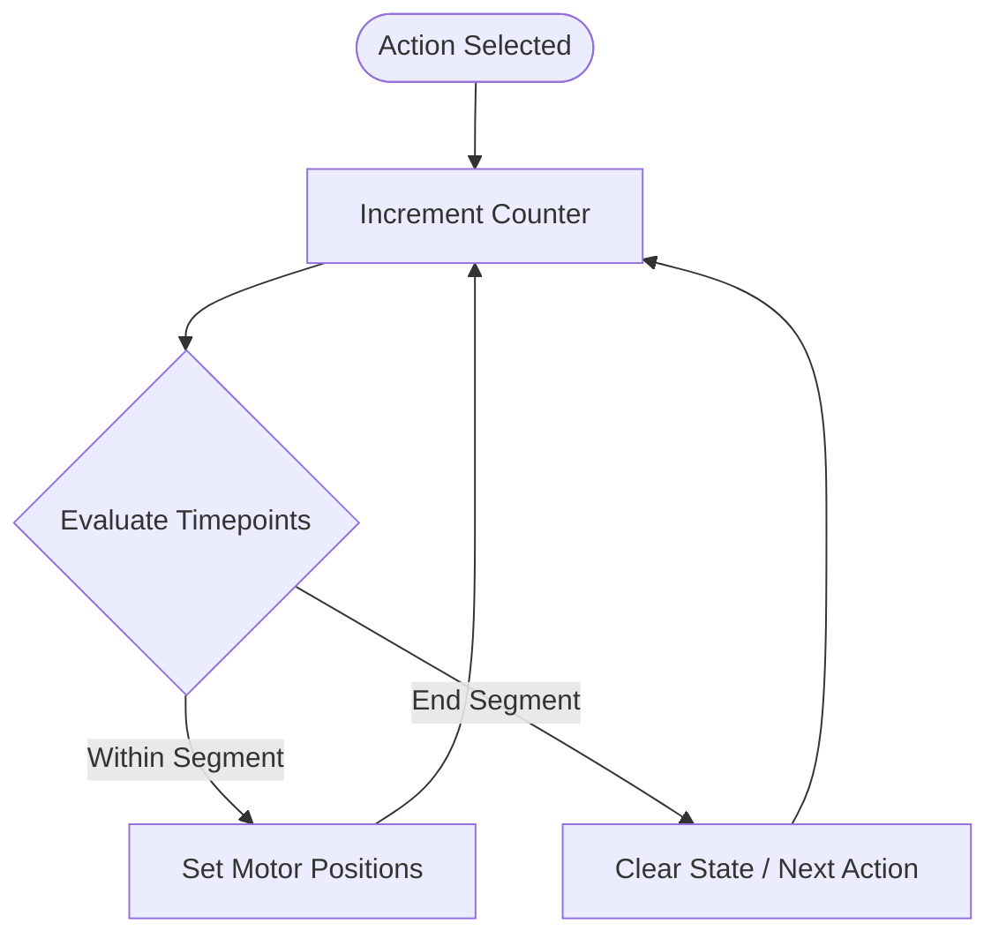
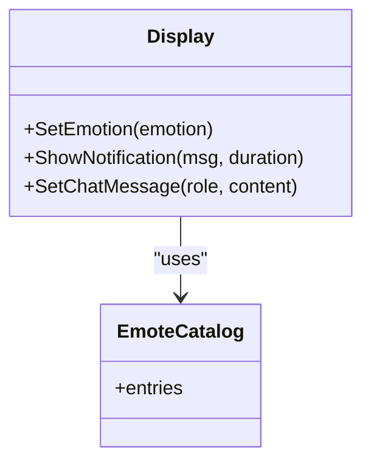
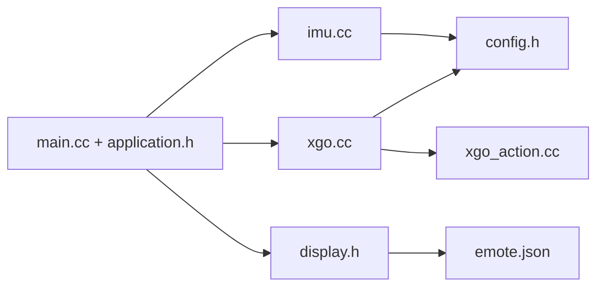

# IMU Integration and Orientation Tracking

<cite>
**Referenced Files in This Document**
- [imu.cc](file://main/boards/lulu-esp32s3/imu.cc)
- [imu.h](file://main/boards/lulu-esp32s3/imu.h)
- [config.h](file://main/boards/lulu-esp32s3/config.h)
- [xgo.cc](file://main/boards/lulu-esp32s3/xgo.cc)
- [xgo.h](file://main/boards/lulu-esp32s3/xgo.h)
- [xgo_action.cc](file://main/boards/lulu-esp32s3/xgo_action.cc)
- [xgo_action.h](file://main/boards/lulu-esp32s3/xgo_action.h)
- [display.h](file://main/display/display.h)
- [emote.json](file://main/boards/lulu-esp32s3/emote.json)
- [main.cc](file://main/main.cc)
- [application.h](file://main/application.h)
</cite>

## Table of Contents
1. [Introduction](#introduction)
2. [Project Structure](#project-structure)
3. [Core Components](#core-components)
4. [Architecture Overview](#architecture-overview)
5. [Detailed Component Analysis](#detailed-component-analysis)
6. [Dependency Analysis](#dependency-analysis)
7. [Performance Considerations](#performance-considerations)
8. [Troubleshooting Guide](#troubleshooting-guide)
9. [Conclusion](#conclusion)
10. [Appendices](#appendices)

## Introduction
This document explains the Inertial Measurement Unit (IMU) integration and orientation tracking system used for head movement detection and attention behaviors. It covers sensor configuration, data acquisition, coordinate system conventions, orientation calculation, and the integration with servo motors and visual displays. It also documents calibration procedures, drift considerations, filtering opportunities, threshold-based movement detection, and audio-triggered behaviors.

## Project Structure
The IMU system resides in the board-specific module for the Lulu ESP32-S3 platform. Key elements:
- IMU driver for ICM42670P via I2C
- Motor control and servo communication over UART
- Display abstraction and emotion-driven visuals
- Application orchestration and task scheduling

**Diagram sources**
- [main.cc:14-29](file://main/main.cc#L14-L29)
- [application.h:42-177](file://main/application.h#L42-L177)
- [imu.cc:57-129](file://main/boards/lulu-esp32s3/imu.cc#L57-L129)
- [imu.h:4-18](file://main/boards/lulu-esp32s3/imu.h#L4-L18)
- [config.h:82-88](file://main/boards/lulu-esp32s3/config.h#L82-L88)
- [xgo.cc:475-512](file://main/boards/lulu-esp32s3/xgo.cc#L475-L512)
- [xgo.h:33-73](file://main/boards/lulu-esp32s3/xgo.h#L33-L73)
- [xgo_action.cc:26-93](file://main/boards/lulu-esp32s3/xgo_action.cc#L26-L93)
- [xgo_action.h:26-49](file://main/boards/lulu-esp32s3/xgo_action.h#L26-L49)
- [display.h:28-65](file://main/display/display.h#L28-L65)
- [emote.json:1-30](file://main/boards/lulu-esp32s3/emote.json#L1-L30)

**Section sources**
- [main.cc:14-29](file://main/main.cc#L14-L29)
- [application.h:42-177](file://main/application.h#L42-L177)
- [config.h:82-88](file://main/boards/lulu-esp32s3/config.h#L82-L88)

## Core Components
- IMU driver for ICM42670P: initializes I2C master, probes device, configures power and range, reads acceleration, and computes pitch and roll angles from gravity vector.
- Servo controller: parses BLE/XGO-style commands, manages motor enable/disable, zero-position calibration, and sends periodic motor commands.
- Actions library: defines timed sequences to drive servos for expressive behaviors.
- Display abstraction: provides emotion APIs used during calibration and normal operation.
- Emote catalog: JSON list of animations mapped to emotions.

Key external references:
- I2C pins and task intervals are configured in board config.
- Servo control uses UART with a proprietary framing protocol.

**Section sources**
- [imu.cc:57-129](file://main/boards/lulu-esp32s3/imu.cc#L57-L129)
- [imu.cc:132-155](file://main/boards/lulu-esp32s3/imu.cc#L132-L155)
- [xgo.cc:475-512](file://main/boards/lulu-esp32s3/xgo.cc#L475-L512)
- [xgo_action.cc:26-93](file://main/boards/lulu-esp32s3/xgo_action.cc#L26-L93)
- [display.h:33-42](file://main/display/display.h#L33-L42)
- [emote.json:1-30](file://main/boards/lulu-esp32s3/emote.json#L1-L30)

## Architecture Overview
The system integrates IMU orientation with servo motor control and visual feedback:
- IMU periodically reads acceleration and computes pitch and roll.
- Servo control consumes IMU-derived motion cues and BLE/XGO commands to set desired positions.
- Actions library provides predefined poses and motions.
- Display updates emotion states during calibration and normal modes.

**Diagram sources**
- [imu.cc:57-129](file://main/boards/lulu-esp32s3/imu.cc#L57-L129)
- [config.h:82-88](file://main/boards/lulu-esp32s3/config.h#L82-L88)
- [xgo.cc:475-512](file://main/boards/lulu-esp32s3/xgo.cc#L475-L512)
- [xgo_action.cc:26-93](file://main/boards/lulu-esp32s3/xgo_action.cc#L26-L93)
- [display.h:33-42](file://main/display/display.h#L33-L42)

## Detailed Component Analysis

### IMU Sensor Configuration and Data Acquisition
- I2C initialization uses dedicated pins and frequency.
- Device probing verifies chip identity.
- Power and range registers are written to wake the sensor and set measurement scales.
- Acceleration data is read from a 6-axis FIFO-like register block and converted to m/s².
- Orientation angles are computed from the gravity vector using inverse trigonometric functions.

**Diagram sources**
- [imu.cc:57-129](file://main/boards/lulu-esp32s3/imu.cc#L57-L129)
- [imu.cc:132-155](file://main/boards/lulu-esp32s3/imu.cc#L132-L155)

**Section sources**
- [imu.cc:57-129](file://main/boards/lulu-esp32s3/imu.cc#L57-L129)
- [imu.cc:132-155](file://main/boards/lulu-esp32s3/imu.cc#L132-L155)
- [config.h:82-88](file://main/boards/lulu-esp32s3/config.h#L82-L88)

### Coordinate System and Orientation Tracking
- The IMU driver computes pitch and roll from the Y and Z axes for pitch, and from X and Z axes for roll, using the gravity vector.
- These angles reflect head tilt and rotation relative to the device’s local frame.
- Yaw is exported but not currently computed in the driver; it would require a magnetometer or extended fusion.

**Diagram sources**
- [imu.cc:152-154](file://main/boards/lulu-esp32s3/imu.cc#L152-L154)

**Section sources**
- [imu.cc:152-154](file://main/boards/lulu-esp32s3/imu.cc#L152-L154)

### Integration with Servo Motors for Head Movement
- Servo control is driven by BLE/XGO commands and internal logic.
- The control loop periodically sets desired positions and sends UART packets to servos.
- Calibration writes zero positions to flash and enables/disables motors accordingly.
- A triple-click gesture toggles calibration mode and updates display emotion.

**Diagram sources**
- [xgo.cc:475-512](file://main/boards/lulu-esp32s3/xgo.cc#L475-L512)
- [xgo.cc:410-472](file://main/boards/lulu-esp32s3/xgo.cc#L410-L472)
- [display.h:33-42](file://main/display/display.h#L33-L42)

**Section sources**
- [xgo.cc:475-512](file://main/boards/lulu-esp32s3/xgo.cc#L475-L512)
- [xgo.cc:410-472](file://main/boards/lulu-esp32s3/xgo.cc#L410-L472)
- [xgo.h:33-73](file://main/boards/lulu-esp32s3/xgo.h#L33-L73)

### Actions Library and Attention Behaviors
- Actions define timed sequences that set motor positions for expressive behaviors.
- Each action uses a time-sliced counter and phase-based math to produce smooth motion.
- Normal state resets servos to a baseline pose.

**Diagram sources**
- [xgo_action.cc:26-93](file://main/boards/lulu-esp32s3/xgo_action.cc#L26-L93)
- [xgo_action.cc:149-176](file://main/boards/lulu-esp32s3/xgo_action.cc#L149-L176)

**Section sources**
- [xgo_action.cc:26-93](file://main/boards/lulu-esp32s3/xgo_action.cc#L26-L93)
- [xgo_action.h:26-49](file://main/boards/lulu-esp32s3/xgo_action.h#L26-L49)

### Visual Display Integration for Emotions
- Display interface exposes emotion setting used during calibration and normal operation.
- Emote catalog enumerates available animations and their playback characteristics.

**Diagram sources**
- [display.h:28-65](file://main/display/display.h#L28-L65)
- [emote.json:1-30](file://main/boards/lulu-esp32s3/emote.json#L1-L30)

**Section sources**
- [display.h:28-65](file://main/display/display.h#L28-L65)
- [emote.json:1-30](file://main/boards/lulu-esp32s3/emote.json#L1-L30)

## Dependency Analysis
- IMU depends on board configuration for I2C pin mapping and task timing.
- Servo control depends on UART pin configuration and motor constants.
- Actions depend on the servo control interface and time-slice constants.
- Display and emote catalog are decoupled from IMU and motor logic.

**Diagram sources**
- [config.h:82-88](file://main/boards/lulu-esp32s3/config.h#L82-L88)
- [xgo.cc:475-512](file://main/boards/lulu-esp32s3/xgo.cc#L475-L512)
- [xgo_action.cc:26-93](file://main/boards/lulu-esp32s3/xgo_action.cc#L26-L93)
- [display.h:28-65](file://main/display/display.h#L28-L65)
- [emote.json:1-30](file://main/boards/lulu-esp32s3/emote.json#L1-L30)
- [main.cc:14-29](file://main/main.cc#L14-L29)
- [application.h:42-177](file://main/application.h#L42-L177)

**Section sources**
- [config.h:82-88](file://main/boards/lulu-esp32s3/config.h#L82-L88)
- [xgo.cc:475-512](file://main/boards/lulu-esp32s3/xgo.cc#L475-L512)
- [xgo_action.cc:26-93](file://main/boards/lulu-esp32s3/xgo_action.cc#L26-L93)
- [display.h:28-65](file://main/display/display.h#L28-L65)
- [emote.json:1-30](file://main/boards/lulu-esp32s3/emote.json#L1-L30)
- [main.cc:14-29](file://main/main.cc#L14-L29)
- [application.h:42-177](file://main/application.h#L42-L177)

## Performance Considerations
- IMU sampling interval is governed by the RX task interval defined in board configuration.
- Servo command rate is controlled by the XGO task interval; tuning affects responsiveness and power consumption.
- Converting raw acceleration to m/s² and computing trigonometric functions introduces computational overhead; consider moving computations to a lower-priority task if needed.
- UART throughput and checksum verification add latency; batching commands can reduce overhead.

[No sources needed since this section provides general guidance]

## Troubleshooting Guide
Common issues and mitigations:
- IMU not detected or incorrect WHO_AM_I: verify I2C pull-ups, address, and wiring; confirm board configuration pin assignments.
- No orientation data: ensure power and range registers are written after initialization; check read function return codes.
- Drifting angles: implement a simple low-pass filter on acceleration readings; periodically re-reference the vertical axis when the device is stationary.
- Jittery servo movement: increase the XGO task interval slightly to smooth out UART bursts; apply position smoothing in the control loop.
- Calibration anomalies: confirm flash erase/write operations succeed; ensure zero positions are within valid ranges before enabling motors.
- Triple-click gesture not recognized: adjust debouncing thresholds and timing windows; verify GPIO level transitions.

**Section sources**
- [imu.cc:83-117](file://main/boards/lulu-esp32s3/imu.cc#L83-L117)
- [xgo.cc:108-125](file://main/boards/lulu-esp32s3/xgo.cc#L108-L125)
- [xgo.cc:410-472](file://main/boards/lulu-esp32s3/xgo.cc#L410-L472)

## Conclusion
The IMU integration provides robust pitch and roll estimation suitable for head movement detection. Combined with servo control and a rich actions library, it enables expressive attention behaviors and visual feedback. While yaw is not currently computed, future enhancements can incorporate gyroscope integration or magnetometer fusion for full 3D orientation tracking.

[No sources needed since this section summarizes without analyzing specific files]

## Appendices

### Sensor Fusion Techniques (Conceptual)
- Extend the driver to read gyroscope and magnetometer data.
- Implement complementary or Kalman filtering to fuse acceleration (gravity), angular rate, and magnetic heading.
- Use a small buffer of recent samples to compute stable estimates and reduce noise.

[No sources needed since this section provides general guidance]

### Filtering Algorithms for Noise Reduction
- Low-pass filters: smooth acceleration and angular rate signals.
- Median filters: reduce impulse noise in static conditions.
- Moving average: stabilize estimates over short windows.

[No sources needed since this section provides general guidance]

### Threshold Detection for Movement Events
- Define magnitude thresholds for acceleration changes to detect head nodding or shaking.
- Use hysteresis to avoid chatter around thresholds.
- Combine with orientation thresholds (e.g., minimum tilt) for gaze-like behaviors.

[No sources needed since this section provides general guidance]

### Integration with Audio-Triggered Behaviors
- Use voice detection flags from the application layer to trigger attention behaviors.
- Map audio events to action selection in the actions library.
- Synchronize display emotions with audio triggers for coherent feedback.

[No sources needed since this section provides general guidance]