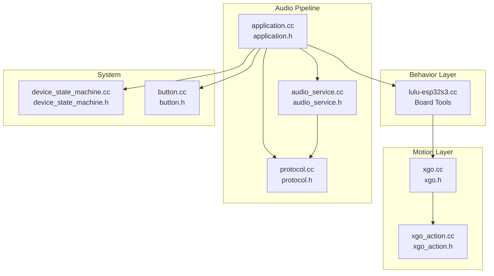
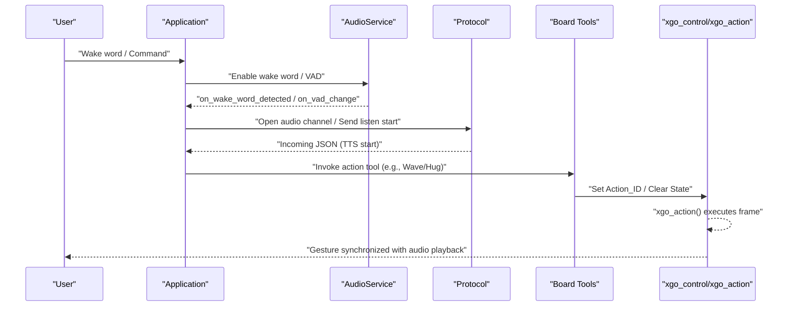
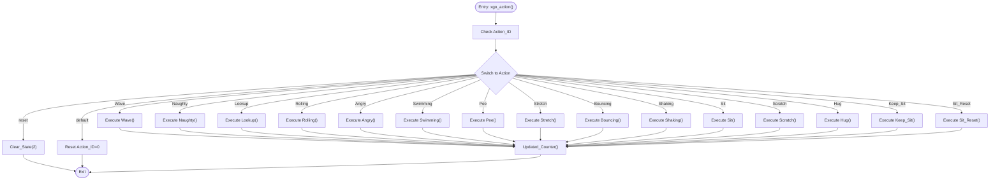
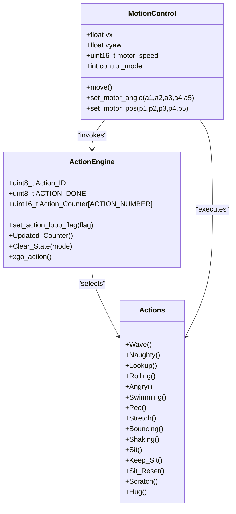
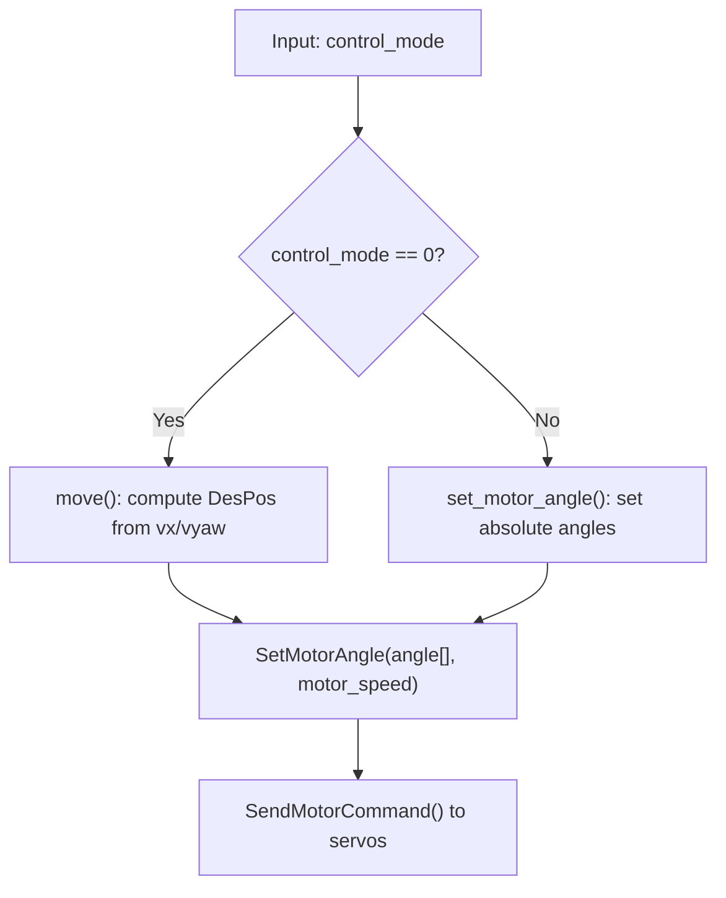
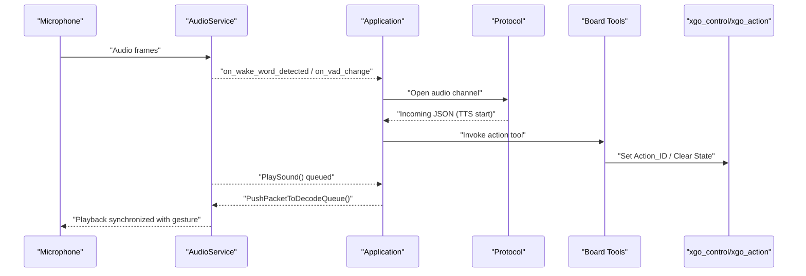
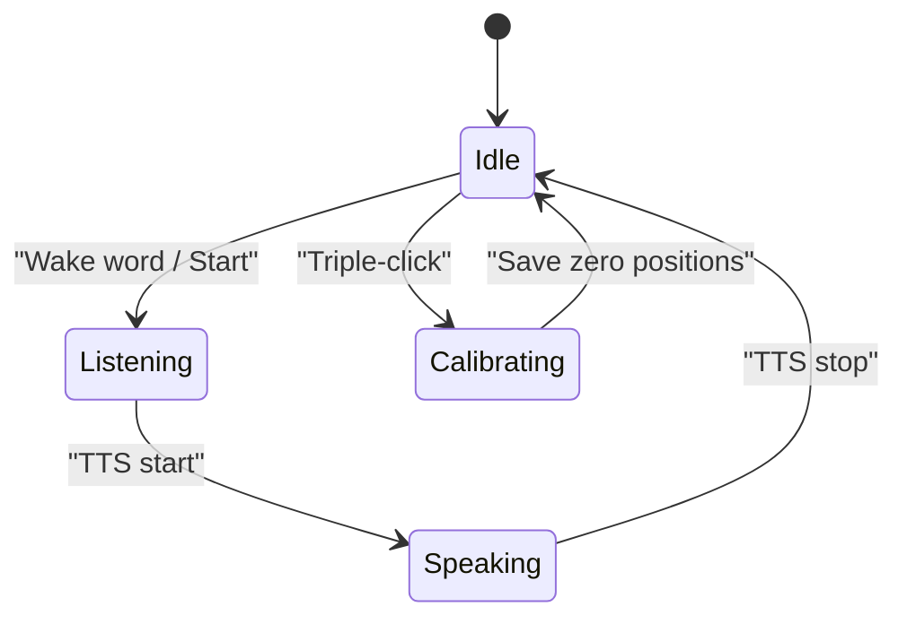
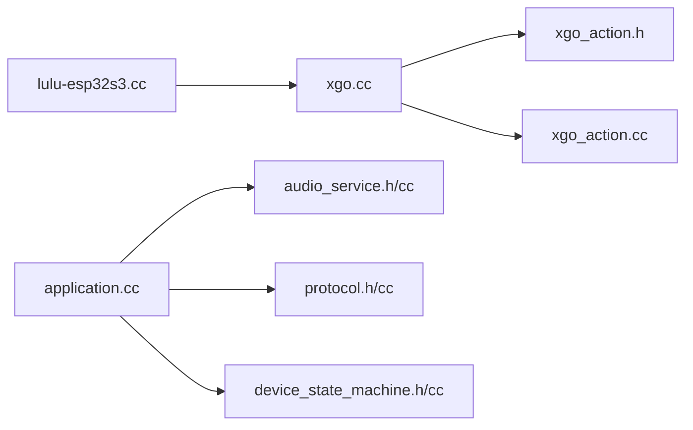

# Motion Sequencing and Behavioral Actions

<cite>
**Referenced Files in This Document**
- [xgo_action.h](file://main/boards/lulu-esp32s3/xgo_action.h)
- [xgo_action.cc](file://main/boards/lulu-esp32s3/xgo_action.cc)
- [xgo.h](file://main/boards/lulu-esp32s3/xgo.h)
- [xgo.cc](file://main/boards/lulu-esp32s3/xgo.cc)
- [lulu-esp32s3.cc](file://main/boards/lulu-esp32s3/lulu-esp32s3.cc)
- [audio_service.h](file://main/audio/audio_service.h)
- [audio_service.cc](file://main/audio/audio_service.cc)
- [application.h](file://main/application.h)
- [application.cc](file://main/application.cc)
- [protocol.h](file://main/protocols/protocol.h)
- [protocol.cc](file://main/protocols/protocol.cc)
- [device_state_machine.h](file://main/device_state_machine.h)
- [device_state_machine.cc](file://main/device_state_machine.cc)
- [button.h](file://main/boards/common/button.h)
- [button.cc](file://main/boards/common/button.cc)
</cite>

## Table of Contents
1. [Introduction](#introduction)
2. [Project Structure](#project-structure)
3. [Core Components](#core-components)
4. [Architecture Overview](#architecture-overview)
5. [Detailed Component Analysis](#detailed-component-analysis)
6. [Dependency Analysis](#dependency-analysis)
7. [Performance Considerations](#performance-considerations)
8. [Troubleshooting Guide](#troubleshooting-guide)
9. [Conclusion](#conclusion)
10. [Appendices](#appendices)

## Introduction
This document explains the motion sequencing and behavioral action system for the RIG-Puppy robot. It focuses on how actions are defined, sequenced, and executed, including:
- Action loop flag management via set_action_loop_flag()
- The ACTION_DONE state tracking and action counters
- Predefined action sequences (sit, stand, tail wag, happy behaviors, etc.)
- The action execution framework, timing coordination across five servos, and smooth transition algorithms
- The relationship between audio triggers and physical actions, including gesture synchronization with voice responses
- The control_mode variable and its impact on movement vs. direct-angle control
- Action parameterization, velocity control, and safety interlocks preventing conflicting actions
- Integration with external triggers (audio, touch, commands) and autonomous behavior patterns
- Examples of custom action creation, chaining, and performance optimization for smooth motion

## Project Structure
The motion and behavior system is centered around the “XGO” subsystem in the lulu-esp32s3 board module, with tight integration to the application’s audio pipeline and state machine. Key modules:
- Motion control and actions: xgo.h/.cc, xgo_action.h/.cc
- Board-level tools and action triggers: lulu-esp32s3.cc
- Audio pipeline: audio_service.h/.cc
- Application orchestration: application.h/.cc
- Protocol bridge: protocol.h/.cc
- Device state machine: device_state_machine.h/.cc
- Touch and buttons: button.h/.cc



**Diagram sources**
- [xgo.cc:1-687](file://main/boards/lulu-esp32s3/xgo.cc#L1-L687)
- [xgo.h:1-74](file://main/boards/lulu-esp32s3/xgo.h#L1-L74)
- [xgo_action.cc:1-551](file://main/boards/lulu-esp32s3/xgo_action.cc#L1-L551)
- [xgo_action.h:1-49](file://main/boards/lulu-esp32s3/xgo_action.h#L1-L49)
- [lulu-esp32s3.cc:375-508](file://main/boards/lulu-esp32s3/lulu-esp32s3.cc#L375-L508)
- [application.cc:1-800](file://main/application.cc#L1-L800)
- [application.h:1-195](file://main/application.h#L1-L195)
- [audio_service.cc:1-765](file://main/audio/audio_service.cc#L1-L765)
- [audio_service.h:1-204](file://main/audio/audio_service.h#L1-L204)
- [protocol.cc:1-91](file://main/protocols/protocol.cc#L1-L91)
- [protocol.h:58-84](file://main/protocols/protocol.h#L58-L84)
- [device_state_machine.cc:1-162](file://main/device_state_machine.cc#L1-L162)
- [device_state_machine.h:1-84](file://main/device_state_machine.h#L1-L84)
- [button.cc:1-125](file://main/boards/common/button.cc#L1-L125)
- [button.h:1-49](file://main/boards/common/button.h#L1-L49)

**Section sources**
- [xgo.cc:1-687](file://main/boards/lulu-esp32s3/xgo.cc#L1-L687)
- [xgo.h:1-74](file://main/boards/lulu-esp32s3/xgo.h#L1-L74)
- [xgo_action.cc:1-551](file://main/boards/lulu-esp32s3/xgo_action.cc#L1-L551)
- [xgo_action.h:1-49](file://main/boards/lulu-esp32s3/xgo_action.h#L1-L49)
- [lulu-esp32s3.cc:375-508](file://main/boards/lulu-esp32s3/lulu-esp32s3.cc#L375-L508)
- [application.cc:1-800](file://main/application.cc#L1-L800)
- [application.h:1-195](file://main/application.h#L1-L195)
- [audio_service.cc:1-765](file://main/audio/audio_service.cc#L1-L765)
- [audio_service.h:1-204](file://main/audio/audio_service.h#L1-L204)
- [protocol.cc:1-91](file://main/protocols/protocol.cc#L1-L91)
- [protocol.h:58-84](file://main/protocols/protocol.h#L58-L84)
- [device_state_machine.cc:1-162](file://main/device_state_machine.cc#L1-L162)
- [device_state_machine.h:1-84](file://main/device_state_machine.h#L1-L84)
- [button.cc:1-125](file://main/boards/common/button.cc#L1-L125)
- [button.h:1-49](file://main/boards/common/button.h#L1-L49)

## Core Components
- Action engine and loop:
  - Action_ID drives the current action selection.
  - ACTION_DONE and Action_Counter track per-action progression and completion.
  - action_loop() advances ACTION_DONE when the loop flag is set, enabling automatic cycling.
  - set_action_loop_flag() toggles continuous looping of actions.
- Motion control:
  - xgo_control() orchestrates movement vs. actions, invoking xgo_action() periodically.
  - move() computes desired servo positions based on vx/vyaw and control_mode.
  - set_motor_angle()/set_motor_pos() translate angles/positions to servo commands.
- Action library:
  - Predefined actions (Wave, Naughty, Lookup, Rolling, Angry, Swimming, Pee, Stretch, Bouncing, Shaking, Sit, Scratch, Hug, Keep_Sit, Sit_Reset).
  - Each action defines a timeline with durations and timepoints, updating motor_speed and motor positions.
- Safety and calibration:
  - Zero-position calibration and stall detection prevent mechanical conflicts.
  - Clear_State() resets motion and clears flags safely.

**Section sources**
- [xgo_action.h:1-49](file://main/boards/lulu-esp32s3/xgo_action.h#L1-L49)
- [xgo_action.cc:11-93](file://main/boards/lulu-esp32s3/xgo_action.cc#L11-L93)
- [xgo.cc:98-106](file://main/boards/lulu-esp32s3/xgo.cc#L98-L106)
- [xgo.cc:474-512](file://main/boards/lulu-esp32s3/xgo.cc#L474-L512)
- [xgo.cc:298-318](file://main/boards/lulu-esp32s3/xgo.cc#L298-L318)
- [xgo.cc:108-272](file://main/boards/lulu-esp32s3/xgo.cc#L108-L272)

## Architecture Overview
The motion system integrates tightly with the application’s audio and state machine:
- AudioService detects wake words and VAD, signaling state changes.
- Application manages device states and dispatches events to open/close audio channels.
- Protocol bridges incoming messages (e.g., TTS start/stop) to drive actions and gestures.
- Board tools expose actions as MCP tools, allowing remote invocation.



**Diagram sources**
- [application.cc:243-254](file://main/application.cc#L243-L254)
- [application.cc:545-631](file://main/application.cc#L545-L631)
- [audio_service.cc:582-660](file://main/audio/audio_service.cc#L582-L660)
- [protocol.cc:51-75](file://main/protocols/protocol.cc#L51-L75)
- [lulu-esp32s3.cc:375-508](file://main/boards/lulu-esp32s3/lulu-esp32s3.cc#L375-L508)
- [xgo.cc:474-512](file://main/boards/lulu-esp32s3/xgo.cc#L474-L512)

## Detailed Component Analysis

### Action Loop and State Tracking
- Action loop flag management:
  - set_action_loop_flag(flag) sets Action_ID and actionLoop_FLAG to start or stop looping.
- ACTION_DONE and counters:
  - ACTION_DONE increments when the loop flag is set, advancing the action sequence after a threshold.
  - Updated_Counter() increments the counter for the current Action_ID and resets others.
- Action selection:
  - xgo_action() switches on Action_ID and invokes the corresponding action function.



**Diagram sources**
- [xgo_action.cc:26-93](file://main/boards/lulu-esp32s3/xgo_action.cc#L26-L93)
- [xgo_action.h:26-49](file://main/boards/lulu-esp32s3/xgo_action.h#L26-L49)

**Section sources**
- [xgo_action.cc:11-93](file://main/boards/lulu-esp32s3/xgo_action.cc#L11-L93)
- [xgo_action.h:26-49](file://main/boards/lulu-esp32s3/xgo_action.h#L26-L49)

### Action Execution Framework and Timing Coordination
- Frame timing:
  - TS defines the base time unit for action timing.
  - Each action computes timepoints from durations and uses Action_Counter to branch into phases.
- Servo control:
  - set_motor_pos() writes desired positions relative to zero offsets.
  - set_motor_angle() converts angles to raw positions and calls set_motor_pos().
  - motor_speed controls movement speed globally.
- Movement vs. action:
  - xgo_control() alternates between move() and xgo_action() to keep motion smooth and responsive.

```mermaid
sequenceDiagram
participant Loop as "Main Loop"
participant Control as "xgo_control()"
participant Move as "move()"
participant Action as "xgo_action()"
participant Motor as "SetMotorAngle/SetMotorPos"
Loop->>Control : "Periodic tick"
alt Action_ID == 0
Control->>Move : "Compute walk/gait"
Move->>Motor : "Send desired angles"
else Action active
Control->>Action : "Execute current action frame"
Action->>Motor : "Set positions/speed per phase"
end
```

**Diagram sources**
- [xgo.cc:474-512](file://main/boards/lulu-esp32s3/xgo.cc#L474-L512)
- [xgo.cc:298-318](file://main/boards/lulu-esp32s3/xgo.cc#L298-L318)
- [xgo_action.cc:95-110](file://main/boards/lulu-esp32s3/xgo_action.cc#L95-L110)

**Section sources**
- [xgo.cc:474-512](file://main/boards/lulu-esp32s3/xgo.cc#L474-L512)
- [xgo.cc:298-318](file://main/boards/lulu-esp32s3/xgo.cc#L298-L318)
- [xgo_action.cc:95-110](file://main/boards/lulu-esp32s3/xgo_action.cc#L95-L110)

### Predefined Action Sequences
Below are the major actions and their characteristics. Each action defines a timeline with durations and timepoints, and updates motor positions and speeds accordingly.

- Sit family:
  - Sit(): gradual lowering and settling into a seated pose, then holding.
  - Keep_Sit(): holds the seated pose indefinitely.
  - Sit_Reset(): returns from sitting to standing.
- Expressive behaviors:
  - Wave(): waving motion with oscillation and pauses.
  - Naughty(): playful shaking with sinusoidal offsets.
  - Lookup(): head-up scanning motion with periodic toggles.
  - Rolling(): body rolling motion with phase modulation.
  - Angry(): angry posture with alternating side shifts.
  - Swimming(): swimming-like limb coordination with waveforms.
  - Pee(): rhythmic contraction/relaxation with pauses.
  - Stretch(): dynamic stretching with acceleration and oscillation.
  - Bouncing(): vertical bouncing motion.
  - Shaking(): head/shake motion with phase modulation.
- Affection:
  - Scratch(): scratch motion with alternating arms and holding.
  - Hug(): embrace motion with coordinated arm and leg positions.



**Diagram sources**
- [xgo_action.h:26-49](file://main/boards/lulu-esp32s3/xgo_action.h#L26-L49)
- [xgo.h:49-69](file://main/boards/lulu-esp32s3/xgo.h#L49-L69)
- [xgo_action.cc:149-551](file://main/boards/lulu-esp32s3/xgo_action.cc#L149-L551)
- [xgo.cc:298-318](file://main/boards/lulu-esp32s3/xgo.cc#L298-L318)

**Section sources**
- [xgo_action.cc:149-551](file://main/boards/lulu-esp32s3/xgo_action.cc#L149-L551)

### Control Mode and Safety Interlocks
- control_mode:
  - 0: movement mode; vx/vyaw drive gait via move().
  - 1: direct-angle control; set_motor_angle() sends absolute angles.
- Safety interlocks:
  - Stall detection monitors position error and torque thresholds to prevent motor binding.
  - Zero-position calibration ensures consistent baseline.
  - Clear_State() resets motion and clears flags to avoid conflicts.



**Diagram sources**
- [xgo.cc:298-318](file://main/boards/lulu-esp32s3/xgo.cc#L298-L318)
- [xgo.cc:208-232](file://main/boards/lulu-esp32s3/xgo.cc#L208-L232)

**Section sources**
- [xgo.cc:298-318](file://main/boards/lulu-esp32s3/xgo.cc#L298-L318)
- [xgo.cc:64-96](file://main/boards/lulu-esp32s3/xgo.cc#L64-L96)
- [xgo.cc:149-175](file://main/boards/lulu-esp32s3/xgo.cc#L149-L175)

### Audio Triggers and Gesture Synchronization
- Wake word and VAD:
  - AudioService detects wake words and VAD changes, signaling Application.
  - Application opens audio channels and transitions device states.
- Incoming audio and gestures:
  - Protocol receives TTS start/stop events; Application sets device state and plays sounds.
  - Board tools invoke actions (e.g., Wave, Hug) in sync with audio playback.
- Triple-click calibration:
  - A hardware button triple-click toggles calibration mode and saves zero positions.



**Diagram sources**
- [audio_service.cc:582-660](file://main/audio/audio_service.cc#L582-L660)
- [application.cc:243-254](file://main/application.cc#L243-L254)
- [application.cc:545-631](file://main/application.cc#L545-L631)
- [protocol.cc:51-75](file://main/protocols/protocol.cc#L51-L75)
- [lulu-esp32s3.cc:375-508](file://main/boards/lulu-esp32s3/lulu-esp32s3.cc#L375-L508)
- [xgo.cc:474-512](file://main/boards/lulu-esp32s3/xgo.cc#L474-L512)

**Section sources**
- [audio_service.cc:582-660](file://main/audio/audio_service.cc#L582-L660)
- [application.cc:243-254](file://main/application.cc#L243-L254)
- [application.cc:545-631](file://main/application.cc#L545-L631)
- [protocol.cc:51-75](file://main/protocols/protocol.cc#L51-L75)
- [lulu-esp32s3.cc:375-508](file://main/boards/lulu-esp32s3/lulu-esp32s3.cc#L375-L508)

### External Triggers and Autonomous Patterns
- Touch:
  - Triple-click on GPIO triggers calibration mode and zero-position saving.
- Commands:
  - Board tools expose actions as MCP tools; setting Action_ID triggers actions.
- Autonomous behavior:
  - Application state machine governs transitions; audio events influence state and action invocation.



**Diagram sources**
- [device_state_machine.cc:34-102](file://main/device_state_machine.cc#L34-L102)
- [application.cc:771-848](file://main/application.cc#L771-L848)
- [xgo.cc:410-472](file://main/boards/lulu-esp32s3/xgo.cc#L410-L472)
- [button.cc:44-125](file://main/boards/common/button.cc#L44-L125)

**Section sources**
- [device_state_machine.cc:34-102](file://main/device_state_machine.cc#L34-L102)
- [application.cc:771-848](file://main/application.cc#L771-L848)
- [xgo.cc:410-472](file://main/boards/lulu-esp32s3/xgo.cc#L410-L472)
- [button.cc:44-125](file://main/boards/common/button.cc#L44-L125)

### Custom Action Creation and Chaining
- Creating a custom action:
  - Define a new action function in xgo_action.cc with a unique ID and add it to the switch in xgo_action().
  - Compute timepoints from durations and use Action_Counter to branch into phases.
  - Update motor positions and speeds per phase; call Clear_State(1) at the end to signal completion.
- Action chaining:
  - Use Clear_State(2) to reset motion and then set Action_ID to the next action to chain.
  - Alternatively, leverage set_action_loop_flag() to cycle through a predefined set of actions.

**Section sources**
- [xgo_action.cc:149-551](file://main/boards/lulu-esp32s3/xgo_action.cc#L149-L551)
- [xgo_action.h:1-49](file://main/boards/lulu-esp32s3/xgo_action.h#L1-L49)
- [xgo.cc:98-106](file://main/boards/lulu-esp32s3/xgo.cc#L98-L106)

## Dependency Analysis
- Internal dependencies:
  - xgo.cc depends on xgo_action.h for action definitions and control flags.
  - lulu-esp32s3.cc registers MCP tools that set Action_ID or call Clear_State().
  - application.cc integrates AudioService and Protocol to orchestrate audio-driven actions.
- External integrations:
  - Protocol.h/cc defines the JSON interface for TTS and listen events.
  - DeviceStateMachine.h/cc validates state transitions triggered by audio and user input.



**Diagram sources**
- [xgo.cc:1-687](file://main/boards/lulu-esp32s3/xgo.cc#L1-L687)
- [xgo_action.h:1-49](file://main/boards/lulu-esp32s3/xgo_action.h#L1-L49)
- [xgo_action.cc:1-551](file://main/boards/lulu-esp32s3/xgo_action.cc#L1-L551)
- [lulu-esp32s3.cc:375-508](file://main/boards/lulu-esp32s3/lulu-esp32s3.cc#L375-L508)
- [application.cc:1-800](file://main/application.cc#L1-L800)
- [audio_service.h:1-204](file://main/audio/audio_service.h#L1-L204)
- [audio_service.cc:1-765](file://main/audio/audio_service.cc#L1-L765)
- [protocol.h:58-84](file://main/protocols/protocol.h#L58-L84)
- [protocol.cc:1-91](file://main/protocols/protocol.cc#L1-L91)
- [device_state_machine.h:1-84](file://main/device_state_machine.h#L1-L84)
- [device_state_machine.cc:1-162](file://main/device_state_machine.cc#L1-L162)

**Section sources**
- [xgo.cc:1-687](file://main/boards/lulu-esp32s3/xgo.cc#L1-L687)
- [xgo_action.h:1-49](file://main/boards/lulu-esp32s3/xgo_action.h#L1-L49)
- [xgo_action.cc:1-551](file://main/boards/lulu-esp32s3/xgo_action.cc#L1-L551)
- [lulu-esp32s3.cc:375-508](file://main/boards/lulu-esp32s3/lulu-esp32s3.cc#L375-L508)
- [application.cc:1-800](file://main/application.cc#L1-L800)
- [audio_service.h:1-204](file://main/audio/audio_service.h#L1-L204)
- [audio_service.cc:1-765](file://main/audio/audio_service.cc#L1-L765)
- [protocol.h:58-84](file://main/protocols/protocol.h#L58-L84)
- [protocol.cc:1-91](file://main/protocols/protocol.cc#L1-L91)
- [device_state_machine.h:1-84](file://main/device_state_machine.h#L1-L84)
- [device_state_machine.cc:1-162](file://main/device_state_machine.cc#L1-L162)

## Performance Considerations
- Frame pacing:
  - TS determines timing granularity; keep durations aligned to multiples of TS for predictable phases.
- Velocity control:
  - motor_speed scales movement smoothness; use moderate speeds for complex coordinated motions.
- Alternation strategy:
  - xgo_control() alternates move() and xgo_action() to balance locomotion and actions.
- Stall prevention:
  - Enable stall detection and adjust speeds/loads to avoid binding.
- Calibration:
  - Proper zero-position calibration reduces jitter and improves repeatability.

[No sources needed since this section provides general guidance]

## Troubleshooting Guide
- Actions not triggering:
  - Verify Action_ID is set and control_mode is 0 for actions.
  - Ensure set_action_loop_flag() is used appropriately for continuous loops.
- Gestures not synchronized with audio:
  - Confirm AudioService is playing and Protocol is sending TTS events.
  - Check that Board tools invoke actions and Clear_State() is called before starting actions.
- Mechanical binding or stalls:
  - Enable stall detection and review logs for stall events.
  - Reduce motor_speed or simplify action phases.
- Calibration issues:
  - Triple-click to re-enter calibration and save zero positions.

**Section sources**
- [xgo.cc:98-106](file://main/boards/lulu-esp32s3/xgo.cc#L98-L106)
- [xgo.cc:64-96](file://main/boards/lulu-esp32s3/xgo.cc#L64-L96)
- [xgo.cc:410-472](file://main/boards/lulu-esp32s3/xgo.cc#L410-L472)
- [application.cc:545-631](file://main/application.cc#L545-L631)
- [audio_service.cc:582-660](file://main/audio/audio_service.cc#L582-L660)

## Conclusion
The motion sequencing and behavioral action system combines precise timing, coordinated multi-servo control, and robust safety mechanisms. By leveraging action loops, state tracking, and audio-driven triggers, it enables expressive, synchronized gestures that enhance user interaction. The modular design allows easy extension with custom actions and safe chaining, while integrated stall detection and calibration ensure reliable operation.

[No sources needed since this section summarizes without analyzing specific files]

## Appendices

### Quick Reference: Key APIs and Variables
- Action loop and selection
  - set_action_loop_flag(flag): toggle continuous action looping
  - Action_ID: current action selector
  - ACTION_DONE: completion tracker for action sequencing
  - Updated_Counter(): increment per-action counter
  - Clear_State(mode): reset motion and flags
- Motion control
  - control_mode: 0 for movement, 1 for direct-angle control
  - move(): compute desired positions from vx/vyaw
  - set_motor_angle(a1,a2,a3,a4,a5): set servo angles
  - set_motor_pos(p1,p2,p3,p4,p5): set raw positions
  - motor_speed: global velocity for coordinated motion
- External triggers
  - Board tools: self.dog.* actions
  - AudioService: wake word/VAD callbacks
  - Protocol: TTS start/stop events

**Section sources**
- [xgo.h:49-69](file://main/boards/lulu-esp32s3/xgo.h#L49-L69)
- [xgo.cc:98-106](file://main/boards/lulu-esp32s3/xgo.cc#L98-L106)
- [xgo.cc:298-318](file://main/boards/lulu-esp32s3/xgo.cc#L298-L318)
- [xgo_action.cc:11-93](file://main/boards/lulu-esp32s3/xgo_action.cc#L11-L93)
- [lulu-esp32s3.cc:375-508](file://main/boards/lulu-esp32s3/lulu-esp32s3.cc#L375-L508)
- [audio_service.cc:582-660](file://main/audio/audio_service.cc#L582-L660)
- [protocol.cc:51-75](file://main/protocols/protocol.cc#L51-L75)