# Robotics Control System

<cite>
**Referenced Files in This Document**
- [xgo.h](file://main/boards/lulu-esp32s3/xgo.h)
- [xgo.cc](file://main/boards/lulu-esp32s3/xgo.cc)
- [xgo_action.h](file://main/boards/lulu-esp32s3/xgo_action.h)
- [xgo_action.cc](file://main/boards/lulu-esp32s3/xgo_action.cc)
- [imu.h](file://main/boards/lulu-esp32s3/imu.h)
- [imu.cc](file://main/boards/lulu-esp32s3/imu.cc)
- [lulu_ble.h](file://main/boards/lulu-esp32s3/lulu_ble.h)
- [lulu_ble.cc](file://main/boards/lulu-esp32s3/lulu_ble.cc)
- [lulu-esp32s3.cc](file://main/boards/lulu-esp32s3/lulu-esp32s3.cc)
- [application.h](file://main/application.h)
- [application.cc](file://main/application.cc)
</cite>

## Table of Contents
1. [Introduction](#introduction)
2. [Project Structure](#project-structure)
3. [Core Components](#core-components)
4. [Architecture Overview](#architecture-overview)
5. [Detailed Component Analysis](#detailed-component-analysis)
6. [Dependency Analysis](#dependency-analysis)
7. [Performance Considerations](#performance-considerations)
8. [Troubleshooting Guide](#troubleshooting-guide)
9. [Conclusion](#conclusion)
10. [Appendices](#appendices)

## Introduction
This document describes the robotics control system for a 5-axis servo platform, focusing on XGO protocol-based servo communication, joint calibration, position control, IMU-based head tracking, action sequencing, safety and fail-safe mechanisms, and motion coordination. It explains how BLE/XGO commands translate into motor actions, how calibration works via a three-click entry/exit mode, and how predefined behaviors are orchestrated. Guidance is also provided for troubleshooting, performance tuning, and extending the system.

## Project Structure
The robotics control resides primarily under the board-specific module for the Lulu ESP32-S3 target. Key areas:
- XGO protocol and motor control: xgo.h/.cc
- Action sequencing and predefined behaviors: xgo_action.h/.cc
- IMU interface and data: imu.h/.cc
- BLE transport and GATT characteristics: lulu_ble.h/.cc
- Board lifecycle, tasks, and calibration workflow: lulu-esp32s3.cc
- Application-level orchestration, state machine, and audio: application.h/.cc

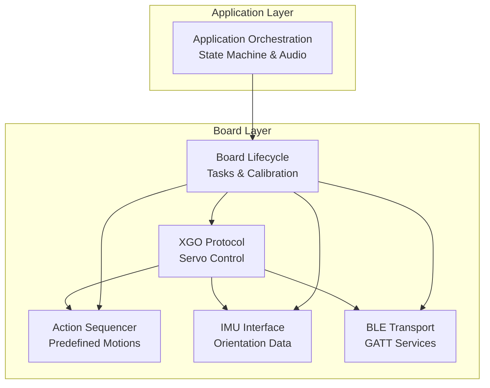

**Diagram sources**
- [xgo.cc:454-620](file://main/boards/lulu-esp32s3/xgo.cc#L454-L620)
- [xgo_action.cc:26-93](file://main/boards/lulu-esp32s3/xgo_action.cc#L26-L93)
- [imu.cc:57-129](file://main/boards/lulu-esp32s3/imu.cc#L57-L129)
- [lulu_ble.cc:21-78](file://main/boards/lulu-esp32s3/lulu_ble.cc#L21-L78)
- [lulu-esp32s3.cc:598-620](file://main/boards/lulu-esp32s3/lulu-esp32s3.cc#L598-L620)
- [application.cc:62-178](file://main/application.cc#L62-L178)

**Section sources**
- [xgo.h:1-74](file://main/boards/lulu-esp32s3/xgo.h#L1-L74)
- [xgo.cc:1-622](file://main/boards/lulu-esp32s3/xgo.cc#L1-L622)
- [xgo_action.h:1-49](file://main/boards/lulu-esp32s3/xgo_action.h#L1-L49)
- [xgo_action.cc:1-551](file://main/boards/lulu-esp32s3/xgo_action.cc#L1-L551)
- [imu.h:1-19](file://main/boards/lulu-esp32s3/imu.h#L1-L19)
- [imu.cc:1-170](file://main/boards/lulu-esp32s3/imu.cc#L1-L170)
- [lulu_ble.h:1-22](file://main/boards/lulu-esp32s3/lulu_ble.h#L1-L22)
- [lulu_ble.cc:1-279](file://main/boards/lulu-esp32s3/lulu_ble.cc#L1-L279)
- [lulu-esp32s3.cc:598-744](file://main/boards/lulu-esp32s3/lulu-esp32s3.cc#L598-L744)
- [application.h:1-195](file://main/application.h#L1-L195)
- [application.cc:1-800](file://main/application.cc#L1-L800)

## Core Components
- XGO Protocol and Servo Control
  - Defines motor structure, control APIs, movement logic, BLE/XGO command parsing, and calibration routines.
  - Implements position control via direct angle commands and periodic state reads.
- Action Sequencing
  - Provides a time-sliced action scheduler with predefined behaviors (sit, stand, tail wag, happy, etc.) and a keep-sit/reset variant.
- IMU Integration
  - Exposes roll/pitch/yaw and accelerometer data for orientation-aware behaviors.
- BLE Transport
  - Implements GATT services and characteristics mirroring XGO protocol semantics for remote control.
- Board Lifecycle and Calibration
  - Initializes tasks, manages zero-position calibration, and coordinates UI/audio feedback during calibration.

**Section sources**
- [xgo.h:17-72](file://main/boards/lulu-esp32s3/xgo.h#L17-L72)
- [xgo.cc:132-447](file://main/boards/lulu-esp32s3/xgo.cc#L132-L447)
- [xgo_action.h:5-49](file://main/boards/lulu-esp32s3/xgo_action.h#L5-L49)
- [xgo_action.cc:26-147](file://main/boards/lulu-esp32s3/xgo_action.cc#L26-L147)
- [imu.h:10-18](file://main/boards/lulu-esp32s3/imu.h#L10-L18)
- [imu.cc:57-129](file://main/boards/lulu-esp32s3/imu.cc#L57-L129)
- [lulu_ble.cc:21-78](file://main/boards/lulu-esp32s3/lulu_ble.cc#L21-L78)
- [lulu-esp32s3.cc:598-744](file://main/boards/lulu-esp32s3/lulu-esp32s3.cc#L598-L744)

## Architecture Overview
The system runs two primary control loops:
- Control Loop: Periodically computes desired positions, sends servo commands, and polls feedback.
- Action Loop: Drives predefined motion sequences with precise timing and speed profiles.

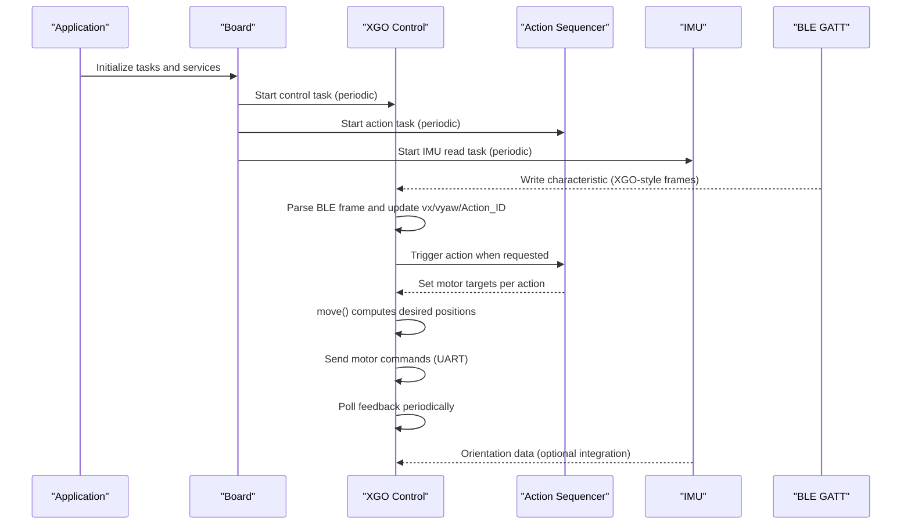

**Diagram sources**
- [xgo.cc:410-447](file://main/boards/lulu-esp32s3/xgo.cc#L410-L447)
- [xgo_action.cc:26-93](file://main/boards/lulu-esp32s3/xgo_action.cc#L26-L93)
- [imu.cc:132-155](file://main/boards/lulu-esp32s3/imu.cc#L132-L155)
- [lulu_ble.cc:38-52](file://main/boards/lulu-esp32s3/lulu_ble.cc#L38-L52)
- [lulu-esp32s3.cc:602-619](file://main/boards/lulu-esp32s3/lulu-esp32s3.cc#L602-L619)

## Detailed Component Analysis

### XGO Protocol Implementation and Servo Communication
- Command framing and checksum handling for both BLE and UART.
- Motor enable/disable, position/angle writes, and periodic state reads.
- Movement logic computes desired positions for five axes based on velocity inputs and a gait pattern.

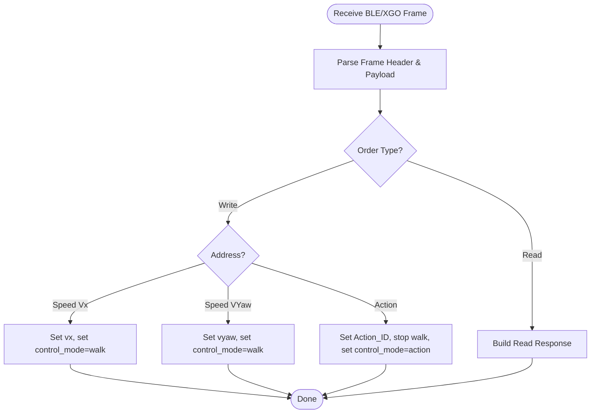

**Diagram sources**
- [xgo.cc:454-620](file://main/boards/lulu-esp32s3/xgo.cc#L454-L620)

**Section sources**
- [xgo.h:39-72](file://main/boards/lulu-esp32s3/xgo.h#L39-L72)
- [xgo.cc:120-190](file://main/boards/lulu-esp32s3/xgo.cc#L120-L190)
- [xgo.cc:132-175](file://main/boards/lulu-esp32s3/xgo.cc#L132-L175)
- [xgo.cc:177-190](file://main/boards/lulu-esp32s3/xgo.cc#L177-L190)
- [xgo.cc:454-620](file://main/boards/lulu-esp32s3/xgo.cc#L454-L620)

### Joint Calibration Procedures and Three-Click Mode
- Zero-position storage in flash and retrieval on boot.
- Automatic calibration entry when zero positions are invalid.
- Three-click detection on GPIO to toggle calibration mode and persist zero positions.

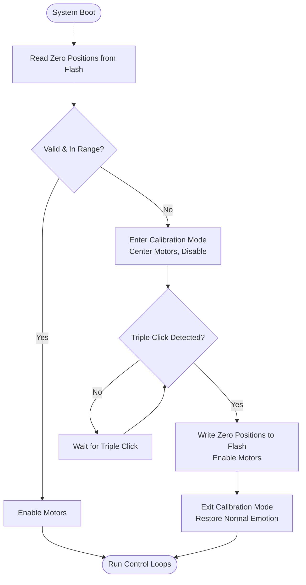

**Diagram sources**
- [xgo.cc:51-90](file://main/boards/lulu-esp32s3/xgo.cc#L51-L90)
- [xgo.cc:345-407](file://main/boards/lulu-esp32s3/xgo.cc#L345-L407)
- [lulu-esp32s3.cc:299-323](file://main/boards/lulu-esp32s3/lulu-esp32s3.cc#L299-L323)
- [lulu-esp32s3.cc:702-741](file://main/boards/lulu-esp32s3/lulu-esp32s3.cc#L702-L741)

**Section sources**
- [xgo.cc:51-90](file://main/boards/lulu-esp32s3/xgo.cc#L51-L90)
- [xgo.cc:345-407](file://main/boards/lulu-esp32s3/xgo.cc#L345-L407)
- [lulu-esp32s3.cc:299-323](file://main/boards/lulu-esp32s3/lulu-esp32s3.cc#L299-L323)
- [lulu-esp32s3.cc:702-741](file://main/boards/lulu-esp32s3/lulu-esp32s3.cc#L702-L741)

### Position Control Algorithms and Movement Coordination
- Velocity-to-gait mapping computes desired positions for each motor axis using trigonometric patterns and a step magnitude derived from combined linear and angular velocities.
- Control mode toggles between walking gait and direct angle control.

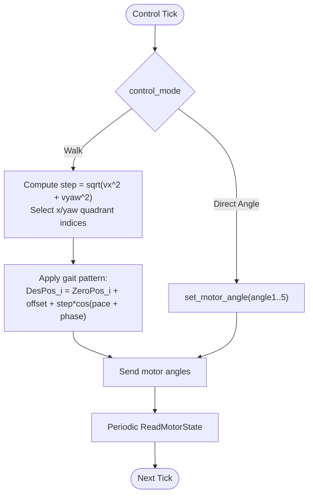

**Diagram sources**
- [xgo.cc:217-261](file://main/boards/lulu-esp32s3/xgo.cc#L217-L261)
- [xgo.cc:410-447](file://main/boards/lulu-esp32s3/xgo.cc#L410-L447)

**Section sources**
- [xgo.cc:217-261](file://main/boards/lulu-esp32s3/xgo.cc#L217-L261)
- [xgo.cc:410-447](file://main/boards/lulu-esp32s3/xgo.cc#L410-L447)

### IMU Integration for Head Tracking and Orientation-Based Behaviors
- IMU initializes I2C bus, validates device, configures sensors, and reads acceleration to compute Euler-like angles.
- While the current control loop does not actively integrate IMU for head tracking, the data is available for future orientation-aware behaviors.

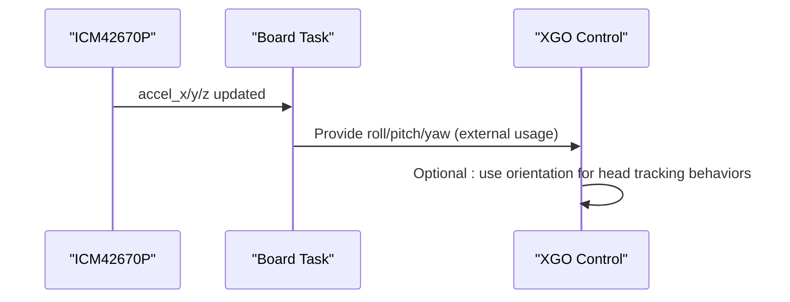

**Diagram sources**
- [imu.cc:57-129](file://main/boards/lulu-esp32s3/imu.cc#L57-L129)
- [imu.cc:132-155](file://main/boards/lulu-esp32s3/imu.cc#L132-L155)

**Section sources**
- [imu.h:10-18](file://main/boards/lulu-esp32s3/imu.h#L10-L18)
- [imu.cc:57-129](file://main/boards/lulu-esp32s3/imu.cc#L57-L129)
- [imu.cc:132-155](file://main/boards/lulu-esp32s3/imu.cc#L132-L155)

### Action Sequencing Framework and Predefined Motions
- Time-sliced actions with a global counter and per-action durations define motion profiles.
- Actions include sit, stand, tail wag, happy, scratch, hug, and variants like keep-sit and sit-reset.

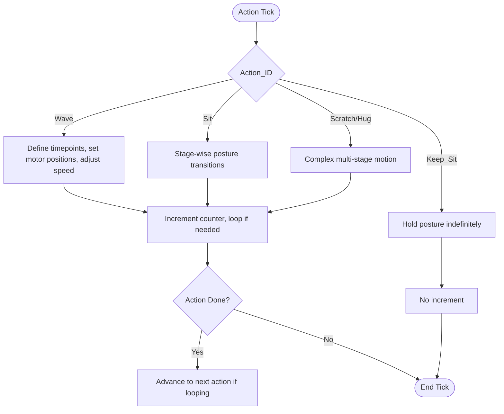

**Diagram sources**
- [xgo_action.cc:26-93](file://main/boards/lulu-esp32s3/xgo_action.cc#L26-L93)
- [xgo_action.cc:415-436](file://main/boards/lulu-esp32s3/xgo_action.cc#L415-L436)
- [xgo_action.cc:439-455](file://main/boards/lulu-esp32s3/xgo_action.cc#L439-L455)
- [xgo_action.cc:478-517](file://main/boards/lulu-esp32s3/xgo_action.cc#L478-L517)
- [xgo_action.cc:519-551](file://main/boards/lulu-esp32s3/xgo_action.cc#L519-L551)

**Section sources**
- [xgo_action.h:5-49](file://main/boards/lulu-esp32s3/xgo_action.h#L5-L49)
- [xgo_action.cc:26-93](file://main/boards/lulu-esp32s3/xgo_action.cc#L26-L93)
- [xgo_action.cc:415-436](file://main/boards/lulu-esp32s3/xgo_action.cc#L415-L436)
- [xgo_action.cc:439-455](file://main/boards/lulu-esp32s3/xgo_action.cc#L439-L455)
- [xgo_action.cc:478-517](file://main/boards/lulu-esp32s3/xgo_action.cc#L478-L517)
- [xgo_action.cc:519-551](file://main/boards/lulu-esp32s3/xgo_action.cc#L519-L551)

### Safety Mechanisms, Emergency Stop, and Fail-Safe Positioning
- Calibration mode disables motors until zero positions are saved, preventing unintended movement.
- Three-click mode provides a user-driven emergency exit from calibration.
- Normal state resets velocities and sets a safe default posture.

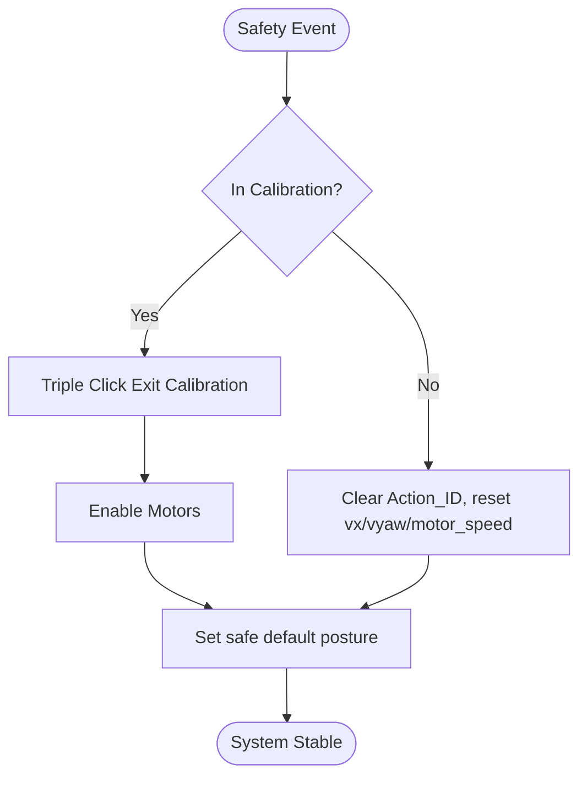

**Diagram sources**
- [xgo.cc:345-407](file://main/boards/lulu-esp32s3/xgo.cc#L345-L407)
- [xgo_action.cc:130-147](file://main/boards/lulu-esp32s3/xgo_action.cc#L130-L147)
- [lulu-esp32s3.cc:299-323](file://main/boards/lulu-esp32s3/lulu-esp32s3.cc#L299-L323)

**Section sources**
- [xgo.cc:345-407](file://main/boards/lulu-esp32s3/xgo.cc#L345-L407)
- [xgo_action.cc:130-147](file://main/boards/lulu-esp32s3/xgo_action.cc#L130-L147)
- [lulu-esp32s3.cc:299-323](file://main/boards/lulu-esp32s3/lulu-esp32s3.cc#L299-L323)

### Kinematics, Trajectory Planning, and Smooth Interpolation
- Gait-based kinematics compute desired positions using cosine trajectories with phase blending between linear and rotational motion.
- Action-based motions use segmented timepoints and sinusoidal or piecewise-linear interpolations for smoothness.

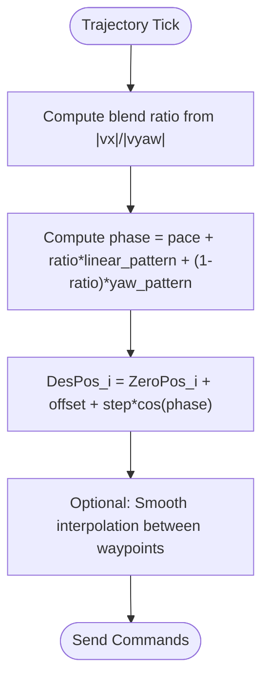

**Diagram sources**
- [xgo.cc:217-261](file://main/boards/lulu-esp32s3/xgo.cc#L217-L261)
- [xgo_action.cc:149-176](file://main/boards/lulu-esp32s3/xgo_action.cc#L149-L176)
- [xgo_action.cc:292-313](file://main/boards/lulu-esp32s3/xgo_action.cc#L292-L313)

**Section sources**
- [xgo.cc:217-261](file://main/boards/lulu-esp32s3/xgo.cc#L217-L261)
- [xgo_action.cc:149-176](file://main/boards/lulu-esp32s3/xgo_action.cc#L149-L176)
- [xgo_action.cc:292-313](file://main/boards/lulu-esp32s3/xgo_action.cc#L292-L313)

### Audio Triggers, Gesture Synchronization, and Autonomous Patterns
- Application orchestrates audio playback and UI reactions; actions can be triggered remotely via BLE and mapped to gestures.
- The board exposes tools for invoking actions (e.g., scratch, hug, reset) through the MCP server.

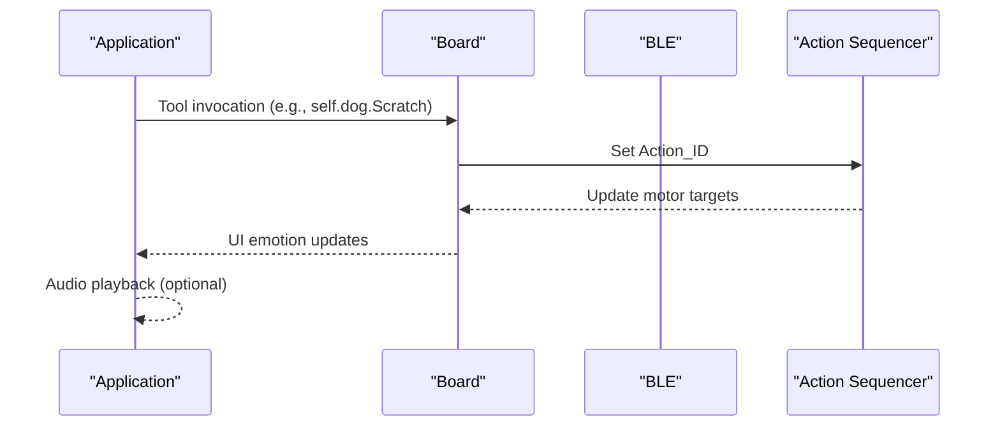

**Diagram sources**
- [application.cc:483-508](file://main/boards/lulu-esp32s3/lulu-esp32s3.cc#L483-L508)
- [xgo_action.cc:26-93](file://main/boards/lulu-esp32s3/xgo_action.cc#L26-L93)

**Section sources**
- [application.h:113-114](file://main/application.h#L113-L114)
- [application.cc:483-508](file://main/boards/lulu-esp32s3/lulu-esp32s3.cc#L483-L508)
- [xgo_action.cc:26-93](file://main/boards/lulu-esp32s3/xgo_action.cc#L26-L93)

## Dependency Analysis
- XGO depends on BLE transport for remote control and on IMU for optional orientation sensing.
- Action sequencer depends on XGO’s motor target setters and timing constants.
- Board tasks coordinate XGO control, action execution, and IMU polling.
- Application manages state transitions and audio feedback.

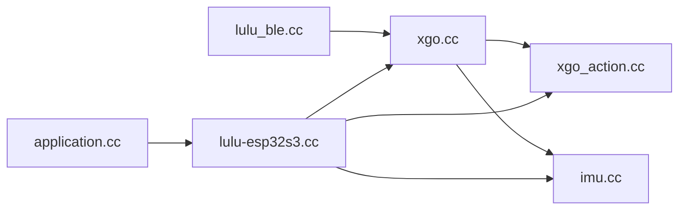

**Diagram sources**
- [lulu_ble.cc:21-78](file://main/boards/lulu-esp32s3/lulu_ble.cc#L21-L78)
- [xgo.cc:410-447](file://main/boards/lulu-esp32s3/xgo.cc#L410-L447)
- [xgo_action.cc:26-93](file://main/boards/lulu-esp32s3/xgo_action.cc#L26-L93)
- [imu.cc:132-155](file://main/boards/lulu-esp32s3/imu.cc#L132-L155)
- [lulu-esp32s3.cc:602-619](file://main/boards/lulu-esp32s3/lulu-esp32s3.cc#L602-L619)
- [application.cc:62-178](file://main/application.cc#L62-L178)

**Section sources**
- [xgo.cc:410-447](file://main/boards/lulu-esp32s3/xgo.cc#L410-L447)
- [xgo_action.cc:26-93](file://main/boards/lulu-esp32s3/xgo_action.cc#L26-L93)
- [imu.cc:132-155](file://main/boards/lulu-esp32s3/imu.cc#L132-L155)
- [lulu-esp32s3.cc:602-619](file://main/boards/lulu-esp32s3/lulu-esp32s3.cc#L602-L619)
- [application.cc:62-178](file://main/application.cc#L62-L178)

## Performance Considerations
- Control loop interval and action tick granularity balance responsiveness and CPU usage.
- UART transmission waits for completion; batching commands reduces overhead.
- IMU read frequency should align with control loop to avoid starvation.
- Motor speed limits and step magnitudes prevent torque overload and improve stability.
- Flash operations for calibration should be minimized to reduce wear.

[No sources needed since this section provides general guidance]

## Troubleshooting Guide
- Motors do not move after boot
  - Verify zero positions are written and motors are enabled post-calibration.
  - Confirm calibration mode exits properly and normal emotion is restored.
- Calibration stuck or not saving
  - Ensure triple-click timing is within the detection window.
  - Check flash erase/write return codes and address alignment.
- BLE control not responding
  - Confirm GATT write to TX characteristic and proper frame checksum.
  - Verify characteristic handles and notification enablement.
- IMU data not updating
  - Validate I2C wiring, device probe, and register configuration.
  - Ensure task scheduling and read intervals are active.

**Section sources**
- [xgo.cc:51-90](file://main/boards/lulu-esp32s3/xgo.cc#L51-L90)
- [xgo.cc:345-407](file://main/boards/lulu-esp32s3/xgo.cc#L345-L407)
- [lulu_ble.cc:38-52](file://main/boards/lulu-esp32s3/lulu_ble.cc#L38-L52)
- [imu.cc:83-129](file://main/boards/lulu-esp32s3/imu.cc#L83-L129)

## Conclusion
The system integrates XGO protocol-based servo control with a robust calibration workflow, precise action sequencing, and optional IMU-based orientation sensing. The three-click calibration ensures reliable zero-position setup, while the action framework enables expressive behaviors. With careful tuning of control intervals, motor speeds, and trajectory blending, the robot achieves smooth, safe, and responsive motion suitable for interactive applications.

[No sources needed since this section summarizes without analyzing specific files]

## Appendices

### A. BLE/XGO Command Reference (Addresses)
- Speed Vx: 0x30 → forward/backward velocity
- Speed VYaw: 0x32 → yaw rotation velocity
- Action: 0x3E → action selection (0x00 stop, 0x0F reset)

**Section sources**
- [xgo.cc:586-620](file://main/boards/lulu-esp32s3/xgo.cc#L586-L620)

### B. Action IDs and Descriptions
- Wave, Naughty, Lookup, Swing, Rolling, Angry, Swimming, Pee, Stretch, Bouncing, Shaking, Sit, Scratch, Hug, Keep_Sit, Sit_Reset, reset

**Section sources**
- [xgo_action.h:7-23](file://main/boards/lulu-esp32s3/xgo_action.h#L7-L23)