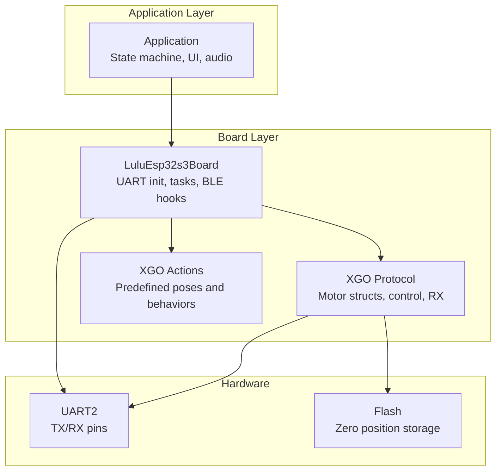
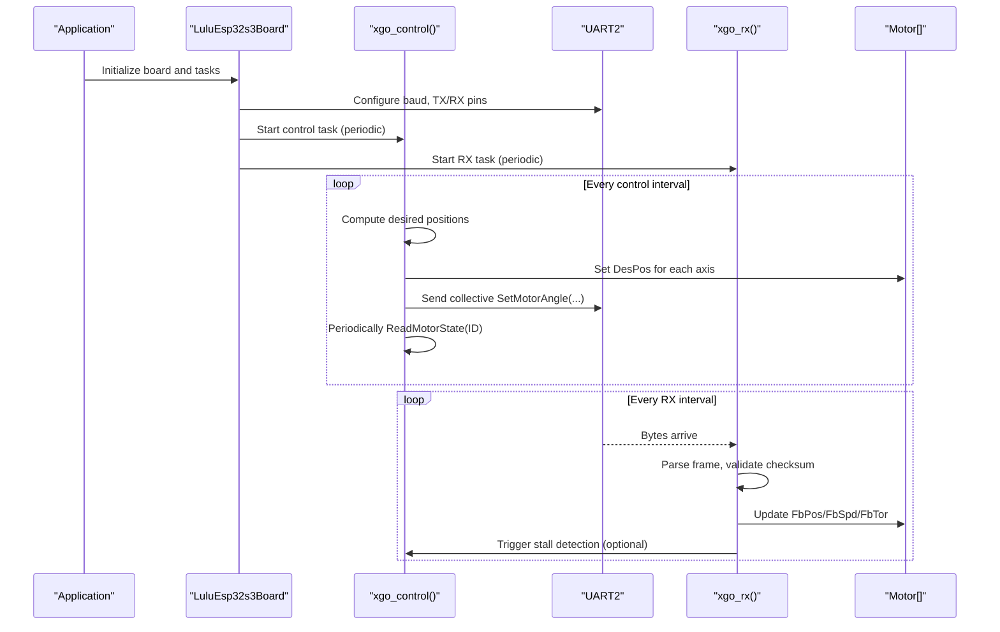
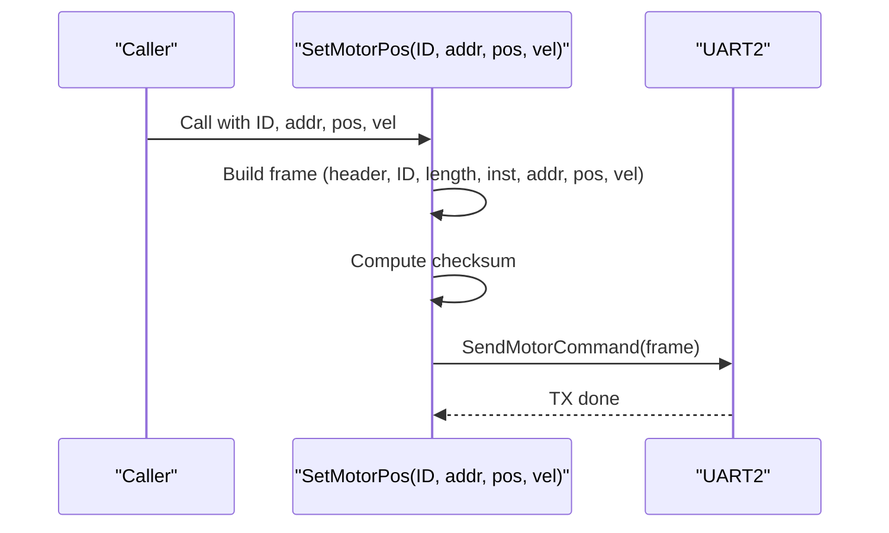
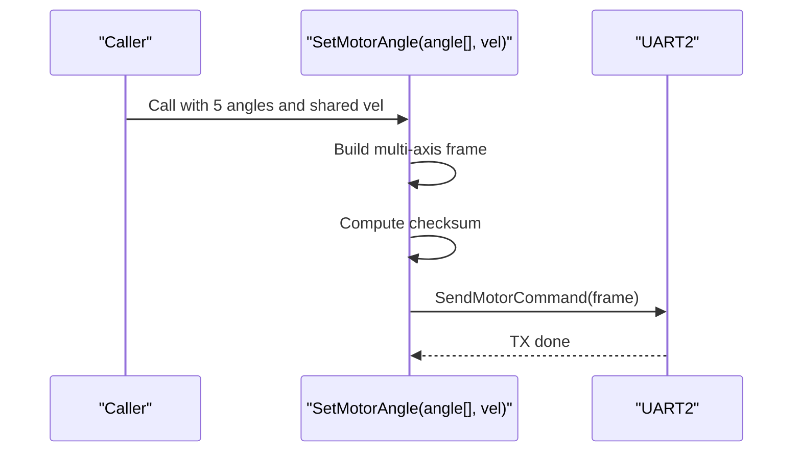
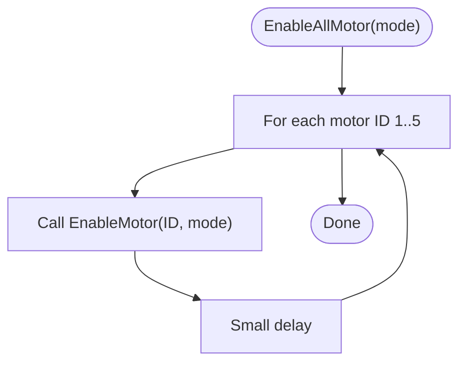
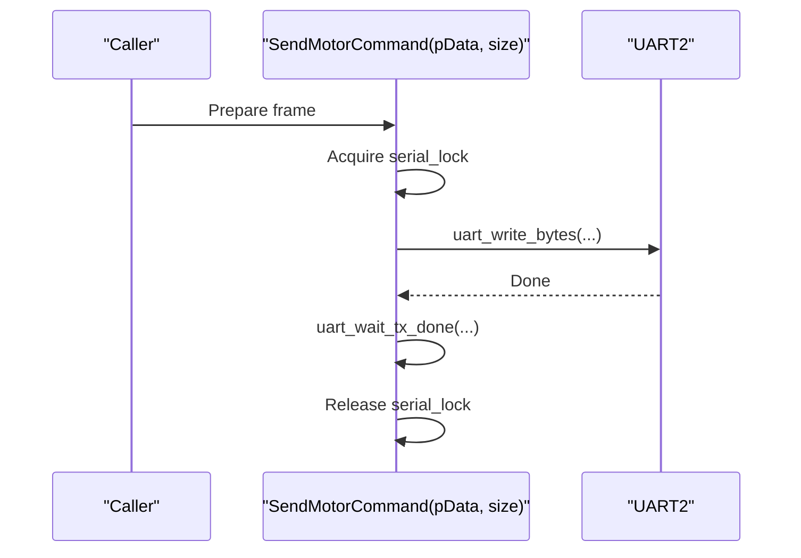
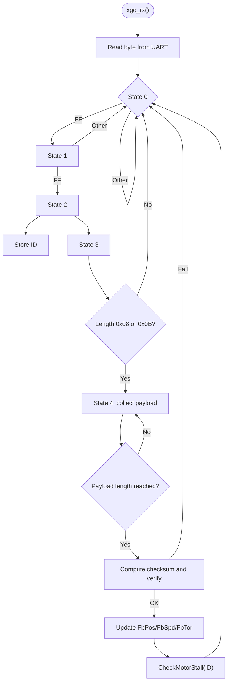
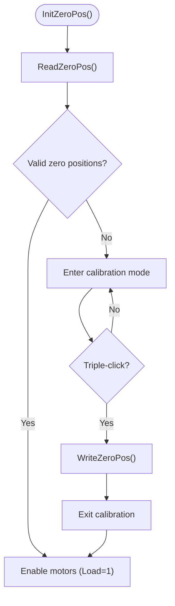
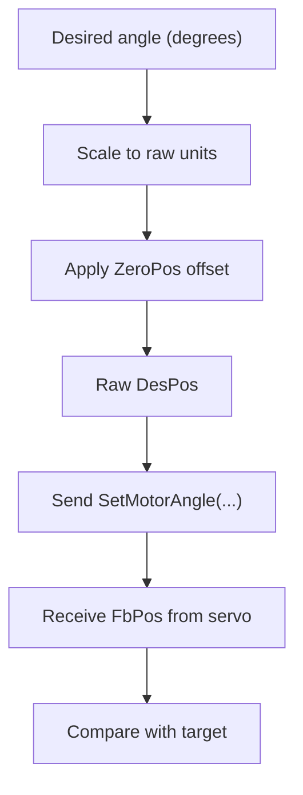
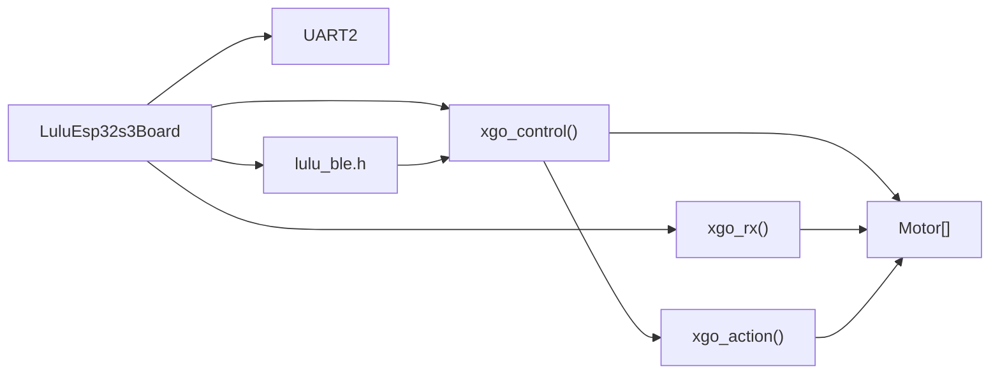

# Servo Motor Control

<cite>
**Referenced Files in This Document**
- [xgo.h](file://main/boards/lulu-esp32s3/xgo.h)
- [xgo.cc](file://main/boards/lulu-esp32s3/xgo.cc)
- [xgo_action.h](file://main/boards/lulu-esp32s3/xgo_action.h)
- [xgo_action.cc](file://main/boards/lulu-esp32s3/xgo_action.cc)
- [lulu-esp32s3.cc](file://main/boards/lulu-esp32s3/lulu-esp32s3.cc)
- [config.h](file://main/boards/lulu-esp32s3/config.h)
- [lulu_ble.h](file://main/boards/lulu-esp32s3/lulu_ble.h)
- [application.h](file://main/application.h)
- [application.cc](file://main/application.cc)
</cite>

## Table of Contents
1. [Introduction](#introduction)
2. [Project Structure](#project-structure)
3. [Core Components](#core-components)
4. [Architecture Overview](#architecture-overview)
5. [Detailed Component Analysis](#detailed-component-analysis)
6. [Dependency Analysis](#dependency-analysis)
7. [Performance Considerations](#performance-considerations)
8. [Troubleshooting Guide](#troubleshooting-guide)
9. [Conclusion](#conclusion)
10. [Appendices](#appendices)

## Introduction
This document describes the 5-axis servo motor control system implemented for the Lulu ESP32-S3 board. It focuses on the XGO protocol over UART for communicating with servos, the Motor struct and its properties, motor enable/disable functions, individual and collective motor control, command sending, and RX feedback processing. It also covers velocity control parameters, torque limits, load monitoring, calibration and zero-position handling, and practical control sequences with error handling and diagnostics.

## Project Structure
The servo control system is centered around the XGO protocol implementation in the Lulu board module. The system integrates:
- UART configuration for XGO protocol communication
- Motor control APIs for individual and group control
- Feedback parsing and stall detection
- BLE/XGO-style serial protocol entry for remote control
- Calibration routines and persistent storage of zero positions
- Tasks for continuous control and RX processing

**Diagram sources**
- [lulu-esp32s3.cc:48-59](file://main/boards/lulu-esp32s3/lulu-esp32s3.cc#L48-L59)
- [xgo.cc:177-187](file://main/boards/lulu-esp32s3/xgo.cc#L177-L187)
- [xgo.h:17-28](file://main/boards/lulu-esp32s3/xgo.h#L17-L28)
- [xgo_action.cc:1-551](file://main/boards/lulu-esp32s3/xgo_action.cc#L1-L551)

**Section sources**
- [lulu-esp32s3.cc:48-59](file://main/boards/lulu-esp32s3/lulu-esp32s3.cc#L48-L59)
- [config.h:75-88](file://main/boards/lulu-esp32s3/config.h#L75-L88)
- [xgo.h:17-28](file://main/boards/lulu-esp32s3/xgo.h#L17-L28)

## Core Components
- Motor struct: Holds per-motor state and targets for position, speed, torque, feedback, and calibration offset.
- XGO protocol functions: Individual motor control, collective angle control, enable/disable, and command sending.
- RX parser: Assembles frames, validates checksums, and updates feedback fields.
- Stall detection: Monitors position error and torque thresholds to detect stalled motors.
- Calibration: Zero-position read/write and calibration mode entry/exit.
- BLE/XGO-style serial entry: Parses BLE frames and translates them into control actions.

**Section sources**
- [xgo.h:17-28](file://main/boards/lulu-esp32s3/xgo.h#L17-L28)
- [xgo.cc:189-232](file://main/boards/lulu-esp32s3/xgo.cc#L189-L232)
- [xgo.cc:325-402](file://main/boards/lulu-esp32s3/xgo.cc#L325-L402)
- [xgo.cc:64-96](file://main/boards/lulu-esp32s3/xgo.cc#L64-L96)
- [xgo.cc:108-147](file://main/boards/lulu-esp32s3/xgo.cc#L108-L147)
- [xgo.cc:515-679](file://main/boards/lulu-esp32s3/xgo.cc#L515-L679)

## Architecture Overview
The system operates with two concurrent tasks:
- Control task: Updates desired positions, sends collective commands, periodically reads individual states, and manages actions.
- RX task: Reads UART bytes, parses XGO feedback frames, updates motor feedback fields, and triggers stall detection.

**Diagram sources**
- [lulu-esp32s3.cc:634-653](file://main/boards/lulu-esp32s3/lulu-esp32s3.cc#L634-L653)
- [xgo.cc:469-506](file://main/boards/lulu-esp32s3/xgo.cc#L469-L506)
- [xgo.cc:325-402](file://main/boards/lulu-esp32s3/xgo.cc#L325-L402)

## Detailed Component Analysis

### Motor Struct and Properties
The Motor struct encapsulates per-axis state and targets:
- ID: Servo identifier (1–5)
- DesPos: Desired position (raw units)
- DesSpd: Desired speed (float)
- DesTor: Desired torque (short)
- FbPos: Feedback position (raw units)
- FbSpd: Feedback speed (float)
- FbTor: Feedback torque (short)
- ZeroPos: Calibration offset (raw units)
- Load: Operational state flag (1 = enabled, 0 = disabled)

These fields are used to compute desired positions, send commands, and monitor feedback.

**Section sources**
- [xgo.h:17-28](file://main/boards/lulu-esp32s3/xgo.h#L17-L28)
- [xgo.cc:21-32](file://main/boards/lulu-esp32s3/xgo.cc#L21-L32)

### Individual Motor Control: SetMotorPos
- Purpose: Send a single servo command to set position and speed for a given ID.
- Protocol: Constructs a fixed-length frame with header, ID, length, instruction, address, position, speed, and checksum.
- Execution: Writes to UART and waits until transmission completes.

**Diagram sources**
- [xgo.cc:189-205](file://main/boards/lulu-esp32s3/xgo.cc#L189-L205)
- [xgo.cc:177-187](file://main/boards/lulu-esp32s3/xgo.cc#L177-L187)

**Section sources**
- [xgo.cc:189-205](file://main/boards/lulu-esp32s3/xgo.cc#L189-L205)

### Collective Motor Control: SetMotorAngle
- Purpose: Send a single command to set desired positions and speeds for all five axes simultaneously.
- Protocol: Builds a multi-axis frame with repeated entries for each motor and a single checksum.
- Execution: Uses the same SendMotorCommand mechanism as SetMotorPos.

**Diagram sources**
- [xgo.cc:208-232](file://main/boards/lulu-esp32s3/xgo.cc#L208-L232)
- [xgo.cc:177-187](file://main/boards/lulu-esp32s3/xgo.cc#L177-L187)

**Section sources**
- [xgo.cc:208-232](file://main/boards/lulu-esp32s3/xgo.cc#L208-L232)

### Motor Enable/Disable: EnableMotor and EnableAllMotor
- EnableMotor(ID, mode): Sends an enable/disable command for a single servo.
- EnableAllMotor(mode): Iterates and enables/disables all servos with small delays to ensure reliable sequencing.

**Diagram sources**
- [xgo.cc:249-272](file://main/boards/lulu-esp32s3/xgo.cc#L249-L272)

**Section sources**
- [xgo.cc:249-272](file://main/boards/lulu-esp32s3/xgo.cc#L249-L272)

### Command Sending Mechanism: SendMotorCommand
- Purpose: Serialize and transmit a prepared frame to UART.
- Safety: Uses a lock to prevent overlapping writes and waits for TX completion.

**Diagram sources**
- [xgo.cc:177-187](file://main/boards/lulu-esp32s3/xgo.cc#L177-L187)

**Section sources**
- [xgo.cc:177-187](file://main/boards/lulu-esp32s3/xgo.cc#L177-L187)

### RX Processing: xgo_rx
- Purpose: Parse incoming XGO feedback frames from servos.
- Protocol: Frame parsing with header detection, length validation, payload extraction, and checksum verification.
- Updates: On valid frames, updates FbPos, FbSpd, FbTor for the corresponding motor ID.
- Stall Detection: Triggers stall check after updating feedback.

**Diagram sources**
- [xgo.cc:325-402](file://main/boards/lulu-esp32s3/xgo.cc#L325-L402)

**Section sources**
- [xgo.cc:325-402](file://main/boards/lulu-esp32s3/xgo.cc#L325-L402)

### Velocity Control Parameters and Torque Limits
- Desired speed (DesSpd) and torque (DesTor) are part of the Motor struct and are sent via SetMotorPos/SetMotorAngle.
- Feedback speed (FbSpd) and torque (FbTor) are parsed from servo feedback frames.
- Torque limits and velocity bounds are not explicitly defined in code; they depend on servo capabilities and the values passed in commands.

Practical guidance:
- Use reasonable speed values for smooth motion; higher speeds increase torque demand.
- Monitor FbTor to detect overload conditions; excessive torque can indicate mechanical binding or stall.

**Section sources**
- [xgo.h:17-28](file://main/boards/lulu-esp32s3/xgo.h#L17-L28)
- [xgo.cc:376-391](file://main/boards/lulu-esp32s3/xgo.cc#L376-L391)

### Load Monitoring
- Load field indicates whether a motor is enabled (1) or disabled (0).
- During calibration, motors are disabled until zero positions are saved.
- Actions and movement logic rely on Load to decide whether to send commands.

**Section sources**
- [xgo.cc:149-175](file://main/boards/lulu-esp32s3/xgo.cc#L149-L175)
- [xgo_action.cc:112-118](file://main/boards/lulu-esp32s3/xgo_action.cc#L112-L118)

### Calibration and Zero-Position Adjustments
- Zero position storage: Stored in flash at a fixed address and validated on boot.
- InitZeroPos: Attempts to read zero positions; if invalid, enters calibration mode and disables motors.
- WriteZeroPos: Writes current feedback positions as zero offsets and enables motors.
- ReadZeroPos: Reads stored zero positions; falls back to defaults if invalid.
- Triple-click gesture: Toggles calibration mode and saves/loads zero positions.

**Diagram sources**
- [xgo.cc:108-147](file://main/boards/lulu-esp32s3/xgo.cc#L108-L147)
- [xgo.cc:404-466](file://main/boards/lulu-esp32s3/xgo.cc#L404-L466)
- [lulu-esp32s3.cc:735-774](file://main/boards/lulu-esp32s3/lulu-esp32s3.cc#L735-L774)

**Section sources**
- [xgo.cc:108-147](file://main/boards/lulu-esp32s3/xgo.cc#L108-L147)
- [xgo.cc:404-466](file://main/boards/lulu-esp32s3/xgo.cc#L404-L466)
- [lulu-esp32s3.cc:735-774](file://main/boards/lulu-esp32s3/lulu-esp32s3.cc#L735-L774)

### Relationship Between Desired Positions and Actual Angles
- Desired positions are stored in DesPos and translated to raw servo units.
- Feedback positions (FbPos) reflect actual servo positions.
- ZeroPos acts as an offset to align commanded positions with physical neutral.
- Angle-based control (set_motor_angle) converts degrees to raw units using scaling constants.

**Diagram sources**
- [xgo_action.cc:103-110](file://main/boards/lulu-esp32s3/xgo_action.cc#L103-L110)
- [xgo.cc:376-391](file://main/boards/lulu-esp32s3/xgo.cc#L376-L391)

**Section sources**
- [xgo_action.cc:103-110](file://main/boards/lulu-esp32s3/xgo_action.cc#L103-L110)
- [xgo.cc:376-391](file://main/boards/lulu-esp32s3/xgo.cc#L376-L391)

### Practical Control Sequences and Examples
- Basic posture: Use normal_state to set default stance and motor_speed.
- Movement control: Set vx/vyaw and motor_speed; the control loop computes desired positions.
- Action sequences: Use predefined actions (e.g., Wave, Sit, Hug) via Action_ID and timing loops.
- Immediate angle control: Use set_motor_angle to set specific angles for all axes.

Example references:
- Normal posture and speed: [xgo_action.cc:112-118](file://main/boards/lulu-esp32s3/xgo_action.cc#L112-L118)
- Movement control loop: [xgo.cc:274-318](file://main/boards/lulu-esp32s3/xgo.cc#L274-L318)
- Action selection: [xgo_action.cc:26-93](file://main/boards/lulu-esp32s3/xgo_action.cc#L26-L93)
- Immediate angle control: [xgo_action.cc:103-110](file://main/boards/lulu-esp32s3/xgo_action.cc#L103-L110)

**Section sources**
- [xgo_action.cc:112-118](file://main/boards/lulu-esp32s3/xgo_action.cc#L112-L118)
- [xgo.cc:274-318](file://main/boards/lulu-esp32s3/xgo.cc#L274-L318)
- [xgo_action.cc:26-93](file://main/boards/lulu-esp32s3/xgo_action.cc#L26-L93)
- [xgo_action.cc:103-110](file://main/boards/lulu-esp32s3/xgo_action.cc#L103-L110)

### Error Handling and Diagnostics
- UART TX lock prevents overlapping writes and ensures reliable transmission.
- RX checksum verification prevents corrupted data from updating motor state.
- Stall detection: Monitors position error and torque to detect stalls; triggers callback to disable and re-enable affected motors.
- Calibration mode: Provides a safe environment to set zero positions; triple-click toggles calibration state.
- BLE/XGO-style protocol: Validates frame length and checksum; responds to read commands with version/battery info.

**Section sources**
- [xgo.cc:177-187](file://main/boards/lulu-esp32s3/xgo.cc#L177-L187)
- [xgo.cc:325-402](file://main/boards/lulu-esp32s3/xgo.cc#L325-L402)
- [xgo.cc:64-96](file://main/boards/lulu-esp32s3/xgo.cc#L64-L96)
- [xgo.cc:404-466](file://main/boards/lulu-esp32s3/xgo.cc#L404-L466)
- [xgo.cc:515-679](file://main/boards/lulu-esp32s3/xgo.cc#L515-L679)

## Dependency Analysis
- Board initialization configures UART pins and creates control/RX tasks.
- Control task depends on Motor structs and control functions.
- RX task depends on UART and checksum logic.
- Actions module depends on Motor structs and control functions.
- BLE entry depends on XGO protocol framing and translation to control variables.

**Diagram sources**
- [lulu-esp32s3.cc:634-653](file://main/boards/lulu-esp32s3/lulu-esp32s3.cc#L634-L653)
- [xgo.cc:469-506](file://main/boards/lulu-esp32s3/xgo.cc#L469-L506)
- [xgo_action.cc:1-551](file://main/boards/lulu-esp32s3/xgo_action.cc#L1-L551)
- [lulu_ble.h:7-17](file://main/boards/lulu-esp32s3/lulu_ble.h#L7-L17)

**Section sources**
- [lulu-esp32s3.cc:634-653](file://main/boards/lulu-esp32s3/lulu-esp32s3.cc#L634-L653)
- [xgo.cc:469-506](file://main/boards/lulu-esp32s3/xgo.cc#L469-L506)
- [xgo_action.cc:1-551](file://main/boards/lulu-esp32s3/xgo_action.cc#L1-L551)
- [lulu_ble.h:7-17](file://main/boards/lulu-esp32s3/lulu_ble.h#L7-L17)

## Performance Considerations
- Control loop interval: Controlled by XGO_TASK_INTERVAL_MS; affects responsiveness and CPU usage.
- RX loop interval: Controlled by XGO_RX_TASK_INTERVAL_MS; affects feedback latency and CPU usage.
- UART baud: Set to 1,000,000 bps for fast communication.
- TX lock: Prevents contention but may add brief blocking; ensure minimal frame sizes and infrequent bursts.
- Stall detection: Adds periodic checks; tune debounce and cooldown to balance sensitivity and stability.

[No sources needed since this section provides general guidance]

## Troubleshooting Guide
- No movement or motors disabled:
  - Check Load flag and EnableAllMotor calls.
  - Verify calibration mode and zero positions.
- Stalls or frequent disabling:
  - Inspect torque thresholds and position error debounce.
  - Reduce speed or remove obstructions.
- Incorrect angles:
  - Recalibrate zero positions.
  - Confirm scaling from degrees to raw units.
- Communication errors:
  - Verify UART pin configuration and baud.
  - Check RX checksum failures and frame lengths.

**Section sources**
- [xgo.cc:149-175](file://main/boards/lulu-esp32s3/xgo.cc#L149-L175)
- [xgo.cc:64-96](file://main/boards/lulu-esp32s3/xgo.cc#L64-L96)
- [xgo.cc:325-402](file://main/boards/lulu-esp32s3/xgo.cc#L325-L402)
- [config.h:75-88](file://main/boards/lulu-esp32s3/config.h#L75-L88)

## Conclusion
The XGO-based servo control system provides robust, real-time control of a 5-axis platform via UART. It includes precise motor control, feedback parsing, stall detection, calibration, and BLE/XGO-style remote control. By tuning control intervals, speed/torque parameters, and leveraging calibration and diagnostics, the system achieves reliable and responsive motion control suitable for dynamic behaviors and interactive applications.

[No sources needed since this section summarizes without analyzing specific files]

## Appendices

### API Reference Summary
- Motor struct fields: ID, DesPos, DesSpd, DesTor, FbPos, FbSpd, FbTor, ZeroPos, Load
- Control APIs: SetMotorPos, SetMotorAngle, EnableMotor, EnableAllMotor
- Feedback: xgo_rx, ReadMotorState
- Calibration: InitZeroPos, WriteZeroPos, ReadZeroPos, IsCalibrated
- Stall detection: SetMotorStallCallback, EnableStallDetection
- BLE/XGO entry: lulu_ble_on_rx_bytes

**Section sources**
- [xgo.h:17-28](file://main/boards/lulu-esp32s3/xgo.h#L17-L28)
- [xgo.cc:189-232](file://main/boards/lulu-esp32s3/xgo.cc#L189-L232)
- [xgo.cc:249-272](file://main/boards/lulu-esp32s3/xgo.cc#L249-L272)
- [xgo.cc:234-247](file://main/boards/lulu-esp32s3/xgo.cc#L234-L247)
- [xgo.cc:108-147](file://main/boards/lulu-esp32s3/xgo.cc#L108-L147)
- [xgo.cc:515-679](file://main/boards/lulu-esp32s3/xgo.cc#L515-L679)