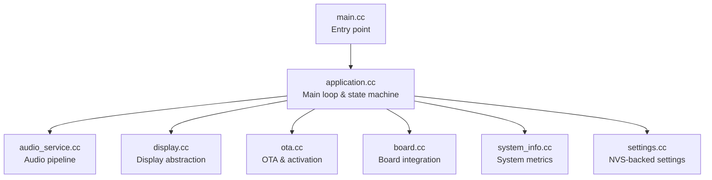
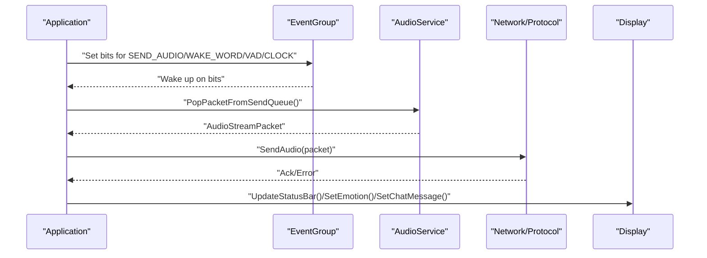
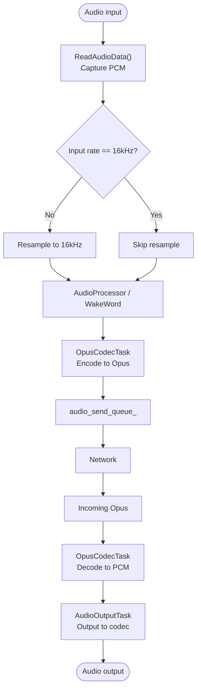
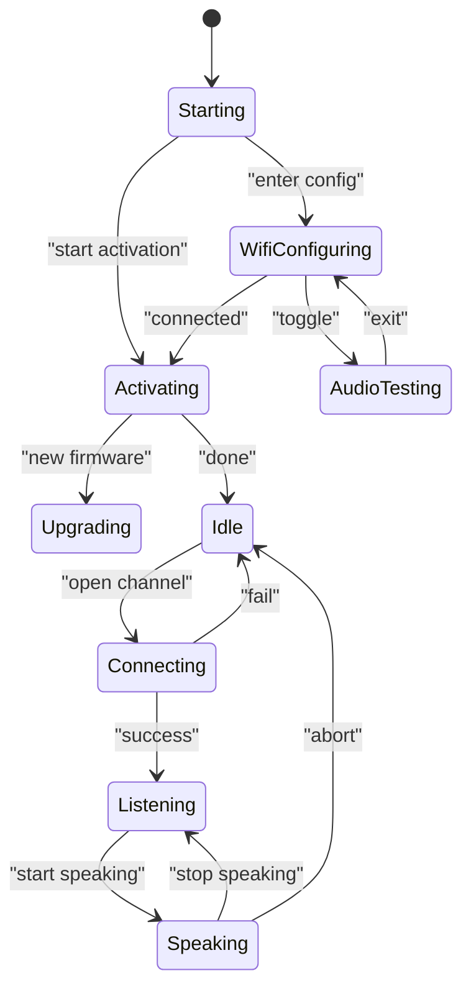
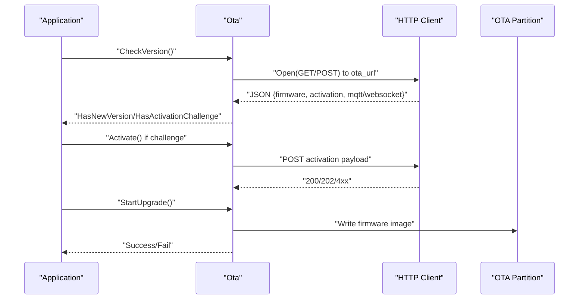
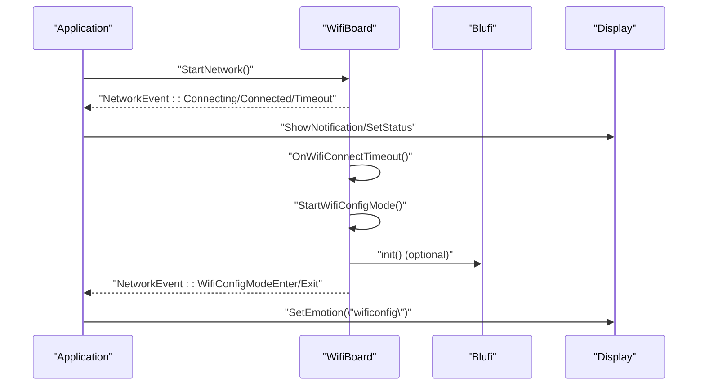
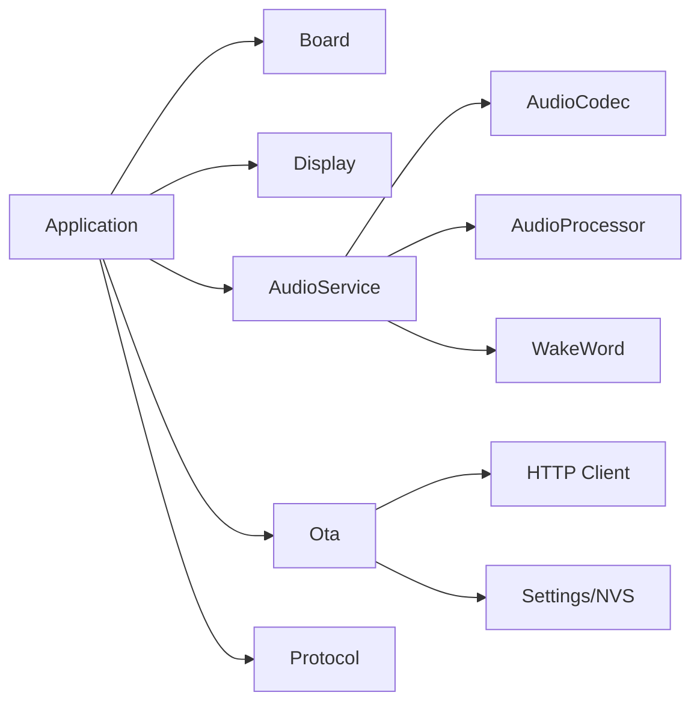

# Troubleshooting and FAQ

<cite>
**Referenced Files in This Document**
- [main.cc](file://main/main.cc)
- [application.cc](file://main/application.cc)
- [audio_service.cc](file://main/audio/audio_service.cc)
- [display.cc](file://main/display/display.cc)
- [ota.cc](file://main/ota.cc)
- [board.cc](file://main/boards/common/board.cc)
- [system_info.cc](file://main/system_info.cc)
- [settings.cc](file://main/settings.cc)
- [audio_debug_server.py](file://scripts/audio_debug_server.py)
- [README.md](file://README.md)
- [audio/README.md](file://main/audio/README.md)
- [device_state_machine.cc](file://main/device_state_machine.cc)
- [wifi_board.cc](file://main/boards/common/wifi_board.cc)
</cite>

## Table of Contents
1. [Introduction](#introduction)
2. [Project Structure](#project-structure)
3. [Core Components](#core-components)
4. [Architecture Overview](#architecture-overview)
5. [Detailed Component Analysis](#detailed-component-analysis)
6. [Dependency Analysis](#dependency-analysis)
7. [Performance Considerations](#performance-considerations)
8. [Troubleshooting Guide](#troubleshooting-guide)
9. [Conclusion](#conclusion)
10. [Appendices](#appendices)

## Introduction
This document provides a comprehensive troubleshooting guide for the RIG-Puppy robot dog firmware. It focuses on diagnosing and resolving hardware connectivity issues, audio processing failures, and display rendering problems. It also covers log analysis techniques using ESP-IDF monitor filtering and TAG-based debugging, step-by-step solutions for WiFi provisioning failures, OTA update problems, and device activation issues, plus performance optimization strategies for memory usage, CPU utilization, and battery life. Finally, it includes preventive maintenance guidelines, system health monitoring, and recovery procedures for critical failures.

## Project Structure
The firmware is organized around a main application loop, audio pipeline, display abstraction, OTA and activation logic, and board-specific integrations. Key areas include:
- Application orchestration and state machine
- Audio capture, processing, encoding/decoding, and playback
- Display abstraction and UI updates
- OTA upgrade and device activation
- Board-level hardware integration and settings storage

**Diagram sources**
- [main.cc:14-29](file://main/main.cc#L14-L29)
- [application.cc:62-178](file://main/application.cc#L62-L178)
- [audio_service.cc:62-123](file://main/audio/audio_service.cc#L62-L123)
- [display.cc:23-46](file://main/display/display.cc#L23-L46)
- [ota.cc:77-111](file://main/ota.cc#L77-L111)
- [board.cc:15-46](file://main/boards/common/board.cc#L15-L46)
- [system_info.cc:31-37](file://main/system_info.cc#L31-L37)
- [settings.cc:8-19](file://main/settings.cc#L8-L19)

**Section sources**
- [README.md:117-137](file://README.md#L117-L137)

## Core Components
- Application: Initializes subsystems, sets up UI, starts network, and drives state transitions and event handling.
- AudioService: Manages audio input/output tasks, Opus encode/decode, wake word detection, and power-aware codec control.
- Display: Abstraction for status, notifications, emotions, chat messages, and power save mode.
- OTA: Version checking, activation via HMAC challenge, firmware upgrade, and server time sync.
- Board: UUID generation, system info JSON assembly, and board-specific hardware hooks.
- SystemInfo: Heap statistics, task CPU usage, PM locks, and optional IMU status.
- Settings: NVS namespace wrapper for persistent configuration.

**Section sources**
- [application.cc:62-178](file://main/application.cc#L62-L178)
- [audio_service.cc:62-123](file://main/audio/audio_service.cc#L62-L123)
- [display.cc:23-46](file://main/display/display.cc#L23-L46)
- [ota.cc:77-111](file://main/ota.cc#L77-L111)
- [board.cc:15-46](file://main/boards/common/board.cc#L15-L46)
- [system_info.cc:152-165](file://main/system_info.cc#L152-L165)
- [settings.cc:8-19](file://main/settings.cc#L8-L19)

## Architecture Overview
The system uses FreeRTOS tasks and event groups to coordinate audio, networking, and UI updates. The application loop waits on event bits and dispatches handlers for network events, audio callbacks, and periodic clock ticks. AudioService runs three concurrent tasks: input, opus codec, and output. Display and LED are updated through callbacks and scheduled tasks.

**Diagram sources**
- [application.cc:184-276](file://main/application.cc#L184-L276)
- [audio_service.cc:553-562](file://main/audio/audio_service.cc#L553-L562)

**Section sources**
- [application.cc:184-276](file://main/application.cc#L184-L276)
- [audio_service.cc:144-200](file://main/audio/audio_service.cc#L144-L200)

## Detailed Component Analysis

### Audio Pipeline
The audio pipeline consists of:
- AudioInputTask: Reads PCM from codec, optionally resamples, and feeds to wake word or audio processor.
- OpusCodecTask: Encodes PCM to Opus for sending and decodes Opus to PCM for playback.
- AudioOutputTask: Outputs PCM to codec and manages power gating.
- Power management: Timer-based disabling of ADC/DAC after inactivity.

**Diagram sources**
- [audio_service.cc:263-321](file://main/audio/audio_service.cc#L263-L321)
- [audio_service.cc:360-479](file://main/audio/audio_service.cc#L360-L479)
- [audio_service.cc:715-728](file://main/audio/audio_service.cc#L715-L728)

**Section sources**
- [audio/README.md:14-88](file://main/audio/README.md#L14-L88)
- [audio_service.cc:62-123](file://main/audio/audio_service.cc#L62-L123)

### State Machine and UI Updates
The device state machine defines valid transitions among states such as starting, wifi_configuring, idle, connecting, listening, speaking, upgrading, activating, audio_testing, fatal_error, and invalid_state. Application handlers react to network events and update the display accordingly.

**Diagram sources**
- [device_state_machine.cc:108-131](file://main/device_state_machine.cc#L108-L131)
- [application.cc:117-171](file://main/application.cc#L117-L171)

**Section sources**
- [device_state_machine.cc:34-102](file://main/device_state_machine.cc#L34-L102)
- [application.cc:117-171](file://main/application.cc#L117-L171)

### OTA and Activation
OTA checks version, parses MQTT/WebSocket configuration, and optionally sets system time. Activation performs HMAC-based challenge-response using efuse-provided serial number when available. Firmware upgrade writes sequentially to the next OTA partition and sets boot partition.

**Diagram sources**
- [ota.cc:77-111](file://main/ota.cc#L77-L111)
- [ota.cc:458-492](file://main/ota.cc#L458-L492)
- [ota.cc:267-387](file://main/ota.cc#L267-L387)

**Section sources**
- [ota.cc:77-111](file://main/ota.cc#L77-L111)
- [ota.cc:267-387](file://main/ota.cc#L267-L387)
- [ota.cc:458-492](file://main/ota.cc#L458-L492)

### WiFi Provisioning and Connectivity
WiFi provisioning supports multiple modes: hotspot-based, ESP-BLUFI, and acoustic provisioning. On timeout, the system enters WiFi config mode and displays prompts. Network events trigger UI updates and state transitions.

**Diagram sources**
- [wifi_board.cc:165-221](file://main/boards/common/wifi_board.cc#L165-L221)
- [application.cc:117-171](file://main/application.cc#L117-L171)

**Section sources**
- [wifi_board.cc:135-221](file://main/boards/common/wifi_board.cc#L135-L221)
- [application.cc:117-171](file://main/application.cc#L117-L171)

## Dependency Analysis
- Application depends on Board, Display, AudioService, OTA, and Protocol abstractions.
- AudioService depends on AudioCodec, AudioProcessor, WakeWord, Opus encoder/decoder, and resamplers.
- OTA depends on HTTP client, NVS settings, and partition APIs.
- Board integrates system info, display, and LED abstractions.

**Diagram sources**
- [application.cc:62-115](file://main/application.cc#L62-L115)
- [audio_service.cc:62-123](file://main/audio/audio_service.cc#L62-L123)
- [ota.cc:55-72](file://main/ota.cc#L55-L72)
- [board.cc:15-46](file://main/boards/common/board.cc#L15-L46)

**Section sources**
- [application.cc:62-115](file://main/application.cc#L62-L115)
- [audio_service.cc:62-123](file://main/audio/audio_service.cc#L62-L123)
- [ota.cc:55-72](file://main/ota.cc#L55-L72)
- [board.cc:15-46](file://main/boards/common/board.cc#L15-L46)

## Performance Considerations
- Memory: Monitor free SRAM and minimum free heap using SystemInfo. Reduce queue sizes or disable non-critical features under memory pressure.
- CPU: Use SystemInfo.PrintTaskCpuUsage to identify heavy tasks and adjust priorities or reduce work.
- Power: Audio power gating reduces ADC/DAC usage after inactivity; ensure adequate delays to avoid thrashing.
- Audio quality: Ensure server sample rate matches device output sample rate to prevent resampling artifacts.

**Section sources**
- [system_info.cc:61-144](file://main/system_info.cc#L61-L144)
- [system_info.cc:152-165](file://main/system_info.cc#L152-L165)
- [audio_service.cc:715-728](file://main/audio/audio_service.cc#L715-L728)
- [application.cc:528-534](file://main/application.cc#L528-L534)

## Troubleshooting Guide

### Hardware Connectivity Problems
Symptoms:
- WiFi scan timeout or no networks shown
- Frequent disconnects or registration errors
- Modem-specific alerts (SIM, registration denied)

Diagnostic steps:
- Verify provisioning mode entry and UI prompts.
- Confirm network event logs and state transitions.
- Check NVS for stored credentials and reset if needed.

Resolution:
- Enter WiFi config mode on timeout and re-provision.
- Clear NVS to reset credentials and restart.
- For cellular, address SIM/PIN/registration issues indicated by alerts.

**Section sources**
- [wifi_board.cc:165-221](file://main/boards/common/wifi_board.cc#L165-L221)
- [application.cc:117-171](file://main/application.cc#L117-L171)
- [settings.cc:91-109](file://main/settings.cc#L91-L109)

### Audio Processing Failures
Symptoms:
- No audio input/output
- Choppy or distorted playback
- Wake word not detected
- Excessive CPU usage in audio tasks

Diagnostic steps:
- Inspect audio queue depths and task logs.
- Verify codec sample rates and resampler configuration.
- Check power gating timers and codec enable/disable sequences.
- Use audio debugger to stream raw PCM to a local WAV server.

Resolution:
- Align server sample rate with device output to avoid resampling.
- Ensure adequate queue capacity and avoid blocking operations.
- Validate hardware connections and codec initialization order.

**Section sources**
- [audio_service.cc:263-321](file://main/audio/audio_service.cc#L263-L321)
- [audio_service.cc:360-479](file://main/audio/audio_service.cc#L360-L479)
- [audio_service.cc:715-728](file://main/audio/audio_service.cc#L715-L728)
- [audio_debug_server.py:11-54](file://scripts/audio_debug_server.py#L11-L54)

### Display Rendering Issues
Symptoms:
- Status text or notifications not updating
- Emotion or chat messages not visible
- Theme changes not applied

Diagnostic steps:
- Confirm display callbacks are invoked and logs are printed.
- Verify theme persistence in settings.
- Check board-specific display implementation.

Resolution:
- Ensure UI update tasks are scheduled and executed.
- Re-apply assets if partition is disabled or corrupted.

**Section sources**
- [display.cc:23-46](file://main/display/display.cc#L23-L46)
- [application.cc:117-171](file://main/application.cc#L117-L171)
- [application.cc:369-414](file://main/application.cc#L369-L414)

### WiFi Provisioning Failures
Symptoms:
- Cannot connect after provisioning
- Config mode exits without credentials
- Timeout during connection

Diagnostic steps:
- Confirm config mode entry and UI prompts.
- Validate SSID/password and web portal behavior.
- Check for timeout and automatic fallback to config mode.

Resolution:
- Retry provisioning with correct credentials.
- Clear NVS and restart if stuck.
- Switch provisioning method if one fails.

**Section sources**
- [wifi_board.cc:165-221](file://main/boards/common/wifi_board.cc#L165-L221)
- [application.cc:117-171](file://main/application.cc#L117-L171)

### OTA Update Problems
Symptoms:
- Version check fails repeatedly
- Activation challenge present
- Upgrade fails or image invalid

Diagnostic steps:
- Inspect HTTP status codes and JSON parsing.
- Verify efuse serial number availability and HMAC payload.
- Monitor upgrade progress and partition writes.

Resolution:
- Fix network connectivity and URL configuration.
- Complete activation challenge before upgrades.
- Retry upgrade with sufficient free space and correct image.

**Section sources**
- [ota.cc:77-111](file://main/ota.cc#L77-L111)
- [ota.cc:458-492](file://main/ota.cc#L458-L492)
- [ota.cc:267-387](file://main/ota.cc#L267-L387)

### Device Activation Issues
Symptoms:
- Persistent activation challenge
- Repeated NVS erasure and restart
- No protocol initialization

Diagnostic steps:
- Check efuse serial number presence.
- Validate HMAC calculation and payload.
- Confirm NVS erase and re-init behavior.

Resolution:
- Ensure device has a valid serial number for activation.
- Clear NVS and restart to reset state.
- Proceed to activation and then normal operation.

**Section sources**
- [ota.cc:28-44](file://main/ota.cc#L28-L44)
- [ota.cc:421-456](file://main/ota.cc#L421-L456)
- [application.cc:452-482](file://main/application.cc#L452-L482)

### Log Analysis Techniques
- Filter by TAGs using ESP-IDF monitor to focus on modules.
- Use periodic heap stats printing to detect leaks or fragmentation.
- Capture audio streams via UDP to a local WAV server for offline inspection.

**Section sources**
- [README.md:183-186](file://README.md#L183-L186)
- [application.cc:270-274](file://main/application.cc#L270-L274)
- [audio_debug_server.py:11-54](file://scripts/audio_debug_server.py#L11-L54)

### Performance Optimization
- Memory: Monitor free SRAM/min free heap; reduce queues or disable features.
- CPU: Identify hot tasks and adjust priorities or reduce work.
- Power: Rely on audio power gating; ensure adequate idle periods.

**Section sources**
- [system_info.cc:152-165](file://main/system_info.cc#L152-L165)
- [system_info.cc:61-144](file://main/system_info.cc#L61-L144)
- [audio_service.cc:715-728](file://main/audio/audio_service.cc#L715-L728)

### Common User Scenarios
- Initial setup problems: Enter WiFi config mode, provision credentials, and confirm activation.
- Calibration failures: Re-enter calibration mode and re-adjust joints; ensure stable power.
- Communication timeouts: Verify network connectivity, retry provisioning, and check server reachability.

**Section sources**
- [wifi_board.cc:165-221](file://main/boards/common/wifi_board.cc#L165-L221)
- [application.cc:88-89](file://main/application.cc#L88-L89)

### Diagnostic Commands and Interpretation
- Build and flash: Use ESP-IDF targets and monitor logs.
- TAG filtering: Use grep patterns to isolate module logs.
- Heap and task stats: Use built-in helpers to diagnose resource usage.

**Section sources**
- [README.md:65-82](file://README.md#L65-L82)
- [README.md:183-186](file://README.md#L183-L186)
- [system_info.cc:152-165](file://main/system_info.cc#L152-L165)
- [system_info.cc:61-144](file://main/system_info.cc#L61-L144)

### Escalation Procedures
- For persistent OTA failures: Erase NVS, clear activation state, and retry.
- For critical audio issues: Disable non-essential features, reduce queue sizes, and validate hardware.
- For fatal errors: Enter fatal_error state and perform a full reset.

**Section sources**
- [application.cc:452-482](file://main/application.cc#L452-L482)
- [device_state_machine.cc:95-102](file://main/device_state_machine.cc#L95-L102)

### Preventive Maintenance and Recovery
- Periodic heap and task stats checks.
- Regular NVS commits and selective erases for recovery.
- Safe upgrade practices: validate image, ensure free space, and mark valid after reboot.

**Section sources**
- [system_info.cc:152-165](file://main/system_info.cc#L152-L165)
- [settings.cc:12-19](file://main/settings.cc#L12-L19)
- [ota.cc:247-265](file://main/ota.cc#L247-L265)

## Conclusion
This guide consolidates practical troubleshooting workflows for connectivity, audio, and display issues, along with robust log analysis and performance tuning strategies. By following the structured diagnostics and resolutions outlined here, most operational problems can be quickly identified and resolved, ensuring reliable device behavior.

## Appendices

### Quick Reference: Common TAGs and Modules
- Application, Board, Display, Ota, AudioService, WifiBoard, SystemInfo, Settings

**Section sources**
- [README.md:188-195](file://README.md#L188-L195)